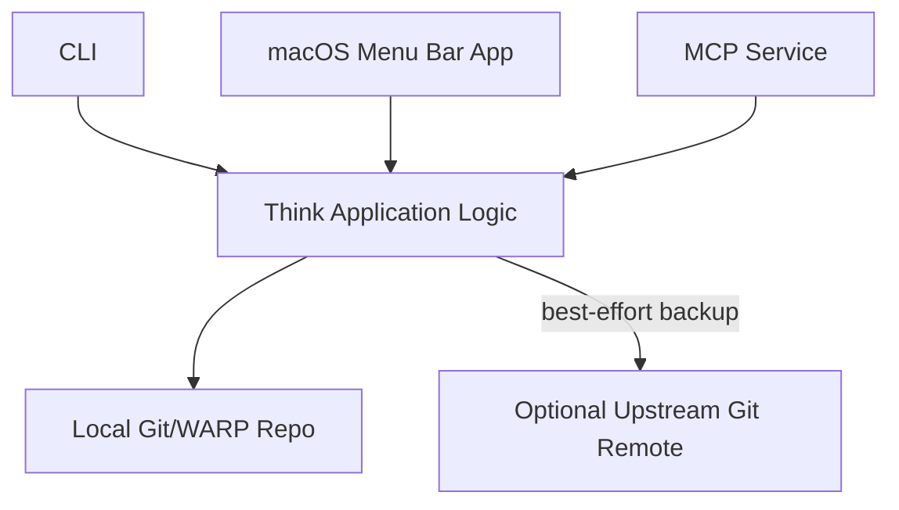
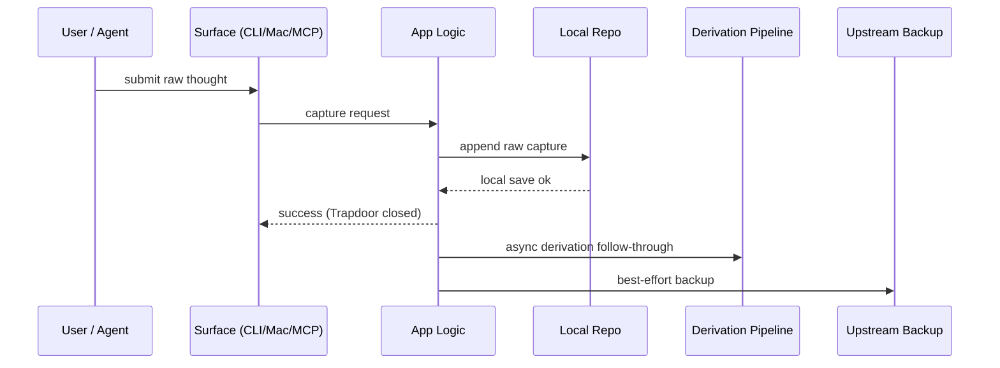

# ARCHITECTURE

Think is an industrial-grade thought-capture engine organized around the sanctity of the raw capture moment.

## System Shape

Think is a local-first system with multiple ingress surfaces writing to a private local Git/WARP repository.

## Core Doctrine

- **Sacred Capture**: The raw capture moment is immutable and non-negotiable.
- **Capture must be cheap**: Sub-second latency is the primary performance target.
- **Geometric Lawfulness**: Cognitive history is a layered worldline, not a flat list.
- **Honest Interpretation**: Derived artifacts (quality, attribution, reflect) are separate from raw thoughts.

## Capture Path (The Trapdoor)

## Data Model

### 1. Raw Entry (`entry:<id>`)
One immutable capture event. Repeated text results in multiple unique entries.

### 2. Canonical Thought (`thought:<fingerprint>`)
Stable content identity. Multiple entries can resolve to one canonical thought.

### 3. Derived Artifacts
Inspectable, append-only metadata (e.g., `seed_quality`, `session_attribution`). They never mutate the raw thought.

### 4. Reflect Sessions
Operational descendants of captured thoughts, stored in separate operational strands.

## Read Path (WARP)

Think uses `git-warp` read handles to avoid whole-graph materialization.
- **Browse**: Window-based TUI for navigating the cognitive worldline.
- **Remember**: Bounded search and relevance recall.
- **Inspect**: Exact metadata and receipt exposure.

---
**The goal is to move the terminal from a collection of widgets to a professional application bedrock for your cognitive history.**
