# TECHNICAL TEARDOWN: think

## Table of Contents

1. [Orientation and domain context](#orientation-and-domain-context)
   - [Project framing and mental model](#project-framing-and-mental-model)
   - [Domain Dictionary](#domain-dictionary)
   - [Quick architecture overview](#quick-architecture-overview)
2. [Command execution and runtime lifecycle](#command-execution-and-runtime-lifecycle)
   - [Entry point and dual launch surfaces](#entry-point-and-dual-launch-surfaces)
   - [Bootstrapping vs runtime](#bootstrapping-vs-runtime)
   - [Golden path: capture pipeline](#golden-path-capture-pipeline)
   - [Golden path: read/remember pipeline](#golden-path-readremember-pipeline)
   - [Golden path: reflect and stats](#golden-path-reflect-and-stats)
3. [Data model and processing pipeline](#data-model-and-processing-pipeline)
   - [Source of truth and state locations](#source-of-truth-and-state-locations)
   - [Payload anatomy and data schema](#payload-anatomy-and-data-schema)
   - [Component deep dive](#component-deep-dive)
4. [Reliability, integration, and operations](#reliability-integration-and-operations)
   - [Concurrency and asynchronous behavior](#concurrency-and-asynchronous-behavior)
   - [External dependencies and boundaries](#external-dependencies-and-boundaries)
   - [Security boundaries and auth flow](#security-boundaries-and-auth-flow)
   - [Unhappy paths and error handling](#unhappy-paths-and-error-handling)
   - [Configuration and env tuning](#configuration-and-env-tuning)
   - [Trade-offs and design rationale](#trade-offs-and-design-rationale)
5. [Outcomes and practical use](#outcomes-and-practical-use)
   - [Where this project stands](#where-this-project-stands)
   - [Future directions](#future-directions)
   - [Use cases](#use-cases)
   - [Summary of key features and design decisions](#summary-of-key-features-and-design-decisions)

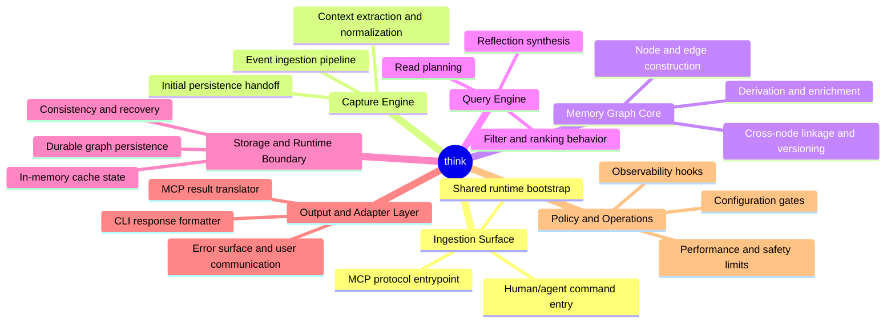

# Orientation and domain context

## Project framing and mental model

`think` is a capture-memory system designed to persist conversational, command, and task context in a Git-linked graph. It has two launch surfaces: CLI and MCP.

The architecture goal is not only to store raw snapshots but to turn those snapshots into usable derived context and reflection artifacts.

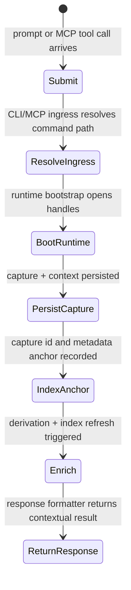

## Domain Dictionary

| Term                                                             | Definition                                                                                       | Related Section                                                                 |
| ---------------------------------------------------------------- | ------------------------------------------------------------------------------------------------ | ------------------------------------------------------------------------------- |
| Capture | A raw persisted unit representing user input and context at a moment in time.                    | [Golden path: capture pipeline](#golden-path-capture-pipeline)                  |
| Checkpoint | Materialized read/query snapshot to avoid expensive full recomputation.                          | [Source of truth and state locations](#source-of-truth-and-state-locations)     |
| Derivation | Post-capture computation that adds entities, receipts, quality signals, and session annotations. | [Component deep dive](#component-deep-dive)                                     |
| Warp model | Git-warp runtime used by `think` as durable storage and graph kernel.                            | [Source of truth and state locations](#source-of-truth-and-state-locations)     |
| Migration | Controlled versioned update path for store/read model shape changes.                             | [Unhappy paths and error handling](#unhappy-paths-and-error-handling)           |
| Follow-through | Deferred completion window for async follow-up operations after a response begins.               | [Concurrency and asynchronous behavior](#concurrency-and-asynchronous-behavior) |
| Service result envelope | Uniform response schema used by MCP service methods.                                             | [Entry point and dual launch surfaces](#entry-point-and-dual-launch-surfaces)   |

## Quick architecture overview

The runtime is designed around a single graph kernel with two protocol surfaces: one for humans via CLI and one for tools via MCP. That keeps command handling reusable while allowing multiple ingress paths to reuse the same operational semantics and storage behavior.

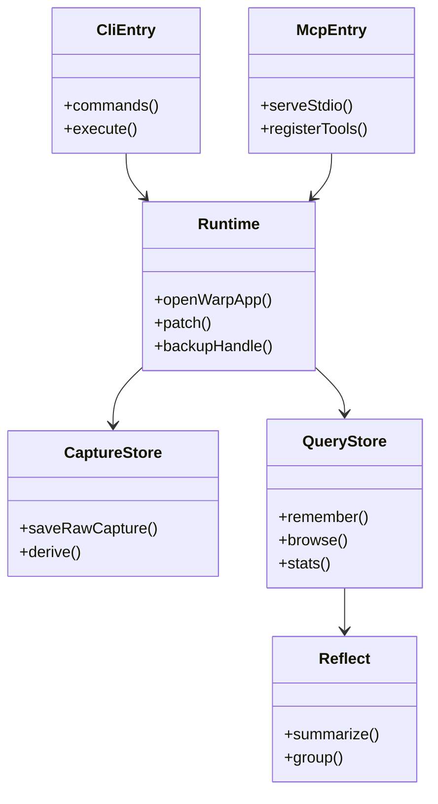

# Command execution and runtime lifecycle

## Entry point and dual launch surfaces

Two launch points matter:

- CLI: `src/cli.js` parses flags and invokes commands.
- MCP server: `bin/think-mcp.js` starts MCP transport and registers tools.

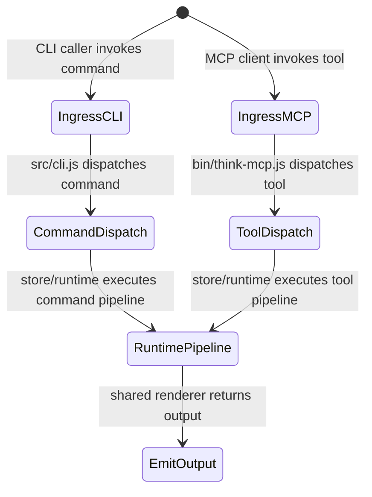

The MCP path is not a separate product; it is a protocol adapter over the same store services.

## Bootstrapping vs runtime

Bootstrapping includes option parsing, repository detection, command branching, and opening handles. Runtime executes capture, read, derivation, and output.

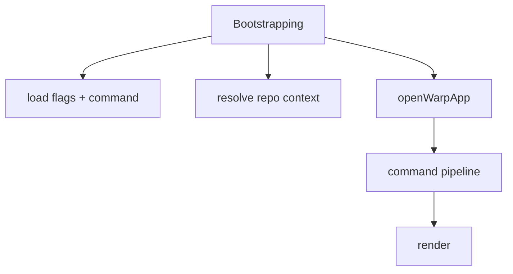

This split enables command-specific preconditions, especially for migration-aware read flows.

## Golden path: capture pipeline

`think` capture follows raw persistence, then derivation, then indexing.

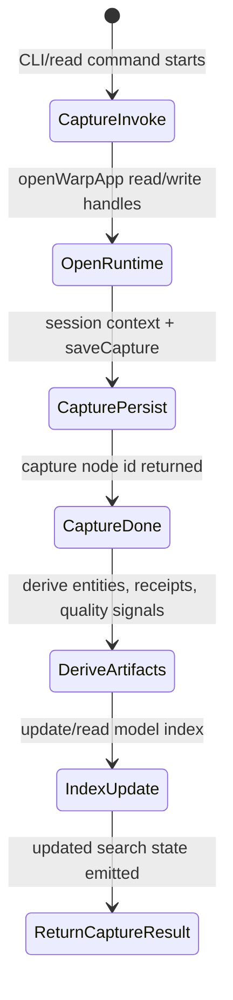

The reason for this order is subtle and important: raw capture is committed fast, while quality-enhancing derivations can be layered later. This preserves responsiveness without sacrificing later recall quality.

## Golden path: read/remember pipeline

When retrieving context, `think` prefers prepared checkpoints and falls back as needed.

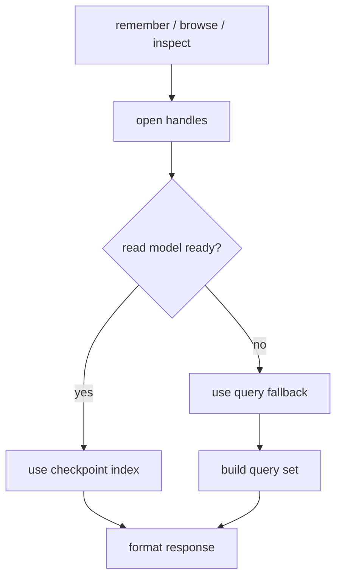

The fallback path ensures availability despite stale caches or incomplete migrations.

## Golden path: reflect and stats

`reflect` is a higher-order path that reads captures and groups evidence by concept, then emits summaries for memory audits.

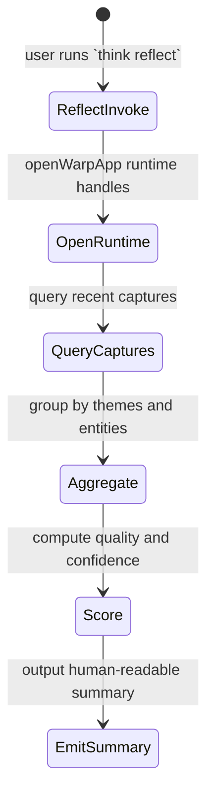

# Data model and processing pipeline

## Source of truth and state locations

Durable state is stored in the git-warp graph layer (the durable graph/commit-backed runtime), while performance-sensitive query paths sit on top of in-memory or checkpointed read models.

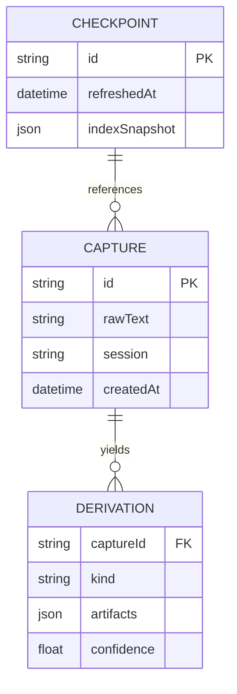

Runtime memory is used for formatting and transport, not as primary truth.

## Payload anatomy and data schema

A typical capture payload includes content, session context, ambient metadata, and derivation placeholders.

```json
{
  "capture": {
    "captureId": "cap_01H",
    "text": "Documented test-plan decisions",
    "command": "npm test --reporter=spec",
    "ambientContext": {
      "repoRef": "refs/heads/main",
      "gitSha": "9f8a4e12c3ab",
      "cwd": "/Users/james/git/think"
    },
    "quality": {
      "seeded": true,
      "score": 0.82
    }
  },
  "derived": {
    "entities": ["test", "decisions"],
    "receipts": ["summary", "tasks"],
    "edges": [
      {"from": "capture:cap_01H", "to": "epoch:9f8a4e12c3ab", "type": "observedAt"}
    ]
  }
}
```

This explicitness allows downstream queries to be composable, and it lowers ambiguity during MCP serialization.

## Component deep dive

`runtime.js` is the orchestration layer that all command and service paths depend on. It resolves graph handles and synchronization state.

`capture.js` writes raw data and delegates derivation to `derivation.js`.

`queries.js` and `reflect.js` contain read-oriented intelligence. They trade immediate freshness for predictable speed by using checkpoints and indexes.

`mcp/service.js` is adapter semantics. It translates MCP tool input into the same logical actions as CLI.

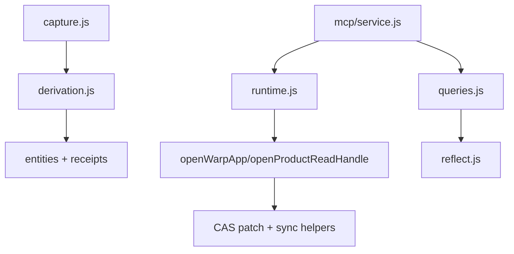

This decomposition gives `think` maintainable separation between storage mechanics and intelligence.

# Reliability, integration, and operations

## Concurrency and asynchronous behavior

`think` uses async paths more intentionally than it uses strict sync-only execution, especially around capture derivation and index maintenance, to preserve interactive responsiveness while still converging toward richer context.

- Capture persists and derives asynchronously where possible.
- Follow-through timeout logic allows the command to remain responsive while background follow-up progresses.
- MCP and CLI both rely on non-blocking promise chains for backup/migration checks.

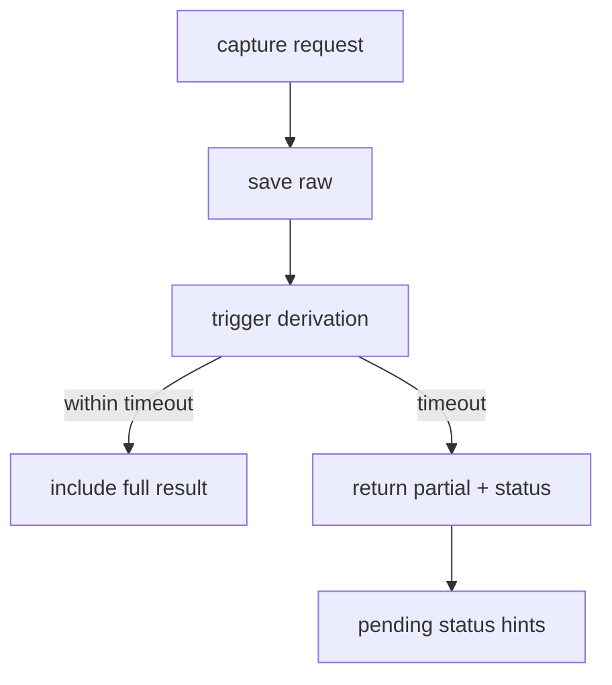

The trade-off is explicit: responsiveness improves, but caller must tolerate delayed enrichment.

## External dependencies and boundaries

`think` depends on a small set of runtime systems:

- `@git-stunts/git-warp`: storage and graph handles.
- Git tooling context via repository metadata.
- MCP transport for tool integrations.
- OS and shell context for command capture.

The boundary is explicit: external systems can only influence behavior by feeding prompts, repository state, and optional environment values.

## Security boundaries and auth flow

`think` is also mostly repository- and environment-driven for identity. There is no embedded JWT protocol in core command flow.

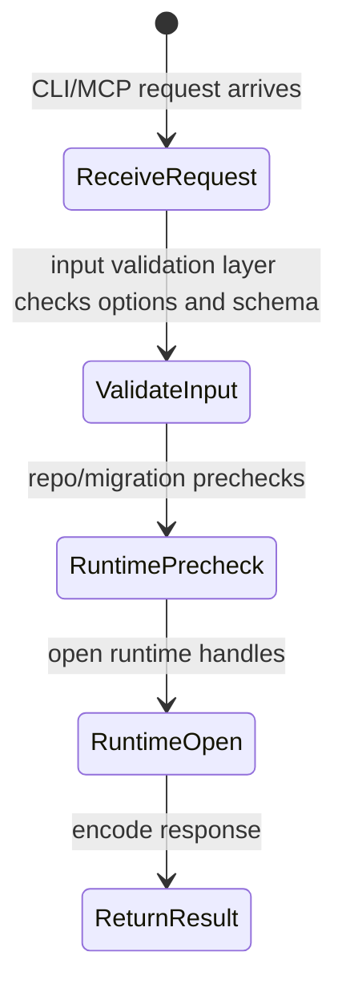

There is no intrinsic JWT/session credential layer in either runtime today. For both CLI and MCP, trust is inherited from host process context: if the repo is unavailable, graph state is not ready, or migrations are pending, commands fail before writing.

For MCP, the trust boundary shifts to the host calling the MCP client; the service assumes process-level trust.

## Unhappy paths and error handling

`think` has richer unhappy-path branches than a basic CLI because it manages both capture and recall semantics.

- Missing repo context.
- Migration required and no migration run yet.
- Interactive command run outside TTY.
- Invalid inspect path missing entry node.
- Follow-through timeout where capture derivation is still pending when the response window closes.
- Query fallback needed when index is stale.

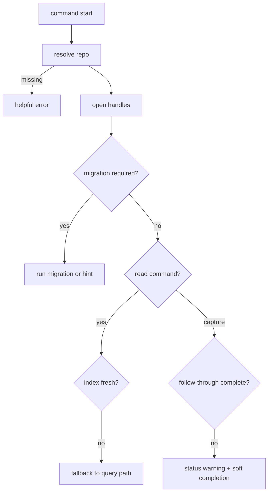

The design is pragmatic: user should rarely be blocked by one transient pipeline stage.

## Configuration and env tuning

`think` has meaningful environment tuning through explicit repo and metrics variables.

`THINK_REPO_DIR` overrides the local repo root (default is `$HOME/.think/repo`).

`THINK_UPSTREAM_URL` enables backup behavior for captures by allowing `pushWarpRefs` to write graph refs remotely.

`THINK_PROMPT_METRICS_FILE` chooses the metrics output destination, replacing the default `$HOME/.think/metrics/prompt-ux.jsonl` path.

`THINK_CAPTURE_INGRESS`, `THINK_CAPTURE_SOURCE_APP`, and `THINK_CAPTURE_SOURCE_URL` seed capture provenance metadata when a capture is created without explicit provenance.

Testing and scripted-run controls exist for non-interactive environments:
- `THINK_TEST_NOW` provides a deterministic clock for time-sensitive assertions.
- `THINK_TEST_INTERACTIVE=1` forces interactive shells to stay in automation-friendly mode.
- `THINK_TEST_CONFIRM_MIGRATION` pre-answers migration prompts for command automation.
- `THINK_TEST_BROWSE_SCRIPT` injects a scripted browse interaction.

The defaults are production-oriented, and these controls are valuable for reproducibility and tests.

These are high-leverage knobs because they allow the same binary to run in CI, local dev, and assistant-integrated contexts without changing code.

## Trade-offs and design rationale

The architecture intentionally chooses layered persistence and derivation over immediate writes of all semantic enrichments.

- Query speed via checkpoints.
- Background follow-through for derivation.
- Extra complexity in state-management and fallback logic.

In simple terms: better responsiveness and richer retrieval at the cost of additional branches and states to reason about.

# Outcomes and practical use

## Where this project stands

The project has progressed into a mature dual-interface platform with consistent command and MCP behavior. The code reflects active concern for failure modes, migrations, and output ergonomics.

Given component breadth and protocol support, it is beyond scaffolding. It is intended for real usage in human-in-the-loop workflows.

## Future directions

Likely evolution includes smarter semantic ranking over derive outputs, stronger conflict resolution across concurrent captures, and tighter cross-session continuity when repo context changes rapidly.

Because MCP and CLI share the same store, the strategic trajectory is likely to deepen the shared schema rather than fork paths.

## Use cases

1. Developers storing project snapshots of thought, decisions, and command outputs during work.
2. LLM-assisted workflows that need persistent context across sessions.
3. Team retrospectives needing reflective summaries of captured interactions.
4. Agents requiring fast remember/browse of recent high-relevance context.
5. CI or tools reading metrics via MCP for continuous coaching.
6. Local-only memory for privacy-sensitive projects.
7. Long-form research notes tied to commit lineage.
8. Incident response engineers replaying contextual captures after context shifts.
9. Managers collecting productivity stats from `stats` views.
10. Teams wanting to expose memory actions as MCP tools in external editors.

## Summary of key features and design decisions

Key features include capture→derive→index flow, dual launch interfaces (CLI + MCP), migration-aware reads, and async follow-through behavior.

Core design decision: unify CLI and MCP around the same runtime/store modules so behavior and state remain consistent regardless of transport.

The principal compromise is complexity in concurrency and state freshness semantics, offset by stronger practical usability and integration reach.
