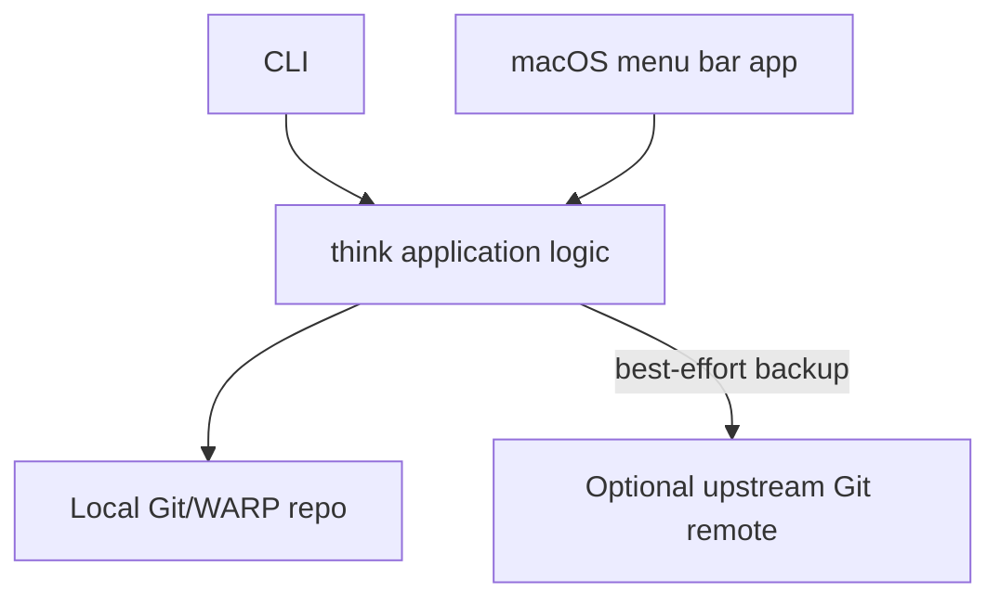
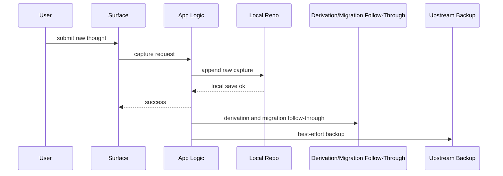

# `think` Architecture

Status: current reference

This is the shortest honest description of how `think` works today.

It is not an ADR archive and it is not a milestone pitch. Its job is to answer:

- what the system is
- which runtime surfaces exist
- where data lives
- how capture, read, derivation, and migration actually work
- which parts of the codebase own which responsibilities

For the historical design trail, see [/Users/james/git/think/docs/design/README.md](/Users/james/git/think/docs/design/README.md).

## System Shape

`think` is a local-first thought-capture system with two primary ingress surfaces:

- a Node.js CLI
- a macOS menu bar app

Both write to the same private local Git/WARP repository and can optionally replicate to an upstream Git remote for backup.

At a high level:

## Runtime Surfaces

### CLI

The CLI is the main product surface and the main machine-readable contract.

It supports:

- raw capture
- recent/reentry reads
- remember/recall
- browse
- inspect
- reflect
- stats
- prompt telemetry reads
- graph migration

Every meaningful command also supports `--json`.

### macOS menu bar app

The macOS app is a thin native capture surface:

- owns the global hotkey
- presents the transient capture panel
- dismisses immediately on submit
- shows minimal save/backup state through the menu bar icon

It is not the source of truth for storage or graph behavior.

### Local thought repo

Default location:

- `~/.think/repo`

Override:

- `THINK_REPO_DIR`

This repo is the system of record.

### Upstream backup

Optional:

- `THINK_UPSTREAM_URL`

Capture never depends on network success. Backup is best-effort follow-through after local success.

## Core Product Doctrine

The architecture is organized around a few non-negotiable rules:

- raw capture is sacred
- capture must be cheap
- local success comes first
- interpretation happens after capture
- provenance must stay inspectable
- human and agent surfaces should share the same underlying semantics

If a change improves sophistication but makes capture slower or noisier, it is the wrong change.

## Main Data Model

### Raw capture event

Current implementation identity:

- `entry:<sortKey-uuid>`

This represents one immutable capture occurrence. Repeated identical text is still multiple capture events.

### Canonical thought identity

- `thought:<fingerprint>`

This represents stable content identity for exact raw text bytes. Multiple captures may resolve to the same canonical thought.

### Sessions

- `session:<session-id>`
- `reflect_session:<session-id>`

Sessions give local context to captures and reflect work without changing the raw capture itself.

### Derived artifacts

Current first-bundle artifact kinds:

- `seed_quality`
- `session_attribution`

Derived artifacts are append-only and inspectable. They are not mutable fields on raw thoughts.

### Reflect outputs

Reflect outputs are operational descendants of captured thoughts. They are stored separately from raw capture.

## Capture Path

Capture is synchronous only up to local durability.

Important boundary:

- raw capture must succeed before derivation or migration matters

If graph migration is needed, capture still saves first and migration runs after local success.

## Read Path

Normal product reads use `git-warp` read handles rather than rebuilding the graph in app code.

Current rule:

- product reads use `WarpApp -> worldline() -> observer(...)`
- `core()` is reserved for migration, admin-style full-state inspection, and the narrow content-attachment escape hatch

This applies to:

- browse
- inspect
- recent
- remember
- stats

The graph-native read refactor exists specifically to avoid:

- whole-graph materialization
- app-local traversal logic
- assuming the full archive fits in memory

## Browse Model

Browse is window-based, not corpus-based.

First paint should need only:

- the current thought
- immediate chronology neighbors
- current session context

Heavier surfaces should load only when requested:

- chronology drawer
- jump surface
- deeper inspect content

This is why browse startup became materially faster after moving onto graph-native reads and checkpoint-backed reuse.

## Derivation Model

The current derivation stack is:

1. raw capture event
2. canonical thought identity
3. fast interpretive artifact: `seed_quality`
4. contextual artifact: `session_attribution`
5. operational descendants such as `reflect`

The governing references are:

- [/Users/james/git/think/docs/design/0009-graph-derivation-model.md](/Users/james/git/think/docs/design/0009-graph-derivation-model.md)
- [/Users/james/git/think/docs/design/0010-ingress-and-derivation-pipeline.md](/Users/james/git/think/docs/design/0010-ingress-and-derivation-pipeline.md)
- [/Users/james/git/think/docs/design/0015-per-thought-derivation-catalog.md](/Users/james/git/think/docs/design/0015-per-thought-derivation-catalog.md)

## Graph Model And Migration

Current read behavior targets:

- graph model `v3`

The important graph-native read edges now include:

- `meta:graph --latest_capture--> capture`
- `capture(newer) --older--> capture(older)`
- `reflect_session --seeded_by--> capture`
- `reflect_entry --produced_in--> reflect_session`
- `reflect_entry --responds_to--> capture`

Migration policy:

- graph-native commands may require migration
- interactive human flows can upgrade in place
- non-interactive and `--json` flows fail explicitly with `graph.migration_required`
- raw capture remains exempt and saves first

## Code Ownership Map

This is the practical code map today:

- [/Users/james/git/think/bin/think.js](/Users/james/git/think/bin/think.js)
  - CLI entrypoint
- [/Users/james/git/think/src/cli.js](/Users/james/git/think/src/cli.js)
  - thin CLI entry module and top-level dispatch
- [/Users/james/git/think/src/cli/](/Users/james/git/think/src/cli/)
  - argument parsing, validation, interactive migration/reflect helpers, output shaping, and command-family runners
- [/Users/james/git/think/src/store.js](/Users/james/git/think/src/store.js)
  - thin storage barrel used by the rest of the app
- [/Users/james/git/think/src/store/](/Users/james/git/think/src/store/)
  - graph runtime helpers, read queries, capture flow, derivation logic, reflect flow, migrations, and prompt-metrics helpers
- [/Users/james/git/think/src/browse-tui.js](/Users/james/git/think/src/browse-tui.js)
  - Bijou browse shell
- [/Users/james/git/think/src/browse-benchmark.js](/Users/james/git/think/src/browse-benchmark.js)
  - browse benchmark fixture/bootstrap helper
- [/Users/james/git/think/src/git.js](/Users/james/git/think/src/git.js)
  - Git backup and repository operations
- [/Users/james/git/think/macos/](/Users/james/git/think/macos/)
  - native capture app and supporting Swift modules

## Current Architectural Notes

The March 2026 editor-report follow-through corrected the largest code-shape mismatch:

- historical slice notes are now archived under `docs/design/archive/`
- `src/cli.js` is now a thin dispatcher over `src/cli/`
- `src/store.js` is now a thin barrel over `src/store/`

The important rule going forward is:

- keep product behavior stable
- decompose along real seams when pressure is real
- do not perform architecture theater for its own sake

Further code-shape changes should be treated as normal design/spec/refactor slices, not as endless cleanup churn.

## Where To Look Next

If you are new to the repo, read these in order:

1. [/Users/james/git/think/README.md](/Users/james/git/think/README.md)
2. [/Users/james/git/think/docs/GLOSSARY.md](/Users/james/git/think/docs/GLOSSARY.md)
3. [/Users/james/git/think/docs/ARCHITECTURE.md](/Users/james/git/think/docs/ARCHITECTURE.md)
4. [/Users/james/git/think/docs/design/ROADMAP.md](/Users/james/git/think/docs/design/ROADMAP.md)
5. [/Users/james/git/think/CONTRIBUTING.md](/Users/james/git/think/CONTRIBUTING.md)
