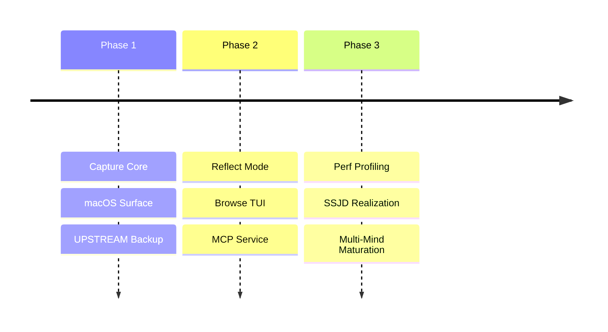

# BEARING

Current direction and active tensions. Historical ship data is in `CHANGELOG.md`.

## Active Gravity

### 1. Performance Hardening
- Profiling CLI capture to identify Node startup and WARP graph bottlenecks.
- Benchmark harness maturation for warm-path regression detection.
- Sub-second capture latency as a non-negotiable target.

### 2. Domain Integrity (SSJD)
- Refactoring the MCP service layer to move from "shape soup" to runtime-backed domain types.
- Standardizing function signatures and boundary validation across the store and CLI layers.

### 3. Orientation & Re-entry
- Learning where the browse and remember surfaces fail through re-entry friction tracking.
- Tuning hotkey ergonomics and macOS URL scheme reliability.

## Tensions

- **Capture Latency**: Current Medians (~2s) exceed the "trapdoor" doctrine target.
- **Service Layer Debt**: The MCP layer lacks explicit domain model enforcement (plain objects only).
- **Multiple Minds UX**: Mind-switching in the TUI is powerful but needs smoother orchestration for agents.
- **Upstream Friction**: Provisioning a day-one backup remote remains too manual.

## Next Target

The immediate focus is **Performance Profiling** to neutralize capture latency and ensure the "Sacred Capture" moment remains truly cheap.
