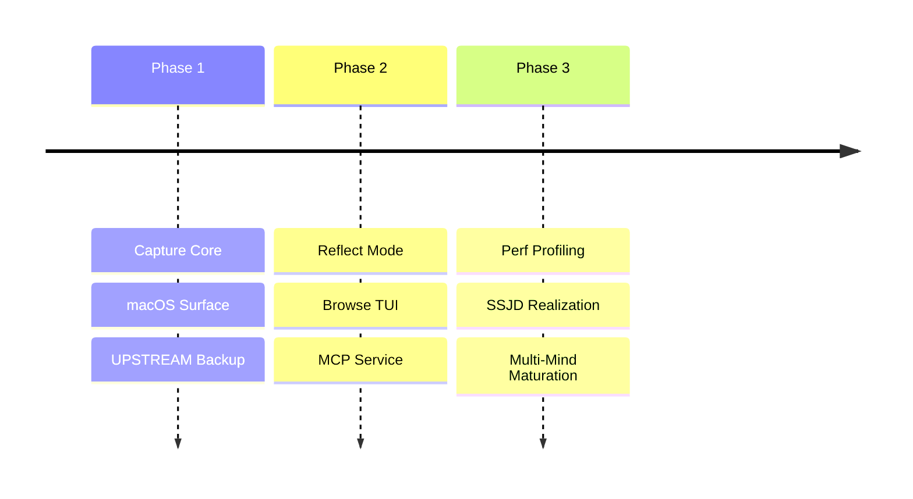

# BEARING

Current direction and active tensions. Historical ship data is in `CHANGELOG.md`.

## Active Gravity

### 0. Local Mind Repairability
- Pulling `CORE_repair-v17-git-warp-minds` into cycle `0066`.
- Making the git-warp v17 checkpoint repair path repeatable for local minds.
- Keeping version-specific repair logic outside normal capture and read flows.

### 1. Think-on-Echo Runtime Proof
- Proving raw capture plus exact inspect as a Think-owned application contract
  hosted by Echo.
- Keeping Think domain nouns in Think while Echo stays a generic dispatch and
  observation substrate.
- Using the proof to shape the next store boundary refactor without switching
  production capture prematurely.

### 2. Performance Hardening
- Profiling CLI capture to identify Node startup and WARP graph bottlenecks.
- Benchmark harness maturation for warm-path regression detection.
- Sub-second capture latency as a non-negotiable target.

### 3. Domain Integrity (SSJD)
- Refactoring the MCP service layer to move from "shape soup" to runtime-backed domain types.
- Standardizing function signatures and boundary validation across the store and CLI layers.

### 4. Orientation & Re-entry
- Learning where the browse and remember surfaces fail through re-entry friction tracking.
- Tuning hotkey ergonomics and macOS URL scheme reliability.

## Tensions

- **Capture Latency**: Current Medians (~2s) exceed the "trapdoor" doctrine target.
- **Service Layer Debt**: The MCP layer lacks explicit domain model enforcement (plain objects only).
- **Multiple Minds UX**: Mind-switching in the TUI is powerful but needs smoother orchestration for agents.
- **Upstream Friction**: Provisioning a day-one backup remote remains too manual.

## Next Target

The immediate architecture focus is **Think-on-Echo contract proof**: prove raw
capture plus exact inspect through Echo before any default production store
switch. Local Mind Repairability remains the data-rescue lane for existing
`git-warp` minds.
