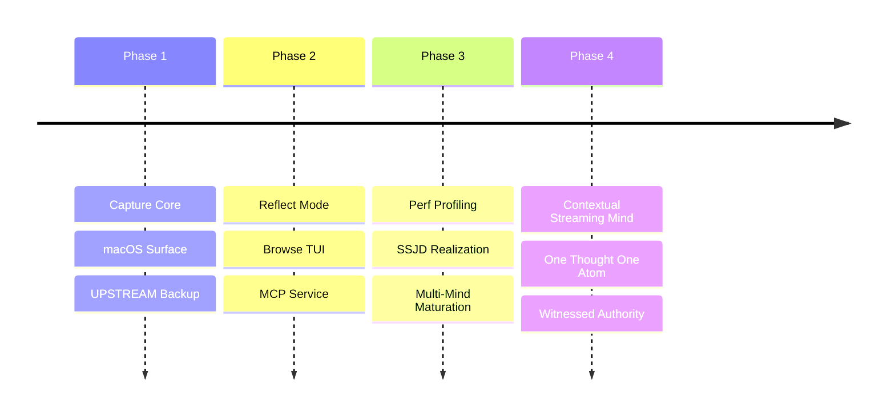

# BEARING

Current direction and active tensions. Historical ship data is in `CHANGELOG.md`.

```mermaid
timeline
    Phase 1 : Capture Core : macOS Surface : UPSTREAM Backup
    Phase 2 : Reflect Mode : Browse TUI : MCP Service
    Phase 3 : Perf Profiling : SSJD Realization : Multi-Mind Maturation
    Phase 4 : Contextual Streaming Mind : One Thought One Atom : Witnessed Authority
```

## Active Gravity

### 0. Local Mind Repairability

- Pulling `CORE_repair-v17-git-warp-minds` into cycle `0066`.
- Making the git-warp v17 checkpoint repair path repeatable for local minds.
- Keeping version-specific repair logic outside normal capture and read flows.

### 1. Contextual Streaming Mind

- Beginning P0 constitutional work for accepted `ADR-THINK-001`.
- Making one immutable ThoughtCapture occurrence one addressable node atom
  while keeping physical publication bounded by AdmissionWindows.
- Making footprint exactness, streaming, process count, authority, projection
  sufficiency, and erasure executable gates rather than ambient claims.
- Keeping legacy production storage authoritative until a verified P4 cutover.

### 2. Think-on-Echo Runtime Proof

- Proving raw capture plus exact inspect as a Think-owned application contract
  hosted by Echo.
- Keeping Think domain nouns in Think while Echo stays a generic dispatch and
  observation substrate.
- Using the proof to shape the next store boundary refactor without switching
  production capture prematurely.

### 3. Performance Hardening

- Profiling CLI capture to identify Node startup and WARP graph bottlenecks.
- Benchmark harness maturation for warm-path regression detection.
- Sub-second capture latency as a non-negotiable target.

### 4. Domain Integrity (SSJD)

- Refactoring the MCP service layer to move from "shape soup" to runtime-backed domain types.
- Standardizing function signatures and boundary validation across the store and CLI layers.

### 5. Orientation & Re-entry

- Learning where the browse and remember surfaces fail through re-entry friction tracking.
- Tuning hotkey ergonomics and macOS URL scheme reliability.

## Tensions

- **Capture Latency**: Current Medians (~2s) exceed the "trapdoor" doctrine target.
- **Service Layer Debt**: The MCP layer lacks explicit domain model enforcement (plain objects only).
- **Multiple Minds UX**: Mind-switching in the TUI is powerful but needs smoother orchestration for agents.
- **Upstream Friction**: Provisioning a day-one backup remote remains too manual.
- **Optic Exactness**: Streaming bounded resident state does not yet prove that
  every production optic reads only its complete causal support slice.
- **Cutover Discipline**: The replacement architecture is accepted, but all
  five gates and a witnessed P4 switch stand between design and authority.

## Next Target

The immediate architecture focus is **ADR-THINK-001 P0 constitutional
foundation**: freeze and execute the bulk-admission, two-level observation,
fixture-capability, authority-policy, and erasure-storage gates. Think-on-Echo
continues as an independent runtime proof, and Local Mind Repairability remains
the data-rescue lane. Neither authorizes a default production store switch.
