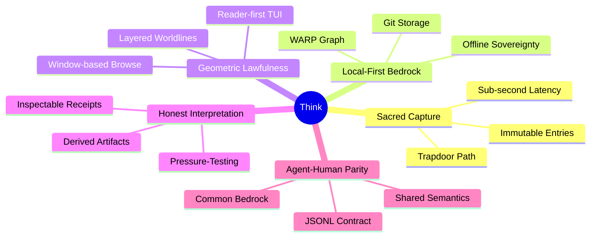

# VISION

Think is an industrial-grade thought-capture engine for coding work where the raw capture moment is sacred and interpretation is honest.

## Core Tenets

### 1. Sacred Capture
The capture path is a trapdoor. It must remain cheap, sub-second, and immutable. No intelligence is added during capture; the goal is zero friction between a thought and its durable record.

### 2. Local-First Bedrock
Your cognitive history belongs to you. It lives in a private Git-backed repository on your machine. Sovereignty over your data is an inherent property of the system.

### 3. Geometric Lawfulness
Thoughts are modeled as a layered worldline of raw entries and derived artifacts. The terminal is the primary operating surface, providing a window-based navigation model that scales.

### 4. Honest Interpretation
Structure, categories, and analysis are derived after capture. They are stored as separate, inspectable artifacts. You can always see what is raw and what was computed.

### 5. Agent-Human Parity
Human and AI agents sit at the same table. They share the same underlying semantics, the same storage bedrock, and the same machine-readable contracts.

---
**The goal is not just note-taking. It is the geometric lawfulness of your cognitive worldline as a professional application bedrock.**
