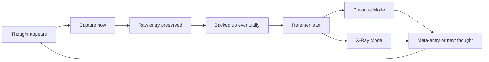
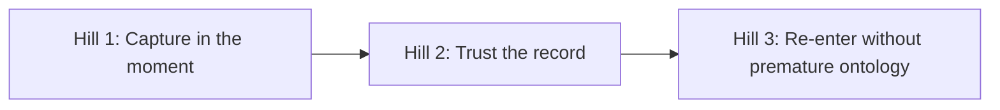

# 0001 Product Frame

Status: draft for review

## Purpose

Define the product frame for `think` using an IBM Design Thinking style structure: sponsor user, hills, playback intent, and explicit experience principles.

This document is the source of truth for product direction during v0 and early v1.

## Problem Statement

Thoughts show up in low-friction moments: during work, on walks, in transit, while switching tasks, or while half-remembering something useful. Most tools ask for too much structure too early, so the thought either gets distorted or never gets captured.

`think` exists to preserve raw thought immediately, then make its evolution visible later.

## Conceptual Product Loop

## Sponsor User

Primary sponsor user:

- A fast-moving individual thinker who has ideas in many contexts, does not want to classify them on entry, and wants a durable private record that can later support reflection, branching, and replay.

## Sponsor Agent

Primary sponsor agent:

- An explicit CLI/JSON consumer that needs the same capture, browse, inspect, and reflect capabilities through stable machine-readable contracts rather than through human-facing presentation or scraping.

## Jobs To Be Done

Primary job:

- When a thought appears, help me record it immediately and exactly so I do not lose it.

Secondary jobs:

- Help me trust that the capture is durable, even if I am offline or my machine fails later.
- Help me revisit recent captures without forcing early categorization.
- Help me evolve raw captures into richer structures later without mutating the original record.

## Product Doctrine

- Raw capture is sacred.
- Capture must be cheap.
- Capture first. Interpret later.
- Never mix capture and interpretation in the same user moment.
- Interpretation is deferred.
- Provenance matters.
- Replay matters.
- The substrate may be sophisticated; the capture experience cannot feel sophisticated.

## Experience Principles

1. Favor immediacy over explanation.
2. Favor exact preservation over cleanup.
3. Favor local success over network success.
4. Favor honest provenance over synthetic simplicity.
5. Favor later sensemaking over capture-time structure.
6. Never interrupt thought. Only deepen it.

## Hills

### Hill 1: Capture In The Moment

Who:

- A user on their own Mac who has a thought right now and wants to keep moving.

What:

- They can invoke `think` from the shell or a global-hotkey-driven capture panel, enter one raw thought, press Enter, and the system saves it immediately without asking for tags, links, or categories.

Wow:

- Capturing a thought feels closer to using Spotlight than using a note-taking app.

### Hill 2: Trust The Record

Who:

- A user who wants to know their captured thoughts are durable and recoverable.

What:

- Every capture is committed locally to a private Git/WARP-backed repo and is best-effort backed up to a private upstream without blocking local success.

Wow:

- The user can trust that a thought is preserved even if the network is flaky, and likely backed up moments later without thinking about Git.

### Hill 3: Re-Enter Without Premature Ontology

Who:

- A user returning later to recent captures or opening a deeper mode such as brainstorm, reflect, or xray.

What:

- The system can refresh and materialize the relevant reading view, begin a dialogue that helps the user earn insight, and expose an explicit x-ray view when the user wants to inspect the machinery behind that dialogue.

Wow:

- The user feels like they are in a dialogue with their own evolving mind, and can peek behind the curtain when they want receipts.

## Playback Questions

These questions should be used in design reviews and milestone playbacks:

1. Is the capture path still fast enough that a busy person would actually use it?
2. Does the product preserve the original wording exactly?
3. Are we separating raw human capture from inferred or derived structure?
4. Does the user need to understand Git, refs, push, or pull to trust the product?
5. Have we accidentally turned the capture path into a note-taking workflow?
6. Are we defaulting to dialogue where it helps, and only exposing dashboards when explicitly invited?

Playback should be evaluated from both perspectives:

- human stakeholder playback
- agent stakeholder playback

The human stakeholder should judge whether the experience is actually good to use.
The agent stakeholder should judge whether the explicit machine contract is semantically complete and parity-preserving.

The mechanics of playback should stay explicit:

- the coding agent should provide concrete commands and steps for the human playback
- the human stakeholder should run that playback and give the verdict directly
- the coding agent should not proceed past playback until that human verdict is received

Retrospectives should also check for design drift explicitly:

- compare what shipped against the approved hill, playback framing, and non-goals for the slice
- name any deviations from the intended design
- decide whether the implementation drifted, the design was incomplete, or the design should be corrected
- update the canonical design docs before calling the slice closed

## Non-Goals

Not in v0:

- tagging
- concept extraction
- embeddings in the hot path
- embeddings anywhere in the system before capture habit is proven
- clustering
- project ontology
- dashboards
- collaboration
- auth
- mobile apps
- public web product

## Risks And Assumptions

Assumptions:

- The user values immediacy more than capture-time structure.
- Git/WARP can remain invisible in the main user experience.
- A macOS-first capture panel is the highest-value UX after the CLI.

Risks:

- We overfit early design to future worldline abstractions before capture is proven.
- We leak substrate concepts into the product language.
- We optimize for architectural elegance instead of actual usage frequency.
- We let retrieval, suggestion, or interpretation leak into the capture moment and break the habit loop.
- We start tuning intelligence infrastructure before proving daily capture behavior.

## Decision Rule

When a design tradeoff is unclear, prefer the option that reduces capture friction even if it delays a richer future feature.
