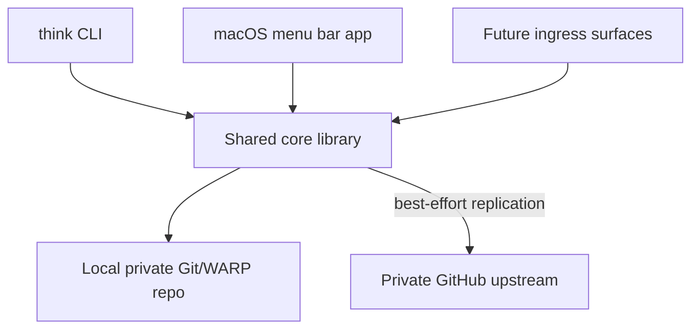
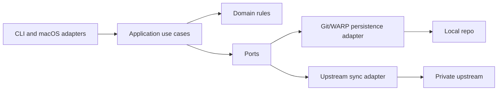
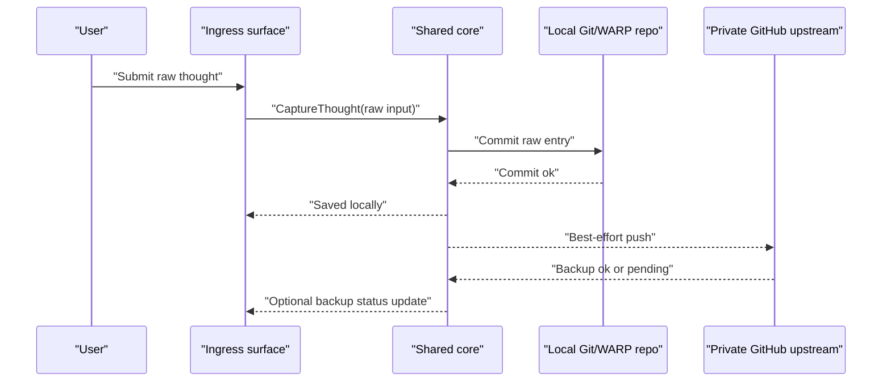
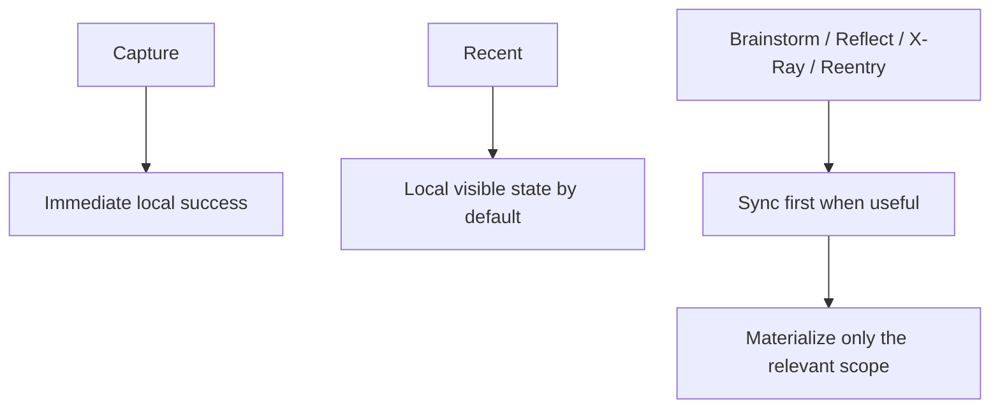

# 0002 V0 Architecture

Status: draft for review

## Intent

Define the architectural shape for v0 and early v1 in a way that preserves the product doctrine.

The architecture must support:

- direct local capture
- durable local storage
- eventual upstream backup
- honest provenance
- later addition of richer read modes

It must not require interpretation before capture succeeds.

## Architectural Stance

`think` is not daemon-first.

The center of the system is:

- a private local Git/WARP-backed repo
- a shared core library that performs capture/query/sync use cases
- multiple ingress surfaces that call the core directly

`thinkd` is not required for v0.

## System Topology

## Top-Level Components

### `think`

- Shell-oriented CLI.
- Supports direct raw capture and basic read operations such as `recent`.
- `recent` should remain a plain, chronological re-entry surface rather than a mini-dashboard.

### macOS menu bar app

- Owns the global hotkey.
- Opens a Spotlight-like transient capture panel.
- Invokes the same shared core library used by the CLI.
- If it exposes status at all, that status must remain minimal and non-administrative.
- It must not become a repo dashboard or control panel.

### Shared core library

- Application use cases: capture, recent, sync, health/diagnostics.
- Domain policies: immutable raw entry semantics, provenance rules, sync posture per use case.
- No UI concerns.

### Git/WARP repo

- The system of record.
- Private local repo under `~/.think/repo` for the first implementation.
- Private upstream GitHub repo on day one for backup and eventual rendezvous.

## Hexagonal Boundary

### Domain

- raw entry
- provenance
- immutable capture contract
- reading/derivation boundaries

### Application

- `CaptureThought`
- `ListRecentEntries`
- `SyncIfNeeded`
- later: `StartBrainstorm`, `StartReflect`, `OpenXray`

### Ports

- entry store
- sync transport
- clock
- ID generator
- platform notifications/status

### Adapters

- CLI adapter
- macOS menu bar adapter
- Git/WARP persistence adapter
- GitHub upstream sync adapter

## Repo Topology

### Local

- Path: `~/.think/repo`
- Purpose: authoritative local system of record
- Characteristics:
  - private
  - app-owned
  - not tied to the current shell repo

### Upstream

- Day-one private GitHub repo for remote backup
- Purpose:
  - disaster recovery
  - first replication target
  - future rendezvous point for multi-device and hosted ingress

The local repo is primary for capture success. Upstream is replication, not the definition of success.

## Writer Identity Policy

Writer IDs are per ingress surface.

Examples:

- `mac:<hostname>:cli`
- `mac:<hostname>:menubar`
- later `web:<edge-id>:capture`
- later `email:<gateway-id>:ingress`
- later `sms:<gateway-id>:ingress`

Rationale:

- provenance stays honest
- ingress behavior can differ without losing authorship context
- future multi-edge systems do not collapse into a fake single writer

## Raw Entry Model

Each human capture becomes a first-class immutable raw entry.

Required stored facts:

- `id`
- `createdAt`
- `kind`
- `source`
- `channel` when known
- `contentType`
- exact raw idea content
- writer provenance

`kind` is system-assigned, not user-entered.

Examples:

- `capture`
- `brainstorm`
- `reflection`

Design rule:

- raw content must not be normalized, rephrased, summarized, or decorated at capture time
- derived structure must live separately from raw captures
- concepts, clusters, and worldlines are discovered later rather than declared during capture
- raw entries are append-only and never edited, even by the user

## Capture Success Contract

Capture succeeds when the local repo commit succeeds.

Capture must not:

- look up prior related entries before saving
- ask the user to confirm conceptual matches
- inject AI suggestions into the raw entry moment

Capture does not require:

- network availability
- upstream reachability
- remote acknowledgment

Performance budget:

- warm-path capture interaction should complete in under 1 second
- local commit target on a warm path should stay under 100 milliseconds

Immediate post-capture behavior:

1. commit locally
2. return success to the calling surface
3. attempt best-effort push to upstream
4. surface backup status separately if useful

Recommended user-facing language:

- `Saved locally`
- `Backed up`
- `Backup pending`

Avoid user-facing Git language such as push, pull, remote, ref, or braid unless the user explicitly enters a diagnostic mode.

Hard UX ban:

- Git/WARP terminology must never appear in the default user experience

## Read And Sync Policy

Sync policy is use-case dependent.

### Capture

- optimize for immediacy
- do not block on sync
- do not perform retrieval-before-write
- do not expose inferred relatedness

### Recent

- default to local visible state
- optional lightweight sync may happen in the background
- keep the view chronological and plain
- do not add smart summaries, grouping, or dashboard chrome early

### Brainstorm / Reflect / Xray / Reentry

- these modes may sync first
- they may materialize only the relevant reading scope rather than the full visible universe
- Git/WARP mechanics stay below the user-facing mode language
- dialogue-first modes may interpret and question
- x-ray modes may expose structure, but should avoid narrating meaning for the user

## Operational Model

No always-on local daemon is required for v0.

This removes:

- local HTTP service management
- “daemon is down” failure mode
- local port security concerns in the core experience

If a background service becomes useful later for indexing, notifications, or continuous sync, it should be added as an optional capability rather than treated as the system center.

## Open Questions

1. What is the exact local bootstrapping experience for first-run repo creation and upstream wiring?
2. Should upstream sync happen inline after capture or via a lightweight deferred queue inside the calling app?
3. Which user actions should surface backup state versus keeping it silent?
4. At what point, if any, do we introduce a policy gateway such as `git-stargate` in front of the upstream?
