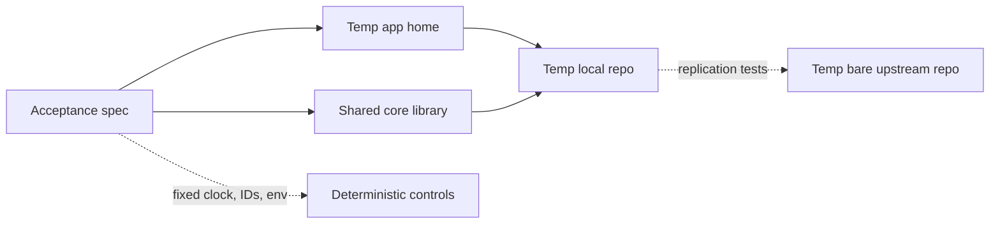

# 0003 Spec And Test Strategy

Status: draft for review

## Purpose

Define how `think` will use tests as the executable specification for product behavior.

The goal is not just coverage. The goal is to make the core product promises testable, deterministic, and hard to regress.

## Testing Principles

1. Tests are the spec.
2. Deterministic tests only.
3. Every test uses an isolated Git repo.
4. No test touches the developer's real `~/.think` directory.
5. Integration behavior matters more than internal implementation shape.

## Spec Pyramid For `think`

### Acceptance specs

These are the primary tests.

They should describe user-visible behavior such as:

- CLI capture saves exact raw text
- menu-bar capture use case saves exact raw text
- recent lists entries in expected order
- local save succeeds while upstream push is unavailable
- backup state is surfaced honestly
- capture commits without requiring retrieval or prior-entry lookup

### Narrow unit tests

Use these for:

- ID generation rules
- writer ID mapping
- sync state classification
- small formatting/presentation helpers

### Adapter tests

Use focused tests for:

- local repo bootstrap
- Git/WARP adapter behavior
- upstream sync adapter behavior

Avoid large end-to-end tests that depend on real background services or non-deterministic OS behavior.

## Determinism Rules

Tests must not depend on:

- wall clock time
- ambient home-directory state
- existing Git configuration outside the test
- real network access
- global hotkeys
- interactive shells
- retries with real sleeps

Strategies:

- inject clocks
- use fixed writer IDs
- use temp directories
- use local bare remotes for replication tests
- use Alfred test clocks if retry/backoff policies are exercised

## Git Test Harness

Each spec should create:

- a unique temp app home
- a unique local private repo
- optionally a unique temp bare upstream repo

Recommended harness behavior:

- set deterministic environment variables
- normalize paths in assertions where needed
- provide helpers for seeding repo state and reading materialized results

This should make it possible to run the full suite repeatedly with identical results.

## Initial Acceptance Specs

### Capture path

- captures exact raw input with no normalization
- stores required metadata
- uses the expected writer ID for the calling ingress
- returns success when local commit succeeds
- does not depend on any related-entry lookup before commit
- does not mutate or overwrite a raw entry after commit

### Backup behavior

- marks backup complete when push succeeds
- marks backup pending when upstream is unavailable
- never reports backup success before local commit

### Read behavior

- `recent` returns local visible state
- `recent` ordering is stable and well-defined
- `recent` remains plain rather than summarizing or clustering entries
- raw entries remain immutable after later derived artifacts are added
- later brainstorm/reflection outputs are stored separately from raw capture entries

### Bootstrap behavior

- first run creates the private local repo
- optional upstream configuration is persisted correctly

## What We Will Not Test First

- real GitHub integration
- real macOS hotkey registration
- real notification center integration
- full-screen TUI behavior
- speculative future worldline semantics

These belong in later smoke or platform tests, not in the core deterministic suite.

## Performance Budgets

Performance matters, but timing assertions can become flaky if tested carelessly.

Recommended approach:

- keep correctness in the deterministic suite
- measure latency budgets through a dedicated repeatable benchmark or smoke harness

Initial budget targets:

- warm-path local commit target under 100 milliseconds
- full warm-path capture interaction under 1 second

## Later-Phase Specs

Once smarter modes begin, acceptance specs should also prove:

- brainstorm mode is intentional and never ambushes plain capture
- dialogue mode asks questions without dumping dashboards by default
- x-ray mode exposes structure without pretending to interpret it for the user

## Relationship To Design

The docs in `docs/design/` should define the intended product behavior.

The first implementation step after design review is to encode those intended behaviors directly into executable acceptance tests. There should not be a second prose-spec layer between design and tests.

## Exit Standard Before Implementation

Before writing production code, we should have:

- reviewed and approved the design docs
- named the first acceptance tests
- agreed on the deterministic harness strategy
- agreed on the first milestone exit criteria
