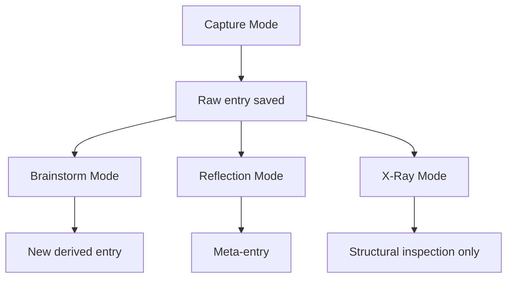
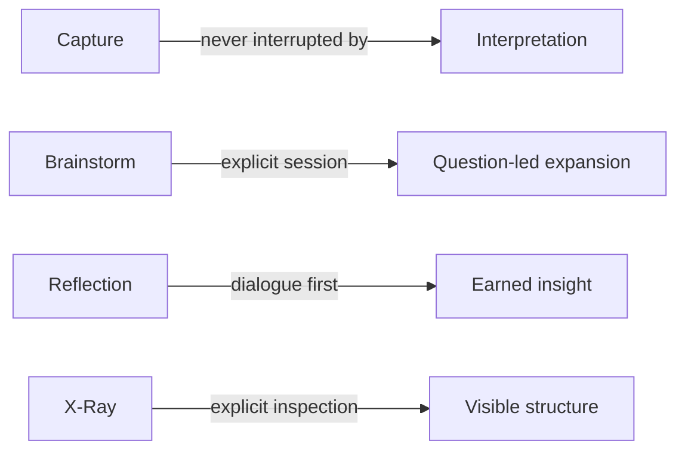
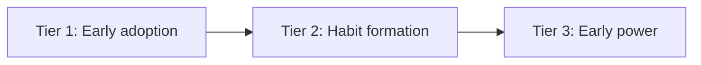

# 0004 Modes And Success Metrics

Status: draft for review

## Purpose

Define the behavioral doctrine for the major product modes and the usage metrics that indicate whether `think` is becoming a real part of the user's thinking loop.

This document exists because the product is not just a storage system. It is a staged experience:

- capture preserves thought
- brainstorm expands thought
- reflection understands thought
- x-ray reveals structure

Those modes must remain distinct.

## Mode Map

## Mode Doctrine

### Capture Mode

Capture mode is sacred.

Goals:

- preserve the thought exactly
- introduce near-zero friction
- vanish immediately after submit

Rules:

- pure raw input
- no required structure
- no suggestions
- no related-entry lookup before save
- no concept matching
- no AI interference in the hot path
- local commit target under 100 milliseconds on a warm path
- full warm-path capture interaction under 1 second

Capture should feel like writing to a dumb file even if the substrate is much richer.

### Recent View

Recent is not a dashboard.

Goals:

- let the user re-enter quickly
- provide a truthful local view of what exists

Rules:

- chronological by default
- local visible state first
- no summaries
- no clustering
- no “control panel” energy

### Brainstorm Mode

Brainstorm mode is explicit and intentional.

Goals:

- help the user generate, sharpen, pressure-test, or recombine ideas
- act like a thinking partner, not an autocomplete engine

Rules:

- only entered deliberately
- starts from a seed thought or entry
- favors sharp questions, tensions, and reframings over idea spam
- produces additional entries without mutating the original raw capture

Brainstorm should help the user think better, not merely think more.

### Reflection Mode

Reflection mode is dialogue-first.

Goals:

- help the user notice how their thinking changed
- surface trajectories without spoon-feeding conclusions

Rules:

- the system may know a lot silently
- the system should make the user earn the insight through guided questioning
- responses in reflection become additional entries, not edits to prior ones

Design principle:

- reveal patterns slowly
- force articulation
- capture the articulation

The AI role in reflection is interviewer, not narrator.

### X-Ray Mode

X-ray mode is explicit inspection.

Goals:

- let the user inspect clusters, related entries, trajectories, and provenance structure

Rules:

- only entered deliberately
- exposes structure directly
- should not try to interpret meaning on the user's behalf

X-ray is the dashboard behind the dialogue, not the default product face.

## Mode Separation Rules

- Capture mode never dumps intelligence into the user moment.
- Brainstorm and reflection may question or challenge, but do so only after capture.
- Dialogue mode never floods the user with raw graph data.
- X-ray mode never pretends to be the reflective dialogue.

If these modes blur together, the product will either become noisy or inert.

## Success Metrics

These metrics are not vanity metrics. They are signs that `think` is becoming a real habit and not just an interesting system.

### Tier 1: Early Adoption

Signals to watch in the first 3-7 days:

- entries per day
- percentage of thoughts captured within 5 seconds of appearing
- percentage of notable thoughts captured immediately
- zero-hesitation feel before capture

Suggested targets:

- target range: 10-30 entries per day
- minimum viable habit signal: 5 per day consistently

Questions:

- did capture feel immediate?
- did the user ever hesitate because of phrasing, categorization, or system choice?
- did the user capture the thought before it started to mutate in their head?

### Tier 2: Habit Formation

Signals to watch after roughly one week:

- unprompted usage multiple times per day
- capture across multiple contexts, not just at a desk
- weird thought capture, not only polished thoughts

Why weird thoughts matter:

- if the user captures only polished or obviously important thoughts, the system is already too performative
- if the user captures stray, funny, or half-formed thoughts, the system has earned trust

### Tier 3: Early Power

Signals to watch after roughly two weeks:

- natural desire to revisit entries
- low re-entry friction
- manual recognition of recurring patterns
- meta-thought capture about how the user thinks

Examples:

- “I keep returning to this idea”
- “my best ideas seem to come from constraint”
- “I tend to abandon ideas right before they become reusable”

Those are signs that the product has moved from capture storage to cognitive leverage.

Re-entry friction question:

- when the user returns, do they feel invited into reflection, or do they avoid the mode because it feels heavy?

## Red Flags

Stop and adjust if these show up:

- “I forgot to use it”
- “I’ll clean this up later”
- “This isn’t important enough to log”
- “I should add feature X before using it more”

These are signs of friction, self-censorship, or engineering procrastination.

## Primary Quantitative Metric

If one metric is tracked first, track:

- rolling average entries per day

It is simple, hard to fake, and strongly correlated with whether the capture loop is real.

If one immediacy metric is tracked next, track:

- percentage of thoughts captured within 5 seconds of appearing

## Qualitative Success Statement

The product is working when the user feels:

- “I don’t know how I used to think without this.”

That is a stronger signal than any dashboard.
