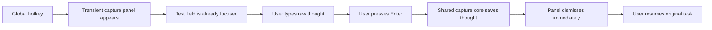
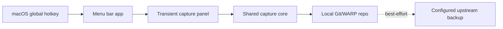
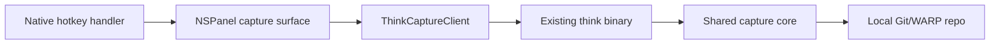
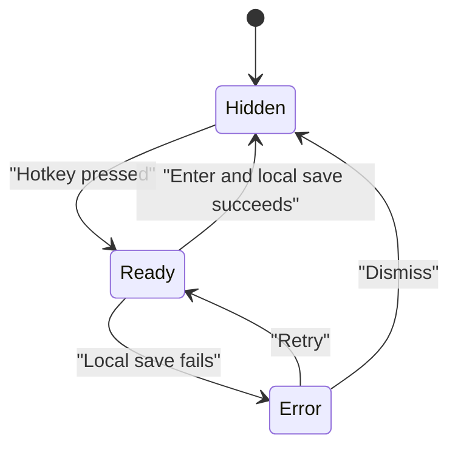

# 0005 M2 macOS Capture Surface

Status: draft for review

## Purpose

Define the product and interaction design for Milestone 2: a macOS capture surface that makes `think` more habitual than the CLI without changing capture semantics.

This document is intentionally about the adapter, not the substrate.

Milestone 1 proved:

- the system works
- local-first capture is real
- backup honesty can stay separate from local success

Milestone 2 must prove something different:

- the user reaches for the hotkey without thinking

## Problem Statement

The CLI is a valid capture surface, but it still requires too much context switching for the highest-frequency moments. A thought appears during work, while browsing, while reading, or between tasks. If capture requires opening a terminal or mentally switching into “tool use,” the habit loop weakens.

Milestone 2 exists to make capture feel closer to a thought appearing directly inside a text field.

## Sponsor User

Primary sponsor user:

- a macOS user already benefiting from raw CLI capture who wants a faster, more reflexive surface for high-frequency thought capture during normal desktop use

## M2 Hill

### Hill: Prefer The Hotkey Without Thinking

Who:

- a user on their Mac who has a thought in the middle of another activity and wants to keep moving

What:

- they press one global hotkey, type one thought into an already-focused field, press Enter, and the panel disappears immediately after capture using the exact same core behavior as the CLI

Wow:

- it feels less like opening an app and more like the thought appeared directly in a text field for long enough to be saved

## Success Statement

Milestone 2 succeeds when:

- the user prefers the hotkey over the CLI without consciously deciding to

Everything else is secondary.

## Experience Principles

1. One motion beats visible power.
2. Focus is a feature.
3. Vanishing quickly is part of the UX.
4. Thin UI is a product virtue here.
5. Adapter parity matters more than visual cleverness.
6. Perceived latency matters more than nominal latency.

## Interaction Doctrine

### One-Motion Capture

The desired loop is literal:

1. hotkey
2. type
3. Enter
4. gone

No extra confirmation step should be required.

### Focus Guarantee

If the panel appears, the cursor must already be ready.

No:

- click to focus
- tab to field
- delayed autofocus
- confusing partial focus states

### Zero-State Surface

The default panel should contain as little as possible:

- a text field

No:

- placeholder text by default
- recent thoughts
- suggestions
- concept matching
- visible history
- settings surface
- dashboard elements

### Auto-Dismiss On Success

The panel should dismiss on Enter after the capture succeeds locally.

It should not linger to celebrate.
It should not expose an observable “saving” phase in the normal path.

### No Retrieval Before Write

The overlay must not look up prior thoughts, suggest related entries, or prompt conceptual matches before save.

Milestone 2 must not violate Milestone 1 doctrine.

### Barely-There Status

The safest default is likely no visible status in the panel after submit.

If status exists, it should be:

- ephemeral
- quiet
- non-blocking
- never dashboard-like

### Interrupt Safety

`Escape` means “forget instantly.”

Rules:

- dismiss immediately
- save nothing
- leave no partial side effects

### Environmental Sanity

The app must behave sanely under desktop reality:

- repeated hotkey presses are defined and idempotent
- the panel appears on the correct monitor
- the panel is not trapped behind other windows
- opening the panel does not produce focus races with the app the user was in

## Strict Constraints

These are non-negotiable constraints for M2:

- no placeholder text by default
- no visible save step in the success path
- no retrieval-before-write
- no settings UI
- no history view
- no suggestions
- no lingering panel after success
- no visible network anxiety when backup is pending

If any of these start to bend, the milestone is drifting.

## Latency Perception Rule

The practical benchmark is not “under one second.” The real benchmark is:

- feels instant

If the user can perceive a delay between hotkey, focus, Enter, and disappearance, that is a product bug even if a formal benchmark still passes.

## Conceptual Loop



## System Shape

The macOS app should be a thin ingress adapter over the existing capture core.



This milestone must not create a second capture implementation.

## Native Stack Decision

M2 is a “does this feel like thinking?” problem, so native macOS performance and window behavior matter more than portability.

Approved stack:

- SwiftUI for the shell
- `MenuBarExtra` for menu bar presence
- `NSPanel` for the transient floating capture surface
- native macOS hotkey plumbing through AppKit-level integration

Explicit non-goal:

- no C core
- no FFI abstraction layer
- no speculative cross-platform runtime

Those may become real later. They are not earned yet.

## Adapter Boundary

Keep `think` as the source of truth.

The macOS app should depend on a tiny boundary such as:

```swift
func capture(text: String) async throws -> CaptureResult
```

For M2, the implementation behind that boundary may simply shell out to the existing `think` binary and translate the result.

The important constraint is:

- no capture logic duplication inside the macOS app

If a future shared core becomes necessary, it can replace the client implementation behind the same boundary.

## Technical Shape



This is intentionally unglamorous. That is a feature.

## App Responsibilities

The macOS app should:

- register the global hotkey
- show and hide the transient capture panel
- hand raw text to the same shared capture core used by the CLI
- optionally expose a minimal menu bar presence

The macOS app should not:

- reinterpret capture semantics
- own a separate storage path
- become a control panel
- become a status dashboard
- become the first brainstorm or reflection UI

## Menu Bar App Doctrine

The menu bar app exists to support capture, not to become a destination.

Good menu bar behavior:

- always available
- quiet
- thin
- reliable

Bad menu bar behavior:

- settings-heavy
- status-heavy
- admin-console energy
- visually sticky

## Panel States

There should be very few states.



Interpretation:

- `Ready` should dominate normal use
- successful save should collapse directly into `Hidden`
- `Error` should exist, but it should be the exceptional path

## Failure Handling

The system should preserve trust without adding ceremony.

Rules:

- local save failure may block dismissal and show a minimal retryable error
- error UI must stay minimal: no stack traces, no advanced controls, no giant surfaces
- backup pending must not behave like capture failure
- unreachable upstream must not drag visible network anxiety into the panel

## Non-Goals

Not in Milestone 2:

- recent thoughts in the panel
- reflection prompts
- brainstorm prompts
- suggestions while typing
- history browsing from the panel
- settings screens
- visual polish for its own sake
- rich status surfaces

## Playback Questions

1. Does the experience feel like “a thought appearing in a text field” rather than opening an app?
2. Is the text field always focused immediately?
3. Does Enter dismiss the panel in one motion after local success?
4. Is the hotkey path already preferred over the CLI for normal desktop use?
5. Did any retrieval-before-write behavior sneak into the surface?
6. Did the menu bar UI stay thin and non-administrative?
7. Does the panel behave correctly across monitor and focus edge cases?

## Exit Criteria

- the macOS app reuses the same shared capture core as the CLI
- the hotkey path preserves exact behavior parity with CLI capture
- the panel supports one-motion capture: hotkey, type, Enter, gone
- the field is focused immediately on open
- `Escape` cancels with zero side effects
- the panel behaves correctly across normal monitor and focus scenarios
- the user prefers the hotkey over the CLI without thinking
- the menu bar app does not become an ad hoc control panel

## Risks

- focus bugs make the whole milestone feel broken even if the backend works
- multi-monitor placement or z-order issues make the panel feel unreliable
- visible status lingers too long and adds cognitive drag
- panel design grows into a mini app
- capture semantics drift from the CLI path
- “just a little intelligence” sneaks into the overlay

## Decision Rule

If an M2 design choice makes the panel feel more like opening an app and less like typing directly into a field, reject it.
