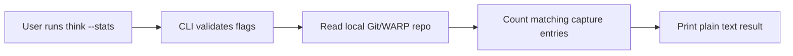

# 0006 Stats Command

Status: accepted addendum; implemented in the CLI

## Purpose

Define a minimal read-only stats surface that helps validate capture habit without turning `think` into a dashboard.

This command exists to support the success metrics in [`0004-modes-and-success-metrics.md`](./0004-modes-and-success-metrics.md), especially:

- rolling average entries per day
- rough daily capture volume
- whether capture is becoming habitual rather than occasional

This is an observational surface, not a new product mode.

## Problem Statement

Capture volume matters, but the product should not become status-first.

Without a small truthful read surface, it is harder to tell whether:

- the capture loop is actually sticky
- the user is reaching for `think` repeatedly
- the system is collecting enough signal to justify later reflective modes

The answer is not a dashboard. The answer is one plain command.

## Command Shape

The command is:

```bash
think --stats
```

Related explicit read command:

```bash
think --recent
```

These are flags rather than positional subcommands so literal thoughts like `"stats"` and `"recent"` remain capturable:

```bash
think "stats"
think "recent"
```

## Interaction Model



The command should:

- read local visible state only
- print plain text
- exit immediately

The command should not:

- bootstrap capture state on its own
- infer meaning
- summarize thoughts
- score the user
- turn into a persistent status surface

## Output Contract

Default output:

```text
Total thoughts: 42
```

Optional bucketed output:

```text
Total thoughts: 42
2026-03-22: 12
2026-03-21: 8
2026-03-20: 15
```

Rules:

- output stays plain
- counts are based on raw capture entries
- newest buckets appear first
- no charts, streaks, or encouragement language

## Filtering Contract

Supported filters:

```bash
think --stats --since=24h
think --stats --since=7d
think --stats --from=2026-03-01 --to=2026-03-07
think --stats --bucket=day
```

Supported buckets:

- `hour`
- `day`
- `week`

Supported relative-window units:

- `h`
- `d`
- `w`

## Validation Rules

The command must fail rather than lie.

That means:

- invalid `--since` values are rejected
- invalid `--from` and `--to` values are rejected
- invalid `--bucket` values are rejected
- stray positional text is rejected

Examples that should fail:

```bash
think --stats --since=7days
think --stats --bucket=month
think --stats "this thought would otherwise be dropped"
```

Why this matters:

- silent fallback makes the numbers untrustworthy
- silent argument discard is especially bad in a capture system

## Product Doctrine Alignment

- capture remains the primary interaction
- stats is read-only and should stay idempotent
- the command supports habit validation without becoming a dashboard
- Git/WARP details stay below the UX
- the command reports facts, not judgments

## Non-Goals

- charts
- streaks
- gamification
- writer-based breakdowns
- latency reporting
- reflection metrics
- proactive habit coaching

## Playback Questions

1. Does `--stats` help confirm whether capture is becoming habitual?
2. Does the output stay boring and trustworthy?
3. Does the command remain clearly separate from capture and reflection?
