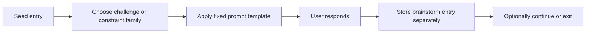

# 0007 M3 Brainstorm Mode

Status: approved for tests

## Purpose

Define Milestone 3 using an IBM Design Thinking style frame so `think` can add a real brainstorm mode without corrupting raw capture, recent, or the thin macOS capture surface.

This document is intentionally about deliberate idea expansion, not reflection and not x-ray.

## Problem Statement

Raw capture now works well. Thoughts can be preserved quickly from the CLI or the macOS hotkey surface.

The next problem is different:

- capture preserves the thought
- but it does not help the user push, challenge, recombine, or sharpen that thought on purpose

Milestone 3 exists to create a deliberate mode for controlled discovery.

It should not feel like autocomplete.
It should not feel like a chatbot.
It should not leak into the capture path.

## Sponsor User

Primary sponsor user:

- a user with a raw captured thought who wants help expanding or pressure-testing it, but does not want generic slop, categorization overhead, or a reflective dashboard

## M3 Hill

### Hill: Pressure-Test An Idea Without Corrupting Capture

Who:

- a user who already captured a thought and now wants to deliberately push it somewhere more interesting

What:

- they enter brainstorm mode with a seed thought, receive one sharp deterministic challenge or constraint prompt, respond, and leave with a new derived entry that preserves the lineage of the session

Wow:

- brainstorm feels less like “generate more ideas” and more like “something sharp pushed my thinking forward”

## Success Statement

Milestone 3 succeeds when:

- brainstorm sessions regularly produce sharper follow-on entries rather than generic filler

Everything else is secondary.

## Experience Principles

1. Deliberate entry beats ambient cleverness.
2. Controlled friction beats idea spam.
3. One sharp question beats ten weak prompts.
4. Receipts matter more than mystique.
5. Brainstorm expands capture; it does not rewrite capture.
6. Deterministic structure is enough if the prompts have teeth.

## Interaction Doctrine

### Brainstorm Is Explicit

Brainstorm mode must only be entered deliberately.

No:

- automatic prompting after capture
- ambient suggestions in the menu bar panel
- “you may also like” behavior in recent

Brainstorm commands must also honor the standing CLI machine contract:

- `--json` must be supported
- `--json` output must remain 100% JSONL across `stdout` and `stderr`
- `stdout` should carry ordinary brainstorm data rows
- `stderr` should carry structured warnings and errors
- machine-readable rows must include real brainstorm data, not just trace noise

### Seeded Session

Brainstorm begins from a seed entry or seed thought.

The system must know what is being pushed on.
The user must not be dropped into a generic blank brainstorm canvas.

### Seed Eligibility Gate

Not every raw capture should be brainstormable.

Brainstorm should only operate on seeds that look like candidate:

- ideas
- questions
- problems
- decisions
- tensions

Status notes, narrative notes, and observational captures are still valuable, but they should not be forced through brainstorm by default.

If a seed is not pressure-testable, the system should:

- refuse clearly
- explain the refusal plainly
- suggest picking a different seed or capturing a sharper claim first
- offer one or two recent eligible alternatives when it can do so honestly

The interactive seed picker should prefer pressure-testable captures rather than offering every raw entry equally.

### Deterministic Pressure

The default brainstorm engine should be deterministic and non-LLM.

The core shape:

1. select seed thought `A`
2. choose a sharp prompt family from the seed alone
3. apply one fixed prompt template
4. capture the user’s response as a brainstorm entry

This makes brainstorm a pressure mode rather than a generation mode.

### Challenge And Constraint First

The first implementation should not depend on the system guessing another relevant thought from the archive.

The best default prompt families are:

- `challenge`
- `constraint`

The important constraint for `M3`:

- keep the prompt selection logic simple and inspectable
- always be able to explain why the question shape was chosen
- make that explanation deterministic and receipt-like rather than narrative

Good default:

- a seed-first question that is always relevant to the seed thought

Bad default:

- a second thought presented as wisdom just because the system found some weak overlap or convenient distance signal

Human-facing brainstorm shells may still let the user choose a pressure family explicitly.
Machine-facing callers may also request an explicit prompt family.

That is acceptable as long as:

- the prompt still comes from a small fixed bank
- the chosen family is reflected honestly in receipts and lineage
- the system does not pretend the family was inferred when it was actually requested

### Recombine Is Optional, Not Default

Archive-driven recombination may still become useful later, but it should not be the default `M3` path.

If recombine is added later, it should be:

- explicit
- explainable
- skippable
- grounded in stronger structure than casual overlap

Examples of acceptable later recombine signals:

- explicit user request
- same session with clear tension
- explicit later linkage
- stronger later `M4` structure once it exists

Until then, default brainstorm should remain seed-first.

### Receipt Surface

Whenever brainstorm presents a prompt, it should also show why it was selected.

Examples:

- “Used a deterministic challenge prompt from the seed thought alone.”
- “Used a deterministic constraint prompt from the seed thought alone.”

This is part of the product, not a debugging detail.

### Prompt Templates, Not Freeform Narration

Prompting should come from a small, explicit bank of sharp question shapes.

Examples:

- “What assumption is hiding here?”
- “What would make this false in practice?”
- “What part of this is probably wishful thinking?”
- “What if this had to work offline?”
- “What is the smallest shippable version of this?”
- “What if this had to be explained in one sentence?”
- “What is the actual core claim here?”
- “What is the smallest concrete next move?”
- “What should be cut from this idea?”

This keeps the mode sparse and intentional.

### Derived Entries Stay Separate

Brainstorm outputs must be stored separately from raw captures.

They should preserve:

- `seedEntryId`
- `contrastEntryId` when used
- `sessionId`
- `promptType`

They must not:

- mutate the raw entry
- rewrite the original wording
- silently replace a thought with its brainstormed descendant

## What Brainstorm Is Not

Brainstorm mode is not:

- reflection mode
- x-ray mode
- clustering UI
- semantic search
- a dashboard
- a notes editor
- a generic chatbot conversation

If the mode starts trying to “understand” the whole archive, it is drifting into `M4`.

## Deterministic M3 Shape

The intelligence here is mostly:

- prompt-family choice
- prompt sharpness
- user response

Not model inference.

## Session Model

Brainstorm should behave like a bounded session, not an endless thread.

Minimum useful session shape:

- one seed
- one prompt
- one response
- optional continuation up to 2-3 total steps max

This keeps the mode from becoming chat sprawl.

### Early Termination Is Success

A brainstorm session is successful if it produces one sharper follow-on entry.

It does not need to:

- complete a fixed flow
- exhaust all prompt types
- continue until the system runs out of things to ask

## Prompt Families

Likely useful first families:

### Challenge

- attack a hidden assumption or weak claim

### Constraint

- force the seed through a hard condition

Examples:

- “What if this had to work offline?”
- “What is the smallest shippable version of this?”
- “What if this had to be explainable in one sentence?”

### Recombine

- ask whether two apparently separate ideas are actually related

Challenge and constraint are the correct defaults.
Recombine is a later, more failure-prone mode and does not need to ship in the first implementation.

## Non-LLM Position

The working assumption for `M3` should be:

- deterministic first
- inspectable first
- local first

If an LLM is used later, it should consume already-derived receipts or structures rather than replacing the deterministic backbone.

For `M3`, that means:

- no LLM dependency is required
- prompt generation should not depend on a model
- session usefulness should come from sharp challenge/constraint prompts and good questions, not synthetic fluency

## Boundaries With M4

These ideas are valuable, but they belong in later reflection / x-ray work, not `M3`:

- clustering neighborhoods
- community detection
- keyphrase extraction for reflection
- weekly reflection packs
- “understanding” surfaces

Brainstorm should push an idea.
Reflection and x-ray should reveal structure.

## No Mode Bleed Rule

During brainstorm, the system must not surface:

- cluster UI
- keyword extraction
- summaries
- reflection narration

If the mode starts doing any of that, it has crossed into `M4`.

## Risks

- brainstorm becomes autocomplete in a nicer coat
- brainstorm starts surfacing too many choices and becomes menu-driven
- brainstorm leaks into capture
- brainstorm outputs become a replacement for raw entries rather than a separate layer
- archive-selection logic gets too clever to explain
- the system mistakes deterministic structure for actual understanding

## Playback Questions

1. Does brainstorm feel deliberately entered rather than ambient?
2. Does one prompt usually produce a sharper thought, not just more words?
3. Can the user see why the system chose the question shape?
4. Is the default prompt always relevant to the seed thought?
5. Does the system refuse low-signal seeds instead of inventing fake depth?
6. Do brainstorm outputs remain clearly separate from raw capture?
7. Does the mode avoid chatbot energy?
8. Would the user use this to pressure-test a real idea, not just to play with the system?

## Exit Criteria

- brainstorm mode is explicit and seeded
- brainstorm refuses seeds that are not pressure-testable
- the first prompt engine is deterministic and inspectable
- the system exposes deterministic receipts for prompt selection
- brainstorm produces separate derived entries with preserved lineage
- raw capture remains untouched
- brainstorm is sharp enough to generate useful follow-on thoughts
- sessions remain bounded
- no reflection, clustering, or x-ray behavior leaks into the milestone

## Decision Rule

If a brainstorm design choice makes the mode feel more like chatting with a model and less like pressure-testing an idea, reject it.
