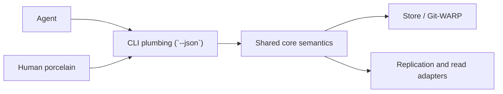

# 0008 Agent-Native CLI

Status: draft for review

## Purpose

Define how `think` should treat agents as first-class users of the system without collapsing the product into “chatbot everywhere.”

This note applies IBM Design Thinking framing to an agent sponsor instead of a human sponsor.

The goal is not to replace the human-facing product.
The goal is to make the core `think` contract usable by agents in a way that is deterministic, inspectable, local-first, and safe to build on.

## Problem Statement

`think` already has human-facing surfaces:

- plain CLI capture and read commands
- a native macOS menu bar capture surface

Those are good product surfaces for humans.
They are not, by themselves, a sufficient long-term integration boundary for agents.

An agent needs different guarantees:

- structured input and output
- explicit side-effect semantics
- stable machine-readable contracts
- retry-safe behavior
- deterministic receipts instead of prose interpretation

If the CLI remains primarily human-shaped and agent support is treated as a later scrape/parsing problem, the system will drift into a weak middle state:

- human output becomes de facto API
- contract changes become accidental breaking changes
- agents become brittle
- human porcelain starts carrying plumbing concerns

The design goal is to avoid that drift.

## Sponsor Agent

Primary sponsor agent:

- an LLM-driven local or remote worker that needs to capture, inspect, and later brainstorm with thoughts using explicit machine-readable contracts rather than parsing human-oriented text

Examples:

- a local coding agent capturing observations during work
- an automated daily review agent inspecting recent entries or stats
- a future reflection agent consuming deterministic receipts before optionally using a model

## Hill

### Hill: Let An Agent Use `think` Without Pretending To Be A Human

Who:

- an agent that needs to write or read from `think` as part of a larger reasoning loop

What:

- it uses explicit, versioned, machine-readable commands and receives structured JSONL rows describing success, warnings, failures, receipts, and results

Wow:

- the agent can use `think` as a real local cognition substrate rather than as a pile of human CLI text it has to guess at

## Success Statement

This design succeeds when:

- an agent can use `think` reliably without depending on human phrasing, terminal formatting, or undocumented event sequences

Everything else is secondary.

## Experience Principles

1. Plumbing must be explicit.
2. Structured receipts beat interpretive narration.
3. Determinism beats cleverness.
4. Stream contracts matter as much as payload shape.
5. Human porcelain and agent plumbing may differ in form, but not in semantics.
6. Agents should consume the contract, not reverse-engineer the UX.

## Agent Doctrine

### Agent-Native Means Contract-First

An agent-facing `think` surface should expose:

- explicit commands
- explicit side effects
- explicit stream semantics
- explicit versions

It should not require:

- scraping human output
- inferring whether a command was read-only
- guessing whether a warning is fatal
- relying on unstated ordering behavior

### JSONL Is The Plumbing Boundary

The default machine contract should be JSONL.

Why:

- row-by-row streaming works well for CLI use
- warnings and partial progress can be represented honestly
- agents can consume results incrementally
- command output remains composable in Unix-style pipelines

### Streams Matter

In `--json` mode:

- `stdout` carries ordinary data and success rows
- `stderr` carries structured warnings and errors
- both streams must remain JSONL-only
- no human-readable fallback text should leak into either stream

This preserves Unix semantics while keeping the system fully machine-readable.

### Schema Versioning Must Be Independent

The JSON contract should have its own versioning policy.

Do not tie machine-contract versions directly to package versions.

Good:

- package version: `0.2.0`
- CLI JSON contract version: `v1`

Why:

- the product can evolve without silently breaking agents
- schema changes can be reviewed as contract changes
- compatibility can be reasoned about deliberately

### Human Porcelain Still Matters

Agent-native does not mean agent-only.

The right split is:

- plumbing: stable machine contract
- porcelain: human-friendly commands and surfaces

Examples:

- `think --json --recent`
- `think --json --stats`
- later, explicit brainstorm session commands

Human shorthand can remain:

- `think "…"`
- `think --recent`
- menu bar capture
- Bijou-driven interactive brainstorm surfaces later

But those should rest on the same semantics rather than inventing their own side effects.

## Target Architecture



The important idea:

- the JSON plumbing contract is a first-class boundary
- porcelain sits above the same semantics
- the store is below both

## Command Contract Shape

The machine contract should be defined at three levels:

1. shared envelope
2. per-row schema
3. per-command sequence contract

### Shared Envelope

Every row should expose enough metadata to be validated and versioned.

A likely minimal envelope:

```json
{
  "schema": "think.cli.capture.status.v1",
  "event": "capture.status",
  "ts": "2026-03-23T07:00:00.000Z"
}
```

Event-specific fields then follow.

### Per-Row Schemas

Examples:

- `cli.start`
- `cli.validation_failed`
- `capture.status`
- `backup.status`
- `recent.entry`
- `stats.total`
- `stats.bucket`
- later:
  - `reflect.session_started`
  - `reflect.prompt`
  - `reflect.entry_saved`

### Sequence Contracts

Agents care not only about row shape, but also about row order and stream placement.

The contract should define, per command:

- which rows may appear
- on which stream they appear
- in what order they may appear
- which rows are terminal

## Retry And Idempotency

Agent use raises a problem humans can ignore:

- retries happen
- duplicate writes become much more likely

So the plumbing surface should eventually support explicit idempotency for write commands.

Likely future contract:

- request id
- idempotency key
- or explicit write token semantics

This should be designed deliberately before claiming agent-safe write retries.

Until then:

- machine clients should treat write retries as potentially non-idempotent

## Brainstorm Implications

The agent-native design is especially important for `M3`.

Brainstorm is already converging on an explicit session protocol:

- start from a seed
- receive a deterministic contrast or fallback
- receive a fixed prompt
- submit a response
- store a derived entry with lineage

That is a strong fit for agents if the contract is explicit.

It is a weak fit if an agent has to parse:

- decorative terminal text
- prose explanations
- human affordances

So brainstorm should be designed as:

- structured plumbing first
- human interactive shell second

## What Agent-Native Is Not

Agent-native does not mean:

- replacing human UX with machine UX
- turning the CLI into an undocumented RPC tunnel
- requiring LLMs for every “smart” feature
- collapsing brainstorm, reflection, and x-ray into one generic agent surface

The product should remain mode-disciplined.

## Risks

- the machine contract is treated as an implementation detail instead of a real product boundary
- schema changes happen accidentally
- porcelain starts depending on undocumented event quirks
- agents are encouraged to parse prose instead of contracts
- idempotency is assumed before it exists
- the plumbing surface expands faster than the mode doctrine

## Playback Questions

1. Can an agent use `think` without scraping human text?
2. Can the contract explain what happened without prose interpretation?
3. Are stream semantics clear enough that warnings and failures are not ambiguous?
4. Can human-facing surfaces evolve without silently breaking agents?
5. Does this design keep plumbing and porcelain distinct without splitting semantics?
6. Are write commands honest about retry and idempotency limits?

## Exit Criteria

- the repo has an explicit machine-contract design note
- `--json` is treated as a first-class contract, not a convenience flag
- stream semantics are documented
- schema/versioning posture is documented
- new mode work, especially brainstorm, treats machine-readable output as required
- no claim of idempotent write safety is made until it is actually designed

## Decision Rule

If an agent integration idea requires parsing human-facing prose or terminal presentation, reject it in favor of a more explicit contract.
