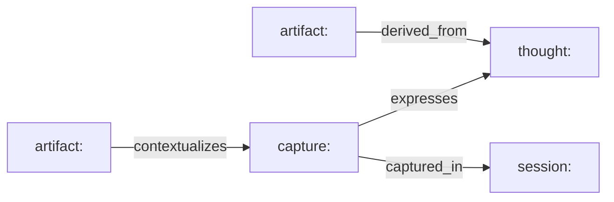
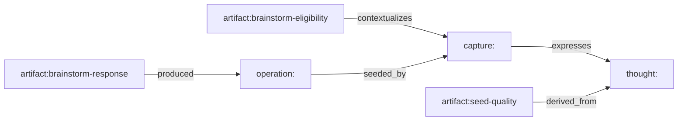
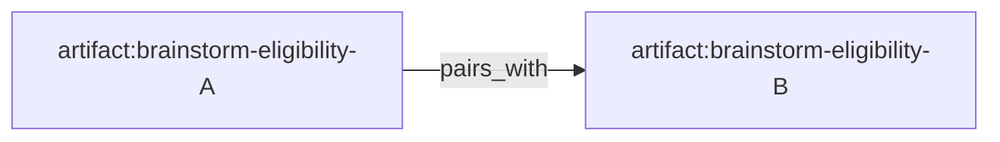
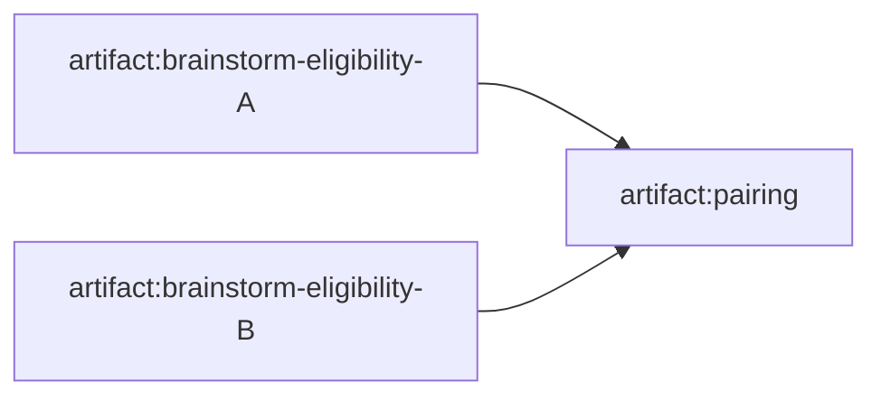

# 0009 Graph Derivation Model

Status: draft for review

## Purpose

Define a focused graph model for `think` so raw capture, derived interpretation, sessions, brainstorm, and later x-ray work all have a consistent substrate.

This note is intentionally technical.
It is not another milestone pitch.
It exists to stop graph flexibility from turning into graph drift.

## Problem Statement

`think` is built on a graph substrate that is flexible enough to encode almost anything:

- raw nodes
- derived nodes
- edge properties
- edge attachments
- recursive graph payloads

That flexibility is useful, but it also creates risk.

Without a tighter graph design, every new mode will be tempted to invent its own structure:

- mutable properties on raw thoughts
- ad hoc heuristics in the CLI layer
- pairings without clear provenance
- edge attachments used as a shortcut for underdesigned node models
- content fingerprints used as if they were enough to identify every derivation forever

The result would be a graph that is technically expressive but architecturally muddy.

This note narrows that space.

## Design Goal

The graph should support this posture:

1. raw capture is sacred and immutable
2. derivation happens after ingress
3. later modes consume derived artifacts rather than re-scraping raw thoughts ad hoc
4. provenance remains inspectable
5. repeated identical thoughts remain distinct capture events

## Core Rules

### 1. Raw Ingress Is Immutable

Once a raw thought enters the system, it must not be rewritten.

No later mode may:

- edit the original wording
- attach mutable interpretation fields directly to the raw capture node
- replace the raw thought with a “better” version

### 2. Capture Identity And Content Identity Are Different

The system must preserve both:

- the occurrence of a thought
- the content of a thought

These are not the same thing.

Two identical strings captured at different times are two distinct capture events.

### 3. Derived Interpretation Lives Outside Raw Capture

Keywords, classifications, seed-quality judgments, contextual eligibility, session structure, and x-ray artifacts are all derived artifacts.

They should not be modeled as mutable truth baked into the raw capture node.

### 4. Modes Should Read The Derived Layer

As the system grows, brainstorm, x-ray, and reflection should not each re-implement raw-text heuristics inside their UI or CLI adapters.

Those modes should consume derived graph artifacts produced by a post-capture derivation pipeline.

### 5. Edge Attachments Are Powerful, But Not Default

The graph substrate allows attachments on edges.
That does not mean edge attachments should be the first modeling move.

Default rule:

- prefer explicit nodes for first-class derived artifacts
- use plain named edges for relationship structure
- use edge attachments only when the edge itself is the primary subject of inspection

## Identity Model

The graph should use two identity layers.

### Capture Identity

Capture identity represents an immutable event.

Example shape:

- `capture:<event-id>`

This answers:

- when was this captured?
- by which ingress?
- by which writer?

It does not assume that session membership is known at capture time.

### Content Identity

Content identity represents the exact raw text bytes.

Example shape:

- `thought:<fingerprint>`

The fingerprint should be a stable hash of the raw content bytes.

Preferred future choice:

- BLAKE3

Acceptable interim choice:

- SHA-256

The important decision is not the exact hash function.
The important decision is that the content identity is stable and separate from the capture event.

## Canonical Payload Ownership

The canonical raw text bytes should be owned by the content node:

- `thought:<fingerprint>`

Recommended rule:

- `capture:<event-id>` holds event metadata
- `thought:<fingerprint>` holds the canonical raw text payload
- derived artifacts reference canonical content and must not become alternate authorities for the bytes

Temporary denormalized copies are acceptable only as disposable caches.
They must not become authoritative.

## Recommended Node Families

The graph should stay small, disciplined, and explicitly typed through schema fields and edge verbs.

### Core Nodes

- `capture:<event-id>`
- `thought:<fingerprint>`
- `session:<session-id>`
- `artifact:<artifact-id>`
- later, when needed:
  - `operation:<operation-id>`

This is intentionally less cute than encoding every semantic in the node id itself.
IDs should stay stable.
Semantics should live in explicit schema fields and named edges.

### Why `artifact:<artifact-id>` Instead Of `classification:<fingerprint>`

Derived artifacts are not identified by input content alone.

The same thought may produce multiple valid derived artifacts if any of these change:

- derivation kind
- derivation implementation
- derivation version
- schema version
- optional config or threshold set

So the durable identity rule is:

- raw content fingerprint is part of provenance
- it is not, by itself, the full identity of a derived artifact

### Artifact Kinds Must Stay Contracted

`artifact:<artifact-id>` must not become a miscellaneous blob with a `kind` field.

Every artifact kind should have a defined payload contract.

At minimum, each kind should have:

- required fields
- allowed provenance inputs
- clear ownership of its payload

The generic `artifact` identity is a discipline tool, not permission to store arbitrary semi-structured drift.

## Derived Artifact Categories

Not all derived outputs are the same.

### 1. Interpretive Artifacts

These are text-oriented judgments or extractions.

Examples:

- keyword sets
- lexical classification
- intrinsic seed quality

These usually derive from:

- `thought:<fingerprint>`

### 2. Contextual Artifacts

These depend on the occurrence and its neighbors, not just on the text bytes.

Examples:

- session-local context
- contextual brainstorm eligibility
- neighboring capture windows

These usually derive from:

- `capture:<event-id>`
- `session:<session-id>`

### 3. Operational Outputs

These are outputs of an explicit mode run or system operation.

Examples:

- brainstorm response
- x-ray scan
- reflection pack

These often depend on:

- user choice
- mode config
- current graph neighborhood
- runtime state

They should not be conflated with interpretive artifacts.

## Derived Artifact Identity

A derived artifact is not identified by input content alone.

It is identified by the combination of:

- artifact kind
- input identity
- derivation implementation
- derivation version
- output schema version
- optional config fingerprint when relevant

Recommended minimum fields on every derived artifact node:

- `kind`
- `primaryInputKind`
- `primaryInputId`
- `deriver`
- `deriverVersion`
- `schemaVersion`
- `createdAt`

Optional fields when relevant:

- `configFingerprint`
- `status`
- `reasonKind`
- `reasonText`

A derived artifact is not identified by input content alone and should not be mutated in place to represent a later derivation result.

This is enough to keep provenance inspectable without introducing a separate derivation-run node too early.

## Derivation Provenance

For now, `think` should use a lightweight provenance model for derivations.

Each derived artifact should record:

- what it was derived from
- how it was derived
- when it was derived

The recommended near-term representation is:

- metadata on the artifact node itself
- one or more named provenance edges to the graph objects it depends on

An artifact may have multiple provenance edges when its derivation depends on more than one graph object.
The named edge should reflect the role of that dependency rather than pretending there is only one exclusive input.

Possible later expansion:

- `derive-run:<id>` nodes for batch runs or reproducibility inspection

That fuller provenance model is valuable, but it is not required for the first disciplined graph shape.

### Derived Artifacts Are Append-Only

Derived artifacts should be append-only records of a specific derivation result.

If derivation logic changes:

- produce a new artifact
- do not mutate an old artifact in place and pretend it always meant the new thing

## Brainstorm-Specific Split

`brainstormability` is too overloaded as a single concept.

It should be split into two concepts:

### Intrinsic Seed Quality

A text-oriented judgment such as:

- idea-like
- question-like
- decision-like
- tension-bearing

This is a content-derived artifact.

### Contextual Brainstorm Eligibility

A context-sensitive judgment such as:

- should this be shown now as a brainstorm candidate?
- has it already been brainstormed recently?
- is it too similar to other recent seeds?
- is it legible in the current session context?

This is a contextual artifact, not a pure content judgment.

This split keeps the graph honest.
The same text can have stable seed quality while having changing operational eligibility.

## Recommended Edge Families

The graph should use explicit named edges.

Graphs rot when edges remain vibes-based.

Recommended starting verbs:

- `capture --expresses--> thought`
- `capture --captured_in--> session`
- `artifact --derived_from--> thought`
- `artifact --contextualizes--> capture`
- `operation --seeded_by--> capture`
- `operation --produced--> artifact`

These verbs can be refined later, but they should be chosen deliberately and reused consistently.

Artifacts may carry more than one provenance edge when they depend on multiple graph objects.
The `captured_in` edge does not imply that session membership is known at ingress; it may be added later by session attribution.

### Core Shape

### Brainstorm Shape

This makes the operational structure explicit:

- raw capture remains sacred
- content judgments remain content-derived
- eligibility can depend on context
- brainstorm output is an operation result, not a reinterpretation of the raw node

## Operation Nodes

An `operation:<operation-id>` node represents a concrete system run or user-invoked mode execution whose outputs should remain inspectable as distinct operational results rather than being collapsed into timeless derivations.

## Post-Capture Derivation Pipeline

The graph should support a derivation pipeline that runs after ingress.

### Fast Per-Thought Derivations

These can be created from the raw content alone.

Examples:

1. keyword extraction
2. lightweight classification
3. seed-quality assessment

### Fast Per-Capture Derivations

These depend on occurrence context.

Examples:

1. session attribution
2. contextualization from surrounding captures
3. brainstorm eligibility

### Later Batch Derivations

These should remain later and heavier.

Examples:

1. x-ray structures
2. cluster neighborhoods
3. pairing candidates
4. reflection packs

## What Consumers Should Read

This is the intended read posture:

### Capture Surfaces

Examples:

- CLI capture
- macOS capture panel
- plain `recent`

These should stay close to raw capture events.

### Brainstorm

Brainstorm should:

- display the canonical raw text from the thought node
- use seed-quality and brainstorm-eligibility artifacts to decide what is eligible
- avoid ad hoc raw heuristics in the UI layer

### X-Ray And Reflection

These should primarily read derived artifacts and aggregated structures, not re-interpret raw text every time.

## Attachments Policy

Attachments are allowed on both nodes and edges by the substrate.

The recommended policy is:

### Attachments Belong On Nodes By Default

Use node attachments for:

- canonical raw text
- larger structured derivation payloads
- future reflective or x-ray artifacts

### Edge Attachments Are Reserved

Use edge attachments only when all three are true:

1. the relation has durable payload
2. that payload is inspected independently
3. introducing a relation-node would be more awkward than clearer

For current `M3` and early `M4` work, edge attachments should not be the default modeling move.

## Pairings And Comparable Thoughts

It may eventually be useful to model valid brainstorm pairings.

That should not be done by connecting raw thoughts directly as if the pairing were universal truth.

Instead, pairing should live in the derived brainstorm layer.

Example future shape:

Direct `pairs_with` edges should be treated as a convenience cache, not as the canonical source of pairing truth, unless the pairing model is later formalized as stable and reproducible.

Or, if the relationship itself needs richer provenance:

Important rule:

- do not materialize every possible pairing eagerly

If pairing is added later, it should be:

- sparse
- explainable
- query-driven or lightly cached

Not:

- a full combinatorial graph built speculatively

## Explicit Non-Goals

This note does not approve:

- recursive graph payloads as a default modeling tool
- making the content fingerprint the sole capture identifier
- identifying derived artifacts by content fingerprint alone
- mutable interpretation properties on raw capture nodes
- full pairwise brainstorm pairing materialization
- x-ray ontology design during `M3`
- treating edge attachments as the primary way to model derived artifacts

## Practical Near-Term Direction

The immediate next architectural improvement should be:

1. keep raw capture as immutable ingress events
2. introduce a stable content identity
3. move brainstorm seed-quality and eligibility out of ad hoc CLI-only logic and into explicit derived graph artifacts
4. let brainstorm read those artifacts instead of re-deciding from scratch in the prompt layer

That is enough structure to improve `M3` without prematurely building all of `M4`.

## Decision Rule

If a graph modeling choice makes raw capture less sacred, provenance less clear, or later modes more coupled to ad hoc heuristics, reject it.
