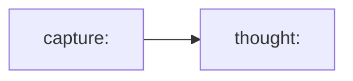
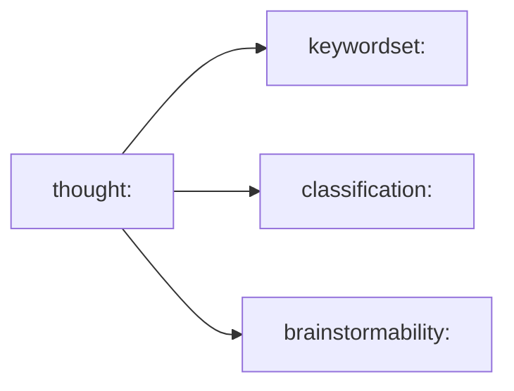
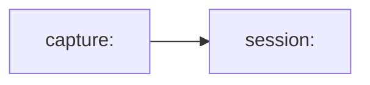
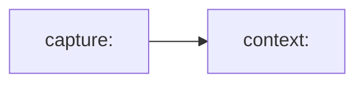
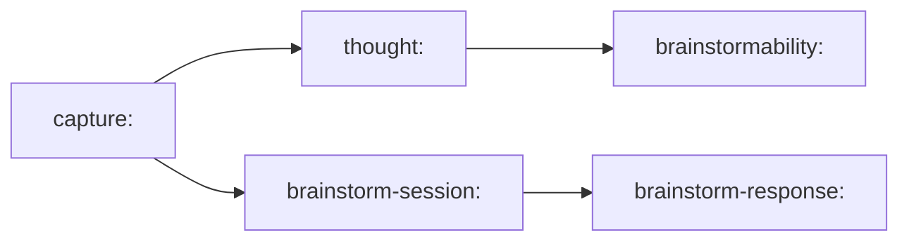
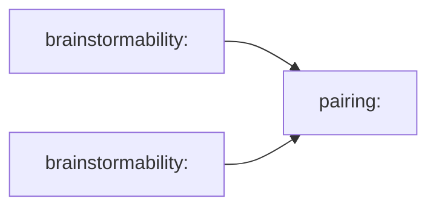

# 0009 Graph Derivation Model

Status: draft for review

## Purpose

Define a focused graph model for `think` so raw capture, derived interpretation, sessions, brainstorm, and later x-ray work all have a consistent substrate.

This note is intentionally technical.
It is not another milestone pitch.
It exists to stop graph flexibility from turning into graph drift.

## Problem Statement

`think` is built on a graph substrate that is flexible enough to encode almost anything:

- raw nodes
- derived nodes
- edge properties
- edge attachments
- recursive graph payloads

That flexibility is useful, but it also creates risk.

Without a tighter graph design, every new mode will be tempted to invent its own structure:

- mutable properties on raw thoughts
- ad hoc heuristics in the CLI layer
- pairings without clear provenance
- edge attachments used as a shortcut for underdesigned node models

The result would be a graph that is technically expressive but architecturally muddy.

This note narrows that space.

## Design Goal

The graph should support this posture:

1. raw capture is sacred and immutable
2. derivation happens after ingress
3. later modes consume derived artifacts rather than re-scraping raw thoughts ad hoc
4. provenance remains inspectable
5. repeated identical thoughts remain distinct capture events

## Core Rules

### 1. Raw Ingress Is Immutable

Once a raw thought enters the system, it must not be rewritten.

No later mode may:

- edit the original wording
- attach mutable interpretation fields directly to the raw capture node
- replace the raw thought with a “better” version

### 2. Capture Identity And Content Identity Are Different

The system must preserve both:

- the occurrence of a thought
- the content of a thought

These are not the same thing.

Two identical strings captured at different times are two distinct capture events.

### 3. Derived Interpretation Lives Outside Raw Capture

Keywords, classifications, brainstormability, session membership, context, and x-ray structures are all derived artifacts.

They should not be modeled as mutable truth baked into the raw capture node.

### 4. Mode Logic Should Read The Derived Layer

As the system grows, brainstorm, x-ray, and reflection should not each re-implement raw-text heuristics inside their UI or CLI adapters.

Those modes should consume derived graph artifacts produced by a post-capture derivation pipeline.

### 5. Edge Attachments Are Powerful, But Not Default

The graph substrate allows attachments on edges.
That does not mean edge attachments should be the first modeling move.

Default rule:

- prefer explicit nodes for first-class derived artifacts
- use plain edges for relationship structure
- use edge attachments only when the edge itself is the primary subject of inspection

## Identity Model

The graph should use two identity layers.

### Capture Identity

Capture identity represents an immutable event.

Example shape:

- `capture:<event-id>`

This answers:

- when was this captured?
- by which ingress?
- by which writer?
- in which session did it occur?

### Content Identity

Content identity represents the exact raw text bytes.

Example shape:

- `thought:<fingerprint>`

The fingerprint should be a stable hash of the raw content bytes.

Preferred future choice:

- BLAKE3

Acceptable interim choice:

- SHA-256

The important decision is not the exact hash function.
The important decision is that the content identity is stable and separate from the capture event.

## Recommended Node Families

### Raw Event Nodes

- `capture:<event-id>`

These represent:

- one ingress event
- one occurrence
- one point in time

### Canonical Content Nodes

- `thought:<fingerprint>`

These represent:

- one exact raw text payload
- stable content identity

The canonical raw text attachment should eventually live here rather than being duplicated conceptually across every derived artifact.

### Content-Derived Artifact Nodes

These depend only on the raw text itself.

Examples:

- `keywordset:<fingerprint>`
- `classification:<fingerprint>`
- `brainstormability:<fingerprint>`

These are good candidates for content-addressed derivation because identical text should produce identical text-only analyses.

### Capture-Context Artifact Nodes

These depend on the occurrence and its surrounding context, not just the text bytes.

Examples:

- `session-membership:<capture-id>`
- `context:<capture-id>`

These must not collapse across identical text, because the same sentence captured in different sessions may mean different things.

### Mode Output Nodes

These represent the outputs of explicit later modes.

Examples:

- `brainstorm-session:<session-id>`
- `brainstorm-response:<event-id>`
- later:
  - `xray-scan:<scan-id>`
  - `reflection-session:<session-id>`

## Recommended Edge Families

The graph should prefer a small set of semantically crisp relationships.

### Capture To Content



Meaning:

- this capture event refers to this exact content

### Content To Content-Derived Artifact



Meaning:

- these artifacts were derived from this exact text

### Capture To Session



Meaning:

- this occurrence belongs to this human session

### Capture To Context Artifact



Meaning:

- this occurrence has contextual derivations tied to its session and neighbors

### Brainstorm Session Structure



Meaning:

- brainstorm begins from a capture event
- eligibility can be assessed from content-derived artifacts
- the brainstorm response is a separate later event

## Post-Capture Derivation Pipeline

The graph should support a derivation pipeline that runs after ingress.

### Fast Per-Thought Derivations

These can be created from the raw content alone.

Examples:

1. keyword extraction
2. lightweight classification
3. brainstormability assessment

### Fast Per-Capture Derivations

These depend on occurrence context.

Examples:

1. session assignment
2. contextualization from surrounding captures

### Later Batch Derivations

These should remain later and heavier.

Examples:

1. x-ray structures
2. cluster neighborhoods
3. pairing candidates
4. reflection packs

## What Consumers Should Read

This is the intended read posture:

### Capture Surfaces

Examples:

- CLI capture
- macOS capture panel
- plain `recent`

These should stay close to raw capture events.

### Brainstorm

Brainstorm should:

- display the raw text from the raw/canonical thought
- use `brainstormability` and related derived artifacts to decide what is eligible
- avoid ad hoc raw heuristics in the UI layer

### X-Ray And Reflection

These should primarily read derived artifacts and aggregated structures, not re-interpret raw text every time.

## Attachments Policy

Attachments are allowed on both nodes and edges by the substrate.

The recommended policy is:

### Attachments Belong On Nodes By Default

Use node attachments for:

- canonical raw text
- larger structured derivation payloads
- future reflective or x-ray artifacts

### Edge Attachments Are Reserved

Do not use edge attachments just because they are available.

Use them only when:

- the relationship itself is the thing being examined
- the relationship needs its own durable payload
- a plain relationship plus a node would be more awkward than necessary

For current `M3`/`M4` work, edge attachments should not be the default modeling move.

## Pairings And Comparable Thoughts

It may eventually be useful to model valid brainstorm pairings.

That should not be done by connecting raw thoughts directly as if the pairing were universal truth.

Instead, pairing should live in the derived brainstorm layer.

Example future shape:



Or, if eventually justified:

```mermaid
flowchart LR
    B1["brainstormability:<fingerprint-A>"] -->| "pairs_with" | B2["brainstormability:<fingerprint-B>"]
```

Important rule:

- do not materialize every possible pairing eagerly

If pairing is added later, it should be:

- sparse
- explainable
- query-driven or lightly cached

Not:

- a full combinatorial graph built speculatively

## Explicit Non-Goals

This note does not approve:

- recursive graph payloads as a default modeling tool
- making the content fingerprint the sole capture identifier
- mutable interpretation properties on raw capture nodes
- full pairwise brainstorm pairing materialization
- x-ray ontology design during `M3`
- treating edge attachments as the primary way to model derived artifacts

## Practical Near-Term Direction

The immediate next architectural improvement should be:

1. keep raw capture as immutable ingress events
2. introduce a stable content identity
3. move brainstorm eligibility out of ad hoc CLI-only logic and into explicit derived graph artifacts
4. let brainstorm read those artifacts instead of re-deciding from scratch in the prompt layer

That is enough structure to improve `M3` without prematurely building all of `M4`.

## Decision Rule

If a graph modeling choice makes raw capture less sacred, provenance less clear, or later modes more coupled to ad hoc heuristics, reject it.
