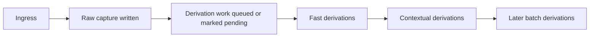

# 0010 Ingress And Derivation Pipeline

Status: draft for review

## Purpose

Define when post-capture derivation happens, which process owns it, and what guarantees it must preserve.

This note exists because the graph model alone is not enough.
Once raw capture and derived artifacts are separated, the system also needs a disciplined answer to:

1. when derivation runs
2. what process performs it
3. what happens when derivation is unavailable
4. how this works when capture is offline or delayed

## Problem Statement

`think` now has a clearer graph model:

- raw capture is immutable
- interpretation is derived later
- later modes should consume derived artifacts instead of re-running ad hoc heuristics

That creates a pipeline problem.

If the system does not define the derivation pipeline clearly, several bad outcomes follow:

- brainstormability remains ad hoc CLI logic
- different surfaces produce different derived state
- offline capture behaves inconsistently
- derivation failures contaminate capture
- Git hooks get mistaken for application orchestration

This note locks the operational doctrine for ingress and derivation.

## Core Doctrine

### 1. Capture Completes Before Derivation Matters

Raw capture is the first-class event.

The capture contract is:

- accept raw thought
- durably write raw capture event
- return success or failure for that raw write

Derivation is downstream of that event.

No derivation stage may be required for raw capture to count as successful.

### 2. Derivation Is Post-Ingress Work

Anything that interprets, classifies, clusters, scores, or contextualizes the capture belongs to the derivation pipeline.

Examples:

- keyword extraction
- seed-quality assessment
- brainstorm eligibility
- session attribution
- local context windows
- later x-ray structures

### 3. Derivation Must Be Replayable

The derivation pipeline should be able to recompute artifacts from raw capture plus graph state.

That means:

- derivation must not depend on invisible transient process state
- derivation results must record provenance
- derivation failures must be recoverable by rerunning later

### 4. Derivation Must Not Be Hidden Git Magic

Git commit hooks are not the primary orchestration layer for `think`.

They are too implicit, too environment-dependent, and too easy to bypass.

Correctness must not depend on them.

## Pipeline Stages

The intended flow is:

### Stage 0: Ingress

Ingress surfaces include:

- CLI capture
- macOS capture panel
- later additional surfaces such as web or agent-native callers

Ingress does one thing:

- create the immutable raw capture event

### Stage 1: Fast Local Derivations

These should be cheap and deterministic enough to run immediately after capture when the local environment is healthy.

Examples:

- content fingerprinting
- canonical thought-node linkage
- seed-quality assessment
- lightweight lexical classification

These may happen in the same application process as capture, but only after the raw write is durable.

### Stage 2: Contextual Derivations

These depend on graph neighborhood, recent captures, or session structure.

Examples:

- session attribution
- contextual brainstorm eligibility
- local context windows

These may still run shortly after capture, but they should be treated as downstream and retryable.

### Stage 3: Later Batch Derivations

These are heavier, broader, or more exploratory.

Examples:

- x-ray structures
- pairing candidates
- reflection packs
- neighborhood/cluster constructions

These should not be on the hot path.

## When Derivation Happens

The intended timing model is:

### Immediate

Raw capture happens immediately and synchronously.

This is the only part that determines whether capture itself succeeded.

### Near-Immediate Best Effort

Fast derivations may run immediately after capture in the same process or a local worker, but only as best-effort post-ingress work.

If they fail, raw capture still stands.

### Deferred

Any derivation that cannot be completed immediately should remain pending and be recomputed later without loss of correctness.

The system should assume that offline capture, app shutdown, or worker absence can interrupt derivation.

That must be a normal state, not a corruption state.

## Which Process Owns Derivation

The system should distinguish clearly between:

- ingress process
- derivation process

Those may be the same executable in a simple implementation, but they are not the same responsibility.

### Near-Term Recommendation

Use an application-owned derivation worker model, not Git hooks.

That means:

- ingress writes raw capture
- ingress marks derivation work as needed
- a local application-controlled worker performs derivations

In the earliest implementation, that worker may simply be:

- the same process, after capture returns success
- or a later explicit re-derivation command
- or a thin local helper process invoked by the app when available

What matters is the ownership boundary:

- the application owns derivation
- Git does not

### Why Not Git Commit Hooks

Git hooks are a bad primary mechanism here because they are:

- implicit
- local-environment-specific
- easy to skip
- hard to version as product behavior
- awkward for offline or delayed recomputation

More importantly, Git hooks run at repository-operation time, not at product-intent time.

`think` needs:

- predictable derivation semantics
- explicit recovery
- controlled replay

Git hooks are not a good substrate for that.

### What Hooks May Still Be Used For

Hooks may be acceptable later for:

- optional operator tooling
- diagnostics
- local assertions in development

They must not be the canonical place where application correctness happens.

## Failure Model

The pipeline must assume partial failure.

### Allowed Failure

These failures must be survivable:

- derivation process unavailable
- app exits after raw capture but before derivation
- offline capture with no later worker immediately available
- derivation code upgrade that invalidates prior pending assumptions

### Not Allowed

These are not acceptable:

- raw capture success depending on derivation success
- silent mutation of raw capture during derivation
- losing track of which captures still need derivation

## Pending State

The system should explicitly represent that a capture may still require derivation work.

This does not have to be exposed loudly in the normal user UX, but it must exist in the technical model.

At minimum, the system needs a way to know:

- this capture has raw ingress complete
- these derivation stages have not yet been materialized

This can be represented either by:

- explicit pending artifacts
- explicit pending work markers
- or a deterministic “missing artifact implies pending” rule

The exact implementation can stay open, but the state itself should not be hand-waved.

## Replay And Re-Derivation

The pipeline should support re-derivation as a first-class operation.

That means later commands should be able to:

- derive missing artifacts
- derive new artifact versions after implementation changes
- leave old artifacts intact as historical derivation results

This is especially important because the graph model already treats derived artifacts as append-only provenance-bearing results.

## Session Note

Session is not assumed to be known at capture time.

So session-related logic should be treated as attribution or derivation unless a future ingress surface explicitly supplies session truth.

That means:

- offline capture is valid without session assignment
- later session attribution is normal
- `capture --captured_in--> session` may be added after ingress

## Recommended Near-Term Implementation

The first implementation should stay boring.

### Phase 1

- write raw capture synchronously
- derive or link `thought:<fingerprint>` immediately after raw success
- leave other derivations as explicit best-effort post-ingress work

### Phase 2

- add a small application-owned derivation runner
- let it fill in seed-quality and brainstorm eligibility artifacts
- allow explicit replay/rebuild of those artifacts

### Phase 3

- expand into contextual and batch derivations for `M4`

This sequencing keeps `M3` honest without prematurely building a full background processing platform.

## Decision

The derivation pipeline should be application-owned, post-ingress, replayable, and independent of Git hooks for correctness.

## Decision Rule

If a pipeline design makes raw capture depend on hidden repository hooks or makes derivation failure indistinguishable from capture failure, reject it.
