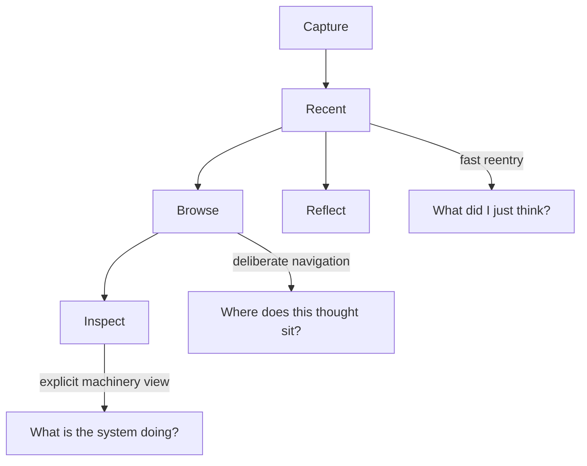

# 0012 M4 Reentry, Browse, And Inspect

Status: draft for review

## Intent

Define Milestone 4 around the human read modes that now appear to matter most in actual use.

This note replaces the vaguer idea of “richer reflection” with a clearer three-layer read model:

- `recent`: fast reentry into what was captured
- `browse`: deliberate navigation through thoughts without prompts or narration
- `inspect`: explicit structural inspection of the stored thought system and its derived organization

The goal is to make returning to old thoughts more useful without corrupting raw capture, hiding provenance, or turning the app into a dashboard.

## Problem

Milestone 3 clarified that deterministic post-capture prompting is useful as `Reflect`, but it is not the same job as reading, revisiting, or inspecting prior thoughts.

The next value to prove is not more pressure-testing.

The next value to prove is:

- can the user return to thoughts and find what matters?
- can the user navigate the archive without early classification pressure?
- can the user inspect what the system knows or inferred without the app getting coy?

“Reflection and X-Ray” was pointing in the right direction, but it blurred together several different reader jobs.

Those jobs should now be separated.

## Reader Mode Stack

The important rule is:

- `recent` stays plain
- `browse` stays navigational
- `inspect` stays explicit

These are different read jobs.

They should not be collapsed into one clever surface.

## Mode 1: Recent

`recent` remains the first return surface.

Its job is still boring and important:

- show what was captured
- preserve exact wording
- stay chronological and easy to trust

`recent` can become more useful without becoming “smart.”

Possible improvements:

- last `N` captures
- captures since a time window
- more human time expressions such as “yesterday” or “since 12:34pm”
- fuzzy keyword filtering

Important constraints:

- no summaries
- no hidden ranking magic
- no inferred relatedness injected into the default list
- no pressure to classify thoughts during capture just to make `recent` work

## Mode 2: Browse

`browse` is a thought browser, not a dialogue mode.

Its job is to let the user move around the archive deliberately.

Possible behaviors:

- show one thought at a time
- show previous and next thoughts
- show session-nearby thoughts when honest
- show connected or related thoughts when there are explicit receipts
- expose provenance or placement context without forcing interpretation
- allow the user to jump from a viewed thought into `Reflect`

Important constraints:

- no prompt injection by default
- no fake narration
- no hiding raw text behind a summary surface
- no assumption that browsing must become a TUI or dashboard immediately

The defining feeling should be:

> I am navigating my thought archive.

Not:

> the app is trying to think for me.

## Mode 3: Inspect

`inspect` is the user-facing name for the explicit machinery view.

This is the mode for:

- looking at the thought database directly
- seeing how the app has organized or linked thoughts
- understanding provenance
- inspecting raw vs derived structure without hand-waving

This is the spiritual successor to the earlier “X-Ray” label, but `inspect` is a better product name because it says plainly what the user is doing.

Possible surfaces:

- raw node / capture metadata
- canonical content identity
- derived artifacts and why they exist
- explicit linkage receipts
- timeline placement
- session attribution
- graph neighborhood when it is real and inspectable

Important constraints:

- no magical explanation voice
- no hidden heuristics presented as truth
- every structural claim should have receipts
- this mode should reveal machinery rather than hiding it

The defining feeling should be:

> show me what the system actually has.

## What M4 Is Not

M4 is not:

- a dashboard milestone
- an ontology-first milestone
- an LLM spitball milestone
- ambient recommendation sludge
- archive-wide “smart summaries” without receipts

M4 should improve reentry and inspection while staying local-first, provenance-aware, and honest.

## Relationship To Reflect

`Reflect` remains a separate explicit mode.

The distinction is:

- `recent` answers: what did I just think?
- `browse` answers: where is this thought in the archive?
- `inspect` answers: what does the system actually know or claim here?
- `reflect` answers: how do I pressure-test this one thought further?

That separation matters.

If `browse` or `inspect` starts prompting by default, or if `reflect` starts pretending to be the archive browser, the modes will collapse again.

## Relationship To Spitball

Future LLM-assisted spitballing still belongs outside this milestone.

If it exists later, it should remain:

- explicit
- bounded
- seed-first
- receipt-backed

It should not silently take over `browse` or `inspect`.

## First M4 Slice

The smallest coherent slice now looks like:

1. strengthen `recent` as a trustworthy reentry surface
2. add the first explicit `browse` prototype
3. add the first explicit `inspect` prototype

That is a better sequence than trying to jump directly to a dialogue-heavy “reflection” mode whose job is still ambiguous.

## Candidate Deliverables

- richer `recent` filters by count, time window, and fuzzy text
- a first browser surface over stored thoughts
- an explicit `inspect` command or view for provenance and derived structure
- clear receipts for any displayed connections or groupings

## Playback Questions

- can the user find a prior thought they care about quickly?
- does `browse` feel like navigation rather than product cleverness?
- does `inspect` help the user trust the system more?
- do these read modes stay separate from capture and `Reflect`?
- does any new read surface remain honest about what is raw versus derived?

## Exit Criteria

- raw entries remain immutable
- `recent` becomes more useful without becoming a mini-dashboard
- `browse` exists as a real navigation surface
- `inspect` exists as a real machinery-facing surface with receipts
- no new read mode adds friction to capture
- no silent “smartness” leaks into the default read path
