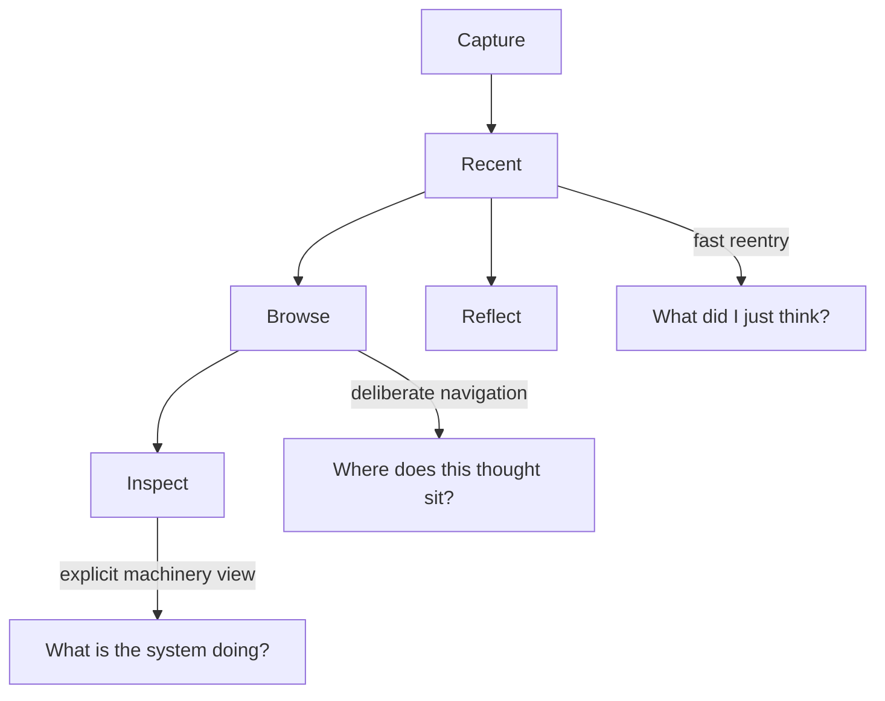

# 0012 M4 Reentry, Browse, And Inspect

Status: implemented and closed

## Intent

Define Milestone 4 around the human read modes that now appear to matter most in actual use.

This note replaces the vaguer idea of “richer reflection” with a clearer three-layer read model:

- `recent`: fast reentry into what was captured
- `browse`: deliberate navigation through thoughts without prompts or narration
- `inspect`: explicit structural inspection of the stored thought system and its derived organization

The goal is to make returning to old thoughts more useful without corrupting raw capture, hiding provenance, or turning the app into a dashboard.

## Problem

Milestone 3 clarified that deterministic post-capture prompting is useful as `Reflect`, but it is not the same job as reading, revisiting, or inspecting prior thoughts.

The next value to prove is not more pressure-testing.

The next value to prove is:

- can the user return to thoughts and find what matters?
- can the user navigate the archive without early classification pressure?
- can the user inspect what the system knows or inferred without the app getting coy?

“Reflection and X-Ray” was pointing in the right direction, but it blurred together several different reader jobs.

Those jobs should now be separated.

## Reader Mode Stack

The important rule is:

- `recent` stays plain
- `browse` stays navigational
- `inspect` stays explicit

These are different read jobs.

They should not be collapsed into one clever surface.

## Surface Decision

M4 should now assume two layers:

- plumbing read commands that remain explicit, scriptable, and JSONL-capable
- a human-facing read shell that makes browsing and inspection feel deliberate rather than mechanical

That read shell should not replace the plumbing.
It should sit on top of it.

The approved direction is:

- keep `--recent`, `--browse`, and `--inspect` as the explicit command surface
- adopt a Bijou-based TUI as the first deliberate human browse/inspect shell
- keep the TUI optional and explicit rather than ambient

This preserves the standing product doctrine:

- capture stays sacred
- machine contracts stay real
- richer human reading can still become pleasant on screen

It also preserves agent parity:

- any meaningful `recent`, `browse`, `inspect`, or `Reflect` capability should have an explicit non-TUI command path
- the human shell may improve navigation and presentation, but it must not become the only place where important read behavior exists

## Mode 1: Recent

`recent` remains the first return surface.

Its job is still boring and important:

- show what was captured
- preserve exact wording
- stay chronological and easy to trust

`recent` can become more useful without becoming “smart.”

Possible improvements:

- last `N` captures
- captures since a time window
- more human time expressions such as “yesterday” or “since 12:34pm”
- fuzzy keyword filtering

Important constraints:

- no summaries
- no hidden ranking magic
- no inferred relatedness injected into the default list
- no pressure to classify thoughts during capture just to make `recent` work

## Mode 2: Browse

`browse` is a reader-first thought browser, not a dialogue mode.

Its job is to let the user move around the archive deliberately.

Core behaviors:

- show one thought at a time as the primary surface
- show useful metadata up front:
  - timestamp
  - relative time
  - log position
  - entry identity
- show previous and next thoughts
- support a hidden chronology drawer rather than a permanent archive rail
- support a fuzzy jump surface so the user can move intentionally without scrolling the whole archive
- show session-nearby thoughts when honest
- show connected or related thoughts when there are explicit receipts
- expose provenance or placement context without forcing interpretation
- allow the user to jump from a viewed thought into `Reflect`

The first human-facing `browse` shell should be a Bijou TUI.
That is now an explicit design direction, not just one possible implementation.

The first prototype already clarified one important anti-pattern:

- a permanent full-height recent rail is the wrong default
- the current thought should dominate the screen
- the archive log should appear only when explicitly summoned

Important constraints:

- no prompt injection by default
- no fake narration
- no hiding raw text behind a summary surface
- no graph fireworks
- no dashboard homepage
- no attempt to absorb capture into the TUI

The defining feeling should be:

> I am navigating my thought archive.

Not:

> the app is trying to think for me.

And not:

> I am staring at a giant recent list with one highlighted row.

## Mode 3: Inspect

`inspect` is the user-facing name for the explicit machinery view.

This is the mode for:

- looking at the thought database directly
- seeing how the app has organized or linked thoughts
- understanding provenance
- inspecting raw vs derived structure without hand-waving

This is the spiritual successor to the earlier “X-Ray” label, but `inspect` is a better product name because it says plainly what the user is doing.

Possible surfaces:

- raw node / capture metadata
- canonical content identity
- derived artifacts and why they exist
- explicit linkage receipts
- timeline placement
- session attribution
- graph neighborhood when it is real and inspectable

Important constraints:

- no magical explanation voice
- no hidden heuristics presented as truth
- every structural claim should have receipts
- this mode should reveal machinery rather than hiding it

In the first M4 shell, `inspect` should likely appear as an explicit pane or toggle within the Bijou browser rather than as a separate full-screen product.
The standalone `--inspect=<entryId>` command still matters for plain CLI and agent-native use.

The defining feeling should be:

> show me what the system actually has.

## What M4 Is Not

M4 is not:

- a dashboard milestone
- an ontology-first milestone
- an LLM spitball milestone
- ambient recommendation sludge
- archive-wide “smart summaries” without receipts

M4 should improve reentry and inspection while staying local-first, provenance-aware, and honest.

That now includes a likely next reentry surface:

- `remember`
  - context-scoped recall for “what was I thinking about this?”
  - complementary to `recent`, `browse`, and `inspect`, not a replacement for them

## Relationship To Reflect

`Reflect` remains a separate explicit mode.

The distinction is:

- `recent` answers: what did I just think?
- `remember` answers: what was I thinking about this project or topic?
- `browse` answers: where is this thought in the archive?
- `inspect` answers: what does the system actually know or claim here?
- `reflect` answers: how do I pressure-test this one thought further?

That separation matters.

If `browse` or `inspect` starts prompting by default, or if `reflect` starts pretending to be the archive browser, the modes will collapse again.

This also applies to agent use:

- an agent should be able to browse, inspect, and invoke `Reflect` through explicit command contracts
- the human shell may make those actions easier to see, but it must not invent exclusive semantics

## Relationship To Spitball

Future LLM-assisted spitballing still belongs outside this milestone.

If it exists later, it should remain:

- explicit
- bounded
- seed-first
- receipt-backed

It should not silently take over `browse` or `inspect`.

## Outcome

Human playback result:

- pass

Agent playback result:

- pass

Delivered milestone behavior:

- `recent` stayed boring while gaining tighter scoped filters
- `remember` became an explicit context-scoped recall surface, with bounded and brief follow-through enhancements
- `browse` became a real reader-first shell rather than a prompt stack or giant list
- `inspect` became a real machinery view with canonical identity and derived receipts
- the Bijou shell stayed optional porcelain over the explicit CLI and JSON contract
- session context, session traversal, and session presentation all became honest browse behaviors without turning into graph theater
- the first derivation bundle gave `inspect` durable receipts
- browse and inspect moved onto graph-native read paths with real performance wins

The milestone also required adjacent correction and follow-through work:

- graph versioning and migration
- graph migration gating and progress UX
- prompt telemetry read surface for product judgment

## Retrospective Reference

For the overall milestone closeout and slice-level follow-through, see:

- [`../retrospectives/m4-reentry-browse-inspect.md`](../retrospectives/m4-reentry-browse-inspect.md)
- [`../retrospectives/m4-session-context-browse.md`](../retrospectives/m4-session-context-browse.md)
- [`../retrospectives/m4-session-traversal.md`](../retrospectives/m4-session-traversal.md)
- [`../retrospectives/m4-v3-read-edge-substrate.md`](../retrospectives/m4-v3-read-edge-substrate.md)
- [`../retrospectives/m4-graph-native-browse-read-refactor.md`](../retrospectives/m4-graph-native-browse-read-refactor.md)
- [`../retrospectives/m4-remember-enhancements.md`](../retrospectives/m4-remember-enhancements.md)
- [`../retrospectives/m4-prompt-telemetry-read-surface.md`](../retrospectives/m4-prompt-telemetry-read-surface.md)
- [`../retrospectives/m4-session-presentation-polish.md`](../retrospectives/m4-session-presentation-polish.md)

## Historical Deliverables And Exit Frame

- richer `recent` filters by count, time window, and fuzzy text
- a first browser surface over stored thoughts
- an explicit `inspect` command or view for provenance and derived structure
- a Bijou-based TUI shell for browse and inspect
- first stored derivation artifacts that materially improve `inspect`

## Historical Slice Evolution

During implementation, the first real derivation bundle and the first session-context browse slice landed first.

The first session-traversal browse slice followed after that.

This keeps the current M4 posture honest:

- session traversal is useful enough to exist
- session presentation beyond that should be chosen from playback rather than assumed automatically
- browse still should not become a graph playground

What is now true:

- `browse` consumes `session_attribution` honestly
- human browse exposes session identity without replacing the reader-first view
- agent/JSON browse exposes explicit session context rows

See:

- [`0016-m4-session-context-browse.md`](./0016-m4-session-context-browse.md)
- [`0017-m4-session-traversal.md`](./0017-m4-session-traversal.md)
- [`../retrospectives/m4-session-traversal.md`](../retrospectives/m4-session-traversal.md)
- [`../retrospectives/m4-session-context-browse.md`](../retrospectives/m4-session-context-browse.md)

## First Bijou Slice (Historical)

The first TUI slice should stay intentionally narrow:

- open explicitly from `--browse` in a real TTY when no `entryId` is provided
- open on the newest raw thought by default
- center one raw thought at a time
- show timestamp and identity metadata without requiring inspect mode
- support older/newer navigation
- support a hidden bottom chronology drawer
- support a fuzzy jump palette for archive movement
- expose an inspect pane or toggle for raw metadata and derived receipts
- allow a jump into `Reflect` from the selected thought without dropping out of the TUI shell

It should not start with:

- graph maps
- ambient recommendations
- a permanent full-height recent rail
- editable dashboards
- capture inside the TUI
- LLM-assisted chat

The TUI is being adopted here because M4 is the first milestone whose core job is on-screen navigation and inspection.
It is not a general permission slip to move the whole product into a terminal application.

## Playback Questions (Historical)

- can the user find a prior thought they care about quickly?
- does the first Bijou shell feel like navigation rather than terminal theater?
- does `browse` feel like navigation rather than product cleverness?
- does `inspect` help the user trust the system more?
- do these read modes stay separate from capture and `Reflect`?
- does any new read surface remain honest about what is raw versus derived?
- can an agent perform the same core read jobs without depending on the Bijou shell?

## Exit Criteria (Historical)

- raw entries remain immutable
- `recent` becomes more useful without becoming a mini-dashboard
- `browse` exists as a real navigation surface
- `inspect` exists as a real machinery-facing surface with receipts
- the next likely M4 reentry slice is explicit context-scoped recall through `--remember`
- the Bijou read shell proves helpful without trying to become the whole product
- no new read mode adds friction to capture
- no silent “smartness” leaks into the default read path
- no core M4 capability exists only in the human TUI
