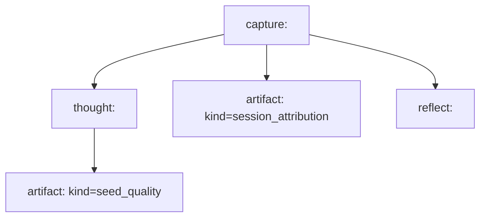

# 0015 Per-Thought Derivation Catalog

Status: draft for review

## Purpose

Consolidate the per-thought derivation story into one place.

This note exists because the derivation model and pipeline doctrine are already documented in:

- [`0009-graph-derivation-model.md`](./0009-graph-derivation-model.md)
- [`0010-ingress-and-derivation-pipeline.md`](./0010-ingress-and-derivation-pipeline.md)
- [`0014-m4-first-derived-artifacts.md`](./0014-m4-first-derived-artifacts.md)

Those notes define the architecture and the first bundle well enough to build against, but they do not give one compact answer to:

> For each raw thought, what derivations exist, when do they happen, what do they contain, and what is actually implemented today?

This note answers that directly.

## Scope

This is a catalog, not a new product thesis.

It should:

- enumerate the derivations attached to a raw thought
- state whether each derivation is immediate, near-immediate, or deferred
- define the current payload contracts at a practical level
- distinguish implemented derivations from planned derivations
- give `inspect`, `browse`, and agent consumers a clear reference

It should not:

- replace the graph doctrine in `0009`
- replace the pipeline doctrine in `0010`
- expand M4 scope into X-Ray, clustering, or LLM spitballing

## Governing Rules

This catalog inherits the standing doctrine:

- raw capture is immutable
- capture identity and content identity are different
- derived artifacts are append-only
- derivations must remain inspectable
- later modes should consume derived artifacts rather than re-scraping raw text ad hoc

## Per-Thought Derivation Stack

For one raw capture event, the current derivation stack should be understood in layers:

1. raw capture event
2. canonical thought identity
3. interpretive artifacts
4. contextual artifacts
5. operational descendants

The important distinction is:

- `thought:<fingerprint>` is canonical content identity, not a derivation judgment
- `seed_quality` is interpretive
- `session_attribution` is contextual
- `reflect` descendants are operational outputs, not timeless artifacts

## Catalog

### 1. Raw Capture Event

Status:

- implemented

Identity:

- `capture:<event-id>` in the design model
- currently materialized in code as `entry:<sortKey-uuid>`

Owned payload:

- capture event metadata
- canonical raw text attachment at ingress time

Important properties:

- immutable
- append-only
- repeated identical strings remain distinct capture events

This is not a derivation.
It is the thing derivations operate on.

### 2. Canonical Thought Identity

Status:

- implemented

Timing:

- immediate identity completion after raw capture succeeds

Identity:

- `thought:<fingerprint>`

Current fingerprint:

- SHA-256 of the raw text bytes

Current responsibility:

- represent stable content identity for exact raw text
- allow multiple capture events to resolve to the same canonical thought

Current practical payload:

- `kind = thought`
- `fingerprint`
- `createdAt`
- `schemaVersion`
- canonical raw text attachment

Current relationship to raw capture:

- raw capture stores `thoughtId`
- `inspect` exposes an explicit `expresses` relationship

Why it exists:

- prevents content identity from being a render-time trick
- makes duplicate raw captures inspectable as separate events sharing one content identity

### 3. Interpretive Artifact: `seed_quality`

Status:

- implemented

Timing:

- fast interpretive derivation after identity completion

Primary input:

- `thought:<fingerprint>`

Question answered:

- does this thought look like a plausible `Reflect` seed?

Current payload contract:

- `kind = seed_quality`
- `primaryInputKind = thought`
- `primaryInputId = thought:<fingerprint>`
- `verdict`
- `reasonKind`
- `reasonText`
- `promptFamilies`
- `deriver`
- `deriverVersion`
- `schemaVersion`
- `createdAt`

Current verdict space:

- `likely_reflectable`
- `weak_note`

Current implementation notes:

- derived from lightweight lexical markers only
- intentionally narrow
- should not be treated as universal truth about the thought

Current user-facing value:

- `inspect` can show why a thought does or does not look pressure-testable
- `Reflect` can rely on a stored receipt instead of re-inventing the same heuristic locally

### 4. Contextual Artifact: `session_attribution`

Status:

- implemented

Timing:

- near-immediate contextual derivation after raw capture succeeds

Primary input:

- `capture:<event-id>` / current implementation `entry:<...>`

Question answered:

- what session does this capture appear to belong to?

Current payload contract:

- `kind = session_attribution`
- `primaryInputKind = capture`
- `primaryInputId = capture:<event-id>` / current implementation `entry:<...>`
- `sessionId`
- `reasonKind`
- `reasonText`
- `deriver`
- `deriverVersion`
- `schemaVersion`
- `createdAt`

Current session rule:

- deterministic temporal bucketing
- new session if the idle gap to the previous capture exceeds 5 minutes

Current user-facing value:

- `inspect` can show context placement with receipts
- `browse` can later add honest session-nearby navigation on top of a real artifact

Important epistemic note:

- session is not assumed to be known at ingress time
- this is an attribution, not a native truth baked into capture

### 5. Operational Descendants: `Reflect`

Status:

- implemented

Timing:

- explicit mode execution later

This is not a per-thought derivation artifact in the same sense as `seed_quality` or `session_attribution`, but it matters in the per-thought inspect surface because it creates direct lineage from a raw capture.

Current inspect-visible fields:

- `relation = seed_of`
- `kind = reflect`
- `entryId`
- `sessionId`
- `promptType`
- `createdAt`

Why it appears in this catalog:

- users and agents inspecting one thought care about direct descendants
- `inspect` should distinguish these operational receipts from timeless artifacts

## Current Read Surface Mapping

### Human `inspect`

Current intended layers:

1. `Raw`
2. `Canonical Thought`
3. `Derived`
4. `Context`
5. direct operational receipts when present

Today that means:

- raw capture facts
- canonical `thoughtId`
- `seed_quality`
- `session_attribution`
- direct `Reflect` descendants

### JSON `--inspect`

Current intended machine-readable rows:

- `inspect.entry`
- `inspect.identity`
- `inspect.receipt` for `seed_quality`
- `inspect.receipt` for `session_attribution`
- `inspect.receipt` for direct `Reflect` descendants

This is the current minimum agent-parity contract for the first derivation bundle.

## Implemented vs Deferred

### Implemented Now

- canonical thought identity materialization
- `seed_quality`
- `session_attribution`
- direct `Reflect` descendant receipts
- duplicate raw capture inspection against a shared canonical thought id

### Explicitly Deferred

- keyword extraction artifacts
- richer lexical classification artifacts
- contextual eligibility beyond simple `seed_quality`
- X-Ray artifacts
- clustering and neighborhoods
- pairing artifacts
- replay UI for missing/pending derivations
- append-only artifact version coexistence in user-facing inspect surfaces

These are not rejected.
They are simply not part of the first implemented bundle.

## Timing Summary

### Immediate identity completion

- canonical thought identity

### Fast interpretive derivation

- `seed_quality`

### Near-immediate contextual derivation

- `session_attribution`

### Later explicit operations

- `Reflect`

### Later deferred derivation families

- X-Ray and other broader archive-analysis artifacts

## Why This Catalog Matters

Without this document, the implementation can still technically work, but the project loses an important discipline:

- one place to review what the system derives from a thought
- one place to compare current implementation against approved scope
- one place to tell whether a proposed new derivation is actually part of M4

This note is that place.

## Recommended Next Use

Use this catalog as the reference when:

- extending `inspect`
- extending `browse` to consume real receipts
- deciding whether a new derivation belongs in M4 or later
- checking whether a new artifact kind needs its own acceptance-spec expansion
