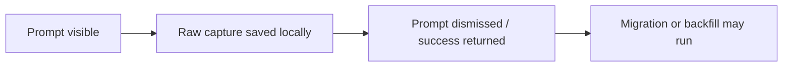
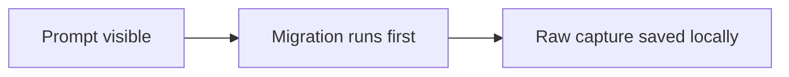

# 0021 Graph Migration Gating

Status: draft for review

## Sponsor

### Sponsor Human

A person using `think` for cheap capture who must never lose a thought because the graph model needs maintenance, but who also should not keep using graph-native read surfaces on an outdated repo forever.

### Sponsor Agent

An agent using explicit `think` commands and JSON contracts that needs graph model requirements to be deterministic, inspectable, and non-magical.

## Hill

If a `think` repo needs graph migration, raw capture still succeeds without friction, while graph-native commands either guide the human through an explicit upgrade or fail clearly for non-interactive/agent callers.

## Playback Questions

### Human Playback

- Can I still capture a thought instantly even if the repo needs migration?
- If I open a graph-native surface on an outdated repo, is the upgrade moment clear and reasonable?
- Does the system avoid a scary “your thought is blocked until maintenance finishes” experience?

### Agent Playback

- Does capture remain reliable without hidden preconditions?
- Do graph-native commands fail explicitly with a machine-readable migration requirement instead of silently mutating the repo?
- Is the migration policy narrow enough that agents do not need to guess which commands may mutate state?

## Non-Goals

This note does not:

- define the full implementation of migration locking/concurrency
- redesign the browse or inspect UX
- replace the migration/versioning note in `0019`
- define the full long-term removal plan for compatibility properties

## Problem

`think` now has:

- a graph model correction path in [`0019-graph-versioning-and-migration.md`](./0019-graph-versioning-and-migration.md)
- a local migration command shape: `think --migrate-graph`
- dual-write edges for new data

But one important product-policy question remains:

> when a repo is still on the old graph model, should `think` block, auto-migrate, or continue permissively?

The wrong answer here can break core product doctrine.

If migration blocks capture, `think` risks losing the very thought it exists to preserve.

If migration is always silent and automatic everywhere, graph changes become hidden system magic.

If `v1` compatibility remains open-ended forever, the architecture never actually converges.

## Decision

The system should treat capture and graph-native commands differently.

## 1. Raw Capture Must Never Be Blocked By Migration

This is the primary rule.

If the user captures a thought through:

- CLI capture
- macOS prompt panel
- later equivalent ingress surfaces

then the sequence must be:

1. accept the thought
2. durably write the raw capture
3. dismiss the UI / return capture success
4. run migration or backfill only after the raw save succeeds

This means migration is permitted as post-capture work.

It must not be a prerequisite for preserving the thought.

### Required Ordering

The allowed order is:

The forbidden order is:

The second ordering is forbidden because migration failure could cost the thought.

## 2. Graph-Native Commands May Require Migration

Commands whose semantics depend on the corrected graph model may block on `v2`.

Near-term examples:

- `--browse`
- `--inspect`
- `--remember`
- `--reflect`

These commands may require the repo to be migrated before continuing.

That is acceptable because they are not sacred-ingress moments.

## 3. Human Interactive Flows Should Offer Explicit Upgrade Or Cancel

If a human uses an interactive graph-native command on a `v1` repo, `think` should present an explicit upgrade gate.

Recommended posture:

- explain that the thought graph is outdated
- explain that the command requires an upgrade
- offer:
  - `Upgrade now`
  - `Cancel`

If the user cancels:

- the command stops
- the repo remains untouched

If the user accepts:

- run migration
- continue into the requested command

This is explicit and understandable.

It is not silent infrastructure drift.

## 4. Agent And Non-Interactive Flows Must Fail Explicitly

For:

- `--json`
- non-interactive shells
- agent callers

there should be no interactive prompt.

If migration is required, the command should fail explicitly with a structured error.

Recommended error shape:

- human message: `Graph migration required. Run think --migrate-graph.`
- structured event/code:
  - `graph.migration_required`

This keeps agent behavior deterministic.

## 5. Auto-Migration Is Allowed Only As Post-Capture Follow-Through

The system may auto-trigger migration after a successful raw local save.

That is the one acceptable automatic path because:

- the thought is already preserved
- the upgrade is improving future graph-native use
- the user was already in a write flow, not a read flow

But even here, the product rule remains:

- capture succeeded because the raw write succeeded
- migration is downstream follow-through, not part of capture success

If migration fails after capture:

- the raw thought still stands
- migration can be retried later
- the system may surface a quiet warning or pending state later

## 6. Compatibility Is Temporary, Not Forever

This gating policy exists to avoid carrying `v1` semantics forever.

The intended posture is:

- capture remains safe during transition
- graph-native commands increasingly expect `v2`
- migration is explicit where it matters
- compatibility fallback is a bridge, not a permanent doctrine

## Command Policy Matrix

| Command class | Outdated graph allowed? | Prompt allowed? | Auto-migrate allowed? |
| --- | --- | --- | --- |
| Raw capture | Yes | No | Yes, after raw save |
| Interactive graph-native read/reflect | No | Yes | No silent pre-run migration |
| JSON / agent graph-native read/reflect | No | No | No |
| Explicit `--migrate-graph` | Yes | Not needed | It is the migration action |

## Recommended UX Language

### Human Interactive

Example:

> Your thought graph uses an older model.
> `browse` needs a graph upgrade before it can continue.

Actions:

- `Upgrade now`
- `Cancel`

### Non-Interactive / Agent

Example:

> Graph migration required. Run `think --migrate-graph`.

Machine-readable:

- `graph.migration_required`

## Capture-Surface Implications

For the macOS panel specifically:

- the prompt should still appear instantly
- submit should still dismiss instantly
- local raw save should still happen first
- any migration should happen after dismissal and after local save

The menu bar or local telemetry may later report migration follow-through if useful, but the capture moment itself must stay thin.

## Implementation Consequences

This note implies the next implementation rules:

1. detect graph model generation cheaply
2. allow capture to continue on `v1`
3. gate graph-native commands on `v2`
4. provide structured migration-required failures for `--json`
5. make post-capture migration safe against duplicate/concurrent triggers

That last point is an implementation detail, but it matters:

- post-capture migration must not stampede
- repeated capture should not create a migration storm

## Relationship To 0019

`0019` answers:

- how the graph is versioned
- how data migrates additively

This note answers:

- when migration is required
- which commands may proceed without it
- where the user/agent sees the upgrade boundary

Both notes are needed.

## Bottom Line

The rule should be:

> outdated graph model may block graph-native use, but it must not block sacred raw capture.

So:

- capture saves first and may migrate after
- interactive graph-native commands can say `upgrade now or cancel`
- agent/non-interactive graph-native commands fail explicitly

That keeps the product honest on both sides:

- no lost thoughts
- no hidden graph magic
- no permanent compatibility limbo
