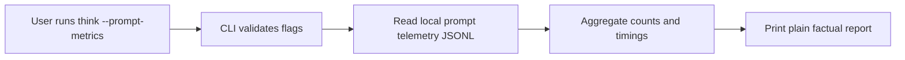

# 0025 Prompt Telemetry Read Surface

Status: implemented and closed

## Sponsor

Primary sponsor human:

- a person who wants to know whether the macOS capture prompt is actually fast enough and habit-friendly enough in real use, without opening logs or staring at vanity charts

Primary sponsor agent:

- an agent that needs explicit prompt UX usage and latency facts through a plain CLI / JSON contract, without scraping raw telemetry files or inferring structure from ad hoc logs

## Hill

If a person or agent wants to inspect prompt UX performance and usage, they can get a small, factual report over the recorded prompt telemetry without turning `think` into an analytics product, a dashboard, or a coaching system.

## Purpose

Define the first explicit read surface over the macOS prompt telemetry already recorded at:

- `~/.think/metrics/prompt-ux.jsonl`
- or `THINK_PROMPT_METRICS_FILE` when overridden

This slice exists because prompt telemetry is already being collected, but there is still no good product surface for reading it.

The result is a gap:

- the data exists
- the product cannot easily inspect it
- product judgment still depends too much on vibes

The answer should be a boring command, not a dashboard.

## Problem Statement

The current telemetry stream is useful, but only if it can be inspected in a disciplined way.

Without a read surface, it is harder to answer:

- is the hotkey path actually fast?
- how often is the prompt opened and abandoned?
- how often does the user start typing and then back out?
- is submit-to-hide calm enough?
- is submit-to-local-save staying inside the intended latency envelope?

The wrong answer is:

- charts
- gamification
- coaching
- vanity analytics

The right answer is:

- one plain command
- explicit filters
- factual counts and timings
- machine-readable parity

## Design Decision

Add a new explicit read-only command:

```bash
think --prompt-metrics
```

Why a separate command rather than folding this into `--stats`:

- prompt telemetry is operational instrumentation, not thought/archive state
- the data source is a local JSONL sidecar, not the thought graph
- combining the two too early would blur “capture habit facts” with “prompt UX instrumentation facts”
- a dedicated command keeps the product honest and the user expectation clear

Later, if a small subset of latency aggregates truly earns a place in `--stats`, that can be designed separately.

## Command Shape

Default command:

```bash
think --prompt-metrics
```

Supported filters for this first slice:

```bash
think --prompt-metrics --since=24h
think --prompt-metrics --since=7d
think --prompt-metrics --from=2026-03-01 --to=2026-03-07
think --prompt-metrics --bucket=day
```

Supported buckets:

- `hour`
- `day`
- `week`

Supported relative-window units:

- `h`
- `d`
- `w`

These intentionally mirror the existing `--stats` filter language so the tool stays learnable.

## Interaction Model



The command should:

- read local telemetry only
- remain read-only and idempotent
- work even when the thought repo does not yet exist
- exit immediately after reporting

The command should not:

- mutate telemetry
- require macOS app availability at read time
- infer emotion, intent, or productivity
- become a dashboard shell

## Source Data Contract

This command reads `PromptUXMetricsRecord` sessions.

The first slice should treat these fields as the stable factual inputs:

- `trigger`
  - `hotkey`
  - `menu`
- `dismissalOutcome`
  - `submitted`
  - `abandoned_empty`
  - `abandoned_started`
- `captureOutcome`
  - `succeeded`
  - `failed`
- `startedTyping`
- `editCount`
- `triggerToVisibleMs`
- `typingDurationMs`
- `submitToHideMs`
- `submitToLocalCaptureMs`
- `backupState`

The read surface should aggregate what exists and stay silent about what does not.

## Human Output Contract

Default output should stay plain:

```text
Prompt metrics
Sessions: 42
Submitted: 31
Abandoned empty: 7
Abandoned started: 4
Hotkey: 35
Menu: 7
Trigger to visible (median): 118 ms
Typing duration (median): 920 ms
Submit to hide (median): 64 ms
Submit to local save (median): 141 ms
```

Optional bucketed output:

```text
Prompt metrics
Sessions: 42
Submitted: 31
Abandoned empty: 7
Abandoned started: 4
Trigger to visible (median): 118 ms
Typing duration (median): 920 ms
Submit to hide (median): 64 ms
Submit to local save (median): 141 ms
2026-03-28: sessions 9, submitted 7, abandoned 2
2026-03-27: sessions 5, submitted 4, abandoned 1
```

Rules:

- output stays plain
- counts stay factual
- timings are aggregate summaries, not raw-event spam
- medians should be preferred for the default human surface
- means may appear in JSON, but do not need to dominate the human view
- newest buckets appear first
- no charts, streaks, grades, or encouragement language

## Empty-State Contract

If no telemetry file exists or no matching records fall within the requested window, the command should stay honest and calm.

Suggested shape:

```text
Prompt metrics
No prompt metrics recorded.
```

That is better than pretending a missing file and a true zero-filled history are the same thing.

## JSON Contract

If humans can inspect prompt telemetry, agents must be able to do the same job through an explicit machine-readable contract.

That means:

- `think --json --prompt-metrics` must exist
- no meaningful aggregation may exist only in the human rendering

Candidate row families:

- `prompt_metrics.summary`
  - sessions
  - submitted
  - abandonedEmpty
  - abandonedStarted
  - hotkey
  - menu
- `prompt_metrics.timing`
  - metric
  - sampleCount
  - medianMs
  - meanMs
  - minMs
  - maxMs
- `prompt_metrics.bucket`
  - key
  - sessions
  - submitted
  - abandonedEmpty
  - abandonedStarted

The exact row names can still be pinned in spec writing, but the important rule is:

- explicit rows
- explicit aggregates
- no scraping required

## Validation Rules

The command must fail rather than lie.

That means:

- invalid `--since` values are rejected
- invalid `--from` / `--to` values are rejected
- invalid `--bucket` values are rejected
- stray positional text is rejected

Examples that should fail:

```bash
think --prompt-metrics --since=7days
think --prompt-metrics --bucket=month
think --prompt-metrics "this should not be treated as a thought"
```

Why this matters:

- silent fallback makes the numbers untrustworthy
- silent positional discard is especially bad in a tool where plain text normally means capture

## Product Doctrine Alignment

- capture remains the primary interaction
- this is an observational surface, not a new product mode
- prompt telemetry remains factual and boring
- the capture moment itself stays free of metrics UI
- Git/WARP details stay below the UX because this command does not inspect the graph at all

## Non-Goals

This slice does not propose:

- folding prompt telemetry into `--stats`
- charts
- streaks
- scores
- coaching
- trend narration
- menu bar report UI
- per-thought or per-session interpretation
- using telemetry to rank, filter, or alter read-mode behavior

## Playback Questions

Agent stakeholder:

- does the JSON contract expose enough facts to judge prompt UX health without scraping the raw telemetry file?
- are the aggregates explicit enough to support later automated regression checks?

Human stakeholder:

- does the command answer “is the prompt actually fast and sticky?” without feeling like an analytics toy?
- does the output stay boring and trustworthy?
- is the separation from `--stats` clear and sensible?

## Next Move

Delivered behavior:

1. `think --prompt-metrics` reads local prompt telemetry without bootstrapping the thought repo
2. the human surface reports factual counts and timing medians
3. `--since`, `--from`, `--to`, and `--bucket` work with the same filter language as `--stats`
4. `think --json --prompt-metrics` emits explicit `prompt_metrics.summary`, `prompt_metrics.timing`, and `prompt_metrics.bucket` rows
5. invalid positional text and invalid filter values fail clearly

Follow-through beyond this slice remains deferred:

- menu bar reporting UI
- any `--stats` integration
- charts, narration, or coaching
