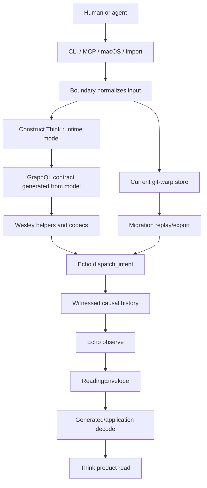
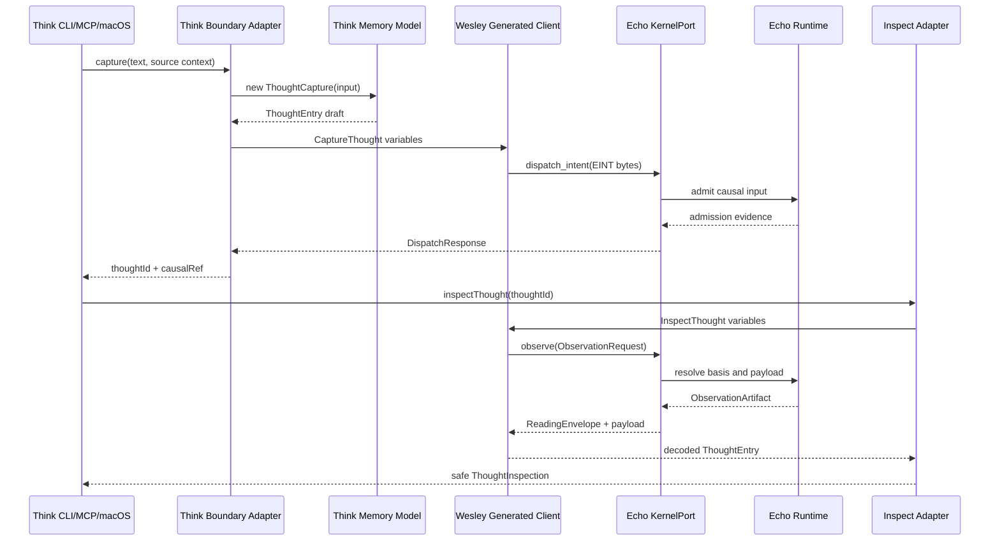
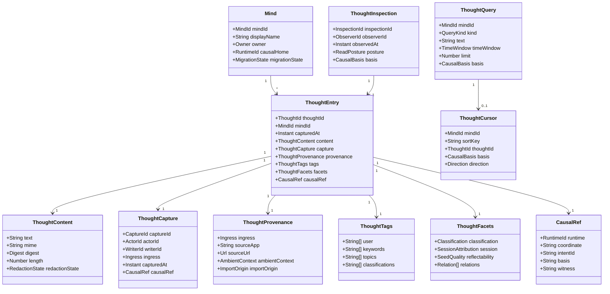
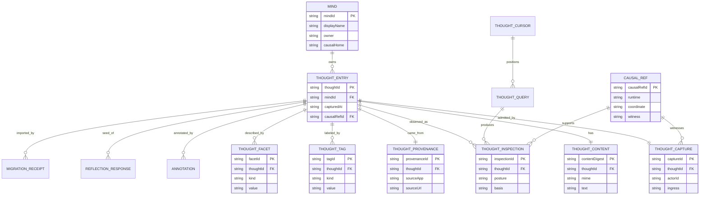

# Think memory data model before Echo GraphQL

Source backlog item: `docs/method/backlog/up-next/CORE_think-echo-phase-2-runtime-roundtrip.md`
Legend: CORE

## Sponsors

- Human: James
- Agent: Codex

## Hill

Think pins its memory model before the Echo round trip. GraphQL expresses this
model; GraphQL does not invent it.

GraphQL expresses this model.

The current `contracts/think-memory.graphql` is a toolchain probe fixture until
it is reviewed against this model. Phase 2 must not prove a contract whose
nouns are not pinned here.

## Model Doctrine

Think is a memory product. Echo is the causal runtime. Wesley compiles Think's
application contract. Continuum supplies shared causal-history vocabulary.

The model follows these rules:

- Think domain nouns live in Think.
- Echo receives canonical intent bytes and returns observation evidence.
- A thought is not a graph node implementation detail.
- A capture is immutable once admitted.
- Derived facets are append-only observations over captured content.
- Query results are read products, not mutations of the thought.
- Inspect exposes a bounded, sanitized product view plus enough causal evidence
  to debug the runtime path.

## Core Questions

### What is a thought?

A thought is a user- or agent-authored memory claim captured into a mind. In the
product model it is represented as a `ThoughtEntry` with immutable content,
capture metadata, provenance, and causal evidence.

The current `git-warp` graph has both `entry:*` nodes and `thought:*` content
identity nodes. The Echo model should normalize that split:

- `ThoughtEntry` is the product-facing record.
- `ThoughtContent` is the immutable captured body and content identity.
- `ThoughtCapture` is the causal event that admitted the entry.

### Who or what owns it?

`Mind` owns the memory lane. `ActorId` or `WriterId` identifies who submitted
the capture. Echo owns neither; Echo witnesses admission into causal history.

For Phase 2, `mindId` may be `default`, but it must be explicit.

### What is immutable?

Immutable after admission:

- `thoughtId`
- `mindId`
- captured content bytes and content digest
- `capturedAt`
- `actorId` / `writerId`
- ingress provenance captured at the boundary
- causal admission reference

Append-only after admission:

- derivation artifacts
- facets and tags
- inspection/read receipts
- migration receipts
- annotations and links
- repaired or imported causal references

### What is derived?

Derived values include:

- `ThoughtTags`
- `ThoughtFacets`
- keyword and topic edges
- semantic classifications
- seed-quality receipts
- session attribution
- remember ranking and match reasons
- browse windows and cursors
- reflection prompts and responses
- stats buckets

Derived values must name their input, derivation method, version, timestamp, and
causal basis.

### What is queryable?

Queryable fields for the first Echo proof:

- `mindId`
- `thoughtId`
- `capturedAt`
- content digest
- exact `thoughtId` inspection

Queryable fields after the first proof:

- time windows
- ingress/source
- actor/writer
- text search
- tags
- facets/classifications
- session/cursor position
- causal frontier or imported origin

### What is causal provenance?

Causal provenance answers: "Which witnessed event made this visible, under what
basis, from which boundary input?"

For Echo this means a `causalRef` that can point at admission and observation
evidence without making Think depend on Echo internals in the domain model.

### What is safe to expose through InspectThought?

Safe by default:

- `thoughtId`
- `mindId`
- `capturedAt`
- `content` for the requested thought
- normalized source/provenance
- public derivation summaries
- `causalRef` summary

Not safe by default:

- raw local filesystem paths
- unsanitized environment values
- private git remotes unless explicitly requested
- full hidden prompt or model telemetry
- sibling-runtime import secrets
- opaque Echo/Wesley implementation blobs

## Domain Objects

### Mind

`Mind` is the ownership and query boundary for a coherent memory lane.

Fields:

- `mindId`: stable explicit id, `default` for Phase 2.
- `displayName`: optional human label.
- `owner`: human, agent, or shared owner descriptor.
- `createdAt`: first known creation time.
- `causalHome`: current runtime home, such as `git-warp` or `echo`.
- `migrationState`: current import/export posture.

### ThoughtEntry

`ThoughtEntry` is the product-facing memory record.

Fields:

- `thoughtId`: stable product id.
- `mindId`: owning mind.
- `capturedAt`: immutable capture timestamp.
- `content`: `ThoughtContent`.
- `capture`: `ThoughtCapture`.
- `provenance`: `ThoughtProvenance`.
- `tags`: `ThoughtTags`.
- `facets`: `ThoughtFacets`.
- `causalRef`: `CausalRef`.

Phase 2 minimum:

```text
ThoughtEntry {
  thoughtId
  mindId
  capturedAt
  content
  source
  metadata
  causalRef
}
```

### ThoughtContent

`ThoughtContent` is the immutable body of the thought.

Fields:

- `text`: normalized captured text.
- `mime`: usually `text/plain; charset=utf-8`.
- `digest`: content digest.
- `length`: byte or character length.
- `redactionState`: whether this view is full, redacted, or unavailable.

### ThoughtCapture

`ThoughtCapture` is the admitted capture event.

Fields:

- `captureId`: capture event id.
- `thoughtId`: captured thought.
- `actorId`: submitter.
- `writerId`: runtime writer where applicable.
- `capturedAt`: boundary timestamp.
- `ingress`: CLI, MCP, macOS URL/share/shortcut, import, repair, or test.
- `boundary`: command/tool/surface that admitted the capture.
- `causalRef`: admission evidence.

### ThoughtInspection

`ThoughtInspection` is a read product for a single thought.

Fields:

- `thought`: inspected entry.
- `inspectionId`: read receipt id if retained.
- `observerId`: observer or read surface.
- `observedAt`: read timestamp.
- `basis`: causal basis/frontier used for the read.
- `posture`: complete, residual, plural, obstructed, or redacted.
- `safeFields`: fields included in the returned product view.

### ThoughtCursor

`ThoughtCursor` is a stable read position for list-like surfaces.

Fields:

- `mindId`
- `sortKey`
- `thoughtId`
- `basis`
- `direction`: newer, older, same-session, search, or topic.

### ThoughtQuery

`ThoughtQuery` is a request for a read view.

Fields:

- `mindId`
- `kind`: recent, remember, browse, stats, inspect, topics, annotations, or
  reflection-context.
- `text`: optional query text.
- `timeWindow`: optional time bound.
- `facets`: optional filters.
- `cursor`: optional position.
- `limit`: bounded count.
- `basis`: optional causal frontier.

### ThoughtProvenance

`ThoughtProvenance` is normalized boundary context.

Fields:

- `ingress`
- `sourceApp`
- `sourceUrl`
- `ambientCwd`
- `ambientGitRoot`
- `ambientGitRemote`
- `ambientGitBranch`
- `importOrigin`
- `repairOrigin`

Only safe normalized fields are included in default inspect output.

### ThoughtTags

`ThoughtTags` are user- or system-visible labels.

Kinds:

- user labels
- keyword labels
- topic labels
- classification labels
- project labels

Tags are derived or asserted. They do not mutate captured content.

### ThoughtFacets

`ThoughtFacets` are structured derived dimensions used for search, browse, and
reflection.

Initial facets:

- `classification`: question, decision, observation, action_item, idea,
  reference, unclassified.
- `topics`: promoted topic nodes.
- `keywords`: inverted-index terms.
- `session`: session attribution.
- `reflectability`: seed-quality verdict.
- `relations`: annotations, links, reflection responses, and evolution edges.

### CausalRef

`CausalRef` is the product-facing reference to runtime evidence.

Fields:

- `runtime`: `git-warp`, `echo`, or `imported`.
- `coordinate`: runtime-neutral coordinate string or object.
- `intentId`: Echo intent/admission id when available.
- `entryNodeId`: legacy `git-warp` node id when imported or dual-read.
- `basis`: read basis/frontier.
- `witness`: witness or receipt reference.
- `migration`: optional migration/import receipt.

## End-To-End Flow



## Capture And Inspect Sequence



## Class Model



## Entity Relationship Model



## Feature Coverage

| Feature | Model object | Query shape | Derived or immutable |
| --- | --- | --- | --- |
| Capture | `ThoughtCapture`, `ThoughtEntry` | create by input | Immutable |
| Ingest/stdin | `ThoughtCapture` | create by input | Immutable |
| macOS URL/share/shortcut | `ThoughtProvenance` | create by input | Immutable normalized provenance |
| MCP capture | `ThoughtCapture` | create by input | Immutable |
| Recent | `ThoughtQuery`, `ThoughtCursor` | time/cursor window | Read product |
| Inspect | `ThoughtInspection` | exact thought id | Read product |
| Remember | `ThoughtQuery`, `ThoughtFacets` | text/ambient scope | Derived ranking |
| Browse | `ThoughtCursor`, `ThoughtQuery` | cursor/session/topic | Read product |
| Stats | `ThoughtQuery` | time buckets | Derived aggregation |
| Reflect | `ThoughtFacets`, `ReflectionResponse` | seed thought | Derived response |
| Annotate | `Annotation` relation | target thought | Append-only |
| Auto tags | `ThoughtTags` | keyword/topic | Derived |
| Semantic parse | `ThoughtFacets` | classification | Derived |
| Sessions | `ThoughtFacets` | temporal proximity | Derived |
| Repair | `MigrationReceipt`, `CausalRef` | mind/runtime | Append-only evidence |
| Migration | `MigrationReceipt`, `CausalRef` | import/export | Append-only evidence |
| Prompt metrics | read telemetry | time/model/tool filters | Operational, not core thought |

## GraphQL Contract Rules

The next GraphQL revision must be a projection of this model.

Allowed Phase 2 GraphQL nouns:

- `Mind`
- `ThoughtEntry`
- `ThoughtContent`
- `ThoughtCapture`
- `ThoughtProvenance`
- `CausalRef`
- `CaptureThought`
- `InspectThought`

Deferred GraphQL nouns:

- `ThoughtTags`
- `ThoughtFacets`
- `ThoughtQuery`
- `ThoughtCursor`
- annotations
- reflection responses
- migration receipts

Required Phase 2 contract fields:

- `thoughtId`
- `mindId`
- `capturedAt`
- `content.text`
- `content.digest`
- `provenance.ingress`
- `provenance.sourceApp`
- `provenance.sourceUrl`
- `causalRef.runtime`
- `causalRef.coordinate`
- `causalRef.witness`

## Echo Causal WARP Graph Preparation

Think should not model Echo as a graph database. Think should model causal
memory and let Echo host the witnessed runtime.

The application graph projection for Echo is:

```text
Mind
  owns ThoughtEntry
ThoughtEntry
  has ThoughtContent
  admitted_by ThoughtCapture
  came_from ThoughtProvenance
  witnessed_by CausalRef
  described_by ThoughtFacet*
  labeled_by ThoughtTag*
  observed_as ThoughtInspection*
```

Echo receives:

- canonical `CaptureThought` intent bytes;
- generated operation ids and variables;
- observation requests for `InspectThought`;
- retained payloads or readings as generic runtime artifacts.

Echo does not receive:

- Think-specific handwritten APIs;
- direct `remember`, `browse`, or `reflect` methods;
- local filesystem path semantics;
- `git-warp` checkpoint semantics.

## Migration Plan From git-warp To Echo

### Phase M0: Freeze The Model

- Treat this document as source truth.
- Mark current GraphQL as provisional until revised against this model.
- Add model-level tests before runtime round-trip code.

### Phase M1: Read Legacy Minds Into Model Objects

- Map `entry:*` capture nodes to `ThoughtEntry`.
- Map attached text content to `ThoughtContent`.
- Map `captureIngress`, `captureSourceApp`, `captureSourceURL`, and ambient
  context fields to `ThoughtProvenance`.
- Map `thought:*` nodes and `expresses` edges to canonical `thoughtId`.
- Map `artifact:*` receipts to `ThoughtFacets`.
- Preserve `entry:*` ids inside `CausalRef.entryNodeId`.

### Phase M2: Generate GraphQL From Model

- Revise `contracts/think-memory.graphql` to match `ThoughtEntry`,
  `ThoughtContent`, `ThoughtCapture`, `ThoughtProvenance`, and `CausalRef`.
- Run `npm run echo:probe -- --json`.
- Keep generated files out of semantic source truth unless a later build step
  requires checked-in fixtures.

### Phase M3: Echo Round Trip

- Dispatch one `CaptureThought`.
- Observe one `InspectThought`.
- Verify the `ReadingEnvelope` posture.
- Decode the payload into `ThoughtEntry`.
- Assert content, provenance, and causal evidence.

### Phase M4: Dual Read / Shadow Write

- Keep `git-warp` authoritative.
- Optionally shadow-write captures to Echo.
- Compare ids, timestamps, content digests, provenance, latency, and inspect
  results.
- Failure in Echo must not break local capture.

### Phase M5: Replay Import

- Export legacy captures in stable chronological order.
- Replay captures into Echo as `CaptureThought` intents with migration
  provenance.
- Retain legacy ids and checkpoint refs in migration receipts.
- Verify counts, digest equality, and inspect parity.

### Phase M6: Product Cutover

- Make Echo opt-in for a named mind first.
- Require read parity for recent, inspect, remember, browse, stats, and
  annotations before default cutover.
- Keep `git-warp` repair and export tools as data-rescue paths.

## Open Model Decisions

- Whether `thoughtId` is content-derived, capture-event-derived, or both via
  separate `contentDigest` and `captureId`.
- Whether `actorId` and `writerId` remain separate product fields.
- How much ambient project context is safe by default in shared or imported
  minds.
- Whether retained inspections become first-class product receipts or only
  runtime evidence.
- How GraphQL schema generation should be governed so the model remains source
  truth.

## Acceptance

This slice is complete when:

- Phase 2 is documented as blocked on this model.
- The existing GraphQL fixture is marked provisional.
- The next GraphQL revision has a concrete field checklist.
- The migration path from `git-warp` to Echo has named phases and parity
  checks.
