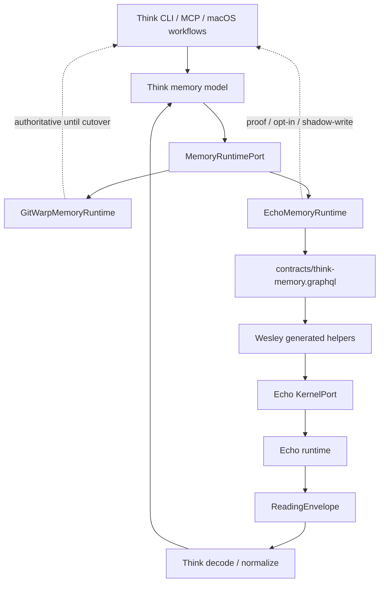
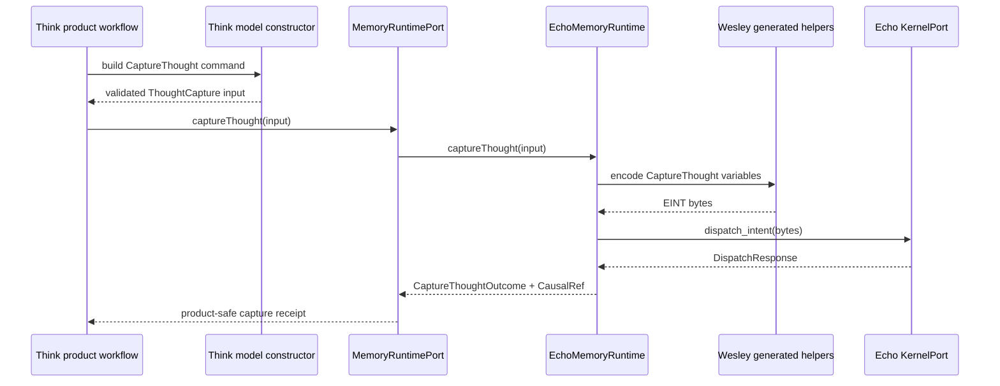
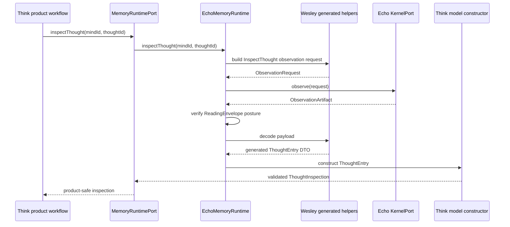
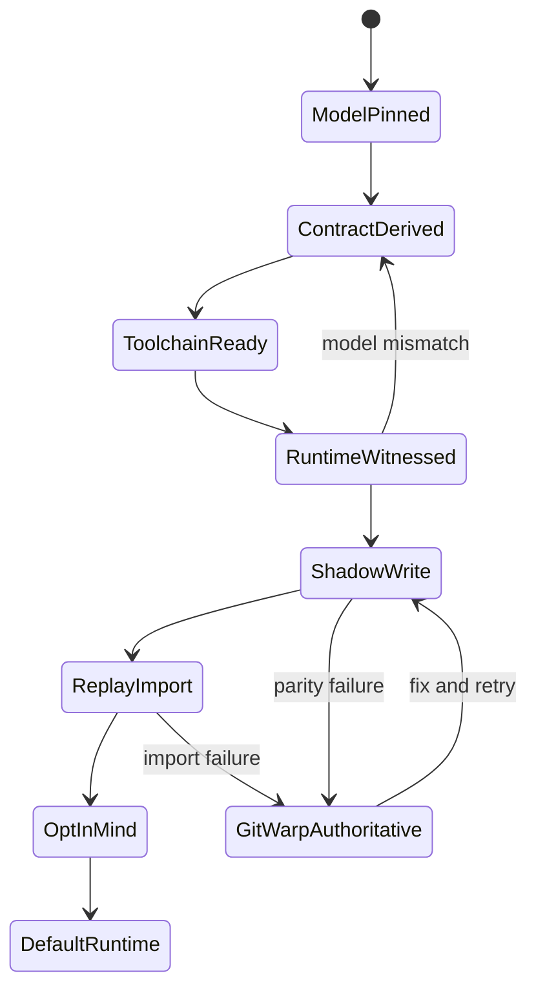
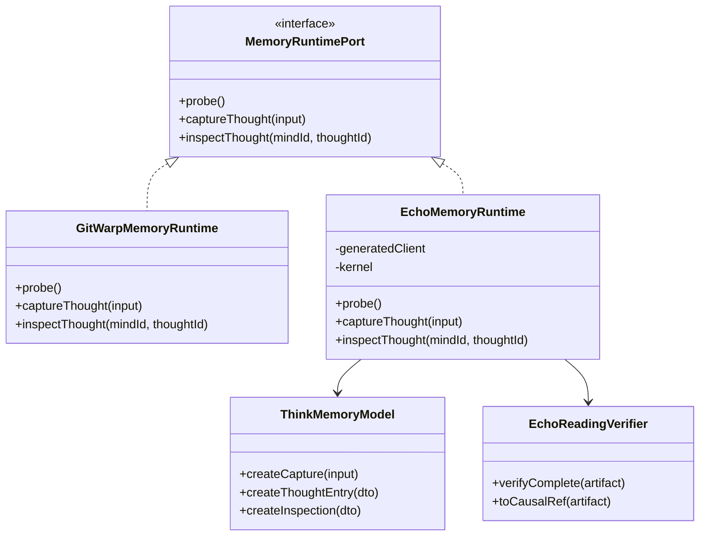

# Think Echo integration plan

Source backlog item: `docs/method/backlog/up-next/CORE_think-echo-phase-2-runtime-roundtrip.md`
Legend: CORE

## Sponsors

- Human: sponsored human user
- Agent: sponsored agent user

## Hill

Think integrates with Echo by putting a model-derived contract and generated
adapter behind a Think-owned memory port. The current `git-warp` store remains
authoritative until Echo proves capture, inspect, read parity, shadow-write
safety, and migration replay.

The first executable proof is still deliberately small:

```text
CaptureThought -> Echo dispatch_intent(...)
InspectThought -> Echo observe(...)
ReadingEnvelope + decoded ThoughtEntry
```

## Design Inputs

- `docs/design/0068-think-memory-data-model/think-memory-data-model.md` is the
  memory model source of truth.
- `contracts/think-memory.graphql` is the model-derived Wesley/Echo contract.
- `scripts/think-echo-capability-probe.mjs` proves the sibling Echo/Wesley
  toolchain can generate helper output.
- `/Users/james/git/echo/docs/architecture/application-contract-hosting.md`
  defines the Echo boundary: applications own nouns, Wesley emits helpers,
  Echo receives generic intents and observations.

## Non-goals

- Do not switch default capture to Echo during the first runtime proof.
- Do not migrate existing `~/.think/*` minds until replay parity is measured.
- Do not expose Echo internals through CLI, MCP, or macOS product APIs.
- Do not teach Echo Think-specific nouns.
- Do not make GraphQL the source of truth over the data model.
- Do not make `git-warp` repair and export work disappear; it remains the
  continuity path for existing minds.

## Runtime Boundary

Think should depend on a product-facing `MemoryRuntimePort`, not directly on
Echo, `git-warp`, generated code, filesystems, process globals, or sibling repo
paths.

```text
Think product workflow
  -> MemoryRuntimePort
  -> GitWarpMemoryRuntime | EchoMemoryRuntime
  -> concrete runtime adapter
```

Minimum port methods:

- `captureThought(input): CaptureThoughtOutcome`
- `inspectThought(mindId, thoughtId): ThoughtInspection`
- `probe(): RuntimeCapabilityReport`

Later methods:

- `recent(query): ThoughtInspection[]`
- `remember(query): RememberResult`
- `browse(cursor): BrowseWindow`
- `annotate(command): AnnotationReceipt`
- `migrate(plan): MigrationReceipt`

## Architecture



## Integration Layers

### Layer 1: Think Model

Owns domain classes and invariants:

- `Mind`
- `ThoughtEntry`
- `ThoughtContent`
- `ThoughtCapture`
- `ThoughtInspection`
- `ThoughtProvenance`
- `CausalRef`

Construction validates invariants before data crosses into runtime adapters.
The model is portable and must not import Echo, Wesley, `git-warp`, Node
filesystem APIs, or process globals.

### Layer 2: Contract Expression

Owns GraphQL contract source:

- `contracts/think-memory.graphql`
- `CaptureThought`
- `InspectThought`
- DTOs that directly express the model

The contract is allowed to use GraphQL-friendly shapes, but it must stay a
projection of the model. Generated output is build/proof material, not semantic
source truth.

### Layer 3: Generated Boundary

Owns Wesley-generated helper usage:

- operation ids
- canonical variables
- EINT packing
- observation request construction
- generated DTO encode/decode helpers

Temporary generated files should live under a test/proof temp directory unless
a later build step deliberately checks in fixtures.

### Layer 4: Echo Adapter

Owns runtime calls:

- `dispatch_intent(intent_bytes)`
- `observe(observation_request)`
- reading-envelope verification
- conversion from Echo evidence to `CausalRef`
- conversion from decoded payload to Think model objects

This adapter is a boundary adapter. It may import generated helpers and Echo
ABI types. Core model code must not.

### Layer 5: Product Composition

Owns runtime selection:

- default: `GitWarpMemoryRuntime`
- proof command/test: `EchoMemoryRuntime`
- later opt-in: named mind with Echo runtime
- later shadow-write: dual runtime adapter

Composition roots inject the chosen runtime. Product workflows do not call
concrete runtime constructors inside core logic.

## Capture Sequence



## Inspect Sequence



## State Machine



## Adapter Class Shape



## Rollout Phases

### Phase 0: Capability Probe

Status: implemented.

- Run `npm run echo:probe -- --json`.
- Confirm Echo sibling checkout exists.
- Confirm `echo-wesley-gen` can compile `contracts/think-memory.graphql`.
- Confirm generated markers include Phase 2 model DTOs and helpers.

### Phase 1: Runtime Witness

- Generate helper output in a temp proof crate or test harness.
- Create an in-memory or local Echo kernel.
- Dispatch one `CaptureThought`.
- Observe one `InspectThought`.
- Verify `ReadingEnvelope` completeness.
- Decode a model-correct `ThoughtEntry`.
- Assert content digest, text, provenance, mind id, and causal ref.

### Phase 2: Think Adapter

- Introduce `EchoMemoryRuntime`.
- Keep it outside production capture path.
- Make proof tests instantiate it via constructor injection.
- Convert generated DTOs into constructor-validated Think model objects.

### Phase 3: Product Experiment

- Add an opt-in proof command or hidden flag.
- Keep `GitWarpMemoryRuntime` authoritative.
- Record Echo admission and read evidence in proof output.
- Do not fail normal local capture on Echo failure.

### Phase 4: Shadow Write

- Write capture to `git-warp` first.
- Attempt Echo capture second.
- Compare model fields:
  - `thoughtId`
  - `mindId`
  - `capturedAt`
  - content digest
  - provenance
  - causal references
- Log mismatch receipts.

### Phase 5: Replay Import

- Export legacy `git-warp` captures in chronological order.
- Convert each capture to model objects.
- Replay as `CaptureThought` intents into Echo.
- Preserve legacy ids and checkpoint refs in migration receipts.
- Verify counts and content digests.

### Phase 6: Opt-in Mind Runtime

- Allow a named mind to choose Echo as its runtime.
- Gate on read parity for `recent`, `inspect`, and bounded `remember`.
- Keep export and rescue paths available.

### Phase 7: Default Runtime Cutover

- Make Echo default only after:
  - capture parity is stable;
  - read parity is stable;
  - migration replay is documented and tested;
  - rollback/export path exists;
  - local capture latency remains acceptable.

## Verification Gates

| Gate | Command or proof | Required result |
| --- | --- | --- |
| Contract generation | `npm run echo:probe -- --json` | `ready_enough_for_phase_2` |
| Model docs | `node --test test/ports/think-echo-model-doc.test.js` | Pass |
| Contract docs | `node --test test/ports/think-echo-contract.test.js` | Pass |
| Local fast gate | `npm run test:fast` | Pass |
| Runtime witness | future Phase 2 command | Capture + inspect round trip |
| Shadow write | future comparison report | No model-field drift |
| Migration replay | future import witness | Count and digest parity |

## Failure Handling

### Generator Unavailable

Report `generator_unavailable` from the probe. Do not hand-roll GraphQL
operation ids unless the missing generated helper work is explicitly logged and
bounded.

### Runtime Unavailable

Report `echo_runtime_unavailable`. Keep the current `git-warp` path unchanged.

### Reading Incomplete

Reject the inspection result. Return an explicit typed outcome that preserves
the `ReadingEnvelope` posture for debugging. Do not present incomplete payloads
as product truth.

### Model Mismatch

Fail the proof. The fix is to align model, GraphQL, generated DTO mapping, or
adapter decoding. Do not patch around mismatch in product code.

### Shadow Drift

Keep `git-warp` authoritative. Record the drift as a comparison receipt and
block runtime cutover.

## Open Decisions

- Whether Phase 2 should live as a Node script that shells into Echo generation
  or as a Rust proof crate under Echo with Think-owned contract input.
- Whether generated helper output should remain temp-only or gain checked-in
  fixture status for deterministic PR review.
- Whether `thoughtId` is digest-derived, capture-event-derived, or represented
  as both `thoughtId` and `captureId`.
- Which product command first exposes the proof result.
- How much `CausalRef` detail is safe in default CLI/MCP output.

## Completion Criteria

Echo integration is achieved when:

- Think model objects are the source of truth.
- GraphQL expresses the model.
- Wesley generation is deterministic and verified locally.
- Echo capture and inspect round trip through generic dispatch and observe.
- Product code depends on `MemoryRuntimePort`, not runtime-specific globals.
- `git-warp` and Echo can run side by side during shadow-write and migration.
- Cutover is gated by parity evidence, not by optimism.
