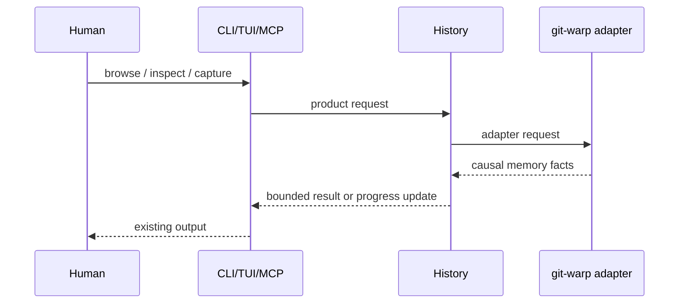

# CORE-0070 - History Product Boundary

## Linked Issue / Backlog

- GitHub issue: not opened yet.
- Related backlog:
  - `docs/method/backlog/bad-code/CORE_hexagonal-store-boundary.md`
  - `docs/method/backlog/bad-code/CORE_runtime-domain-model-cutover.md`
  - `docs/method/backlog/bad-code/CORE_large-mind-read-timeouts.md`
  - `docs/method/backlog/up-next/CORE_think-echo-integration-plan.md`

## Design Type

This design is primarily:

- [x] Runtime/API
- [ ] Storage/substrate
- [ ] Sync/protocol
- [ ] Migration/release
- [ ] CLI/operator
- [ ] Docs/public guidance
- [ ] TUI/visual surface
- [x] Test/tooling

## Decision Summary

Think will promote `History` into the product-owned read/write boundary for
memory operations. `git-warp` remains one adapter, Echo can become another, and
TUI/CLI/MCP callers consume causal memory facts instead of graph implementation
details.

## Sponsored Human

A Think user wants capture, browse, inspect, and remember to behave like one
memory product so that the storage engine can evolve without changing how they
work or wait, without having to reason about graph materialization, refs, or
worldlines.

## Sponsored Agent

An agent needs a stable History contract with typed facts, cursors, basis
metadata, and deterministic errors so it can read and write memory without
inferring private git-warp state or scraping human-oriented output.

## Hill

By the end of this cycle, product surfaces can open a `History` handle, read a
bounded capture window, inspect an entry, stream startup progress, and write a
raw capture through History-owned contracts, and the repo proves it with fake
History port tests plus one real git-warp adapter witness.

## Current Truth

`src/history/read.js` currently exposes History-named functions, but every
function is a direct delegate into `git-warp-read.js`.

Browse has a narrow data-port adapter that can consume either one-shot initial
view loading or streamed initial-view updates. That boundary is promising, but
it is still read-only and still shaped around the current git-warp-backed
history implementation.

Capture writes raw entries through the current worldline path, then a separate
finalization path performs first-derived artifacts, read edges, and optional
migration. This is still store-shaped rather than History-shaped.

Evidence:

- [`src/history/read.js#L1:4ae31fb3092135897b406b90286d2aeb59a1380b`](https://github.com/flyingrobots/think/blob/4ae31fb3092135897b406b90286d2aeb59a1380b/src/history/read.js#L1)
- [`src/browse/adapters/history.js#L29:4ae31fb3092135897b406b90286d2aeb59a1380b`](https://github.com/flyingrobots/think/blob/4ae31fb3092135897b406b90286d2aeb59a1380b/src/browse/adapters/history.js#L29)
- [`src/store/capture.js#L15:4ae31fb3092135897b406b90286d2aeb59a1380b`](https://github.com/flyingrobots/think/blob/4ae31fb3092135897b406b90286d2aeb59a1380b/src/store/capture.js#L15)
- [`docs/design/0069-think-echo-integration-plan/think-echo-integration-plan.md#L54:4ae31fb3092135897b406b90286d2aeb59a1380b`](https://github.com/flyingrobots/think/blob/4ae31fb3092135897b406b90286d2aeb59a1380b/docs/design/0069-think-echo-integration-plan/think-echo-integration-plan.md#L54)

## Problem

Think still has storage nouns leaking into product decisions. That makes TUI
startup, MCP reads, future Echo cutover, and performance fixes too easy to solve
by materializing storage internals instead of asking for bounded causal history.

## Scope

This cycle includes:

- Define a `History` port for raw capture, bounded reads, inspect, status, and
  streamed startup updates.
- Move product code to History contracts before reaching git-warp adapters.
- Preserve the existing git-warp-backed implementation behind the adapter.
- Add fake-port tests that prove product code does not need git-warp.
- Add one adapter integration test that proves the port works against the
  current runtime.

## Non-Goals

This cycle does not include:

- Replacing git-warp as the default persistence engine.
- Migrating existing minds to Echo.
- Changing raw capture IDs or stored content semantics.
- Teaching product code to read refs, patch chains, graph snapshots, or
  worldline internals.
- Building new browse UI features. That is `SURFACE-0071`.

## Runtime / API Contract

The product contract is a `History` handle opened from a composition root:

```js
const history = await openHistory({
  repoDir,
  mindName: 'default',
  writerId: 'think',
});
```

The first implementation must expose these capabilities:

- `history.captureRawThought({ text, provenance, ambientContext })`
- `history.readLatestCaptureWindow({ signal })`
- `history.readCaptureWindow({ entryId, signal })`
- `history.inspectEntry({ entryId, signal })`
- `history.readChronology({ cursor, limit, signal })`
- `history.observeLatestCaptureWindow({ signal })`
- `history.status({ signal })`
- `history.close()`

Returned facts must be Think domain facts:

- `HistoryEntry`
- `HistoryWindow`
- `HistoryChronologyPage`
- `HistoryInspection`
- `HistoryBasis`
- `HistoryProgress`
- `HistoryError`

The contract must not expose git-warp classes, refs, patch IDs, graph snapshots,
or materialization handles. Adapter diagnostics may include implementation
metadata under a namespaced debug field only when explicitly requested.

## User Experience / Product Shape

No new visible command is required in this cycle. The user-visible outcome is
that existing surfaces keep working while their dependency shape changes:



## Data / State Model

| State | Source of truth | Derived state | Invalid states | Reset behavior | Serialization | Determinism assumptions |
| --- | --- | --- | --- | --- | --- | --- |
| Raw capture | Current persistence adapter | `HistoryEntry` | Entry with missing text/content basis | Not reset by this cycle | Existing stored content | ID and content are stable |
| Window | History read basis | Current/older/newer/session facts | Window without current entry on success | Re-read with same basis if supported | JSON-compatible object | Ordering uses committed sort keys |
| Progress | Adapter read operation | TUI/CLI loading state | Final update followed by non-final update | Dispose signal cancels updates | JSON-compatible events | Event order is adapter-defined but monotonic |
| Status | Adapter capability probe | Health summary | Unknown adapter reported as ok | Re-probe | JSON-compatible object | Capability checks are explicit |

## Architecture / Anti-SLUDGE Posture

| Concern | Decision |
| --- | --- |
| Domain changes | Introduce History-owned nouns for product memory reads and writes. |
| Port changes | Add a read/write History port and make product surfaces depend on it. |
| Adapter changes | Keep git-warp code in the git-warp adapter only. |
| Boundary validation | Validate returned facts at adapter boundaries before UI/MCP code sees them. |
| Runtime-backed nouns introduced | `HistoryEntry`, `HistoryWindow`, `HistoryBasis`, `HistoryProgress`. |
| Expected failure representation | Use typed `HistoryError` results or thrown `HistoryPortError` only at port open. |
| Banned shortcuts avoided | No direct graph materialization in product surfaces. |
| Quarantine impact | Enables retiring graph-named compatibility paths incrementally. |

## Cost / Residency Posture

| Surface | Current cost | Target cost | Limit/budget | Failure mode |
| --- | --- | --- | --- | --- |
| Latest capture window | Transitional | Bounded | Hydrate current plus adjacent entries | Return partial/progress or typed timeout |
| Chronology page | Transitional | Cursor | Caller-provided limit | Return page error with basis |
| Inspect entry | Transitional | Bounded | One entry plus receipts | Return not-found or partial receipts |
| Status | Diagnostic | Bounded | No content hydration | Return degraded status |

## Determinism / Replay / Causality

This design preserves deterministic replay by naming the read basis returned
with every History result. The basis is product metadata; it is not permission
for product code to inspect graph internals.

Causal inputs:

- basis: History adapter read basis, when available
- frontier: adapter-owned, optional debug metadata
- writer id: captured in History provenance, not UI state
- patch/order source: adapter-owned
- checkpoint or coordinate identity: adapter-owned, optional debug metadata

Replay/convergence tests:

- Read the same fixture through a fake History port and the git-warp adapter.
- Assert equivalent product facts for the same capture window.
- Assert product code can run without importing git-warp modules.

## Compatibility / Migration Posture

| Concern | Decision |
| --- | --- |
| Public API compatibility | Existing CLI and MCP commands keep their output contracts unless a later proposal changes them. |
| Package export changes | New internal History module exports may be added; old store functions remain during migration. |
| Storage/read compatibility | Existing git-warp minds remain readable. |
| Legacy behavior retained | `migrate_graph` remains for MCP compatibility. |
| Deprecation behavior | Graph-named internal functions get deprecated only after product paths move. |
| Migration path | Product surfaces switch one at a time to the History port. |
| Release note impact | Note the internal boundary if it changes operator behavior or performance. |

## Error Contract

| Failure | Error/result | Caller recovery | Test |
| --- | --- | --- | --- |
| Missing repo | `HistoryError { code: "repo_missing" }` | Show no-repo state or bootstrap prompt | Fake-port browse test |
| Unsupported adapter capability | `HistoryError { code: "capability_missing" }` | Fall back to one-shot read or disable feature | Adapter status test |
| Read timeout | `HistoryError { code: "read_timeout", partial }` | Render partial state and retry affordance | Streaming task test |
| Entry not found | `HistoryError { code: "entry_not_found" }` | Show not-found output | Inspect test |
| Adapter invariant failure | `HistoryError { code: "adapter_invariant" }` | Show doctor guidance | Integration test |

## Lower Modes

Lower modes are the JSON and MCP outputs. Every History result used by a human
surface must also be representable as deterministic JSON without relying on TUI
layout, terminal color, or prose-only status.

## Accessibility Posture

| Concern | Decision |
| --- | --- |
| Semantic labels or facts | History returns named fields, not visual-only layout state. |
| Focus order or focus ownership | Not applicable in this cycle. |
| Hidden or visual-only information | Progress and partial state are exposed as facts. |
| Keyboard behavior | Not applicable in this cycle. |
| Secret/redaction behavior | Provenance fields keep existing redaction rules; no new secret collection. |

## Agent Inspectability / Explainability Posture

Agents can inspect:

- stable entry IDs
- basis metadata
- cursor metadata
- adapter capability facts
- typed errors
- optional debug metadata behind an explicit diagnostics flag

Agents must not inspect:

- graph snapshots
- raw refs
- patch-chain internals
- terminal pixels

## Linked Invariants

- Tests Are the Spec.
- Runtime Truth Wins.
- Hexagonal Architecture.
- Causal History Is Product Data; Graph Shape Is Adapter Data.
- Public Claims Need Witnesses.
- Docs Are Evidence, Not Proof.

## Design Alternatives Considered

### Option A: Keep The Current Thin Facade

Pros:

- Smallest immediate change.
- No new product vocabulary.

Cons:

- Preserves the exact leak this design is meant to remove.
- Makes Echo and other adapters inherit git-warp-shaped assumptions.
- Does not give the TUI a stronger progress or cancellation contract.

### Option B: Expose git-warp Worldlines Directly

Pros:

- Gives advanced callers maximum capability.
- Avoids writing mapping code.

Cons:

- Makes product code depend on storage implementation details.
- Encourages graph materialization and low-level patch reasoning.
- Makes agent contracts unstable.

### Option C: Promote History As The Product Boundary

Pros:

- Matches the product language users already understand.
- Lets git-warp, Echo, and test fakes share one product contract.
- Creates a place for bounded reads, progress, and typed errors.

Cons:

- Requires disciplined adapter tests.
- Requires temporary compatibility shims while callers migrate.

## Decision

Choose Option C. History is the product boundary. git-warp is an adapter behind
that boundary, not the vocabulary for Think features.

## Proof Surface

The implementation must be proven through:

- actual surface under test: Browse and MCP code consuming a fake History port
- first RED test: product read surface runs with no git-warp imports available
- required witness command: focused History port tests plus `npm run test:fast`
- non-acceptable proof: documentation-only assertions or tests that inspect only
  module names

## Implementation Slices

- Define History fact schemas and fake port fixtures.
- Move Browse data loading to the History port.
- Move MCP browse/inspect/recent reads to the History port.
- Move raw capture write path to the History port without changing capture IDs.
- Add git-warp adapter parity witness for a small fixture mind.
- Deprecate graph-named compatibility functions only after call sites move.

## Tests To Write First

Behavior tests required:

- [ ] Browse accepts a fake History port and renders a latest capture window.
- [ ] MCP browse/inspect/recent accept a fake History port and return the same JSON shape.
- [ ] History git-warp adapter reads a fixture latest-capture window without full chronology hydration.
- [ ] History capture writes through the adapter and returns a `HistoryEntry`.
- [ ] Adapter timeout returns a typed `HistoryError` with recoverable context.

Documentation/process tests, only if relevant:

- [ ] Design index links this proposal and follow-on proposal docs.

## Acceptance Criteria

The work is done when:

- [ ] Product code depends on `History`, not git-warp modules.
- [ ] Existing CLI and MCP output contracts still pass.
- [ ] A fake History port can drive Browse and MCP tests.
- [ ] The git-warp adapter parity witness passes.
- [ ] New errors are documented and covered.
- [ ] CI and local validation are green.

## Validation Plan

Expected before PR:

```bash
npm run typecheck
npm run lint
npm run test:fast
```

Add focused tests for the new History port and whichever surface migrates in the
slice.

## Playback / Witness

Reviewer witness:

```bash
npx vitest run test/ports/history-port.test.ts
npx vitest run test/acceptance/mcp.test.js
npm run test:fast
```

The witness must show a fake History port and the git-warp adapter exercising
the same product facts.

## Risks

Known risks:

- A too-large first slice could stall behind all read surfaces.
- The first History shape could accidentally clone current git-warp assumptions.
- Compatibility wrappers could linger.

Mitigations:

- Move one product surface at a time.
- Name banned nouns in tests.
- Track cleanup debt as GitHub issues instead of hidden TODOs.

## Follow-On Debt

Create GitHub issues for:

- Removing graph-named compatibility exports after callers migrate.
- Adding adapter capability docs after Echo is available.
- Adding performance budgets for each History read.

## Tracker Disposition

| Issue / Backlog | Role | Expected disposition |
| --- | --- | --- |
| `CORE_hexagonal-store-boundary.md` | primary | update or close when product code moves |
| `CORE_runtime-domain-model-cutover.md` | blocks | update with migrated surfaces |
| `CORE_large-mind-read-timeouts.md` | blocked-by | leave open until budget tests land |
| `CORE_think-echo-integration-plan.md` | related | update with History boundary outcome |

## Done Does Not Mean

When this lands, it does not prove:

- Echo is ready as the default runtime.
- Browse has become a full workbench.
- Large-mind reads are fast enough without explicit performance tests.
- All graph-named internals have been removed.

## Retrospective

Fill this in after implementation.

What changed from the design:

- TBD.

What the tests proved:

- TBD.

What remains open:

- TBD.

PR:

- TBD.
