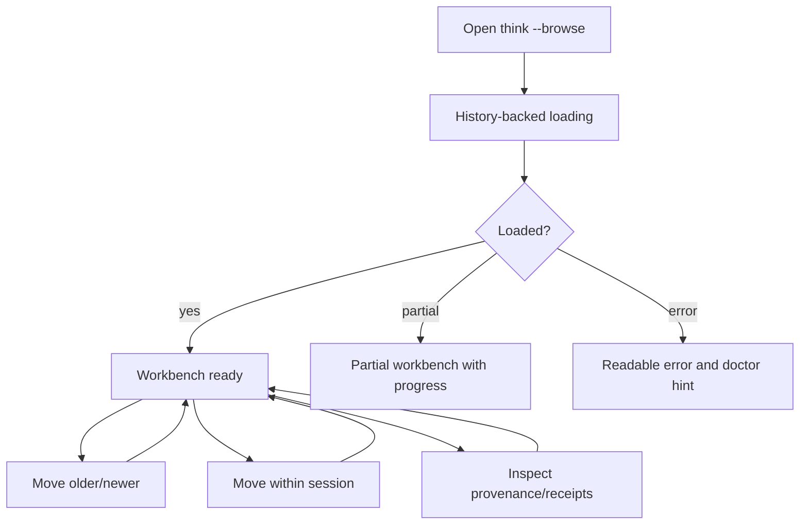

# SURFACE-0071 - Browse Memory Workbench

## Linked Issue / Backlog

- GitHub issue: not opened yet.
- Related backlog:
  - `docs/method/backlog/cool-ideas/SURFACE_browse-presentation.md`
  - `docs/method/backlog/cool-ideas/SURFACE_session-replay.md`
  - `docs/method/backlog/cool-ideas/SURFACE_writer-provenance-views.md`
  - `docs/method/backlog/bad-code/SURFACE_browse-tui-strict-limits.md`
  - `docs/method/backlog/bad-code/SURFACE_fadeInBrowse-throwaway-model.md`

## Design Type

This design is primarily:

- [ ] Runtime/API
- [ ] Storage/substrate
- [ ] Sync/protocol
- [ ] Migration/release
- [x] CLI/operator
- [ ] Docs/public guidance
- [x] TUI/visual surface
- [x] Test/tooling

## Decision Summary

`think --browse` will become a real Bijou AppShell workbench for memory
re-entry. It will show a bounded chronology, the selected thought, session
context, provenance/receipt facts, and real loading progress driven by the
History port rather than decorative fake progress.

## Sponsored Human

A Think user wants Browse to feel like an actual memory tool so that returning
to a thought gives context, neighboring captures, provenance, and next actions,
without having to run multiple commands or wait on a blank screen.

## Sponsored Agent

An agent needs Browse state to be inspectable as model facts and deterministic
lower-mode output so it can verify what the TUI is showing without scraping
terminal pixels.

## Hill

By the end of this cycle, a user can open `think --browse`, watch real
History-backed loading, move through chronology and session context, inspect
provenance/receipts, and quit with predictable keyboard behavior, and the repo
proves it with model tests, terminal-size render tests, and a lower-mode JSON
witness.

## Current Truth

Browse already has an AppShell page that requires a data port and starts a
loading command plus loading ticks during initialization.

The History browse adapter already supports streamed initial-view updates when
the backing History object exposes `loadLatestCaptureWindowUpdates()`. That is
the correct direction, but the current TUI still behaves mostly like a splash
screen plus one simple text view.

The existing browse-window test proves a bounded read invariant: browsing one
capture should hydrate only the selected entry and adjacent chronology entries.

Evidence:

- [`src/browse/app.js#L101:4ae31fb3092135897b406b90286d2aeb59a1380b`](https://github.com/flyingrobots/think/blob/4ae31fb3092135897b406b90286d2aeb59a1380b/src/browse/app.js#L101)
- [`src/browse/adapters/history.js#L29:4ae31fb3092135897b406b90286d2aeb59a1380b`](https://github.com/flyingrobots/think/blob/4ae31fb3092135897b406b90286d2aeb59a1380b/src/browse/adapters/history.js#L29)
- [`test/ports/browse-window.test.js#L8:4ae31fb3092135897b406b90286d2aeb59a1380b`](https://github.com/flyingrobots/think/blob/4ae31fb3092135897b406b90286d2aeb59a1380b/test/ports/browse-window.test.js#L8)

## Problem

Browse currently does not provide enough working context to justify being a
TUI. It should not be a decorative title screen, and it should not fake loading.
It needs real model state, real progress updates, bounded read behavior, and
screen layouts that behave across terminal sizes.

## Scope

This cycle includes:

- Replace the current simple Browse view with a multi-pane memory workbench.
- Drive loading state from the History progress stream.
- Support keyboard movement through older/newer and session entries.
- Display provenance and derivation receipts for the selected entry.
- Preserve existing non-TUI commands that use Bijou for regular terminal
  output.
- Add lower-mode JSON output for the same selected workbench state.

## Non-Goals

This cycle does not include:

- Turning `recent`, `inspect`, `stats`, or `remember` into TUIs.
- Adding editing, annotation, delete, merge, or link mutation.
- Changing storage or capture semantics.
- Rendering unbounded chronology.
- Using fake timers or decorative progress as proof of real loading.

## Runtime / API Contract

The TUI consumes a `BrowseWorkbenchPort` derived from History:

```js
const port = createBrowseWorkbenchPort({ history, mindName });
```

Required commands:

- `loadInitialWorkbenchTask()`
- `selectEntry({ entryId })`
- `moveSelection({ direction: "older" | "newer" | "sessionPrevious" | "sessionNext" })`
- `loadReceiptPanel({ entryId })`
- `toLowerModeSnapshot(model)`

Required model states:

- `loading`
- `ready`
- `partial`
- `empty`
- `error`

Required facts:

- selected entry
- chronology neighbors
- session entries
- receipt summaries
- provenance fields
- loading/progress stage
- focus target

## User Experience / Product Shape

The workbench starts at the latest capture unless an entry ID is provided. The
user can move in chronology, jump inside the current session, inspect receipts,
and quit.



Golden path:

- Launch Browse.
- See real loading stages.
- Land on latest capture.
- Move to older/newer entries.
- Inspect session context and receipts.
- Quit.

Alternative flows:

- Empty mind shows an empty-state panel and capture hint.
- Slow History read shows progress and remains cancellable.
- Partial read shows available facts and a retry key.
- Error state includes a short user string and machine-readable lower-mode code.

## Wide UI Mockup

Required terminal target: 120 columns by 36 rows.

```text
Think Browse [default]                         History: live  Basis: latest
-----------------------------------------------------------------------------
Chronology                  Thought                                Receipts
> 10:42  current focus      I should rewrite browse around...       identity ok
  10:38  previous idea      ...                                     session ok
  10:33  earlier note       ...                                     read edges ok

Session
1 10:33 earlier note
2 10:38 previous idea
3 10:42 current focus

Provenance
ingress: cli     source: local     writer: think     captured: 2026-06-19

[j/k] older/newer  [n/p] session  [r] retry  [d] details  [q] quit
```

## Narrow UI Mockup

Required terminal target: 48 columns by 20 rows.

```text
Think Browse [default]
History: live

> 10:42 current focus
  I should rewrite browse around...

Session 3/3
prev: previous idea
next: none

Receipts
identity ok
session ok

[j/k] move [d] details [q] quit
```

## Data / State Model

| State | Source of truth | Derived state | Invalid states | Reset behavior | Serialization | Determinism assumptions |
| --- | --- | --- | --- | --- | --- | --- |
| Workbench model | Browse reducer | Render tree and lower-mode snapshot | Ready without selected entry | Recreated on page init | JSON snapshot | Same input events yield same model |
| Focus target | User input reducer | Highlight and command routing | Focus target missing panel | Reset to thought panel | String enum | No implicit terminal focus |
| Loading progress | History stream | Spinner text/stage | Final stage followed by loading stage | Dispose cancels | JSON event | Stage order is monotonic |
| Receipt panel | History inspect result | Summary lines | Receipt with no source entry | Reload on selection | JSON object | Receipt ordering is stable |

## Architecture / Anti-SLUDGE Posture

| Concern | Decision |
| --- | --- |
| Domain changes | None beyond History facts from `CORE-0070`. |
| Port changes | Add a Browse-specific workbench adapter over History. |
| Adapter changes | TUI never imports git-warp. |
| Boundary validation | Workbench reducer accepts only normalized facts. |
| Runtime-backed nouns introduced | `BrowseWorkbenchModel`, `BrowseFocus`, `BrowsePanel`, `BrowseAction`. |
| Expected failure representation | Error state in model plus lower-mode error code. |
| Banned shortcuts avoided | No fake loading bars, no direct graph reads, no process-global layout reads in render functions. |
| Quarantine impact | Enables removing throwaway fade-in and splash monolith code. |

## Cost / Residency Posture

| Surface | Current cost | Target cost | Limit/budget | Failure mode |
| --- | --- | --- | --- | --- |
| Initial browse | Transitional | Streaming bounded | First paint before full inspect panel | Partial state |
| Movement | Bounded | Bounded | Hydrate selected plus neighbors | Keep previous selection and show error |
| Receipt panel | Bounded | On demand | One selected entry | Empty receipts with reason |
| Lower-mode snapshot | Bounded | Current model only | No extra reads | Snapshot unavailable error |

## Error Contract

| Failure | Error/result | Caller recovery | Test |
| --- | --- | --- | --- |
| No captures | `empty` model | Show capture hint | Empty mind render test |
| Slow History | `partial` model with progress | Continue spinner, allow quit | Streaming model test |
| History error | `error` model with code | Show doctor hint and retry key | Error render test |
| Terminal too narrow | Compact layout | Preserve text without overlap | Narrow render test |
| Missing receipt | Receipt row marked unavailable | Keep selected thought visible | Receipt panel test |

## Lower Modes

The workbench must provide a deterministic JSON snapshot for tests and agents:

```json
{
  "status": "ready",
  "mindName": "default",
  "selectedEntryId": "entry:...",
  "focus": "thought",
  "chronology": [],
  "session": [],
  "receipts": [],
  "progress": null
}
```

The JSON snapshot is not a new public CLI command until explicitly wired, but
the model function must exist so render tests are not the only proof.

## Accessibility Posture

| Concern | Decision |
| --- | --- |
| Semantic labels or facts | Panels have stable IDs and titles in the model. |
| Focus order or focus ownership | Focus is a model enum and keyboard events route through it. |
| Hidden or visual-only information | Every visible status also exists in lower-mode JSON. |
| Keyboard behavior | Required keys are deterministic and documented in visible footer text. |
| Secret/redaction behavior | Provenance panel uses existing redaction rules and avoids hidden full URLs unless available in inspect. |

## User-Facing Text / Directionality

- new or changed visible strings:
  - `Think Browse [<mind>]`
  - `History: <stage>`
  - `No captures yet`
  - `History read failed`
  - `[j/k] older/newer`
  - `[n/p] session`
  - `[r] retry`
  - `[d] details`
  - `[q] quit`
- where the wording appears: Browse TUI title, panels, footer, loading/error
  state.
- left-to-right assumptions: English LTR terminal layout.
- machine-readable equivalent output: `toLowerModeSnapshot(model)`.

## Agent Inspectability / Explainability Posture

Agents can inspect:

- the lower-mode snapshot
- stable panel IDs
- selected entry ID
- focus target
- progress stage
- receipt summaries
- error codes

Agents do not need to inspect terminal colors, cursor positions, or pixels.

## Linked Invariants

- Tests Are the Spec.
- Runtime Truth Wins.
- TUI State Is Model State.
- Lower Modes Are Not Optional.
- Bounded Reads Stay Bounded.
- Product Surfaces Use History, Not Graph Internals.

## Design Alternatives Considered

### Option A: Polish The Current Text View

Pros:

- Fastest surface change.
- Lower risk to existing TUI boot.

Cons:

- Does not justify AppShell.
- Keeps Browse as a novelty instead of a workbench.
- Does not address loading truth or inspectability.

### Option B: Build A Full Dashboard

Pros:

- Richer product vision.
- Could include stats, search, heatmaps, and graph views.

Cons:

- Too broad for a first reliable Browse cycle.
- Risks unbounded reads and visual clutter.

### Option C: Build A Focused Memory Workbench

Pros:

- Uses Bijou AppShell for what it is good at: model, commands, layout.
- Solves the real re-entry workflow.
- Keeps read scope bounded.

Cons:

- Requires disciplined render tests across terminal sizes.
- Requires History progress events to avoid fake loading.

## Decision

Choose Option C. Browse becomes a focused memory workbench with bounded panels,
real loading progress, keyboard navigation, and a deterministic lower-mode
snapshot.

## Proof Surface

The implementation must be proven through:

- actual surface under test: Browse AppShell model and rendered output
- first RED test: loading spinner/progress state changes only when History emits
  progress updates
- required witness command: render tests for wide and narrow terminal sizes
- non-acceptable proof: screenshot-only approval or decorative animation tests

## Implementation Slices

- Define the workbench model and lower-mode snapshot.
- Replace fake/decorative loading with History progress events.
- Render chronology, thought, session, provenance, and receipts panels.
- Add keyboard movement and focus ownership.
- Add narrow and wide render tests.
- Wire retry and error states.

## Tests To Write First

Behavior tests required:

- [ ] Loading model remains honest when History does not emit progress.
- [ ] Wide render includes all required panels without overlapping text.
- [ ] Narrow render collapses panels without hiding selected thought.
- [ ] Keyboard movement changes selected entry through History commands.
- [ ] Lower-mode snapshot matches selected TUI state.
- [ ] Error state shows code, retry, and doctor hint.

Documentation/process tests, only if relevant:

- [ ] Design index includes the Browse workbench proposal.

## Acceptance Criteria

The work is done when:

- [ ] `think --browse` uses the AppShell workbench.
- [ ] Real progress replaces fake loading.
- [ ] The selected thought, chronology, session context, provenance, and receipts
  are visible or explicitly unavailable.
- [ ] Wide and narrow render tests pass.
- [ ] Lower-mode snapshot tests pass.
- [ ] Existing CLI/MCP tests remain green.
- [ ] CI and local validation are green.

## Validation Plan

Expected before PR:

```bash
npm run typecheck
npm run lint
npm run test:fast
```

Add focused Browse model and render tests to the relevant package test command.

## Playback / Witness

Reviewer witness:

```bash
think --browse
npm run test:fast
```

For manual visual review, run at 120x36 and 48x20 terminal sizes and verify that
text does not overlap and the footer keys match actual behavior.

## Risks

Known risks:

- A rich TUI could drift into unbounded reads.
- Terminal layout regressions are easy without explicit size tests.
- Progress can become decorative if it is not driven by History events.

Mitigations:

- Keep panels bounded.
- Test wide and narrow layouts.
- Require progress events in model tests.

## Follow-On Debt

Create GitHub issues for:

- Search/filter mode inside Browse.
- Thought graph visualization after bounded workbench is stable.
- Session replay as a separate mode.
- Writer provenance drill-down if receipt summaries are not enough.

## Tracker Disposition

| Issue / Backlog | Role | Expected disposition |
| --- | --- | --- |
| `SURFACE_browse-presentation.md` | primary | close or update when workbench lands |
| `SURFACE_session-replay.md` | follow-on | leave open |
| `SURFACE_writer-provenance-views.md` | follow-on | leave open |
| `SURFACE_browse-tui-strict-limits.md` | guardrail | update with layout/read limits |
| `SURFACE_fadeInBrowse-throwaway-model.md` | cleanup | close when removed |

## Done Does Not Mean

When this lands, it does not prove:

- Browse is a graph visualizer.
- Browse can edit memory.
- Other commands should become TUIs.
- Large minds are fully optimized beyond the bounded reads used here.

## Retrospective

Fill this in after implementation.

What changed from the design:

- TBD.

What the tests proved:

- TBD.

What remains open:

- TBD.

PR:

- TBD.
