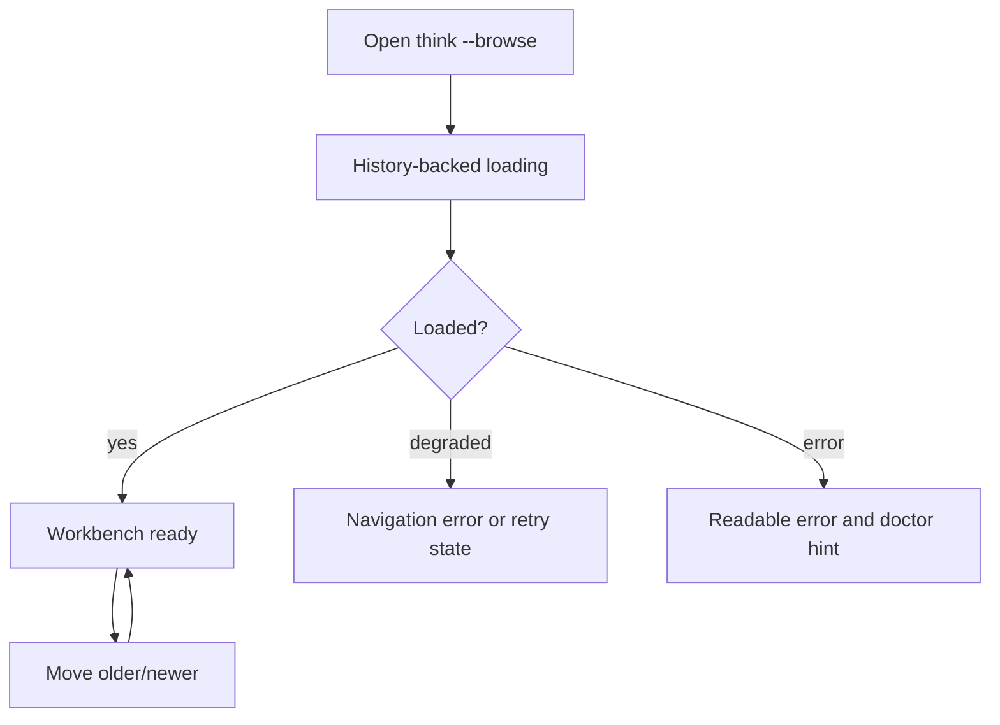

# SURFACE-0071 - Browse Honest Navigation

## Linked Issue / Backlog

- GitHub issue: not opened yet.
- Related backlog:
  - `docs/method/backlog/cool-ideas/SURFACE_browse-presentation.md`
  - `docs/method/backlog/cool-ideas/SURFACE_session-replay.md`
  - `docs/method/backlog/cool-ideas/SURFACE_writer-provenance-views.md`
  - `docs/method/backlog/bad-code/SURFACE_browse-tui-strict-limits.md`
  - `docs/method/backlog/bad-code/SURFACE_fadeInBrowse-throwaway-model.md`

## Design Type

This design is primarily:

- [ ] Runtime/API
- [ ] Storage/substrate
- [ ] Sync/protocol
- [ ] Migration/release
- [x] CLI/operator
- [ ] Docs/public guidance
- [x] TUI/visual surface
- [x] Test/tooling

## Decision Summary

`think --browse` will take the first workbench slice: honest History-backed
loading, the latest selected thought, older/newer navigation, compact and wide
layouts, and a deterministic model snapshot. Session panels, provenance,
receipt details, richer focus routing, and advanced partial/error handling move
to Browse B after real use proves they matter.

## Sponsored Human

A Think user wants Browse to feel like an actual memory tool so that returning
to a thought gives the latest capture and immediate neighbors, without waiting
on a fake loading display or running several commands.

## Sponsored Agent

An agent needs Browse state to be inspectable as model facts and deterministic
lower-mode output so it can verify what the TUI is showing without scraping
terminal pixels.

## Hill

By the end of this cycle, a user can open `think --browse`, watch real
History-backed loading, read the latest selected thought, move older/newer
through a bounded window, and quit with predictable keyboard behavior, and the
repo proves it with reducer/model tests, terminal-size render tests, and a
lower-mode JSON witness.

## Current Truth

Browse already has an AppShell page that requires a data port and starts a
loading command plus loading ticks during initialization.

The History browse adapter already supports streamed initial-view updates when
the backing History object exposes `loadLatestCaptureWindowUpdates()`. That is
the correct direction, but the current TUI still behaves mostly like a splash
screen plus one simple text view.

The existing browse-window test proves a bounded read invariant: browsing one
capture should hydrate only the selected entry and adjacent chronology entries.

Evidence:

- [`src/browse/app.js#L101:4ae31fb3092135897b406b90286d2aeb59a1380b`](https://github.com/flyingrobots/think/blob/4ae31fb3092135897b406b90286d2aeb59a1380b/src/browse/app.js#L101)
- [`src/browse/adapters/history.js#L29:4ae31fb3092135897b406b90286d2aeb59a1380b`](https://github.com/flyingrobots/think/blob/4ae31fb3092135897b406b90286d2aeb59a1380b/src/browse/adapters/history.js#L29)
- [`test/ports/browse-window.test.js#L8:4ae31fb3092135897b406b90286d2aeb59a1380b`](https://github.com/flyingrobots/think/blob/4ae31fb3092135897b406b90286d2aeb59a1380b/test/ports/browse-window.test.js#L8)

## Problem

Browse currently does not provide enough working context to justify being a
TUI. It should not be a decorative title screen, and it should not fake loading.
It needs real model state, real progress updates, bounded read behavior, and
screen layouts that behave across terminal sizes.

## Scope

This cycle includes:

- Replace the current simple Browse view with a bounded Browse A navigation
  model.
- Drive loading state from real History activity, not decorative timers.
- Support keyboard movement through older/newer entries.
- Render compact and wide layouts for the selected thought and its immediate
  neighbors.
- Preserve existing non-TUI commands that use Bijou for regular terminal
  output.
- Add lower-mode JSON output for the same selected navigation state.

## Non-Goals

This cycle does not include:

- Turning `recent`, `inspect`, `stats`, or `remember` into TUIs.
- Adding editing, annotation, delete, merge, or link mutation.
- Changing storage or capture semantics.
- Rendering unbounded chronology.
- Using fake timers or decorative progress as proof of real loading.
- Session panels, provenance, receipt details, focus routing, search/filtering,
  and richer partial/error handling. Those are Browse B or later.

## Runtime / API Contract

The TUI consumes a small `BrowseNavigationPort` derived from History:

```js
const port = createBrowseNavigationPort({ history, mindName });
```

Required commands:

- `loadInitialNavigationTask()`
- `selectEntry({ entryId })`
- `toLowerModeSnapshot(model)`

Older/newer movement is primarily reducer logic. The port answers bounded
queries; the UI model decides what "older" and "newer" mean from facts it
already owns, and asks the port for another bounded window only when movement
would leave the current window.

Required model states:

- `loading`
- `ready`
- `empty`
- `error`

Required facts:

- selected entry
- chronology neighbors
- loading/progress stage
- active key binding set

## User Experience / Product Shape

The first Browse slice starts at the latest capture unless an entry ID is
provided. The user can move older/newer through bounded chronology and quit.



Golden path:

- Launch Browse.
- See real loading stages.
- Land on latest capture.
- Move to older/newer entries.
- Quit.

Alternative flows:

- Empty mind shows an empty-state panel and capture hint.
- Slow History read shows progress and remains cancellable.
- Partial read shows available navigation facts and a retry key if implemented
  in the first slice.
- Error state includes a short user string and machine-readable lower-mode code.

## Wide UI Mockup

Required terminal target: 120 columns by 36 rows.

```text
Think Browse [default]                         History: live  Basis: latest
-----------------------------------------------------------------------------
Chronology                  Thought
> 10:42  current focus      I should rewrite browse around causal history...
  10:38  previous idea      This could load through a bounded window...
  10:33  earlier note       The title screen is cool but the app needs...

Older: earlier note
Newer: none

[j/k] older/newer  [r] retry  [q] quit
```

## Narrow UI Mockup

Required terminal target: 48 columns by 20 rows.

```text
Think Browse [default]
History: live

> 10:42 current focus
  I should rewrite browse around...

older: previous idea
newer: none

[j/k] move [q] quit
```

## Data / State Model

| State | Source of truth | Derived state | Invalid states | Reset behavior | Serialization | Determinism assumptions |
| --- | --- | --- | --- | --- | --- | --- |
| Navigation model | Browse reducer | Render tree and lower-mode snapshot | Ready without selected entry | Recreated on page init | JSON snapshot | Same input events yield same model |
| Selected entry | History window facts | Highlight and detail body | Selection outside known window without pending read | Re-read bounded window | Entry ID | Entry IDs are stable |
| Loading activity | History task lifecycle | Spinner/stage text | Spinner advances without real task state | Dispose cancels task | JSON event | Model changes follow task updates |
| Neighbor cache | History window facts | Older/newer labels | Neighbor label without entry ID | Replaced on bounded read | JSON object | Ordering uses History facts |

## Architecture / Anti-SLUDGE Posture

| Concern | Decision |
| --- | --- |
| Domain changes | None beyond History facts from `CORE-0070`. |
| Port changes | Add a small Browse navigation adapter over History. |
| Adapter changes | TUI never imports git-warp. |
| Boundary validation | Navigation reducer accepts only normalized facts. |
| Runtime-backed nouns introduced | `BrowseNavigationModel`, `BrowseSelection`, `BrowseAction`. |
| Expected failure representation | Error state in model plus lower-mode error code. |
| Banned shortcuts avoided | No fake loading bars, no direct graph reads, no process-global layout reads in render functions. |
| Quarantine impact | Enables removing throwaway fade-in and splash monolith code. |

## Cost / Residency Posture

| Surface | Current cost | Target cost | Limit/budget | Failure mode |
| --- | --- | --- | --- | --- |
| Initial browse | Transitional | Bounded | Latest plus immediate neighbors | Empty/error model |
| Movement | Bounded | Bounded | Hydrate selected plus neighbors | Keep previous selection and show error |
| Lower-mode snapshot | Bounded | Current model only | No extra reads | Snapshot unavailable error |

## Error Contract

| Failure | Error/result | Caller recovery | Test |
| --- | --- | --- | --- |
| No captures | `empty` model | Show capture hint | Empty mind render test |
| Slow History | `loading` model from active task | Continue spinner, allow quit | Loading model test |
| History error | `error` model with code | Show doctor hint and retry key | Error render test |
| Terminal too narrow | Compact layout | Preserve text without overlap | Narrow render test |

## Lower Modes

The Browse A navigation model must provide a deterministic JSON snapshot for
tests and agents:

```json
{
  "status": "ready",
  "mindName": "default",
  "selectedEntryId": "entry:...",
  "chronology": [],
  "olderEntryId": "entry:...",
  "newerEntryId": null,
  "loading": null
}
```

The JSON snapshot is not a new public CLI command until explicitly wired, but
the model function must exist so render tests are not the only proof.

## Accessibility Posture

| Concern | Decision |
| --- | --- |
| Semantic labels or facts | Navigation regions have stable IDs and titles in the model. |
| Focus order or focus ownership | Single-focus Browse A; richer focus routing is Browse B. |
| Hidden or visual-only information | Every visible status also exists in lower-mode JSON. |
| Keyboard behavior | Required keys are deterministic and documented in visible footer text. |
| Secret/redaction behavior | Browse A does not add provenance display. |

## User-Facing Text / Directionality

- new or changed visible strings:
  - `Think Browse [<mind>]`
  - `History: <stage>`
  - `No captures yet`
  - `History read failed`
  - `[j/k] older/newer`
  - `[r] retry`
  - `[q] quit`
- where the wording appears: Browse TUI title, panels, footer, loading/error
  state.
- left-to-right assumptions: English LTR terminal layout.
- machine-readable equivalent output: `toLowerModeSnapshot(model)`.

## Agent Inspectability / Explainability Posture

Agents can inspect:

- the lower-mode snapshot
- stable panel IDs
- selected entry ID
- older/newer entry IDs
- loading state
- error codes

Agents do not need to inspect terminal colors, cursor positions, or pixels.

## Linked Invariants

- Tests Are the Spec.
- Runtime Truth Wins.
- TUI State Is Model State.
- Lower Modes Are Not Optional.
- Bounded Reads Stay Bounded.
- Product Surfaces Use History, Not Graph Internals.

## Design Alternatives Considered

### Option A: Polish The Current Text View

Pros:

- Fastest surface change.
- Lower risk to existing TUI boot.

Cons:

- Does not justify AppShell.
- Keeps Browse as a novelty instead of a workbench.
- Does not address loading truth or inspectability.

### Option B: Build A Full Dashboard

Pros:

- Richer product vision.
- Could include stats, search, heatmaps, and graph views.

Cons:

- Too broad for a first reliable Browse cycle.
- Risks unbounded reads and visual clutter.

### Option C: Build Browse A First

Pros:

- Uses Bijou AppShell for what it is good at: model, commands, layout.
- Solves the smallest real re-entry workflow.
- Keeps read scope bounded.

Cons:

- Requires disciplined render tests across terminal sizes.
- Defers session, provenance, receipt, and search features.

## Decision

Choose Option C. `SURFACE-0071` is Browse A: honest loading, selected thought,
older/newer navigation, compact/wide layouts, and a deterministic lower-mode
snapshot. The richer memory workbench remains the direction, but it is not one
cycle of work.

## Proof Surface

The implementation must be proven through:

- actual surface under test: Browse AppShell model and rendered output
- first RED test: loading state cannot advance unless the active History task
  changes state
- required witness command: render tests for wide and narrow terminal sizes
- non-acceptable proof: screenshot-only approval or decorative animation tests

## Implementation Slices

- Define the Browse A navigation model and lower-mode snapshot.
- Replace fake/decorative loading with real task-backed loading state.
- Render selected thought plus older/newer context.
- Add reducer-owned older/newer keyboard movement.
- Add narrow and wide render tests.
- Wire basic empty and error states.

## Tests To Write First

Behavior tests required:

- [ ] Loading model remains honest when History does not emit progress.
- [ ] Wide render includes selected thought and older/newer context without overlapping text.
- [ ] Narrow render collapses panels without hiding selected thought.
- [ ] Keyboard movement changes selected entry through reducer-owned navigation when facts are already loaded.
- [ ] Keyboard movement asks the port for a bounded window only when the selection leaves known facts.
- [ ] Lower-mode snapshot matches selected TUI state.
- [ ] Empty and error states show deterministic model facts and readable text.

Documentation/process tests, only if relevant:

- [ ] Design index includes the Browse A proposal.

## Acceptance Criteria

The work is done when:

- [ ] `think --browse` uses the Browse A AppShell model.
- [ ] Real task-backed loading replaces fake loading.
- [ ] The selected thought and older/newer context are visible or explicitly
  unavailable.
- [ ] Wide and narrow render tests pass.
- [ ] Lower-mode snapshot tests pass.
- [ ] Existing CLI/MCP tests remain green.
- [ ] CI and local validation are green.

## Validation Plan

Expected before PR:

```bash
npm run typecheck
npm run lint
npm run test:fast
```

Add focused Browse A model and render tests to the relevant package test
command.

## Playback / Witness

Reviewer witness:

```bash
think --browse
npm run test:fast
```

For manual visual review, run at 120x36 and 48x20 terminal sizes and verify that
text does not overlap and the footer keys match actual behavior.

## Risks

Known risks:

- A rich TUI could drift into unbounded reads.
- Terminal layout regressions are easy without explicit size tests.
- Loading can become decorative if it is not driven by real task state.

Mitigations:

- Keep panels bounded.
- Test wide and narrow layouts.
- Require task-backed loading state in model tests.

## Follow-On Debt

Create GitHub issues for:

- Search/filter mode inside Browse.
- Thought graph visualization after bounded workbench is stable.
- Session replay as a separate mode.
- Writer provenance and receipt drill-down after Browse A proves useful.

## Tracker Disposition

| Issue / Backlog | Role | Expected disposition |
| --- | --- | --- |
| `SURFACE_browse-presentation.md` | primary | update when Browse A lands |
| `SURFACE_session-replay.md` | follow-on | leave open |
| `SURFACE_writer-provenance-views.md` | follow-on | leave open |
| `SURFACE_browse-tui-strict-limits.md` | guardrail | update with layout/read limits |
| `SURFACE_fadeInBrowse-throwaway-model.md` | cleanup | close when removed |

## Done Does Not Mean

When this lands, it does not prove:

- Browse is a graph visualizer.
- Browse can edit memory.
- Other commands should become TUIs.
- Large minds are fully optimized beyond the bounded reads used here.

## Retrospective

Fill this in after implementation.

What changed from the design:

- TBD.

What the tests proved:

- TBD.

What remains open:

- TBD.

PR:

- TBD.
