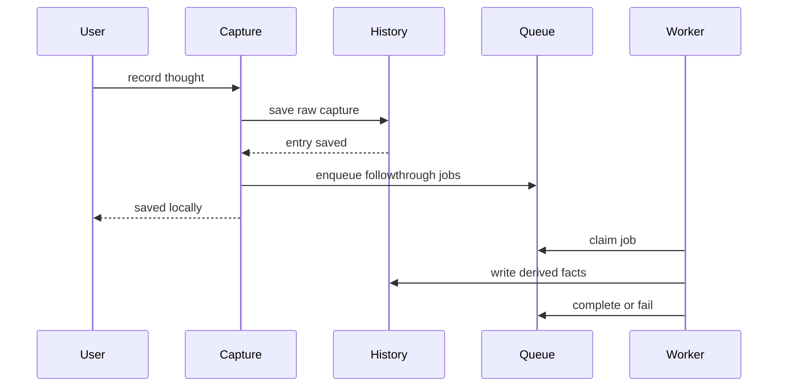

# CORE-0072 - Followthrough Job Queue

## Linked Issue / Backlog

- GitHub issue: not opened yet.
- Related backlog:
  - `docs/method/backlog/bad-code/RE-025-deferred-derivation-pipeline.md`
  - `docs/method/backlog/cool-ideas/CORE_post-capture-automated-enrichment.md`
  - `docs/method/backlog/cool-ideas/CORE_capture-recovery.md`
  - `docs/method/backlog/bad-code/CORE_large-mind-read-timeouts.md`

## Design Type

This design is primarily:

- [x] Runtime/API
- [x] Storage/substrate
- [ ] Sync/protocol
- [ ] Migration/release
- [x] CLI/operator
- [ ] Docs/public guidance
- [ ] TUI/visual surface
- [x] Test/tooling

## Decision Summary

Think will add a durable followthrough queue for post-capture work. Raw capture
remains immediate and sacred; derivation, read-edge repair, backup checks,
enrichment, and migration followthrough become explicit jobs with visible
status, retry behavior, and deterministic receipts.

## Sponsored Human

A Think user wants capture to return quickly and reliably so that writing down a
thought is never blocked by enrichment, migration, or repair work, without
losing visibility into whether that followthrough finished.

## Sponsored Agent

An agent needs inspectable job state so it can decide whether memory is fresh,
degraded, pending, or failed, without guessing from command latency or parsing
logs.

## Hill

By the end of this cycle, capture can save raw content and enqueue followthrough
jobs, `doctor` or a new status surface can report pending/failed jobs, and tests
prove that a failed followthrough worker does not roll back or hide the raw
capture.

## Current Truth

Raw capture writes an entry and attached content through the current worldline
path. `finalizeCapturedThought()` then opens the app, ensures first-derived
artifacts, ensures read edges, and optionally runs migration before returning.

Derived artifacts already carry receipt-like fields such as deriver,
deriverVersion, schemaVersion, primary input, reason, and createdAt. That shape
is useful, but there is no durable job status showing whether followthrough work
is pending, running, failed, skipped, or complete.

Evidence:

- [`src/store/capture.js#L15:4ae31fb3092135897b406b90286d2aeb59a1380b`](https://github.com/flyingrobots/think/blob/4ae31fb3092135897b406b90286d2aeb59a1380b/src/store/capture.js#L15)
- [`src/store/capture.js#L62:4ae31fb3092135897b406b90286d2aeb59a1380b`](https://github.com/flyingrobots/think/blob/4ae31fb3092135897b406b90286d2aeb59a1380b/src/store/capture.js#L62)
- [`src/store/derivation.js#L243:4ae31fb3092135897b406b90286d2aeb59a1380b`](https://github.com/flyingrobots/think/blob/4ae31fb3092135897b406b90286d2aeb59a1380b/src/store/derivation.js#L243)
- [`src/store/derivation.js#L303:4ae31fb3092135897b406b90286d2aeb59a1380b`](https://github.com/flyingrobots/think/blob/4ae31fb3092135897b406b90286d2aeb59a1380b/src/store/derivation.js#L303)

## Problem

Post-capture work is important but not visible enough. If it is synchronous, it
can make capture and startup feel broken. If it becomes asynchronous without a
contract, users and agents cannot tell whether memory is complete, stale, or
failed. Think needs a first-class followthrough model.

## Scope

This cycle includes:

- Define durable `FollowthroughJob` and `FollowthroughReceipt` facts.
- Enqueue required jobs after raw capture saves.
- Add a worker entry point that can claim and complete jobs.
- Report pending and failed jobs through doctor or a dedicated status surface.
- Prove raw capture persists even when followthrough fails.
- Keep job effects idempotent.

## Non-Goals

This cycle does not include:

- A long-running daemon.
- Network sync workers.
- LLM enrichment by default.
- Arbitrary user-authored job plugins.
- Changing the capture ID, content, or provenance contract.

## Runtime / API Contract

The port contract:

```js
const queue = await openFollowthroughQueue({ history, workerId: 'think' });
```

Required operations:

- `enqueue({ entryId, kind, inputBasis, priority })`
- `list({ status, limit })`
- `claimNext({ workerId, now })`
- `complete({ jobId, receipt })`
- `fail({ jobId, error, retryAfter })`
- `observe({ status })`

Required job states:

- `queued`
- `running`
- `complete`
- `failed`
- `skipped`

Required initial job kinds:

- `derive_first_artifacts`
- `ensure_read_edges`
- `backup_probe`
- `migration_probe`

## User Experience / Product Shape

Capture remains a fast save-first path:



Operator-visible surfaces:

- capture output includes `followthrough: queued` or `followthrough: skipped`
  when the command exposes status.
- doctor reports failed jobs.
- MCP can expose followthrough status after `SURFACE-0073`.

## Data / State Model

| State | Source of truth | Derived state | Invalid states | Reset behavior | Serialization | Determinism assumptions |
| --- | --- | --- | --- | --- | --- | --- |
| Job | History queue facts | Status summary | Running without claim owner | Timed-out claim can be released | JSON-compatible fact | Job ID derived from entry, kind, version |
| Claim | Worker write | Active worker status | Claim by two workers at same basis | CAS conflict or retry | JSON-compatible fact | Claim winner is persistence-determined |
| Receipt | Worker result | Inspect/doctor summary | Receipt without job ID | Never reset; new receipt supersedes | JSON-compatible fact | Receipt includes input basis |
| Failure | Worker result | Retry schedule | Failure without code | Retry by appending attempt | JSON-compatible fact | Retry count is append-only |

## Architecture / Anti-SLUDGE Posture

| Concern | Decision |
| --- | --- |
| Domain changes | Add Followthrough as Think infrastructure, not storage internals. |
| Port changes | Add queue port over History. |
| Adapter changes | git-warp adapter persists job facts through History operations. |
| Boundary validation | Job kind, status, attempts, and receipts are schema validated. |
| Runtime-backed nouns introduced | `FollowthroughJob`, `FollowthroughReceipt`, `FollowthroughAttempt`. |
| Expected failure representation | Failed jobs are data, not swallowed logs. |
| Banned shortcuts avoided | No hidden in-memory queue as the only truth; no blocking capture on enrichment. |
| Quarantine impact | Provides a path to retire synchronous finalization coupling. |

## Cost / Residency Posture

| Surface | Current cost | Target cost | Limit/budget | Failure mode |
| --- | --- | --- | --- | --- |
| Capture | Transitional synchronous followthrough | Save plus enqueue | Raw save should not wait on expensive reads | Capture saved, job failed/queued |
| Worker claim | None | Bounded queue page | Claim one job | No job available |
| Doctor status | Diagnostic | Bounded summary | Count failed/pending; no content hydration | Warn with unknown count |
| Retry | None | One job | Attempt limit per kind | Mark failed with retry exhausted |

## Determinism / Replay / Causality

This design preserves deterministic replay by making jobs append-only facts with
explicit inputs and receipts. Workers may run later, but every effect names the
job, input entry, kind, deriver/worker version, and basis used.

Causal inputs:

- basis: History basis at enqueue and claim time
- frontier: adapter-owned optional debug metadata
- writer id: worker ID in claim/receipt
- patch/order source: History adapter
- checkpoint or coordinate identity: adapter-owned optional debug metadata

Replay/convergence tests:

- Replaying the same capture and worker sequence yields the same job IDs and
  receipt states.
- Duplicate enqueue attempts produce one active job per entry/kind/version.
- Re-running a complete idempotent job does not duplicate derived artifacts.

## Git Substrate Impact

| Substrate area | Impact |
| --- | --- |
| refs | No product code may create refs directly. |
| commits | Job facts are persisted through the active History adapter. |
| trees/blobs | No direct product impact. |
| empty-tree graph commits | No product impact. |
| object ids | No product code depends on object IDs. |
| tag/release behavior | Release notes should mention capture/followthrough behavior changes. |
| migration compatibility | Existing captures without jobs are treated as needing probes, not corrupt. |

## Compatibility / Migration Posture

| Concern | Decision |
| --- | --- |
| Public API compatibility | Existing capture status remains compatible; extra followthrough fields are additive. |
| Package export changes | New internal queue exports may be added. |
| Storage/read compatibility | Existing minds are valid with no queue facts. |
| Legacy behavior retained | Synchronous finalization can remain until the worker covers parity. |
| Deprecation behavior | Remove synchronous coupling only after parity tests. |
| Migration path | First worker can backfill jobs for captures missing derived facts. |
| Release note impact | Note whether capture output changes. |

## Error Contract

| Failure | Error/result | Caller recovery | Test |
| --- | --- | --- | --- |
| Enqueue fails after raw save | Capture returns saved with followthrough warning | Run doctor or retry enqueue | Capture failure isolation test |
| Worker throws | Job status `failed` with code/message | Retry or inspect doctor | Worker failure test |
| Duplicate job | Existing job returned | Do not duplicate | Idempotent enqueue test |
| Claim conflict | Claim returns conflict/no job | Retry later | Concurrent claim test |
| Retry exhausted | Job status `failed` with retry exhausted | Human intervention | Retry policy test |

## Security / Trust / Redaction Posture

- trust boundary: workers operate inside local Think authority.
- authority or capability checked: future external workers must identify
  themselves with worker IDs and capabilities.
- secret-bearing values: job errors and receipts must not persist raw secrets
  beyond existing capture content and provenance.
- redaction behavior: doctor and MCP status summarize failures without dumping
  full content unless inspect explicitly requests the entry.
- log/report behavior: failed job logs are summarized as structured facts.
- abuse or replay concern: retry loops must have attempt limits.

## Lower Modes

Queue state must be available as JSON:

```json
{
  "queued": 2,
  "running": 0,
  "failed": 1,
  "complete": 19,
  "failures": [
    { "jobId": "job:...", "kind": "ensure_read_edges", "code": "read_failed" }
  ]
}
```

## Accessibility Posture

| Concern | Decision |
| --- | --- |
| Semantic labels or facts | Job states are enum facts. |
| Focus order or focus ownership | Not applicable unless surfaced in Browse later. |
| Hidden or visual-only information | No job state is visual-only. |
| Keyboard behavior | Not applicable in this cycle. |
| Secret/redaction behavior | Failure summaries omit full capture text by default. |

## User-Facing Text / Directionality

- new or changed visible strings:
  - `followthrough queued`
  - `followthrough pending`
  - `followthrough failed`
  - `run think doctor for details`
- where the wording appears: capture output, doctor, possible status command.
- left-to-right assumptions: English LTR CLI output.
- machine-readable equivalent output: followthrough JSON summary.

## Agent Inspectability / Explainability Posture

Agents can inspect:

- job IDs
- job kinds
- input entry IDs
- statuses
- attempts
- receipts
- failure codes
- retry advice

Agents do not need logs, terminal prose, or storage internals to know whether
followthrough is complete.

## Linked Invariants

- Raw Capture Is Sacred.
- Tests Are the Spec.
- Runtime Truth Wins.
- Async Work Must Be Visible.
- Followthrough Effects Are Idempotent.
- Public Claims Need Witnesses.

## Design Alternatives Considered

### Option A: Keep Followthrough Synchronous

Pros:

- Simpler mental model.
- Existing behavior mostly stays in one call path.

Cons:

- Capture and startup can block on derived work.
- Failures are not first-class user-visible state.

### Option B: Use An In-Memory Worker Queue

Pros:

- Easy to build.
- Good enough for a single process demo.

Cons:

- Loses work on process exit.
- Agents cannot inspect durable status.
- Does not satisfy local-first memory expectations.

### Option C: Persist Followthrough Jobs In History

Pros:

- Durable and inspectable.
- Aligns with causal memory.
- Supports retries and later workers.

Cons:

- Requires careful idempotency tests.
- Adds new state to existing minds.

## Decision

Choose Option C. Followthrough is durable History data with explicit job and
receipt facts. Capture saves first; followthrough reports its own state.

## Proof Surface

The implementation must be proven through:

- actual surface under test: capture plus followthrough worker/status APIs
- first RED test: raw capture persists when a followthrough job fails
- required witness command: focused queue tests plus `npm run test:fast`
- non-acceptable proof: background logs or manually observed latency

## Implementation Slices

- Define job schema and deterministic job ID rules.
- Enqueue followthrough jobs after raw capture.
- Add worker claim/complete/fail operations.
- Move one existing finalization task behind a job.
- Add status summary to doctor or a dedicated command.
- Backfill missing jobs for existing captures as a repair path.

## Tests To Write First

Behavior tests required:

- [ ] Capture returns saved when enqueue succeeds.
- [ ] Capture remains saved when followthrough worker fails.
- [ ] Duplicate enqueue is idempotent.
- [ ] Worker claim conflict does not double-run a job.
- [ ] Complete receipt includes job ID, input basis, worker ID, and version.
- [ ] Doctor/status reports failed jobs without full capture text.

Documentation/process tests, only if relevant:

- [ ] Design index includes this proposal.

## Acceptance Criteria

The work is done when:

- [ ] Raw capture no longer depends on all followthrough work completing.
- [ ] Queue state is durable and inspectable.
- [ ] At least one existing finalization task runs through the queue.
- [ ] Failed jobs surface in doctor/status.
- [ ] Retry/idempotency tests pass.
- [ ] CI and local validation are green.

## Validation Plan

Expected before PR:

```bash
npm run typecheck
npm run lint
npm run test:fast
```

Add focused queue tests for capture isolation, idempotency, failure, and status.

## Playback / Witness

Reviewer witness:

```bash
npx vitest run test/ports/followthrough-queue.test.ts
npm run test:fast
```

Manual witness:

```bash
think "queued followthrough witness"
think doctor --json
```

## Risks

Known risks:

- Queue state could create new migration burden.
- Failed jobs could alarm users if wording is too severe.
- Retry loops could duplicate derived facts.

Mitigations:

- Treat missing job facts as valid legacy state.
- Keep user text short and actionable.
- Require idempotent job tests before adding new job kinds.

## Follow-On Debt

Create GitHub issues for:

- A dedicated followthrough status command if doctor becomes too crowded.
- A background worker strategy.
- MCP followthrough status after `SURFACE-0073`.
- Queue compaction or summary views if job history grows.

## Tracker Disposition

| Issue / Backlog | Role | Expected disposition |
| --- | --- | --- |
| `RE-025-deferred-derivation-pipeline.md` | primary | close or update when first job lands |
| `CORE_post-capture-automated-enrichment.md` | follow-on | leave open |
| `CORE_capture-recovery.md` | related | update with queue repair path |
| `CORE_large-mind-read-timeouts.md` | related | leave open |

## Done Does Not Mean

When this lands, it does not prove:

- Enrichment is implemented.
- A background daemon exists.
- Queue compaction is solved.
- Every finalization task has been migrated.

## Retrospective

Fill this in after implementation.

What changed from the design:

- TBD.

What the tests proved:

- TBD.

What remains open:

- TBD.

PR:

- TBD.
