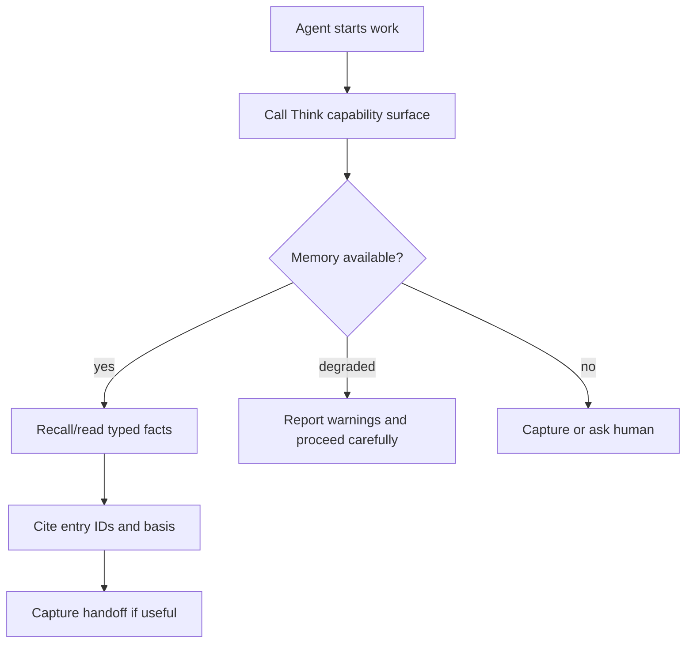

# SURFACE-0073 - Agent-Native Memory API

## Linked Issue / Backlog

- GitHub issue: not opened yet.
- Related backlog:
  - `docs/method/backlog/cool-ideas/SURFACE_bootstrap-command-for-agents-and-mcp.md`
  - `docs/method/backlog/cool-ideas/SURFACE_generated-surface-capability-matrix.md`
  - `docs/method/backlog/cool-ideas/SURFACE_generated-contract-docs-from-runtime-registry.md`
  - `docs/method/backlog/bad-code/CORE_mcp-service-dependency-injection.md`
  - `docs/design/0008-agent-native-cli.md`

## Design Type

This design is primarily:

- [x] Runtime/API
- [ ] Storage/substrate
- [ ] Sync/protocol
- [ ] Migration/release
- [x] CLI/operator
- [x] Docs/public guidance
- [ ] TUI/visual surface
- [x] Test/tooling

## Decision Summary

Think will define an agent-native memory API across MCP and JSON CLI surfaces.
The API will advertise capabilities, return typed History facts, include basis
and provenance metadata, and avoid forcing agents to infer state from terminal
text, visual Browse layouts, or private runtime details.

## Sponsored Human

A Think user wants agents to use their memory safely and predictably so that
assisted work can resume context, cite captured thoughts, and report gaps,
without silently hallucinating what Think knows.

## Sponsored Agent

An agent needs stable machine-readable tools for capture, recall, inspect,
browse, status, and capability discovery so it can coordinate work across
turns, without scraping prose or depending on undocumented command behavior.

## Hill

By the end of this cycle, an agent can call one capability-discovery surface,
read typed memory facts with causal basis metadata, write a raw capture, inspect
followthrough status if available, and receive deterministic errors, and the
repo proves that contract through MCP tests and JSON CLI witnesses.

## Current Truth

The MCP server exposes `capture`, `recent`, `remember`, `browse`, `inspect`,
`stats`, `prompt_metrics`, `doctor`, and `migrate_graph`. The acceptance test
asserts that exact tool list.

The server already uses schemas for tool input and output, but there is no
single capability-discovery contract that tells an agent which memory facts,
basis fields, lower modes, or followthrough features are available.

Evidence:

- [`src/mcp/server.js#L99:4ae31fb3092135897b406b90286d2aeb59a1380b`](https://github.com/flyingrobots/think/blob/4ae31fb3092135897b406b90286d2aeb59a1380b/src/mcp/server.js#L99)
- [`src/mcp/server.js#L105:4ae31fb3092135897b406b90286d2aeb59a1380b`](https://github.com/flyingrobots/think/blob/4ae31fb3092135897b406b90286d2aeb59a1380b/src/mcp/server.js#L105)
- [`src/mcp/server.js#L125:4ae31fb3092135897b406b90286d2aeb59a1380b`](https://github.com/flyingrobots/think/blob/4ae31fb3092135897b406b90286d2aeb59a1380b/src/mcp/server.js#L125)
- [`test/acceptance/mcp.test.js#L13:4ae31fb3092135897b406b90286d2aeb59a1380b`](https://github.com/flyingrobots/think/blob/4ae31fb3092135897b406b90286d2aeb59a1380b/test/acceptance/mcp.test.js#L13)

## Problem

Think has agent-usable tools, but not yet an agent-native contract. The current
surface is useful but piecemeal: agents can list MCP tools, but they cannot ask
Think what memory model version, History adapter capabilities, basis fields,
followthrough status, redaction rules, or lower-mode guarantees are available.

## Scope

This cycle includes:

- Add a capability-discovery tool or JSON command.
- Add versioned schemas for common memory facts.
- Include basis/provenance metadata in agent read results where available.
- Preserve existing MCP tool names and output compatibility unless explicitly
  versioned.
- Add test witnesses for MCP and CLI JSON.
- Document agent contract examples.

## Non-Goals

This cycle does not include:

- Replacing human CLI output.
- Making Browse a machine API.
- Adding remote sync, authentication, or shared minds.
- Exposing git-warp internals.
- Giving agents permission to mutate existing memories beyond explicit capture
  or future reviewed mutation tools.

## Runtime / API Contract

The API adds one capability surface:

```json
{
  "tool": "capabilities",
  "version": "1",
  "history": {
    "read": true,
    "writeCapture": true,
    "streaming": true,
    "basis": true
  },
  "surfaces": {
    "mcp": true,
    "cliJson": true,
    "tui": false
  }
}
```

Existing tools remain:

- `capture`
- `recent`
- `remember`
- `browse`
- `inspect`
- `stats`
- `prompt_metrics`
- `doctor`
- `migrate_graph`

New or extended fields must be additive:

- `basis`
- `adapter`
- `modelVersion`
- `capabilities`
- `warnings`
- `redactions`
- `followthrough`

## User Experience / Product Shape

The human-visible experience is docs and predictable JSON. The operator flow:



## Data / State Model

| State | Source of truth | Derived state | Invalid states | Reset behavior | Serialization | Determinism assumptions |
| --- | --- | --- | --- | --- | --- | --- |
| Capability report | Runtime composition root | Agent planning state | Capability without version | Re-read on session start | JSON object | Same runtime reports same schema |
| Memory fact | History port | MCP/CLI output | Fact without ID or kind | Re-read with basis | JSON object | Fact fields are stable by version |
| Warning | Runtime/adapter | Agent risk model | Warning without code | Re-check after repair | JSON object | Codes are stable |
| Redaction notice | Output formatter | Agent disclosure state | Redaction without field path | Re-read with explicit inspect if allowed | JSON object | Redactions are explicit |

## Architecture / Anti-SLUDGE Posture

| Concern | Decision |
| --- | --- |
| Domain changes | None beyond shared memory fact schemas. |
| Port changes | Agent API consumes History and followthrough ports, not adapters. |
| Adapter changes | No adapter-specific facts without namespaced diagnostics. |
| Boundary validation | MCP and CLI JSON share schemas where possible. |
| Runtime-backed nouns introduced | `MemoryCapabilityReport`, `MemoryFact`, `MemoryWarning`, `MemoryBasis`. |
| Expected failure representation | Typed JSON errors and warnings. |
| Banned shortcuts avoided | No pixel scraping, no prose-only facts, no graph internals. |
| Quarantine impact | Creates a migration target for older ad hoc JSON shapes. |

## Cost / Residency Posture

| Surface | Current cost | Target cost | Limit/budget | Failure mode |
| --- | --- | --- | --- | --- |
| Capabilities | Diagnostic | Bounded | No content reads | Degraded capability report |
| Recent/remember | Existing bounded knobs | Bounded/cursor | Existing `count`/`limit` | Warning plus partial result |
| Browse | Bounded window | Bounded History result | Current plus neighbors/session budget | Partial result |
| Inspect | One entry | Bounded receipts | One entry | Not found or partial receipts |

## Compatibility / Migration Posture

| Concern | Decision |
| --- | --- |
| Public API compatibility | Existing tool names remain. Additive fields only unless versioned. |
| Package export changes | Shared schema exports may be added. |
| Storage/read compatibility | Existing minds remain readable. |
| Legacy behavior retained | `migrate_graph` remains until a reviewed migration replacement exists. |
| Deprecation behavior | Any renamed tool gets at least one release with alias/docs. |
| Migration path | Agents can branch on capability version. |
| Release note impact | Document new capabilities and additive fields. |

## Error Contract

| Failure | Error/result | Caller recovery | Test |
| --- | --- | --- | --- |
| Repo missing | `repoPresent: false` plus warning | Bootstrap or capture | MCP capability test |
| Capability absent | `capabilities.<name>: false` | Avoid feature | Capability matrix test |
| Read degraded | Result with `warnings` and `partial: true` | Use available facts, cite warning | Partial read test |
| Redacted field | `redactions[]` with path/reason | Do not infer hidden value | Redaction test |
| Unsupported version | Typed error | Fall back or ask human | Version negotiation test |

## Security / Trust / Redaction Posture

- trust boundary: MCP and CLI JSON expose local memory to local authorized
  callers.
- authority or capability checked: future mutation tools must advertise explicit
  write capabilities.
- secret-bearing values: captured text may contain secrets and is returned only
  by tools that already expose entry content.
- redaction behavior: all redacted or omitted fields must be named in
  `redactions[]` when omission is meaningful.
- log/report behavior: capability reports do not dump memory content.
- abuse or replay concern: agents must cite entry IDs and basis when claiming
  memory-backed context.

## Lower Modes

This design is lower-mode first. JSON and MCP are the product surface. Any human
docs examples must be executable or mirrored by tests.

## Accessibility Posture

| Concern | Decision |
| --- | --- |
| Semantic labels or facts | Every field is schema-described. |
| Focus order or focus ownership | Not applicable. |
| Hidden or visual-only information | None; visual Browse state is not the API. |
| Keyboard behavior | Not applicable. |
| Secret/redaction behavior | Redaction metadata is explicit and machine-readable. |

## User-Facing Text / Directionality

- new or changed visible strings: documentation examples and optional CLI JSON
  errors such as `unsupported capability version`.
- where the wording appears: docs, JSON error messages, MCP descriptions.
- left-to-right assumptions: English docs; JSON keys are ASCII.
- machine-readable equivalent output: the API itself.

## Agent Inspectability / Explainability Posture

Agents can inspect:

- capability version
- memory model version
- available read/write tools
- adapter health without adapter internals
- basis fields
- warning codes
- redaction paths
- followthrough status if `CORE-0072` has landed

Agents must cite:

- entry IDs for memory claims
- query or command used
- basis if present
- warnings if result was partial

## Linked Invariants

- Agents Are First-Class Users.
- Lower Modes Are Not Optional.
- Runtime Truth Wins.
- History Is Product Boundary.
- Public Claims Need Witnesses.
- No Prose-Only Machine Contracts.

## Design Alternatives Considered

### Option A: Keep Existing MCP Tools Only

Pros:

- No migration work.
- Current tools are already useful.

Cons:

- Agents still lack capability discovery.
- Contract remains scattered across schemas and docs.

### Option B: Add A Separate Agent Protocol

Pros:

- Clean slate.
- Could be optimized for Codex/Claude workflows.

Cons:

- Duplicates MCP and CLI JSON.
- More surface area to keep compatible.

### Option C: Version MCP And CLI JSON Around Shared Memory Facts

Pros:

- Builds on existing surfaces.
- Lets agents discover what is safe to use.
- Keeps human CLI separate from machine contracts.

Cons:

- Requires schema discipline.
- Existing tests need additive updates.

## Decision

Choose Option C. Agent-native means shared versioned facts and capability
discovery across MCP and CLI JSON, not a separate private protocol.

## Proof Surface

The implementation must be proven through:

- actual surface under test: MCP client calls and CLI JSON command output
- first RED test: agent can call capabilities and see versioned History support
- required witness command: MCP acceptance test plus CLI JSON smoke
- non-acceptable proof: README examples without executable tests

## Implementation Slices

- Define shared memory fact schemas.
- Add capability report for MCP.
- Add matching CLI JSON capability command or flag.
- Add basis/warning/redaction fields to one read tool.
- Extend remaining read tools additively.
- Generate or update docs from the runtime registry.

## Tests To Write First

Behavior tests required:

- [ ] MCP capabilities tool returns version, surfaces, and History support.
- [ ] CLI JSON capability output matches MCP capability schema.
- [ ] Browse or inspect result includes basis when History provides one.
- [ ] Redaction metadata appears for intentionally omitted fields.
- [ ] Unsupported capability version returns a typed error.

Documentation/process tests, only if relevant:

- [ ] Generated capability docs match runtime registry.

## Acceptance Criteria

The work is done when:

- [ ] Agents can discover capabilities before using memory.
- [ ] MCP and CLI JSON share schema-backed memory facts.
- [ ] Existing MCP tools stay compatible.
- [ ] New fields are additive or versioned.
- [ ] Capability and read witnesses pass.
- [ ] CI and local validation are green.

## Validation Plan

Expected before PR:

```bash
npm run typecheck
npm run lint
npm run test:fast
```

Add focused MCP and CLI JSON tests for capabilities and one read surface.

## Playback / Witness

Reviewer witness:

```bash
npx vitest run test/acceptance/mcp.test.js
think doctor --json
npm run test:fast
```

If a dedicated capabilities CLI lands, use that command instead of `doctor` as
the JSON witness.

## Risks

Known risks:

- Tool naming churn could break existing agents.
- Capability reports can become marketing docs instead of runtime truth.
- Redaction metadata can leak too much if field paths are careless.

Mitigations:

- Preserve current tools and add fields.
- Generate docs from runtime schemas.
- Test redaction paths explicitly.

## Follow-On Debt

Create GitHub issues for:

- Generated runtime capability docs.
- Tool deprecation policy if any alias becomes necessary.
- Agent bootstrap command after capability report lands.
- Followthrough status tool after `CORE-0072`.

## Tracker Disposition

| Issue / Backlog | Role | Expected disposition |
| --- | --- | --- |
| `SURFACE_bootstrap-command-for-agents-and-mcp.md` | related | update with capability command |
| `SURFACE_generated-surface-capability-matrix.md` | follow-on | leave open or close if generated |
| `SURFACE_generated-contract-docs-from-runtime-registry.md` | follow-on | leave open unless implemented |
| `CORE_mcp-service-dependency-injection.md` | related | update if composition changes |

## Done Does Not Mean

When this lands, it does not prove:

- Agents can mutate or annotate existing memories.
- Remote MCP trust boundaries are solved.
- Browse TUI state is the machine API.
- Every old JSON shape has been rationalized.

## Retrospective

Fill this in after implementation.

What changed from the design:

- TBD.

What the tests proved:

- TBD.

What remains open:

- TBD.

PR:

- TBD.
