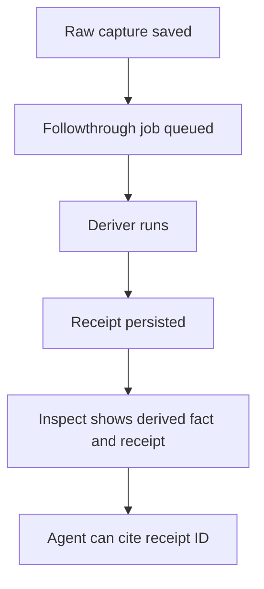

# REFLECT-0074 - Evidence-Bound Enrichment

## Linked Issue / Backlog

- GitHub issue: not opened yet.
- Related backlog:
  - `docs/method/backlog/cool-ideas/CORE_post-capture-automated-enrichment.md`
  - `docs/method/backlog/cool-ideas/REFLECT_automated-summaries.md`
  - `docs/method/backlog/cool-ideas/REFLECT_deterministic-analysis.md`
  - `docs/method/backlog/cool-ideas/REFLECT_llm-spitball.md`
  - `docs/method/backlog/cool-ideas/CORE_evolve-thoughts.md`

## Design Type

This design is primarily:

- [x] Runtime/API
- [ ] Storage/substrate
- [ ] Sync/protocol
- [ ] Migration/release
- [ ] CLI/operator
- [x] Docs/public guidance
- [ ] TUI/visual surface
- [x] Test/tooling

## Decision Summary

Think will make enrichment composable but evidence-bound. Deterministic
derivers, optional LLM-assisted reflections, summaries, tags, and future
evolution steps all produce receipts that name inputs, methods, versions, basis,
epistemic status, limitations, and evidence anchors. Enrichment never rewrites
raw capture and never becomes product truth without an inspectable receipt.

## Sponsored Human

A Think user wants the system to help organize and reflect on captured thoughts
so that memory becomes more useful over time, without losing the ability to tell
what was raw, what was derived, and why.

## Sponsored Agent

An agent needs enrichment facts to be typed, attributable, and replayable so it
can use summaries, tags, or reflection packs without treating guesses as raw
memory.

## Hill

By the end of this cycle, Think can register and run one deterministic
enrichment deriver through followthrough, persist a receipt with explicit input
method metadata and evidence anchors, expose the receipt through inspect, and
prove replay stability with tests.

## Current Truth

Think already creates first-derived artifacts such as canonical thought
identity, seed-quality receipts, and session attribution receipts. Those
receipts include useful fields such as primary input, reason, deriver,
deriverVersion, schemaVersion, and createdAt.

The memory data model already says captures are immutable and derived facets are
append-only evidence. That doctrine is the right foundation, but there is not
yet a composable deriver registry, cost posture, or explicit treatment for
LLM-assisted enrichment.

Evidence:

- [`src/store/derivation.js#L243:4ae31fb3092135897b406b90286d2aeb59a1380b`](https://github.com/flyingrobots/think/blob/4ae31fb3092135897b406b90286d2aeb59a1380b/src/store/derivation.js#L243)
- [`src/store/derivation.js#L303:4ae31fb3092135897b406b90286d2aeb59a1380b`](https://github.com/flyingrobots/think/blob/4ae31fb3092135897b406b90286d2aeb59a1380b/src/store/derivation.js#L303)
- [`docs/design/0068-think-memory-data-model/think-memory-data-model.md#L29:4ae31fb3092135897b406b90286d2aeb59a1380b`](https://github.com/flyingrobots/think/blob/4ae31fb3092135897b406b90286d2aeb59a1380b/docs/design/0068-think-memory-data-model/think-memory-data-model.md#L29)
- [`docs/design/0068-think-memory-data-model/think-memory-data-model.md#L88:4ae31fb3092135897b406b90286d2aeb59a1380b`](https://github.com/flyingrobots/think/blob/4ae31fb3092135897b406b90286d2aeb59a1380b/docs/design/0068-think-memory-data-model/think-memory-data-model.md#L88)

## Problem

Enrichment is where Think can become much more useful, but it is also where
sludge enters if guesses, summaries, tags, and reflections become indistinct
from capture truth. Think needs a disciplined enrichment contract before adding
more automation.

## Scope

This cycle includes:

- Define a `DeriverRegistry` and `Deriver` contract.
- Run one deterministic enrichment through the followthrough queue.
- Persist an enrichment receipt with input, method, version, basis, output,
  epistemic status, limitations, and evidence anchors.
- Expose enrichment receipts through inspect and agent read surfaces.
- Define policy for optional LLM enrichment without enabling it by default.
- Prove deterministic replay for the first enrichment.

## Non-Goals

This cycle does not include:

- Automatic network calls.
- Default LLM summarization.
- Rewriting raw thought text.
- Ranking memories by opaque model scores.
- A visual graph or Browse enrichment panel unless a later surface slice chooses
  to render the facts.

## Runtime / API Contract

Deriver registration:

```js
registerDeriver({
  id: 'summary.seed.v1',
  kind: 'deterministic_summary',
  version: '1.0.0',
  input: ['capture'],
  output: 'enrichment_receipt',
  run: async ({ history, entry, basis, enrichment }) => receipt,
});
```

Required receipt fields:

- `receiptId`
- `kind`
- `primaryInputKind`
- `primaryInputId`
- `inputBasis`
- `method`
- `deriver`
- `deriverVersion`
- `schemaVersion`
- `createdAt`
- `output`
- `epistemicStatus`
- `supports`
- `limitations`
- `evaluation`

Evidence anchors use entry IDs and character spans when the output makes a
claim about captured text:

```json
{
  "supports": [
    {
      "entryId": "entry:...",
      "spans": [{ "start": 12, "end": 48 }]
    }
  ]
}
```

`confidence` is deliberately not part of the first contract. A deterministic
algorithm can be repeatable and still produce a weak conclusion, while an LLM's
self-reported confidence is mostly decorative. Callers get `epistemicStatus`,
`method`, `limitations`, `supports`, and optional externally computed
`evaluation` instead.

Optional LLM receipt fields, when a later cycle enables them:

- `model`
- `promptTemplateId`
- `promptTemplateVersion`
- `inputRedactions`
- `temperature`
- `responseId`
- `cost`

## User Experience / Product Shape

The first user-visible surface is inspect. A capture remains raw memory; the
enrichment section explains what was derived and how.



## Data / State Model

| State | Source of truth | Derived state | Invalid states | Reset behavior | Serialization | Determinism assumptions |
| --- | --- | --- | --- | --- | --- | --- |
| Deriver registry | Runtime composition | Capability report | Deriver without version | Process restart rebuilds registry | JSON manifest | Same build has same registry |
| Enrichment job | Followthrough queue | Worker plan | Job without deriver ID | Retry via queue | JSON fact | Job ID includes deriver version |
| Receipt | Enrichment port | Inspect/agent output | Receipt without input basis or supports | Append new version; do not mutate raw | JSON fact | Deterministic deriver output is stable |
| LLM receipt | Future explicit deriver | Reflection output | Output without prompt/model evidence | Append correction/supersession | JSON fact | Non-determinism is disclosed |

## Architecture / Anti-SLUDGE Posture

| Concern | Decision |
| --- | --- |
| Domain changes | Add enrichment receipts as derived facts. |
| Port changes | Derivers read through History, execute through Followthrough, and write governed receipts through `think.enrichment`. |
| Adapter changes | No direct adapter reads inside derivers. |
| Boundary validation | Registry validates input/output schemas. |
| Runtime-backed nouns introduced | `Deriver`, `DeriverRegistry`, `EnrichmentReceipt`. |
| Expected failure representation | Failed enrichment is a followthrough failure, not a partial raw capture. |
| Banned shortcuts avoided | No raw-text mutation, no opaque model facts, no evidence-free summaries. |
| Quarantine impact | Creates a governed path for future reflection features. |

## Cost / Residency Posture

| Surface | Current cost | Target cost | Limit/budget | Failure mode |
| --- | --- | --- | --- | --- |
| Deterministic deriver | Inline/none | Followthrough bounded | One selected entry or bounded input set | Failed job with code |
| Inspect enrichment | Bounded receipts | Bounded | Receipts for one entry | Partial receipts |
| LLM enrichment | None | Explicit opt-in later | Budget and redaction required | Skipped/not configured |
| Registry report | None | Bounded | No content reads | Capability absent |

## Determinism / Replay / Causality

This design preserves deterministic replay by separating deterministic derivers
from non-deterministic assisted derivers. Deterministic derivers must produce
the same receipt output for the same input facts and deriver version. Assisted
derivers must disclose non-deterministic inputs and cannot be replay-stability
proofs.

Causal inputs:

- basis: History basis used to read the input
- frontier: adapter-owned optional debug metadata
- writer id: followthrough worker ID
- patch/order source: runtime adapter
- checkpoint or coordinate identity: adapter-owned optional debug metadata

Replay/convergence tests:

- Run the same deterministic deriver twice for the same capture and assert one
  idempotent receipt.
- Rebuild a fixture mind and assert the receipt output matches.
- Assert LLM derivers are disabled or skipped in fast/local tests.

## Compatibility / Migration Posture

| Concern | Decision |
| --- | --- |
| Public API compatibility | Inspect gets additive enrichment fields. |
| Package export changes | Registry exports may be internal first. |
| Storage/read compatibility | Existing captures without enrichment remain valid. |
| Legacy behavior retained | Existing seed/session receipts remain valid. |
| Deprecation behavior | Old receipts are superseded by new versions, not rewritten. |
| Migration path | Backfill enrichment via followthrough jobs. |
| Release note impact | Document any new inspect/MCP fields. |

## Error Contract

| Failure | Error/result | Caller recovery | Test |
| --- | --- | --- | --- |
| Deriver missing | Followthrough failure `deriver_missing` | Rebuild registry or skip | Missing deriver test |
| Input unavailable | Failure `input_missing` | Leave raw capture intact | Missing input test |
| Schema mismatch | Failure `receipt_invalid` | Fix deriver/version | Schema validation test |
| Duplicate receipt | Existing receipt returned | Do not duplicate | Idempotency test |
| LLM unavailable | Skipped receipt or job warning | Configure explicitly | No-network fast test |

## Security / Trust / Redaction Posture

- trust boundary: deterministic local derivers run inside Think authority.
- authority or capability checked: assisted/network derivers require explicit
  future opt-in.
- secret-bearing values: captured text can contain secrets; enrichment must not
  expand exposure beyond the requested read surface.
- redaction behavior: assisted derivers must record input redactions.
- log/report behavior: failures and receipts summarize methods without dumping
  full raw text by default.
- abuse or replay concern: non-deterministic outputs must not masquerade as
  deterministic receipts.

## Lower Modes

Inspect and agent APIs must expose enrichment as JSON:

```json
{
  "enrichmentReceipts": [
    {
      "receiptId": "receipt:...",
      "kind": "deterministic_summary",
      "primaryInputId": "entry:...",
      "method": "local",
      "deriver": "summary.seed.v1",
      "deriverVersion": "1.0.0",
      "epistemicStatus": "derived",
      "supports": [
        {
          "entryId": "entry:...",
          "spans": [{ "start": 12, "end": 48 }]
        }
      ],
      "limitations": ["no semantic model"],
      "evaluation": null
    }
  ]
}
```

## Accessibility Posture

| Concern | Decision |
| --- | --- |
| Semantic labels or facts | Enrichment fields are named facts with receipt IDs. |
| Focus order or focus ownership | Not applicable until a TUI panel renders enrichment. |
| Hidden or visual-only information | No enrichment exists only visually. |
| Keyboard behavior | Not applicable. |
| Secret/redaction behavior | Redaction metadata is included for assisted derivers. |

## User-Facing Text / Directionality

- new or changed visible strings:
  - `Enrichment`
  - `derived by`
  - `epistemic status`
  - `limitations`
  - `not configured`
- where the wording appears: inspect output and docs.
- left-to-right assumptions: English LTR CLI output.
- machine-readable equivalent output: inspect/MCP JSON enrichment receipts.

## Agent Inspectability / Explainability Posture

Agents can inspect:

- receipt ID
- input ID
- input basis
- method
- deriver ID/version
- schema version
- output
- epistemic status
- evidence supports
- limitations
- redaction metadata

Agents must not treat enrichment as raw capture. A memory-backed claim based on
enrichment should cite both the raw entry ID and the receipt ID.

## Linked Invariants

- Raw Capture Is Immutable.
- Derived Facts Need Receipts.
- Runtime Truth Wins.
- Tests Are the Spec.
- Assisted Outputs Are Evidence, Not Truth.
- Public Claims Need Witnesses.

## Design Alternatives Considered

### Option A: Add One-Off Summary Fields

Pros:

- Quick to expose in inspect.
- Simple implementation.

Cons:

- No reusable contract.
- Easy to blur raw and derived facts.
- Hard to replay or supersede.

### Option B: Make LLM Enrichment The First Feature

Pros:

- Product-visible wow factor.
- Can produce richer summaries and tags.

Cons:

- Introduces cost, privacy, and non-determinism before the evidence boundary is
  proven.
- Harder to test locally and in CI.

### Option C: Build The Receipt Contract With One Deterministic Deriver

Pros:

- Proves the architecture without network risk.
- Establishes the evidence rule before richer enrichment.
- Fits followthrough and inspect.

Cons:

- First user-visible output may be modest.
- Requires later cycles for richer reflection.

## Decision

Choose Option C. Enrichment starts with a deterministic deriver and a strict
receipt contract. LLM-assisted enrichment remains a later opt-in design that
must use the same evidence surface.

## Proof Surface

The implementation must be proven through:

- actual surface under test: followthrough deriver execution and inspect output
- first RED test: deterministic deriver writes one idempotent receipt with input
  basis, version metadata, epistemic status, limitations, and evidence supports
- required witness command: focused enrichment tests plus inspect JSON witness
- non-acceptable proof: prose-only examples or untested LLM output

## Implementation Slices

- Define the deriver registry, enrichment port, and receipt schema.
- Register one deterministic enrichment deriver.
- Run it through followthrough.
- Expose receipts through inspect.
- Add replay/idempotency tests.
- Document optional assisted-deriver requirements without enabling them.

## Tests To Write First

Behavior tests required:

- [ ] Registry rejects derivers without IDs, versions, inputs, and output schema.
- [ ] Deterministic deriver creates one receipt for one capture.
- [ ] Running the same deriver twice is idempotent.
- [ ] Inspect returns enrichment receipts with input basis, epistemic status,
  supports, and limitations.
- [ ] LLM deriver path is disabled/skipped without explicit configuration.

Documentation/process tests, only if relevant:

- [ ] Design index links this enrichment proposal.

## Acceptance Criteria

The work is done when:

- [ ] At least one deterministic enrichment deriver runs through followthrough.
- [ ] Receipts are persisted and inspectable.
- [ ] Receipts name inputs, methods, versions, basis, epistemic status,
  supports, limitations, and optional evaluation.
- [ ] Raw captures remain unchanged.
- [ ] Replay/idempotency tests pass.
- [ ] CI and local validation are green.

## Validation Plan

Expected before PR:

```bash
npm run typecheck
npm run lint
npm run test:fast
```

Add focused registry, followthrough, inspect, and replay tests.

## Playback / Witness

Reviewer witness:

```bash
npx vitest run test/ports/enrichment-receipts.test.ts
think inspect <entry-id> --json
npm run test:fast
```

The inspect witness must show a receipt with input ID, deriver ID/version, basis,
epistemic status, supports, limitations, and optional evaluation.

## Risks

Known risks:

- Enrichment can feel more authoritative than it is.
- LLM ideas can pull the cycle into network/privacy work too early.
- Receipt proliferation can make inspect noisy.

Mitigations:

- Label enrichment as derived.
- Keep LLM support out of the first implementation.
- Summarize receipts in human output and keep full JSON for agents.

## Follow-On Debt

Create GitHub issues for:

- Assisted/LLM enrichment opt-in contract.
- Summary/tag derivers after receipt proof.
- Browse enrichment panel after `SURFACE-0071`.
- Receipt supersession and compaction policy.

## Tracker Disposition

| Issue / Backlog | Role | Expected disposition |
| --- | --- | --- |
| `CORE_post-capture-automated-enrichment.md` | primary | update when deterministic deriver lands |
| `REFLECT_automated-summaries.md` | follow-on | leave open |
| `REFLECT_deterministic-analysis.md` | related | update or close depending on deriver |
| `REFLECT_llm-spitball.md` | follow-on | leave open |
| `CORE_evolve-thoughts.md` | follow-on | leave open |

## Done Does Not Mean

When this lands, it does not prove:

- LLM enrichment is safe or enabled.
- Enrichment can rewrite memories.
- Browse displays enrichment.
- Ranking, clustering, or graph visualization is implemented.

## Retrospective

Fill this in after implementation.

What changed from the design:

- TBD.

What the tests proved:

- TBD.

What remains open:

- TBD.

PR:

- TBD.
