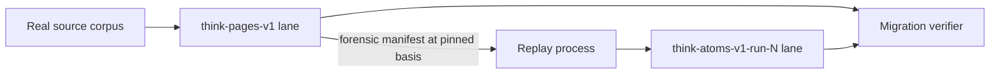
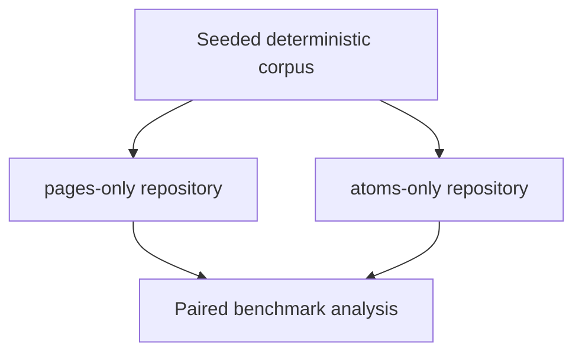

# Atomic Capture Occurrence Experiment

Status: **Gate 1 passed; Gate 2 blocked on the supported v19.1 read surface**

This note defines a disposable Think-only experiment against the exact
`@git-stunts/git-warp@19.1.0` package. It does not authorize a production data
model cutover, a retained-mind migration, or a change to git-warp, git-cas, or
Plumbing.

## Decision summary

The experiment tests this canonical-storage hypothesis:

> One accepted Think capture act is represented by one immutable
> `CaptureOccurrence` entity created through one Git WARP patch containing its
> complete initial semantic envelope. Git WARP allocates the representation
> subject and returns a distinct receipt-bound causal occurrence. Think retains
> its own capture and intent identities. Corrections, annotations, and
> interpretations are later occurrences or readings, never mutations of the
> admitted source envelope.

The experiment does **not** freeze "one thought equals one node." A semantic
thought may later be a governed reading over captures, corrections,
annotations, links, classifications, or redactions. This slice concerns only
the durable birth of a capture occurrence.

Three different proofs remain separate:

1. **Source feasibility:** atomic captures can be enumerated completely from a
   lane at a basis after every Think-owned manifest and projection is deleted.
2. **Migration/coexistence:** the current paged adapter and the atomic adapter
   coexist in one disposable repository, and real source captures replay
   additively without changing the source lane.
3. **Performance:** independently populated pages-only and atoms-only
   repositories run the same deterministic corpus under controlled loose and
   packed geometry.

One shared object database proves coexistence. It cannot prove isolated
performance.

## Why this experiment exists

The current paged adapter makes a derived aggregate part of canonical write
history. A small capture can therefore rewrite a large page or summary and
later reads can pay for the historical copies of that aggregate.

The atomic hypothesis inverts that authority:

```text
accepted capture act
    -> immutable capture occurrence source
    -> optional disposable chronology/page/search projections
    -> product readings over a declared source basis
```

The desired win is not merely "more nodes." It is the removal of a mutable hot
container from the authoritative capture path.

## Identity law

The experiment preserves four identities. None may substitute for another.

<!-- markdownlint-disable MD013 -->

| Identity | Owner | Meaning |
| --- | --- | --- |
| `CaptureIntentId` | Think ingress | One user or agent act across transport/process retry |
| `CaptureId` | Think domain | Durable identity of the admitted capture across storage migrations |
| `CaptureRepresentationSubject` | Git WARP adapter | Graph address of this retained representation |
| `CaptureOccurrenceRef` | Git WARP adapter | Opaque causal identity of this particular admission |

<!-- markdownlint-enable MD013 -->

The existing Think entry ID is the default candidate for `CaptureId`. Replay
must preserve it unless an executable reference audit proves that replacing it
is safe. It is not demoted to decorative migration provenance.

Required retry behavior:

<!-- markdownlint-disable MD013 -->

| Event | Intent ID | Capture ID | Representation subject | Occurrence |
| --- | --- | --- | --- | --- |
| Same act retried after ambiguity | same | same | same admitted result | same admitted result |
| Deliberate equal-text capture | different | different | different | different |
| Storage replay of legacy capture | migration-specific | preserved | new | new replay admission |
| Later correction | different | different | different | different |

<!-- markdownlint-enable MD013 -->

Generation one replay is deliberately non-resumable, so it does not claim the
first row for partially executed migration batches. A failed target lane is
retained as failed evidence and a new target lane is selected.

## Atomic representation

The proposed write uses `intent.entity.addAuto` behind a Think-owned port. It
places semantic capture data and replay provenance in separate versioned
properties while admitting both in the same initial patch.

```js
intent.entity.addAuto({
  namespace: 'think-capture',
  properties: {
    'think.capture.v1': {
      captureId: source.id,
      captureIntentId: `migration:${migrationBatchId}:${source.id}`,
      body: source.text,
      source: source.source,
      channel: source.channel,
      sourceWriterId: source.writerId,
      capturedAt: source.createdAt,
      sourceSortKey: source.sortKey,
      sessionId: source.sessionId,
    },
    'think.replay-provenance.v1': {
      migrationBatchId,
      sourceLane,
      sourceBasis,
      sourceDigest,
      sourcePage: source.page,
      sourceOrdinal: source.ordinal,
      replayOrdinal,
    },
  },
});
```

The final codec and runtime classes remain implementation work. This example
freezes the separation of meanings, not an unvalidated plain-object domain
model.

`think.capture.v1` is application truth about the captured source.
`think.replay-provenance.v1` is evidence about how this representation entered
the experimental lane. Native future captures do not pretend to be migrated.

## Port boundary

Product code must not import git-warp values or know WARP ref, checkpoint, CAS,
or materialization layouts. The experiment introduces a Think-shaped port
whose adapter owns all substrate translation.

```ts
interface CaptureOccurrenceStorePort {
  admit(capture: CaptureAdmission): Promise<CaptureAdmissionReceipt>;
  read(subject: CaptureRepresentationSubject, basis: CaptureBasis):
    Promise<CaptureOccurrenceRecord | null>;
  enumerate(basis: CaptureBasis): AsyncIterable<CaptureOccurrenceRecord>;
}
```

The receipt shape preserves the four identities:

```ts
interface CaptureAdmissionReceipt {
  captureId: CaptureId;
  captureIntentId: CaptureIntentId;
  representationSubject: CaptureRepresentationSubject;
  occurrence: CaptureOccurrenceRef;
  outcome: CaptureAdmissionOutcome;
  evidence: CaptureAdmissionEvidence;
}
```

These sketches name the boundary. Runtime-backed classes and boundary codecs
must enforce the final invariants in implementation.

## Canonical enumerability is Gate 2

An addressable atom is not yet a usable source of truth. From only:

```text
repository + lane + captured basis
```

Think must be able to discover every admitted `think.capture.v1` entity
exactly once after deleting:

- the replay manifest;
- chronology and page projections;
- search indexes;
- materialization caches that are declared disposable;
- process-local subject lists;
- prior observation results.

The enumeration result must be basis-bound and carry a completeness claim:

```ts
interface CaptureEnumerationCertificate {
  lane: CaptureLaneRef;
  basis: CaptureBasis;
  profile: 'think.capture.v1';
  completeness: 'complete';
  visibleNodeCount: number;
  captureCount: number;
  malformedCaptureSubjects: readonly CaptureRepresentationSubject[];
  duplicateCaptureIds: readonly CaptureId[];
  sourceDigest: string;
}
```

The implementation may stream records and calculate the certificate
incrementally. It must not materialize an unbounded capture collection merely
to satisfy the type above.

Known-subject reads do not satisfy this gate. Reading every subject named by
the manifest proves only that expected objects exist. Independent target
enumeration must also prove:

```text
missing = empty
extra = empty
duplicate capture IDs = empty
malformed capture entities = empty
expected count = actual count
```

### Current API pressure point

The exact 19.1.0 package publicly exposes `Runtime`, `Lane.write`, bounded
Observers, subject-addressed property/node/neighborhood readings, and
`captureCoordinate`. Internal projection code has node enumeration, but the
v19 application boundary does not presently advertise a basis-bound entity
enumeration Observer.

That observation is not permission to deep-import an internal class, decode
private storage formats in product code, or make the migration manifest
authoritative. Gate 2 must first try the supported public surface in an
executable disposable-repository witness.

If it cannot produce a complete enumeration certificate, this experiment
stops before migration and records one narrow capability gap:

> Think cannot rebuild a complete atomic capture reading from a lane and basis
> through the supported git-warp 19.1 application boundary.

Under the present scope, no lower repository is modified to close that gap.

## Repository topology

### Coexistence repository



This repository proves additive replay, independent lane configuration,
restart recovery, cache/lock separation, and source immutability. It is not the
primary performance comparison.

### Isolated benchmark repositories



Each arm is populated independently from the same canonical fixture bytes. The
arms do not share object databases, packs, ref state, maintenance, or prior
ingest artifacts.

## Chronology law

Replay creates new causal history. It does not recover old causal history.

<!-- markdownlint-disable MD013 -->

| Field | Meaning | May drive product chronology? |
| --- | --- | --- |
| `capturedAt` | Source-reported application time | Yes, under declared Think chronology law |
| `sourceSortKey` / `sourceOrdinal` | Stable order preserved from the paged source | Yes, as deterministic tie-break/provenance |
| `replayOrdinal` | Importer execution sequence | No; audit provenance only |
| Git WARP occurrence order | Causal/deterministic order of replay admissions | No; not recovered user chronology |

<!-- markdownlint-enable MD013 -->

Migration verification therefore requires:

```text
migration admission order is completely recorded
and
source semantic order is reproduced independently
```

It does not require target occurrence order to masquerade as historical
capture order.

## Falsification ladder

No later gate begins until every earlier gate is green.

### Gate 1: pinned primitive verification

Against exact `@git-stunts/git-warp@19.1.0` in a disposable Git repository:

1. admit one capture with `entity.addAuto`;
2. prove one writer advancement and one patch publication;
3. prove both versioned initial properties are in that patch;
4. prove the receipt contains an admitted outcome, allocated subject, and
   receipt-bound occurrence;
5. close the runtime and every process;
6. reopen and recover canonical equivalent values through the subject;
7. prove no implicit follow-up property mutation occurred.

The experiment uses an exact dependency pin because the entity capability is
an unofficial preview and its behavior must not drift under a caret range.

### Gate 2: manifest-free source enumeration

1. admit a deterministic corpus containing equal bodies under distinct
   capture IDs;
2. capture the target basis;
3. destroy every Think-owned manifest, projection, and cache;
4. close all runtimes and processes;
5. reopen using only repository, lane, and basis;
6. stream every capture entity exactly once;
7. recover and validate every semantic envelope;
8. produce a complete enumeration certificate;
9. compare its ordered semantic digest to the original corpus;
10. prove no missing, extra, duplicate, or malformed capture entity exists.

Failure blocks every source-truth, migration, and benchmark claim.

### Gate 3: real-corpus migration witness

The coexistence repository uses the actual current paged adapter.

1. preflight a disposable repository and unique empty target lane;
2. pin the source lane and source basis;
3. stream a forensic source manifest oldest-first without changing source;
4. preserve `CaptureId`, capture bytes, semantic metadata, source order, and
   provenance;
5. replay one complete entity admission per capture;
6. record target subject, target occurrence, receipt, and replay ordinal;
7. close and reopen;
8. enumerate the target independently of the manifest;
9. prove same capture IDs, same envelopes, same semantic order, no missing,
   no extras, no duplicates, and complete receipt mapping;
10. prove the source basis and source refs are unchanged.

Crash injection must show that a failed target is visibly uncertified and
cannot be resumed or mistaken for a valid target. A new run uses a new lane.

### Gate 4: isolated representation benchmark

Populate pages-only and atoms-only repositories independently from a seeded
synthetic corpus. The benchmark name is:

> Current Paged Think Adapter versus Atomic Capture Adapter

It does not claim to compare all possible page architectures.

Corpus matrix:

| Captures | Body classes | Purpose |
| ---: | --- | --- |
| 1,000 | small, medium, large | fast development and regression loop |
| 10,000 | small, medium, large | primary decision sample |
| 100,000 | small, medium, large | slow scale/geometry witness |

Each sample records a semantic fingerprint. Invalid fingerprints invalidate
the timing sample rather than entering latency statistics.

Measure:

- capture p50, p95, and maximum latency;
- patch, commit, ref-update, and Git child-process counts;
- loose object count and bytes;
- controlled full-repack object count and bytes;
- exact-read p50 and p95;
- provenance-cone object and byte size;
- full-enumeration latency and peak memory;
- process-cold reopen latency;
- long-lived-runtime latency and peak memory.

Run fresh-ingest loose geometry first, then standard maintenance, then a
controlled full repack. Every destructive maintenance command is restricted to
the disposable benchmark repositories.

Paired ABBA ordering reduces temporal drift within each isolated posture, but
does not turn a shared repository into an isolated benchmark.

### Gate 5: projection demolition

Build the first compatibility projection from atomic sources, preferably the
current page-shaped read model. Every projection certificate records:

```text
source lane
source basis
covered-through basis
builder version
projection profile
projection digest
completeness class
```

Then delete every projection ref and cache, restart, rebuild from the atomic
source basis, and require identical query fingerprints. A stale projection
must report staleness or incomplete coverage; it cannot return an apparently
complete negative answer.

### Gate 6: product behavior benchmark

Only after equivalent projections exist, compare capture, Browse, recent,
remember, inspect, and full export. Measure both fresh CLI processes and one
long-lived runtime. Node startup and repository opening remain separately
reported costs.

## Migration certificate

A successful generation-one run emits a machine-verifiable certificate bound
to immutable inputs and observed outputs:

```text
migration profile and version
exact package versions
source repository identity
source lane and pinned basis
target lane and pinned basis
source manifest digest
independent target enumeration digest
expected and actual capture counts
missing, extra, duplicate, and malformed sets
source semantic-order digest
target semantic-order digest
receipt-map digest
source-ref before/after digest
result: certified | failed
```

The certificate is evidence about a completed replay. It is not itself the
authority needed to rediscover the target captures.

## Promotion and falsification rules

The atomic design is rejected or returned to design if any of these are true:

- no supported basis-bound operation can enumerate all atomic captures without
  a Think manifest or projection;
- one accepted capture can become partially visible;
- restart verification finds a missing, extra, duplicate, malformed, or
  semantically unequal capture;
- the only usable chronology relies on replay admission order;
- projection demolition cannot rebuild identical complete readings;
- capture latency or write amplification does not materially improve over the
  current paged adapter at the primary corpus scale;
- object/commit amplification is superlinear or packed geometry is operationally
  unacceptable at the slow scale witness;
- full enumeration is superlinear, unbounded in memory, or cannot report a
  complete basis-bound result.

Storage density alone is not the architecture's only objective. Atoms may use
more packed bytes at some sizes. That cost must be measured and disclosed, not
assumed away.

## Explicit non-goals

- no production capture switch;
- no retained-mind migration;
- no automatic dual write;
- no long-lived source/target authority ambiguity;
- no Strands or settlement in the A/B topology;
- no occurrence relation/decoder API without a named Think claim requiring it;
- no semantic extraction on the capture or replay hot path;
- no mutation of admitted capture source properties;
- no lower-repository implementation under this experiment;
- no deep imports from git-warp internals;
- no raw WARP ref or CAS parsing in Think product code;
- no headline performance claim from the coexistence repository.

## Immediate execution order

1. Pin git-warp 19.1.0 exactly on the experimental branch.
2. Add a generated or narrowly hand-written experimental `entity.addAuto`
   adapter behind the Think port.
3. Make Gate 1 RED, then green.
4. Make Gate 2 an executable falsification witness.
5. Stop if Gate 2 cannot produce a completeness certificate through the
   supported boundary.
6. Only after Gate 2 passes, implement real-corpus replay.
7. Only after migration certifies, implement isolated benchmarks and
   projection demolition.

The default Think storage path remains the current paged adapter throughout
the experiment.

## Live gate result

On 2026-08-25, the first executable slice established:

- exact `@git-stunts/git-warp@19.1.0` is pinned on the experiment branch;
- one `entity.addAuto` admission creates one writer commit containing both
  initial profile values;
- the Think receipt preserves `CaptureId`, `CaptureIntentId`, the allocated
  representation subject, the opaque occurrence, outcome, and evidence basis;
- exact property recovery succeeds after every runtime closes and a fresh
  runtime opens;
- equal bodies under different capture and intent IDs produce distinct
  subjects and occurrences;
- the supported `Lane`, captured coordinate, coordinate optic, coordinate
  source, and advanced package exports expose no basis-bound node/entity
  enumerator;
- `enumerate()` therefore fails explicitly with
  `CAPTURE_ENUMERATION_UNAVAILABLE` and includes the real basis that could not
  be enumerated.

The focused witness is
`test/ports/atomic-capture-occurrence.test.js`. Gates 3 through 6 remain
prohibited. The result does not authorize a deep import, raw ref decoder,
authoritative manifest, or lower-layer change.
