# ADR-THINK-001 delivery plan and diagram atlas

> **Planning projection, not canonical state.** The accepted decision lives in
> [`ADR-THINK-001`](./ADR-THINK-001-thoughts-are-sources-claims-are-readings.md).
> The machine-checked implementation graph lives in
> [`ADR-THINK-001-work-items.json`](./ADR-THINK-001-work-items.json). This
> document explains their delivery shape. Existing production behavior remains
> authoritative until the verified P8 production cutover.

## 1. Executive delivery contract

The implementation program contains exactly:

- **9 milestones**: P0 through P8, matching the ADR implementation phases;
- **18 features**: two coherent product or platform outcomes per milestone;
- **60 leaf issues**: each with at least two complete user stories, explicit
  deliverables, acceptance criteria, contract/integration/failure/resource
  tests, non-goals, dependencies, ADR traceability, and a build-time resource
  list whose every entry declares an exclusivity mode;
- **5 implementation gates**, **17 constitutional invariants**, and **35 ADR
  acceptance criteria**, all covered by the issue graph;
- one acyclic dependency graph that is checked before the catalog or GitHub
  payloads can be generated.

The hierarchy is strict:

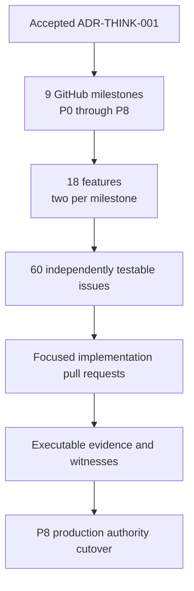

Milestones organize outcome and sequence. Features name coherent capabilities.
Issues are the smallest independently reviewable proof slices. Pull requests
may implement one issue or a tightly coupled subset, but they must not erase
issue-level acceptance boundaries.

## 2. Current truth versus target truth

This plan does not turn architectural intent into a present-tense claim.
The current state was refreshed on 2026-08-21.

| Concern | Confirmed current state | Required target state |
| --- | --- | --- |
| Think storage shape | Legacy page/container-shaped read models still exist in production minds. | One immutable `ThoughtCapture` occurrence becomes one addressable node atom; collections are derived indexes or immutable membership edges. |
| Patch-chain metadata reads | git-warp [PR #847](https://github.com/git-stunts/git-warp/pull/847) batches one writer chain into one `git log` stream and reports a Think cold-read improvement from 82.9 s to 8.9 s. The PR is open, `CHANGES_REQUESTED`, and `BLOCKED`; green checks do not make it merged. | No per-commit metadata process; process count grows with bounded sessions, not history entries. |
| Footprint slicing | git-warp has targeted reducers and bounded resident-state paths, but a targeted node-property replay still streams the selected frontier and filters patches. Recorded syntactic footprints may also under-approximate undeclared semantic reads. | A normal optic reads only its proven causal support slice. Exactness travels with the reading; an under-approximate cone cannot support an exhaustive claim. |
| Streaming reads | Async patch streams and bounded materialization components exist; [#824](https://github.com/git-stunts/git-warp/issues/824), [#817](https://github.com/git-stunts/git-warp/issues/817), and [#565](https://github.com/git-stunts/git-warp/issues/565) remain open for the complete indexed, recursive, end-to-end streaming contract. | Every history-sized source, transform, fan-out, reduction, and sink applies backpressure and has explicit item, byte, memory, concurrency, and process bounds. |
| Git object reads | The architecture calls for one persistent, bounded `git cat-file --batch-command --buffer` session; the remaining Think profile still includes per-payload object reads. | Object reads use persistent bounded sessions and drain or cancel protocol slots correctly. |
| Git object writes | Isolated one-shot writes remain lawful, but migration-scale process-per-object publication is not. git-cas [#110](https://github.com/git-stunts/git-cas/issues/110) tracks bounded batches of small asset writes. | Bulk paths use storage-neutral, backpressured sessions; process count is O(windows), not O(thoughts), blobs, claims, or pages. |
| Capture semantics | Current capture may materialize or update coarse storage structures. | Capture success ends after body preparation, one logical ThoughtCapture admission, and optional durable follow-through enqueueing. Extraction is excluded. |
| Production authority | Legacy storage remains the production source of truth. | New records become authoritative only after P4 rehearsal, P5–P8 proof work, closure of AC1–AC35, the final `CutoverWitness`, and the one atomic authority switch in P8. |

### The direct answer about read-side optics

The architectural answer is **yes, with proof**: an optic must materialize only
the minimum causal structures required by its declared aperture. The confirmed
current implementation answer is **not universally yet**. Bounded resident
memory does not prove a bounded source scan, and a syntactic footprint does not
prove semantic completeness when application reads were not declared.

The lawful result type therefore includes both aperture and exactness:

```text
ReadingEvidence {
    result
    basis
    aperture
    derivation
    exactness: exact | under_approximate
}
```

An `under_approximate` slice remains useful for candidate retrieval. It cannot
prove global absence, exhaustiveness, proposition equivalence, or authority.

## 3. Performance thesis

The old failure mode tied the cost of a five-item question or one-item capture
to the complete history. The replacement makes cost proportional to the work
actually requested and the bounded physical sessions used to perform it.

```text
read cost  = O(index aperture + proven causal support + bounded stale delta)
write cost = O(capture bytes + one logical atom) within O(admission windows)
```

The equations are incomplete without process and memory laws:

```text
Git processes = O(stream sessions + admission windows), never O(records)
resident memory = O(configured window + current bounded barrier), never O(history)
```

### Before and after

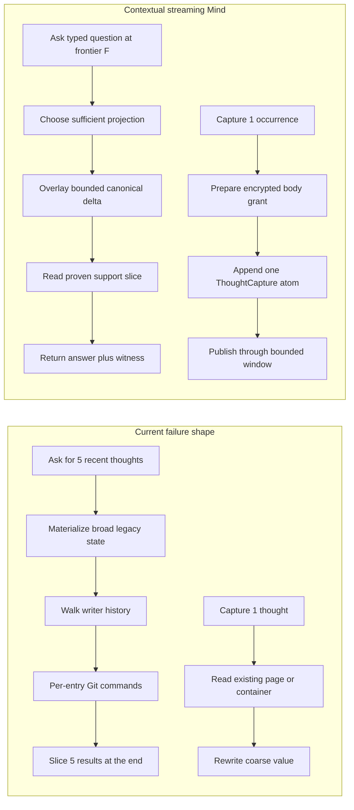

### Performance acceptance ratchets

Absolute timing gates are calibrated on named hardware and a production-shaped
fixture; CI uses relative regression gates until its runner class is stable.

| Path | Release ratchet |
| --- | --- |
| Recent read | `--recent --count=5` is sub-second at P95 on the named codex-sized local fixture after warm projection publication; cold canonical fallback has an explicit bounded budget. |
| Capture | Capture success is below one second at P95 on the named local fixture and remains flat as history grows; semantic follow-through is outside the timed contract. |
| Read process count | Git child-process count is proportional to opened read sessions and bounded windows, with no per-patch, per-node, or per-blob process path. |
| Write process count | Migration and backfill process count grows with `AdmissionWindow` and bulk-object sessions, not thoughts, claims, bodies, or projection shards. |
| Memory | Peak process-tree RSS stays approximately flat as historical item count grows while item and byte windows stay fixed. |
| Backpressure | Producer pull count never exceeds downstream capacity plus the declared in-flight window. |
| Cancellation | Cancelling a query, build, migration, or capture follow-through closes producers and child processes and leaves no visible partial semantic artifact. |
| Negative answers | An exhaustive or negative query is never accelerated by a candidate-only projection, regardless of latency pressure. |

## 4. Architecture at four planes

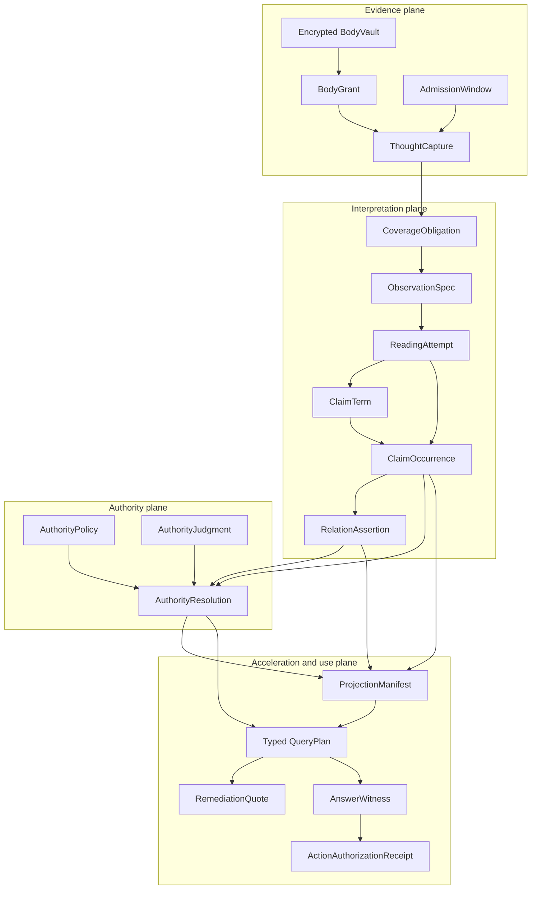

No plane may impersonate another. A capture is not a claim. A reading is not an
authority judgment. A projection is not canonical evidence. An answer is not
authorization to act.

## 5. Repository ownership and dependency direction

The storage shape is a **Think-side domain decision**. git-warp supplies a
generic causal graph and receipts. git-cas owns efficient Git object sessions.
Contextual Claims supplies the independent language-reading IR. Edict or
Boundary supplies independent authorization and effect execution.

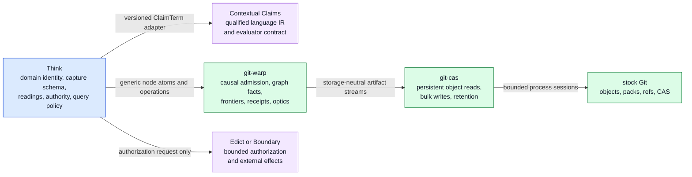

Repository boundaries are one-way contracts:

| Repository | Owns | Must not own |
| --- | --- | --- |
| Think | `ThoughtCapture`, exact observation identity, reading attempts, authority policy, projections, typed queries, migration semantics, erasure blast radius | Git process mechanics, a universal semantic ontology, or generic action execution |
| Contextual Claims | Qualified claim-bearing language structure and evaluator specification | Think occurrence identity, authority policy, storage, migration, or user-facing query law |
| git-warp | Generic causal graph facts, frontiers, receipts, reading apertures, exactness evidence, and WARP publication | Think nouns, body-vault policy, projection authority, or Git CAS optimization APIs |
| git-cas | Persistent object readers, bounded multi-read, bulk object writers, maintenance leases, retention receipts | Think or WARP domain semantics |
| Edict or Boundary | Bounded authorization and execution of registered effects | Inferring authority from prose, claims, projections, or answer confidence |

## 6. Canonical entity relationships

The canonical history is records and references. The ER diagram is a rendering,
not the Mind itself.

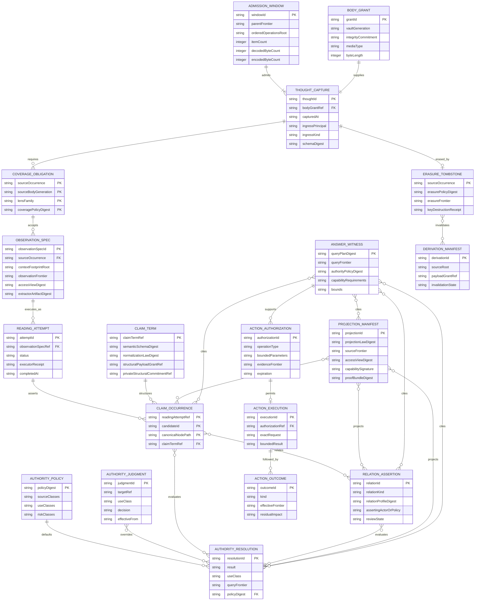

## 7. Service and port class model

```mermaid
classDiagram
    class CaptureService {
        +capture(command) CaptureReceipt
    }
    class ReadingService {
        +observe(spec) ReadingAttempt
    }
    class CoverageScheduler {
        +streamObligations(policy, frontier) AsyncIterable
    }
    class QueryPlanner {
        +plan(requirement) QueryPlan
        +execute(plan) QueryResult
    }
    class ProjectionBuilder {
        +build(law, frontier, bounds) ProjectionManifest
    }
    class MigrationService {
        +streamLegacy(frontier) AsyncIterable
        +publishWindow(window) WindowReceipt
    }
    class ErasureService {
        +erase(occurrence, policy) ErasureTombstone
    }
    class ActionBridge {
        +authorize(request) ActionAuthorizationReceipt
        +execute(receipt) ActionExecutionReceipt
    }

    class BodyVaultPort {
        <<interface>>
        +prepare(bytes, policy) BodyGrant
        +open(grant, view) ByteStream
        +destroy(grant, policy) KeyDestructionReceipt
    }
    class CausalStorePort {
        <<interface>>
        +observe(aperture, frontier) ReadingStream
        +publish(window) WindowReceipt
    }
    class ContextualClaimsPort {
        <<interface>>
        +extract(observation) CandidateStream
        +validate(envelope) ValidationResult
    }
    class ProjectionPort {
        <<interface>>
        +candidates(requirement) ManifestStream
        +publish(manifest) PublicationReceipt
    }
    class AuthorityPort {
        <<interface>>
        +resolve(target, use, frontier) AuthorityResolution
    }
    class ActionBoundaryPort {
        <<interface>>
        +execute(receipt) ActionExecutionReceipt
    }

    CaptureService --> BodyVaultPort
    CaptureService --> CausalStorePort
    ReadingService --> BodyVaultPort
    ReadingService --> CausalStorePort
    ReadingService --> ContextualClaimsPort
    CoverageScheduler --> ReadingService
    QueryPlanner --> ProjectionPort
    QueryPlanner --> CausalStorePort
    QueryPlanner --> AuthorityPort
    ProjectionBuilder --> CausalStorePort
    ProjectionBuilder --> ProjectionPort
    MigrationService --> BodyVaultPort
    MigrationService --> CausalStorePort
    ErasureService --> BodyVaultPort
    ErasureService --> ProjectionPort
    ActionBridge --> AuthorityPort
    ActionBridge --> ActionBoundaryPort
```

The interfaces are product boundaries. Concrete module names may change during
implementation; dependency direction may not.

## 8. One thought equals one node atom

One thought equals one **logical** node atom and one witnessed birth. It does
not equal one Git process, one Git commit, one pack, or one physical publication
cohort.

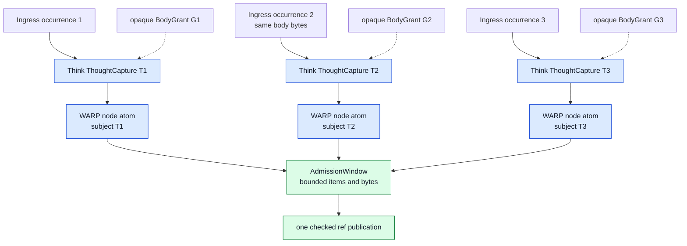

The invariants are exact:

1. T1 and T2 remain different occurrences even when their decrypted bytes are
   equal.
2. The vault may privately deduplicate storage, but public canonical records do
   not reveal equality and each occurrence can be erased independently.
3. Each node atom has one non-empty initial payload, an empty declared graph
   read set, and exactly one declared subject write.
4. Physical batching preserves separate `thoughtId`, subject, operation path,
   body grant, birth witness, and erasure lifecycle.
5. Membership, order, topics, tags, counts, pages, and current-state views do
   not become mutable arrays or coarse snapshots on a thought node.

## 9. Capture and write-side sequences

### 9.1 New capture

Capture returns after evidence is durable. It never waits for semantic
interpretation.

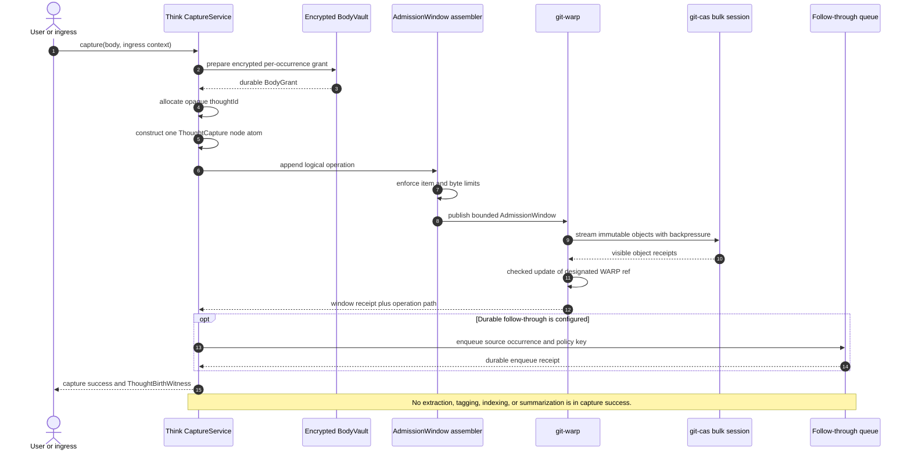

### 9.2 Bounded physical publication

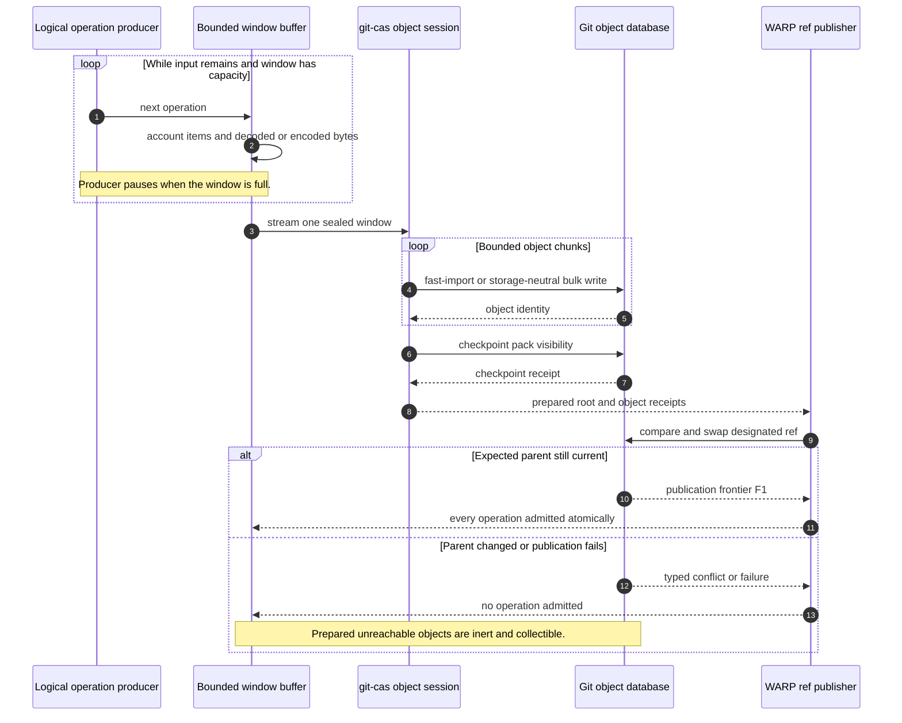

### 9.3 Write-side resource boundary

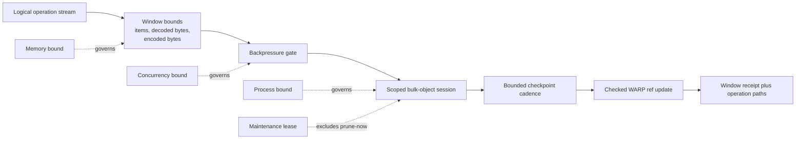

The single-writer default is one git-cas bulk writer per repository. Ordinary
readers and non-aggressive maintenance may coexist only where the upstream
contract proves it. `git gc --prune=now` and an active object-write session
share an exclusive maintenance resource.

## 10. Read-side sequences

### 10.1 Typed query with footprint-sliced canonical fallback

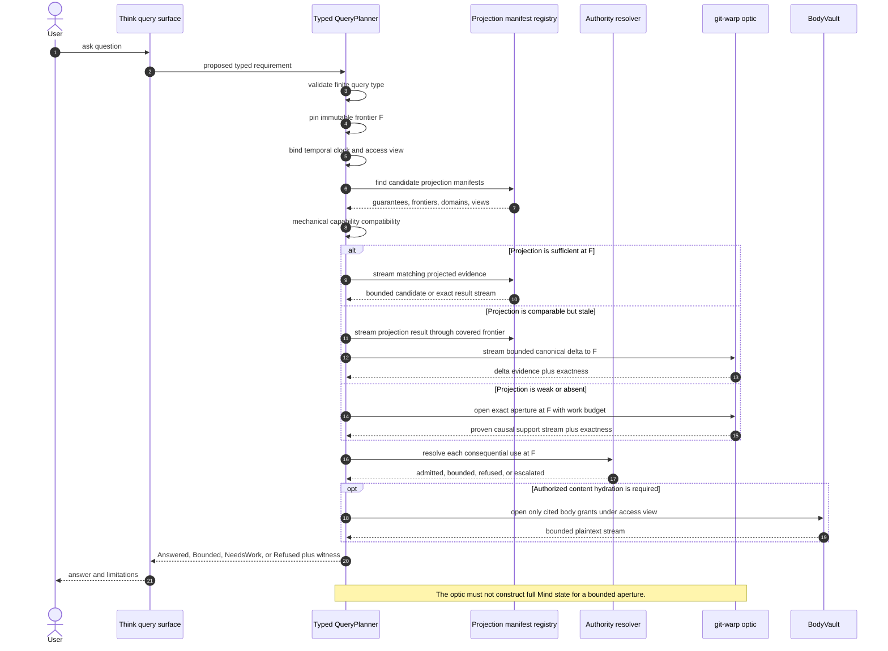

### 10.2 Optic aperture and exactness

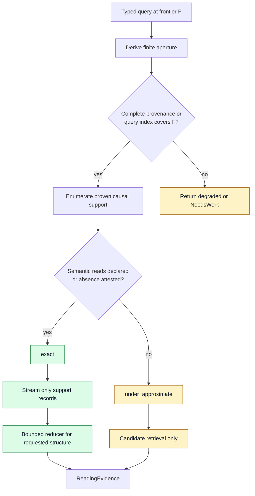

Enumeration and provenance remain distinct. `edgesFrom(bucket)` answers which
entities belong to a group. `patchesFor(entity)` answers which events produced
that entity. A container ID must never smuggle all descendants into a function
named `slice`.

### 10.3 Exact observation and immutable attempts

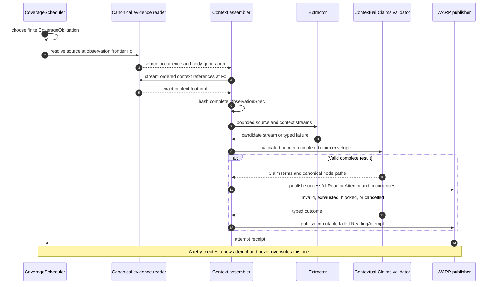

## 11. Query-planning flow

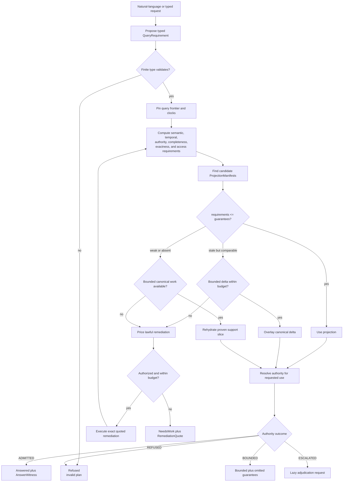

The planner may use an LLM to propose a finite query type. The validator owns
the type. The LLM cannot waive a distinction, completeness requirement,
frontier, access view, or authority use class.

## 12. Authority resolution flow

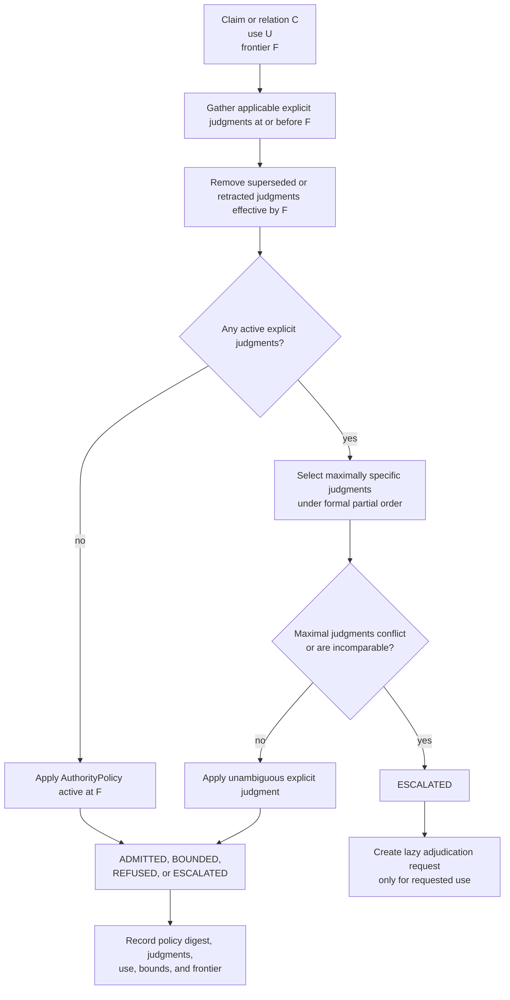

Confidence, model agreement, repetition, and recency may inform a versioned
policy. None independently grants authority.

## 13. Coverage scheduling flow

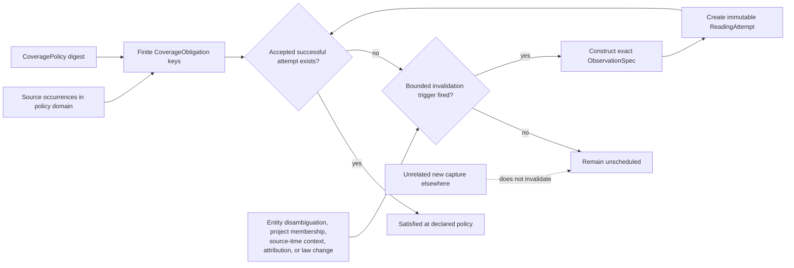

The scheduler enumerates finite obligations, never the infinite space of all
possible context footprints. Actual execution identity stays exact.

## 14. Migration and cutover sequences

### 14.1 Raw occurrence migration

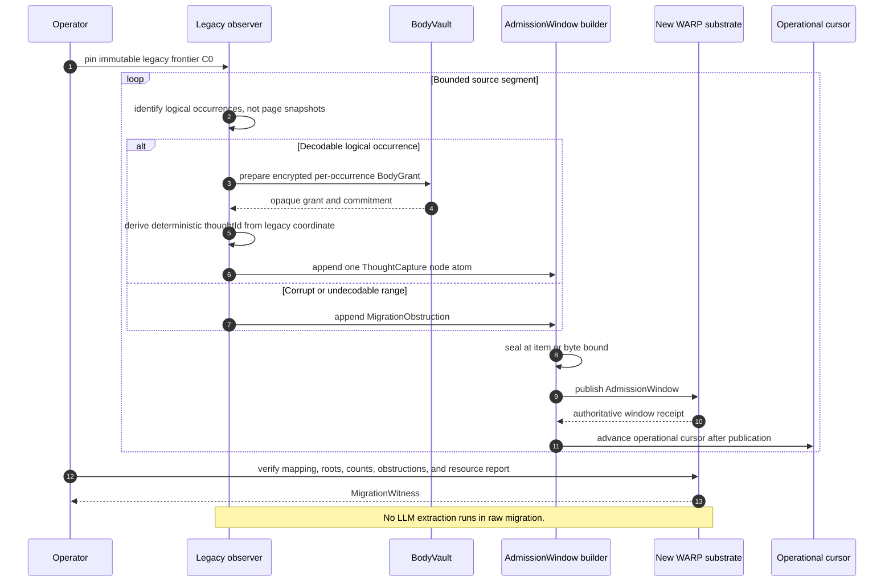

### 14.2 Final verified authority cutover

P4 rehearses this entire sequence against non-authoritative refs. It executes
against the production authority router only in P8, after AC1–AC35 pass.

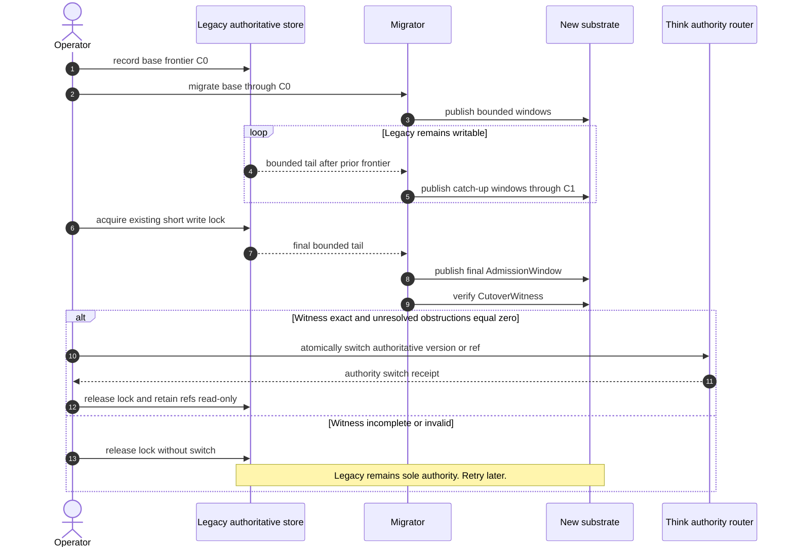

Long-lived dual writing is forbidden. A migration failure at 98 percent pauses
the migration; it does not split authority.

### 14.3 Erasure sequence

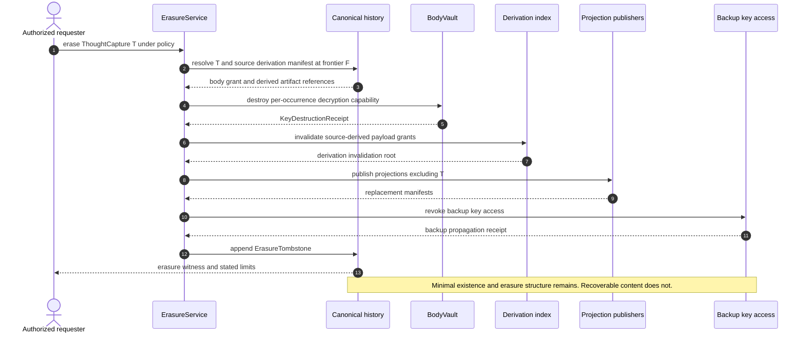

### 14.4 Action bridge sequence

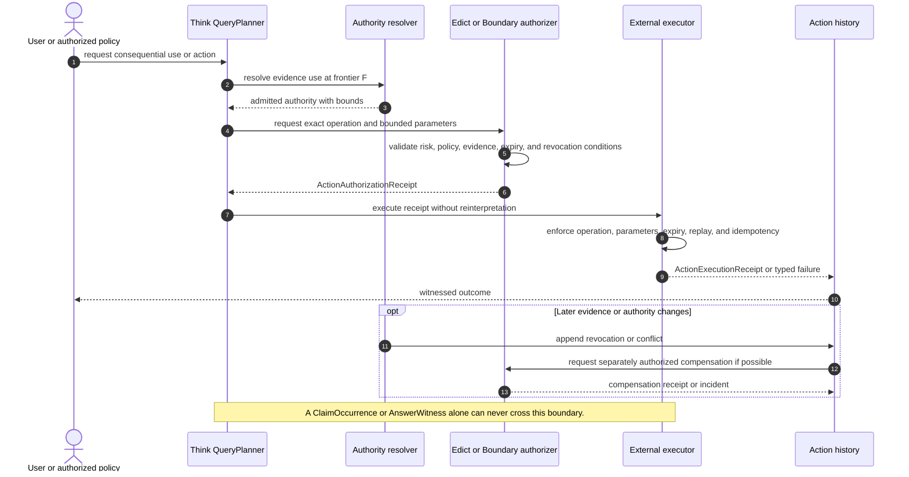

## 15. State-machine atlas

### 15.1 Body grant and capture

```mermaid
stateDiagram-v2
    [*] --> Preparing: encrypt and durably prepare
    Preparing --> PreparationFailed: vault failure
    Preparing --> Prepared: BodyGrant readable
    Prepared --> Admitting: submit ThoughtCapture atom
    Admitting --> Orphaned: WARP admission fails
    Admitting --> Admitted: checked ref update linearizes
    Admitted --> Erasing: authorized erasure
    Erasing --> Erased: key destruction and invalidation witnessed
    PreparationFailed --> [*]
    Orphaned --> Collectible
    Collectible --> [*]
    Erased --> [*]

    note right of Admitted
      Semantic extraction is independent.
      Capture success is already complete.
    end note
```

### 15.2 AdmissionWindow publication

```mermaid
stateDiagram-v2
    [*] --> Open
    Open --> Open: append operation within bounds
    Open --> Sealed: item, byte, time, or explicit flush bound
    Sealed --> WritingObjects
    WritingObjects --> Prepared: object checkpoint visible
    WritingObjects --> Aborted: stream, protocol, or checkpoint failure
    Prepared --> Publishing: compare and swap designated ref
    Publishing --> Admitted: expected parent matched
    Publishing --> Conflict: expected parent changed
    Publishing --> Aborted: publication failure
    Conflict --> [*]
    Aborted --> [*]
    Admitted --> [*]

    note right of Prepared
      Prepared objects remain inert until ref publication.
    end note
```

### 15.3 ReadingAttempt lifecycle

```mermaid
stateDiagram-v2
    [*] --> Scheduled
    Scheduled --> Running: executor starts
    Scheduled --> Cancelled: cancelled before start
    Running --> Success: completed envelope validates
    Running --> TypedFailure: extractor or dependency failure
    Running --> ResourceExhausted: declared budget reached
    Running --> InvalidOutput: envelope or schema invalid
    Running --> PolicyBlocked: execution not permitted
    Running --> Cancelled: cancellation drains
    Success --> [*]
    TypedFailure --> [*]
    ResourceExhausted --> [*]
    InvalidOutput --> [*]
    PolicyBlocked --> [*]
    Cancelled --> [*]

    note right of Success
      Every terminal state is immutable.
      Retry means a new attemptId.
    end note
```

### 15.4 Projection build and publication

```mermaid
stateDiagram-v2
    [*] --> Planned
    Planned --> Building: law, frontier, view, and bounds fixed
    Building --> Validating: all bounded shards complete
    Building --> Failed: builder or source failure
    Validating --> Rejected: fixture, mutant, root, or manifest failure
    Validating --> Ready: proof bundle valid
    Ready --> Published: manifest atomically linearizes
    Ready --> Failed: publication conflict or failure
    Published --> Superseded: newer valid manifest publishes
    Failed --> [*]
    Rejected --> [*]
    Superseded --> [*]
    Published --> [*]

    note right of Building
      Partial shards have no query authority.
      The previous manifest remains current.
    end note
```

### 15.5 Query execution result

```mermaid
stateDiagram-v2
    [*] --> Planned
    Planned --> Evaluating
    Evaluating --> Answered: all requirements satisfied
    Evaluating --> Bounded: useful result with named omissions
    Evaluating --> NeedsWork: lawful cure exists
    Evaluating --> Refused: law violated and no cure available
    NeedsWork --> Remediating: quote accepted within budget
    NeedsWork --> [*]: quote declined or over budget
    Remediating --> Evaluating: exact quoted work completes
    Remediating --> NeedsWork: typed bounded failure
    Answered --> [*]
    Bounded --> [*]
    Refused --> [*]
```

### 15.6 Migration and authority cutover

```mermaid
stateDiagram-v2
    [*] --> LegacyAuthoritative
    LegacyAuthoritative --> RehearsalMigrating: P4 pins C0
    RehearsalMigrating --> RehearsalMigrating: publish bounded candidate window
    RehearsalMigrating --> Paused: failure or operator pause
    Paused --> RehearsalMigrating: resume from history
    RehearsalMigrating --> CandidateVerified: rehearsal witness through C0
    CandidateVerified --> SemanticProof: P5-P8 shadow and action proofs
    SemanticProof --> CandidateVerified: any AC1-AC35 failure
    SemanticProof --> TailCatchup: all AC1-AC35 pass
    TailCatchup --> TailCatchup: bounded production tail windows
    TailCatchup --> FinalLock: lag within final bound
    FinalLock --> Verifying: publish final window
    FinalLock --> TailCatchup: lock or final-tail failure
    Verifying --> LegacyAuthoritative: witness invalid or incomplete
    Verifying --> NewAuthoritative: atomic authority switch
    NewAuthoritative --> RecoveryReady: legacy refs retained read-only
    RecoveryReady --> [*]

    note right of Paused
      Users continue writing only to legacy storage through P8 proof.
      There is no split brain.
    end note
```

### 15.7 External action and aftermath

```mermaid
stateDiagram-v2
    [*] --> Proposed
    Proposed --> Denied: authority or risk policy refuses
    Proposed --> Authorized: bounded receipt minted
    Authorized --> Expired: expiration reached
    Authorized --> Revoked: revocation effective before execution
    Authorized --> Executing: adapter validates exact request
    Executing --> Failed: typed execution failure
    Executing --> EffectRecorded: external effect witnessed
    EffectRecorded --> Settled: no later conflict
    EffectRecorded --> RevokedAfterEffect: later evidence or authority changes
    RevokedAfterEffect --> Compensating: reversible and separately authorized
    RevokedAfterEffect --> Incident: irreversible or not compensatable
    Compensating --> Compensated: bounded compensation succeeds
    Compensating --> Incident: compensation fails or is partial
    Denied --> [*]
    Expired --> [*]
    Revoked --> [*]
    Failed --> [*]
    Settled --> [*]
    Compensated --> [*]
    Incident --> [*]
```

## 16. Git and causal-publication graphs

The following `gitGraph` diagrams are conceptual causal-object diagrams. They
do not prescribe developer branches, GitHub merge commits, or a long-lived
dual-write topology.

### 16.1 AdmissionWindow linearization

```mermaid
gitGraph LR:
    commit id: "frontier F0"
    branch prepared_window
    checkout prepared_window
    commit id: "objects written but inert"
    commit id: "pack checkpoint visible"
    checkout main
    merge prepared_window id: "checked ref update F1"
    commit id: "window receipt"
```

Before the checked ref update, the prepared objects are unreachable from the
authoritative WARP ref. After it, every logical operation in the window is
admitted at one frontier, each under its own operation path.

### 16.2 Migration and cutover frontiers

```mermaid
gitGraph LR:
    commit id: "legacy C0"
    branch new_substrate
    checkout new_substrate
    commit id: "base window 1"
    commit id: "P4 rehearsal witness"
    checkout main
    commit id: "legacy C1"
    commit id: "AC1-AC35 proof complete"
    checkout new_substrate
    commit id: "tail through C1"
    checkout main
    commit id: "final locked tail"
    checkout new_substrate
    commit id: "final window and witness"
    checkout main
    merge new_substrate id: "authority switch receipt"
```

The final merge-shaped node depicts an authority-ref switch after witness
verification. It does not authorize Git branch merging as the cutover
mechanism.

## 17. Temporal readings and the Mind worldline

### 17.1 Source-time versus current interpretation

```mermaid
timeline
    title One source, multiple lawful readings
    Frontier F0 : ThoughtCapture admitted : source bytes and ingress become evidence
    Frontier F1 : source-time ObservationSpec : ReadingAttempt A asserts ClaimOccurrences
    Frontier F2 : new context or entity binding admitted : A remains unchanged
    Frontier F3 : current-reinterpretation ObservationSpec : ReadingAttempt B may disagree
    Frontier F4 : authority judgment admitted : future uses may change
    Historical query at F1 : uses A and policy available at F1
    Current query at F4 : may use B and policy available at F4
```

### 17.2 The complete semantic stack

```mermaid
mindmap
  root((Contextual streaming Mind))
    Evidence
      Encrypted BodyGrant
      ThoughtCapture occurrence
      WARP birth witness
      Erasure tombstone
    Interpretation
      Coverage obligation
      Exact ObservationSpec
      Immutable ReadingAttempt
      ClaimTerm
      ClaimOccurrence
      RelationAssertion
    Authority
      Versioned default policy
      Explicit judgment
      Historical resolution
      Lazy adjudication
    Acceleration
      Projection law
      Killing fixture
      Capability signature
      Atomic manifest
    Query
      Typed requirement
      Pinned frontier
      Bounded remediation
      AnswerWitness
    Action
      Independent authorization
      Exact bounded execution
      Revocation
      Compensation
      Incident
```

## 18. Implementation-gate requirements

```mermaid
requirementDiagram
    requirement bulk_admission {
        id: G1
        text: Bounded migration publication uses bounded Git process sessions.
        risk: high
        verifymethod: test
    }
    requirement observation_model {
        id: G2
        text: Finite obligations and exact observation identities remain distinct.
        risk: high
        verifymethod: test
    }
    requirement fixture_capabilities {
        id: G3
        text: Every projection capability is killed by a governing mutant.
        risk: high
        verifymethod: test
    }
    requirement authority_policy {
        id: G4
        text: Versioned default authority resolves common uses before escalation.
        risk: high
        verifymethod: test
    }
    requirement erasure_storage {
        id: G5
        text: Body storage and every derivative support per occurrence erasure.
        risk: high
        verifymethod: test
    }

    element AdmissionWindow {
        type: service
        docRef: CT105
    }
    element CoveragePolicy {
        type: policy
        docRef: CT201
    }
    element ProjectionProofBundle {
        type: test_suite
        docRef: CT602
    }
    element AuthorityResolver {
        type: service
        docRef: CT701
    }
    element EncryptedBodyVault {
        type: service
        docRef: CT102
    }

    AdmissionWindow - satisfies -> bulk_admission
    CoveragePolicy - satisfies -> observation_model
    ProjectionProofBundle - satisfies -> fixture_capabilities
    AuthorityResolver - satisfies -> authority_policy
    EncryptedBodyVault - satisfies -> erasure_storage
```

Passing a gate means its independent executable evidence exists. Naming a type
or merging scaffolding does not pass a gate.

## 19. Milestone dependency graph

```mermaid
flowchart LR
    P0["P0<br/>Constitutional foundation"] --> P1["P1<br/>Evidence substrate"]
    P1 --> P2["P2<br/>Minimal semantic vertical"]
    P2 --> P3["P3<br/>Migration dry run"]
    P3 --> P4["P4<br/>Verified cutover rehearsal"]
    P4 --> P5["P5<br/>Claims backfill"]
    P5 --> P6["P6<br/>Projection shadow mode"]
    P6 --> P7["P7<br/>Authority and refusal readiness"]
    P7 --> P8["P8<br/>Action bridge and production cutover"]

    G1["Gate 1<br/>bulk admission"] -. blocks .-> P3
    G2["Gate 2<br/>observation model"] -. blocks .-> P2
    G3["Gate 3<br/>fixture capabilities"] -. blocks .-> P6
    G4["Gate 4<br/>authority policy"] -. blocks .-> P2
    G5["Gate 5<br/>erasure storage"] -. blocks .-> P1

    P0 --> G1
    P0 --> G2
    P0 --> G3
    P0 --> G4
    P0 --> G5
```

P2 may be prototyped on isolated fixtures before migration, but production
migration cannot begin until all five P0 gates are independently verified.
P4 proves the cutover mechanics without changing authority. P8 performs the
only production authority switch, after the complete acceptance graph passes.

## 20. Dependency-only Gantt

This Gantt communicates order and possible overlap, **not calendar promises or
estimates**. The anchor date is illustrative, and each duration is a planning
unit to be replaced only after issue-level estimation and upstream evidence.

```mermaid
gantt
    title ADR-THINK-001 dependency sequence - illustrative planning units only
    dateFormat YYYY-MM-DD
    axisFormat %b %d

    section Foundations
    P0 Constitutional foundation             :crit, p0, 2026-08-24, 20d

    section Evidence and semantics
    P1 Evidence substrate                    :crit, p1, after p0, 30d
    P2 Minimal semantic vertical slice       :crit, p2, after p1, 30d

    section Migration
    P3 Migration dry run                     :crit, p3, after p2, 25d
    P4 Verified cutover rehearsal            :crit, p4, after p3, 15d

    section Interpretation and reads
    P5 Contextual Claims backfill             :p5, after p4, 30d
    P6 Projection shadow mode                :p6, after p5, 25d
    P7 Authority and refusal readiness       :crit, p7, after p6, 30d

    section Action
    P8 Action bridge and production cutover  :crit, p8, after p7, 25d
```

## 21. Milestones, features, and issue allocation

| Milestone | Feature | Leaf issues | Exit signal |
| --- | --- | --- | --- |
| P0 | F0.1 Constitutional contracts and ownership | CT-001–CT-002, CT-005–CT-006 | Vocabulary, record contracts, fixtures, and capability minting law are frozen. |
| P0 | F0.2 Gating proofs and bounded-execution law | CT-003–CT-004, CT-007–CT-008 | Observation, authority, erasure, admission, and streaming gate contracts are executable. |
| P1 | F1.1 Encrypted vault and occurrence identity | CT-101–CT-104 | Equal bytes produce distinct erasable ThoughtCaptures, each as one node atom. |
| P1 | F1.2 Windowed evidence admission | CT-105–CT-108 | Capture and bounded publication satisfy atomicity, recovery, memory, and process ratchets. |
| P2 | F2.1 Observation, attempts, and qualified claims | CT-201–CT-206 | Exact observations produce immutable attempts, claims, and witnessed relations. |
| P2 | F2.2 Authority-aware query vertical | CT-207–CT-210 | One typed query proves projection insufficiency, bounded rehydration, authority, and an AnswerWitness. |
| P3 | F3.1 Legacy occurrence observation and import | CT-301–CT-302 | Legacy logical occurrences stream into deterministic encrypted ThoughtCaptures without snapshot duplication. |
| P3 | F3.2 Resumable migration proof | CT-303–CT-307 | Crashes, obstructions, mappings, equivalence bounds, and real-Mind rehearsal are witnessed on disposable refs. |
| P4 | F4.1 Tail convergence rehearsal | CT-401–CT-402 | Base and bounded tails converge under a rehearsed short lock without changing production authority. |
| P4 | F4.2 Candidate cutover proof and recovery | CT-403–CT-405 | Candidate CutoverWitnesses, recovery refs, erasure posture, and fleet rehearsals prove the eventual switch path without split brain. |
| P5 | F5.1 Bounded semantic scheduling and extraction | CT-501–CT-502 | Finite obligations schedule bounded attempts without coupling extraction to capture or migration validity. |
| P5 | F5.2 Longitudinal relations and reinterpretation | CT-503–CT-505 | Relations, bounded backfill, source-time readings, and current reinterpretations coexist. |
| P6 | F6.1 Confessing projection builders | CT-601–CT-602 | Legacy enrichment is demoted and no capability publishes without killing fixtures. |
| P6 | F6.2 Shadow planning and canonical escalation | CT-603–CT-606 | Real query shadows quantify insufficiency, repair cost, answer changes, and enforcement readiness. |
| P7 | F7.1 Historical authority and adjudication | CT-701–CT-703 | Historical policy, explicit judgment precedence, conflict, and finite-attention review are operational. |
| P7 | F7.2 Sufficiency enforcement readiness and answer witnesses | CT-704–CT-706 | Query classes prove capability-law enforcement with erasable answers, remediation, rollback, and historical replay before activation. |
| P8 | F8.1 Bounded action authorization | CT-801–CT-802 | Only exact signed receipts can cross the Edict or Boundary adapter. |
| P8 | F8.2 Revocation, compensation, audit, and cutover | CT-803–CT-805 | Later evidence produces truthful aftermath; the complete AC1–AC35 suite gates the one production authority switch. |

The complete leaf specifications are generated into
[`ADR-THINK-001-issue-catalog.md`](./ADR-THINK-001-issue-catalog.md). The catalog,
not this summary table, is the review surface for issue acceptance.

## 22. Build-time resource and exclusivity model

Every leaf issue names every shared build-time resource it needs and chooses
exactly one mode:

| Mode | Law |
| --- | --- |
| `exclusive` | Only one active slice may mutate or lease the named resource. |
| `partitioned` | Concurrent writes are lawful only in disjoint partitions named by each slice. |
| `shared` | Concurrent read-only use is lawful; the slice does not mutate the resource. |

### 22.1 Scheduler model

```mermaid
flowchart TD
    READY["Dependency-ready issue"] --> DECL["Read declared resource list"]
    DECL --> EX{"Any exclusive resource busy?"}
    EX -->|"yes"| WAIT["Wait without claiming issue complete"]
    EX -->|"no"| PART{"Partition overlaps an active writer?"}
    PART -->|"yes"| WAIT
    PART -->|"no"| LEASE["Atomically lease exclusive and partitioned resources"]
    LEASE --> BUILD["Build and test slice"]
    BUILD --> PUB["Publish immutable evidence"]
    PUB --> RELEASE["Release every lease unconditionally"]
    RELEASE --> NEXT["Unlock dependent issues"]

    SHARED["Shared read-only resources"] -. require no mutation lease .-> BUILD
```

### 22.2 Cross-cutting exclusive resources

The issue catalog is exhaustive. These are the highest-contention categories
that reviewers should expect to serialize:

| Resource family | Typical mode | Why |
| --- | --- | --- |
| Canonical schema and policy registries | `exclusive` | Concurrent incompatible edits could mint duplicate authority or identity laws. |
| Body-vault key hierarchy and erasure policy | `exclusive` | Key lifecycle and revocation semantics must have one coordinated mutation lane. |
| WARP publication ref per Mind | `exclusive` | Checked publication linearizes one expected parent at a time. |
| git-cas bulk writer per repository | `exclusive` | The initial architecture deliberately permits one object-write session per repository. |
| Git aggressive-maintenance lease | `exclusive` | `prune-now` cannot race an active import session. |
| Migration source snapshot | `shared` | All migration workers read one pinned immutable frontier. |
| Migration window namespace | `partitioned` | Workers may prepare disjoint source ranges but publication remains checked and ordered. |
| Fixture corpus | `partitioned` | Independent capability or scenario families may evolve concurrently when their partitions are named. |
| Model execution lanes | `partitioned` | Provider, profile, tenant, and budget partitions bound concurrency and cost. |
| Published canonical history | `shared` | Readers consume a pinned frontier without mutation. |
| Production authority switch | `exclusive` | Only CT-805 in P8 may change the authoritative substrate after all acceptance proofs pass. |
| Query-class rollout state | `partitioned` | Distinct query classes may canary independently; one class has one authoritative rollout state. |

Resource contention is scheduling, not causality. An issue remains causally
blocked only by `blockedBy`; a busy exclusive resource makes it temporarily
unavailable without changing the dependency graph.

## 23. Verification architecture

### 23.1 Proof pyramid

```mermaid
flowchart TB
    U["Unit and codec laws<br/>identity, canonical encoding, bounds"]
    C["Contract tests<br/>ports, policies, capability algebra"]
    I["Integration fixtures<br/>WARP, vault, CAS, Contextual Claims"]
    F["Failure and recovery matrix<br/>crash points, retries, conflict, cancellation"]
    R["Resource ratchets<br/>RSS, queues, bytes, processes, concurrency"]
    S["Security and erasure drills<br/>keys, logs, traces, backups, access views"]
    A["Acceptance worldlines<br/>dojo, migrated Mind, action simulator"]

    U --> C --> I --> F --> R --> S --> A
```

### 23.2 Gate-to-proof matrix

| Gate | Primary issues | Independent proof |
| --- | --- | --- |
| G1 Bulk admission | CT-008, CT-105–CT-108, CT-303–CT-304 | Process-tree counters show O(windows); crash matrix proves no partial admission or duplicate semantic birth. |
| G2 Two-level observation | CT-005, CT-201–CT-203 | Scheduler remains finite while exact ObservationSpec identity changes on every semantically relevant input. |
| G3 Fixture-gated capability | CT-003–CT-004, CT-208, CT-602, CT-704 | Every capability has a killing fixture and every registered mutant is detected before manifest publication. |
| G4 Versioned authority | CT-006, CT-207, CT-701–CT-703 | Historical policy replay, explicit override, conflict escalation, and lazy adjudication pass the dojo. |
| G5 Erasure-compatible storage | CT-007, CT-101–CT-102, CT-404, CT-705 | Equal-content independent grants survive selective erasure; restore drills cannot recover destroyed key access or derived text. |

### 23.3 Required performance witnesses

Every performance claim names:

- repository, ref, commit, dependency versions, Git version, and hardware;
- fixture construction law, item counts, byte counts, object posture, and
  packed/loose state;
- wall time, CPU time, parent RSS, child RSS, and process-tree peak RSS;
- Git command count by command family and maximum concurrent child count;
- input pull count, queue high-water marks, configured windows, cancellations,
  and incomplete-stream behavior;
- warm versus cold state and the exact projection/checkpoint frontier;
- output equality or witnessed semantic equivalence outside the timed region.

No benchmark may count fixture construction inside one contender but not
another. No benchmark may treat “did not OOM” as proof that the query read only
its causal support slice.

## 24. GitHub synchronization contract

The source of issue truth is
[`ADR-THINK-001-work-items.json`](./ADR-THINK-001-work-items.json). The executable
validator and renderer are
[`scripts/adr-think-001-work-items.mjs`](../../scripts/adr-think-001-work-items.mjs).

```mermaid
flowchart LR
    JSON["Validated work-items JSON"] --> CHECK["roadmap:contextual-mind:check"]
    CHECK --> CAT["Generated complete Markdown catalog"]
    CHECK --> PAY["Deterministic GitHub milestone and issue payloads"]
    PAY --> GH["9 milestones and 60 issues"]
    GH --> MAP["GitHub number and URL map"]
    MAP --> CAT
    MAP --> PAY
```

The validator rejects publication when:

- milestone, feature, or issue IDs are missing or duplicated;
- an issue lacks two full user stories;
- any deliverable, acceptance criterion, non-goal, or required test category is
  empty;
- a resource lacks a valid `exclusive`, `partitioned`, or `shared` mode;
- a milestone/feature reference or local blocker is unknown;
- the dependency graph contains a cycle;
- any of G1–G5, I1–I17, or AC1–AC35 lacks issue coverage;
- the expected totals of 9 milestones, 18 features, and 60 issues change
  without deliberately changing the validator and ADR projection together.
- the stable 60-ID set or exact three resource modes changes;
- the GitHub map is missing, incomplete, stale, or lacks any dependency target;
- the generated issue catalog differs from the validated manifest and map.

Every GitHub issue contains the stable marker:

```text
<!-- adr-think-001-work-item: CT-NNN -->
```

The marker is the idempotency key for reconciliation. The GitHub mapping file
records remote numbers and URLs; it does not replace the stable CT identity.
`npm run roadmap:contextual-mind:check` fails on an incomplete map or stale
catalog without requiring network access.
`npm run roadmap:contextual-mind:reconcile` then reads live GitHub and compares
every mapped issue number, title, milestone, URL, state, body, and label set,
plus every milestone number, title, description, URL, and state, before it may
report exact reconciliation.

## 25. Definition of done

The program is not complete when the docs exist or all 60 issues are closed.
It is complete when the integrated evidence shows:

1. one occurrence equals one independently erasable ThoughtCapture node atom;
2. equal bytes never collapse domain identity or reveal public equality;
3. capture is sub-second, history-flat, and independent of semantic work;
4. reads stream only the proven aperture, or explicitly label a weaker basis;
5. process count grows with sessions and windows, not records or blobs;
6. memory and queue depth stay bounded as Mind history grows;
7. attempts, claims, relations, authority, and projections remain append-only
   readings over evidence rather than mutable canonical state;
8. negative and exhaustive answers require exhaustive proof at the selected
   frontier and access view;
9. migration is deterministic, resumable, obstruction-aware, and performs one
   witnessed authority switch without long-lived dual writes;
10. erasure removes future content and derivative recoverability across active
    stores, projections, diagnostics, answers, and backups;
11. no interpreted language crosses an external boundary without a separately
    authorized bounded receipt;
12. later correction produces new evidence, revocation, compensation, or an
    incident—never rewritten history.

Through P7, the implementation remains a gated, non-authoritative shadow beside
legacy production. P4 rehearses but does not switch. P6 measures projection
insufficiency before P7 proves enforcement readiness. P8 first proves the
action boundary and all AC1–AC35, then performs the only production authority
switch.
