# ADR-THINK-001 implementation issue catalog

<!-- Generated by scripts/adr-think-001-work-items.mjs. Do not edit by hand. -->

This catalog expands [ADR-THINK-001](https://github.com/flyingrobots/think/blob/main/docs/design/ADR-THINK-001-thoughts-are-sources-claims-are-readings.md) into **9 milestones, 18 features, and 60 independently testable GitHub issues**.

## Milestones

| ID | Milestone | Features | Issues |
| --- | --- | ---: | ---: |
| P0 | ADR-THINK-001 P0 — Constitutional foundation | 2 | 8 |
| P1 | ADR-THINK-001 P1 — Evidence substrate | 2 | 8 |
| P2 | ADR-THINK-001 P2 — Minimal semantic vertical slice | 2 | 10 |
| P3 | ADR-THINK-001 P3 — Migration dry run | 2 | 7 |
| P4 | ADR-THINK-001 P4 — Verified cutover rehearsal | 2 | 5 |
| P5 | ADR-THINK-001 P5 — Contextual Claims backfill | 2 | 5 |
| P6 | ADR-THINK-001 P6 — Projection shadow mode | 2 | 6 |
| P7 | ADR-THINK-001 P7 — Authority and refusal readiness | 2 | 6 |
| P8 | ADR-THINK-001 P8 — Action bridge and production cutover | 2 | 5 |

## Build-time resource modes

| Mode | Build-time scheduling law |
| --- | --- |
| **exclusive** | Only one active slice may mutate or lease the named resource. |
| **partitioned** | Concurrent writes are lawful only in disjoint partitions named by each slice. |
| **shared** | Concurrent read-only use is lawful; this slice does not mutate the resource. |

## Complete dependency graph

```mermaid
flowchart LR
  subgraph EXT["External blockers"]
    direction TB
    EXT1["git-stunts/git-cas#110"]
    EXT2["git-stunts/git-warp#565"]
    EXT3["git-stunts/git-warp#817"]
    EXT4["git-stunts/git-warp#824"]
    EXT5["git-stunts/git-warp#847"]
  end
  subgraph P0["P0"]
    direction TB
    CT001["CT-001"]
    CT002["CT-002"]
    CT003["CT-003"]
    CT004["CT-004"]
    CT005["CT-005"]
    CT006["CT-006"]
    CT007["CT-007"]
    CT008["CT-008"]
  end
  subgraph P1["P1"]
    direction TB
    CT101["CT-101"]
    CT102["CT-102"]
    CT103["CT-103"]
    CT104["CT-104"]
    CT105["CT-105"]
    CT106["CT-106"]
    CT107["CT-107"]
    CT108["CT-108"]
  end
  subgraph P2["P2"]
    direction TB
    CT201["CT-201"]
    CT202["CT-202"]
    CT203["CT-203"]
    CT204["CT-204"]
    CT205["CT-205"]
    CT206["CT-206"]
    CT207["CT-207"]
    CT208["CT-208"]
    CT209["CT-209"]
    CT210["CT-210"]
  end
  subgraph P3["P3"]
    direction TB
    CT301["CT-301"]
    CT302["CT-302"]
    CT303["CT-303"]
    CT304["CT-304"]
    CT305["CT-305"]
    CT306["CT-306"]
    CT307["CT-307"]
  end
  subgraph P4["P4"]
    direction TB
    CT401["CT-401"]
    CT402["CT-402"]
    CT403["CT-403"]
    CT404["CT-404"]
    CT405["CT-405"]
  end
  subgraph P5["P5"]
    direction TB
    CT501["CT-501"]
    CT502["CT-502"]
    CT503["CT-503"]
    CT504["CT-504"]
    CT505["CT-505"]
  end
  subgraph P6["P6"]
    direction TB
    CT601["CT-601"]
    CT602["CT-602"]
    CT603["CT-603"]
    CT604["CT-604"]
    CT605["CT-605"]
    CT606["CT-606"]
  end
  subgraph P7["P7"]
    direction TB
    CT701["CT-701"]
    CT702["CT-702"]
    CT703["CT-703"]
    CT704["CT-704"]
    CT705["CT-705"]
    CT706["CT-706"]
  end
  subgraph P8["P8"]
    direction TB
    CT801["CT-801"]
    CT802["CT-802"]
    CT803["CT-803"]
    CT804["CT-804"]
    CT805["CT-805"]
  end
  CT001 --> CT002
  CT002 --> CT003
  CT003 --> CT004
  CT002 --> CT005
  CT002 --> CT006
  CT003 --> CT006
  CT002 --> CT007
  CT003 --> CT007
  CT001 --> CT008
  CT002 --> CT008
  EXT2 -. external .-> CT008
  EXT3 -. external .-> CT008
  EXT4 -. external .-> CT008
  EXT1 -. external .-> CT008
  CT002 --> CT101
  CT007 --> CT101
  CT101 --> CT102
  CT001 --> CT103
  CT002 --> CT103
  CT101 --> CT103
  CT103 --> CT104
  CT008 --> CT104
  CT008 --> CT105
  CT104 --> CT105
  EXT2 -. external .-> CT105
  EXT3 -. external .-> CT105
  EXT1 -. external .-> CT105
  CT105 --> CT106
  CT105 --> CT107
  CT106 --> CT107
  EXT5 -. external .-> CT107
  CT102 --> CT108
  CT104 --> CT108
  CT106 --> CT108
  CT107 --> CT108
  CT005 --> CT201
  CT108 --> CT201
  CT005 --> CT202
  CT201 --> CT202
  CT202 --> CT203
  CT002 --> CT204
  CT003 --> CT204
  CT203 --> CT204
  CT203 --> CT205
  CT204 --> CT205
  CT205 --> CT206
  CT006 --> CT207
  CT205 --> CT207
  CT004 --> CT208
  CT205 --> CT208
  CT207 --> CT208
  CT207 --> CT209
  CT208 --> CT209
  CT201 --> CT210
  CT202 --> CT210
  CT203 --> CT210
  CT204 --> CT210
  CT205 --> CT210
  CT206 --> CT210
  CT207 --> CT210
  CT208 --> CT210
  CT209 --> CT210
  CT108 --> CT301
  EXT4 -. external .-> CT301
  EXT5 -. external .-> CT301
  CT102 --> CT302
  CT103 --> CT302
  CT301 --> CT302
  CT004 --> CT303
  CT005 --> CT303
  CT006 --> CT303
  CT105 --> CT303
  CT106 --> CT303
  CT107 --> CT303
  CT302 --> CT303
  CT303 --> CT304
  CT302 --> CT305
  CT303 --> CT305
  CT304 --> CT306
  CT305 --> CT306
  CT306 --> CT307
  CT307 --> CT401
  CT401 --> CT402
  CT306 --> CT403
  CT402 --> CT403
  CT402 --> CT404
  CT403 --> CT404
  CT403 --> CT405
  CT404 --> CT405
  CT201 --> CT501
  CT405 --> CT501
  CT202 --> CT502
  CT203 --> CT502
  CT204 --> CT502
  CT501 --> CT502
  CT206 --> CT503
  CT502 --> CT503
  CT501 --> CT504
  CT502 --> CT504
  CT503 --> CT504
  CT504 --> CT505
  CT209 --> CT505
  CT210 --> CT601
  CT405 --> CT601
  CT004 --> CT602
  CT208 --> CT602
  CT601 --> CT602
  CT210 --> CT603
  CT602 --> CT603
  CT209 --> CT604
  CT602 --> CT604
  EXT4 -. external .-> CT604
  EXT2 -. external .-> CT604
  CT603 --> CT605
  CT604 --> CT605
  CT603 --> CT606
  CT604 --> CT606
  CT605 --> CT606
  CT207 --> CT701
  CT505 --> CT701
  CT606 --> CT701
  CT701 --> CT702
  CT702 --> CT703
  CT606 --> CT704
  CT701 --> CT704
  CT702 --> CT704
  CT605 --> CT705
  CT704 --> CT705
  CT703 --> CT706
  CT704 --> CT706
  CT705 --> CT706
  CT706 --> CT801
  CT801 --> CT802
  CT802 --> CT803
  CT803 --> CT804
  CT804 --> CT805
```

## ADR-THINK-001 P0 — Constitutional foundation

Freeze the contracts, proofs, authority law, erasure model, and bounded-publication law required by all five implementation gates. No migration begins.

### F0.1 — Constitutional contracts and ownership

#### CT-001 — Freeze canonical terminology, identity, and repository ownership

<!-- adr-think-001-work-item: CT-001 -->

[ADR-THINK-001](https://github.com/flyingrobots/think/blob/main/docs/design/ADR-THINK-001-thoughts-are-sources-claims-are-readings.md) · [Delivery plan](https://github.com/flyingrobots/think/blob/main/docs/design/ADR-THINK-001-delivery-plan.md) · [Complete issue catalog](https://github.com/flyingrobots/think/blob/main/docs/design/ADR-THINK-001-issue-catalog.md)

**Milestone:** ADR-THINK-001 P0 — Constitutional foundation

**Feature:** F0.1 — Constitutional contracts and ownership

##### Outcome

A versioned vocabulary assigns every ADR record family and invariant to Think, Contextual Claims, git-warp, git-cas, or Edict without duplicate authority.

##### User stories

- As a **Think maintainer**, I want one authoritative glossary and ownership matrix, so that implementation cannot move a domain noun into the wrong repository.
- As a **reviewer**, I want explicit supersession and non-supersession statements, so that an accepted ADR cannot silently rewrite an independent schema or live substrate contract.

##### Deliverables

- [ ] Canonical glossary for all record families, frontiers, clocks, and identities.
- [ ] Repository ownership matrix with dependency direction and public boundary.
- [ ] Supersession map from the current Think model to ADR-THINK-001.
- [ ] Named rules for occurrence identity, structural term identity, and relation identity.

##### Acceptance criteria

- [ ] Every noun in ADR sections 8–24 has exactly one owning repository and one consuming boundary.
- [ ] ThoughtCapture, WARP receipt, body grant, ClaimTerm, and proposition sameness are explicitly non-interchangeable.
- [ ] Contextual Claims remains an independent claim-bearing language IR rather than a Think-owned universal ontology.
- [ ] A terminology lint fixture fails on duplicate canonical declarations or unresolved ownership strings.

##### Test plan

###### Contract and unit

- [ ] Golden glossary fixtures accept every canonical term and reject deprecated identity aliases.

###### Integration and acceptance

- [ ] Cross-document link tests resolve the ADR, Contextual Claims specification, and upstream WARP/CAS contracts.

###### Failure and recovery

- [ ] A mutation that equates ThoughtCapture identity with a body hash or WARP receipt must fail.

###### Resource and performance

- [ ] The ownership checker runs without network, Git writes, body-vault keys, or an active mind.

##### Build-time resources

| Resource | Exclusivity mode | Scope |
| --- | --- | --- |
| `canonical-terminology-registry` | **exclusive** | Entire ADR-THINK-001 vocabulary and ownership matrix. |
| `contextual-claims-v1-spec` | **shared** | Read-only independent syntax and evaluator specification. |
| `git-warp-public-contract` | **shared** | Read-only substrate vocabulary and admission semantics. |

- **exclusive:** Only one active slice may mutate or lease the named resource.
- **partitioned:** Concurrent writes are lawful only in disjoint partitions named by each slice.
- **shared:** Concurrent read-only use is lawful; this slice does not mutate the resource.

##### Dependencies

- None.

##### ADR traceability

- Implementation gates: None directly
- Constitutional invariants: `I1`, `I2`, `I7`, `I12`
- ADR acceptance criteria: `AC8`, `AC9`

##### Non-goals

- Do not implement codecs or storage.
- Do not relocate Contextual Claims source artifacts into Think.

#### CT-002 — Define canonical record schemas and completion-manifest boundaries

<!-- adr-think-001-work-item: CT-002 -->

[ADR-THINK-001](https://github.com/flyingrobots/think/blob/main/docs/design/ADR-THINK-001-thoughts-are-sources-claims-are-readings.md) · [Delivery plan](https://github.com/flyingrobots/think/blob/main/docs/design/ADR-THINK-001-delivery-plan.md) · [Complete issue catalog](https://github.com/flyingrobots/think/blob/main/docs/design/ADR-THINK-001-issue-catalog.md)

**Milestone:** ADR-THINK-001 P0 — Constitutional foundation

**Feature:** F0.1 — Constitutional contracts and ownership

##### Outcome

Every canonical record family has a versioned, bounded, validation-first schema and a declared publication boundary before production code exists.

##### User stories

- As a **domain implementer**, I want schema-complete record contracts, so that constructors and adapters can preserve the ADR invariants without trusting raw shapes.
- As a **operator**, I want completion manifests that separate partial bytes from published meaning, so that crashes never make incomplete semantic artifacts queryable.

##### Deliverables

- [ ] Schema registry for the record families in the ADR complexity ledger.
- [ ] Size, item-count, and recursive-depth bounds for every encoded envelope.
- [ ] Completion/publication manifest contract for readings, projections, and migration windows.
- [ ] Forward-compatible version and unknown-field handling policy.

##### Acceptance criteria

- [ ] Every record family names its identity inputs, schema digest, maximum atomic barrier, and publication event.
- [ ] Schemas reject cyclic observations, unbounded ClaimTerms, and partial completion manifests.
- [ ] Operational leases and cursors are absent from canonical domain records.
- [ ] Generated or hand-authored codecs share one schema source rather than duplicated declarations.

##### Test plan

###### Contract and unit

- [ ] Table-driven codec fixtures round-trip every record family and reject missing identity fields.

###### Integration and acceptance

- [ ] A full publication fixture proves partial chunks are invisible until the matching immutable manifest exists.

###### Failure and recovery

- [ ] Corrupt versions, over-limit envelopes, unknown mandatory fields, and operational-state leakage fail closed.

###### Resource and performance

- [ ] Peak decode allocation is bounded by the declared record envelope rather than repository history.

##### Build-time resources

| Resource | Exclusivity mode | Scope |
| --- | --- | --- |
| `canonical-record-schema-registry` | **exclusive** | All ADR-THINK-001 canonical record descriptors. |
| `terminology-registry` | **shared** | Frozen output of CT-001. |
| `codec-generation-contract` | **partitioned** | One disjoint generated artifact family per record schema. |

- **exclusive:** Only one active slice may mutate or lease the named resource.
- **partitioned:** Concurrent writes are lawful only in disjoint partitions named by each slice.
- **shared:** Concurrent read-only use is lawful; this slice does not mutate the resource.

##### Dependencies

- Blocked by [#40 — CT-001](https://github.com/flyingrobots/think/issues/40)

##### ADR traceability

- Implementation gates: None directly
- Constitutional invariants: `I5`, `I6`, `I8`, `I15`, `I16`
- ADR acceptance criteria: `AC6`, `AC10`, `AC18`

##### Non-goals

- Do not select a production database or graph rendering.
- Do not publish generated runtime artifacts in this slice.

#### CT-005 — Specify CoveragePolicy and exact ObservationSpec identity

<!-- adr-think-001-work-item: CT-005 -->

[ADR-THINK-001](https://github.com/flyingrobots/think/blob/main/docs/design/ADR-THINK-001-thoughts-are-sources-claims-are-readings.md) · [Delivery plan](https://github.com/flyingrobots/think/blob/main/docs/design/ADR-THINK-001-delivery-plan.md) · [Complete issue catalog](https://github.com/flyingrobots/think/blob/main/docs/design/ADR-THINK-001-issue-catalog.md)

**Milestone:** ADR-THINK-001 P0 — Constitutional foundation

**Feature:** F0.1 — Constitutional contracts and ownership

##### Outcome

Schedulers receive finite CoverageObligations while evidence binds every reading to an exact, well-founded observation footprint.

##### User stories

- As a **scheduler**, I want a finite coverage domain and bounded invalidation triggers, so that new context does not cause an accidental reread of the whole Mind.
- As a **reader**, I want an exact manifest of every semantically relevant input, so that a reading never claims evidence from ambient or future context.

##### Deliverables

- [ ] CoveragePolicy schema, satisfaction relation, and policy-evolution rules.
- [ ] ObservationSpec identity law including body commitment, context order, frontier, access view, and artifact digests.
- [ ] Context-footprint manifest and root commitment.
- [ ] Well-founded dependency validator and bounded invalidation taxonomy.

##### Acceptance criteria

- [ ] CoverageObligations are finitely enumerable for a pinned source domain.
- [ ] Changing any semantically relevant ObservationSpec input changes its identity.
- [ ] Observed-at execution time does not change ObservationSpec identity.
- [ ] Self, future, and circular observation dependencies are rejected.

##### Test plan

###### Contract and unit

- [ ] Property tests vary every identity field and verify exactly the intended digest changes.

###### Integration and acceptance

- [ ] A scheduler fixture proves unrelated captures do not invalidate local-source obligations.

###### Failure and recovery

- [ ] Self-dependency, future references, cycles, unrecorded context, and access-view drift fail closed.

###### Resource and performance

- [ ] Obligation enumeration and footprint hashing stream over bounded manifests.

##### Build-time resources

| Resource | Exclusivity mode | Scope |
| --- | --- | --- |
| `coverage-policy-registry` | **exclusive** | Coverage keys, satisfaction, invalidation, and evolution law. |
| `observation-spec-schema` | **exclusive** | Exact observation identity and footprint encoding. |
| `canonical-record-schema-registry` | **shared** | Record envelope conventions from CT-002. |

- **exclusive:** Only one active slice may mutate or lease the named resource.
- **partitioned:** Concurrent writes are lawful only in disjoint partitions named by each slice.
- **shared:** Concurrent read-only use is lawful; this slice does not mutate the resource.

##### Dependencies

- Blocked by [#41 — CT-002](https://github.com/flyingrobots/think/issues/41)

##### ADR traceability

- Implementation gates: `G2`
- Constitutional invariants: `I5`, `I6`, `I10`
- ADR acceptance criteria: `AC4`, `AC5`, `AC6`

##### Non-goals

- Do not implement an extractor or queue.
- Do not enumerate the space of all possible contexts.

#### CT-006 — Specify versioned AuthorityPolicy and judgment precedence

<!-- adr-think-001-work-item: CT-006 -->

[ADR-THINK-001](https://github.com/flyingrobots/think/blob/main/docs/design/ADR-THINK-001-thoughts-are-sources-claims-are-readings.md) · [Delivery plan](https://github.com/flyingrobots/think/blob/main/docs/design/ADR-THINK-001-delivery-plan.md) · [Complete issue catalog](https://github.com/flyingrobots/think/blob/main/docs/design/ADR-THINK-001-issue-catalog.md)

**Milestone:** ADR-THINK-001 P0 — Constitutional foundation

**Feature:** F0.1 — Constitutional contracts and ownership

##### Outcome

Common low-risk uses resolve through a versioned default policy while explicit judgments, conflicts, history, and escalation retain lawful precedence.

##### User stories

- As a **Think user**, I want ordinary retrieval resolved without constant review prompts, so that the system remains useful under finite human attention.
- As a **auditor**, I want historical policy and judgment references on every consequential resolution, so that later policy changes cannot rewrite whether an earlier answer was lawful.

##### Deliverables

- [ ] AuthorityPolicy schema, use/risk classes, bounds, refusals, and escalation rules.
- [ ] AuthorityJudgment schema with scope, effective interval, and append-only revision.
- [ ] Formal precedence and incomparable-conflict algorithm.
- [ ] Default low-risk policy fixture and adjudication-trigger matrix.

##### Acceptance criteria

- [ ] The policy returns only ADMITTED, BOUNDED, REFUSED, or ESCALATED with a versioned reason.
- [ ] An unambiguous more-specific explicit judgment overrides the active default policy.
- [ ] Conflicting maximally specific judgments escalate instead of choosing by recency.
- [ ] Historical evaluation uses the policy and judgments effective at the requested frontier.

##### Test plan

###### Contract and unit

- [ ] Decision-table tests cover every policy outcome, use class, risk class, and precedence rule.

###### Integration and acceptance

- [ ] Historical fixtures evaluate the same claim under its original and current policy without mutation.

###### Failure and recovery

- [ ] Incomparable judgments, missing policy versions, revoked grants, and confidence-only grants fail closed.

###### Resource and performance

- [ ] Resolution touches only bounded candidate judgments selected by explicit scope indexes.

##### Build-time resources

| Resource | Exclusivity mode | Scope |
| --- | --- | --- |
| `authority-policy-registry` | **exclusive** | Default policy versions and precedence rules. |
| `authority-judgment-schema` | **exclusive** | Judgment identity, scope, and effective intervals. |
| `governing-conformance-corpus` | **shared** | Authority and temporal fixtures. |

- **exclusive:** Only one active slice may mutate or lease the named resource.
- **partitioned:** Concurrent writes are lawful only in disjoint partitions named by each slice.
- **shared:** Concurrent read-only use is lawful; this slice does not mutate the resource.

##### Dependencies

- Blocked by [#41 — CT-002](https://github.com/flyingrobots/think/issues/41)
- Blocked by [#42 — CT-003](https://github.com/flyingrobots/think/issues/42)

##### ADR traceability

- Implementation gates: `G4`
- Constitutional invariants: `I9`, `I10`
- ADR acceptance criteria: `AC11`, `AC12`, `AC13`, `AC14`

##### Non-goals

- Do not build the adjudication inbox.
- Do not permit ClaimOccurrences to authorize external actions.

### F0.2 — Gating proofs and bounded-execution law

#### CT-003 — Build the governing Contextual Mind conformance corpus

<!-- adr-think-001-work-item: CT-003 -->

[ADR-THINK-001](https://github.com/flyingrobots/think/blob/main/docs/design/ADR-THINK-001-thoughts-are-sources-claims-are-readings.md) · [Delivery plan](https://github.com/flyingrobots/think/blob/main/docs/design/ADR-THINK-001-delivery-plan.md) · [Complete issue catalog](https://github.com/flyingrobots/think/blob/main/docs/design/ADR-THINK-001-issue-catalog.md)

**Milestone:** ADR-THINK-001 P0 — Constitutional foundation

**Feature:** F0.2 — Gating proofs and bounded-execution law

##### Outcome

The dojo scenario and every required ambiguity, temporal, authority, publication, and erasure distinction exist as adjudicated fixtures before implementation.

##### User stories

- As a **Think user**, I want my repeated, qualified, and changing statements represented without flattening, so that queries do not turn proposals, quotes, guards, or retractions into facts.
- As a **test author**, I want an adjudicated fixture for every named failure class, so that new implementations can be falsified before they acquire authority.

##### Deliverables

- [ ] Canonical Monday/Friday/Saturday dojo fixture with a repeated Monday capture.
- [ ] Fixture families for every class listed in ADR section 26.2.
- [ ] Expected typed queries, frontiers, authority results, and answer bounds.
- [ ] Fixture provenance and adjudication ledger suitable for mutation testing.

##### Acceptance criteria

- [ ] Every required fixture class has source evidence, expected structure, expected query result, and lost-distinction label.
- [ ] Source alternatives and extractor candidates have separate fixtures and expected identities.
- [ ] Source-time and current reinterpretation produce intentionally different but non-mutating expected results.
- [ ] Erasing one duplicate body leaves the surviving duplicate readable while all derivatives of the erased occurrence disappear.

##### Test plan

###### Contract and unit

- [ ] Schema validation loads every fixture and verifies canonical paths, clocks, frontiers, and expected outcomes.

###### Integration and acceptance

- [ ] The complete dojo runs through the reference evaluator and produces the frozen answer set.

###### Failure and recovery

- [ ] Malformed attribution, guard, candidate, cycle, publication, and erasure fixtures are rejected.

###### Resource and performance

- [ ] Fixture loading streams by case and enforces a per-case byte ceiling.

###### Security, privacy, and erasure

- [ ] Synthetic bodies and keys are isolated from real minds and production vault material.

##### Build-time resources

| Resource | Exclusivity mode | Scope |
| --- | --- | --- |
| `governing-conformance-corpus` | **exclusive** | Fixture vocabulary, expected answers, and adjudication ledger. |
| `canonical-record-schema-registry` | **shared** | Schema definitions from CT-002. |
| `contextual-claims-v1-spec` | **shared** | Independent term laws and examples. |

- **exclusive:** Only one active slice may mutate or lease the named resource.
- **partitioned:** Concurrent writes are lawful only in disjoint partitions named by each slice.
- **shared:** Concurrent read-only use is lawful; this slice does not mutate the resource.

##### Dependencies

- Blocked by [#41 — CT-002](https://github.com/flyingrobots/think/issues/41)

##### ADR traceability

- Implementation gates: `G3`
- Constitutional invariants: `I1`, `I3`, `I5`, `I6`, `I7`, `I9`, `I10`, `I15`, `I17`
- ADR acceptance criteria: `AC1`, `AC4`, `AC5`, `AC7`, `AC19`, `AC28`, `AC29`, `AC30`

##### Non-goals

- Do not use production captures as committed fixtures.
- Do not treat one adjudicator or one model run as objective truth.

#### CT-004 — Create the capability registry and killing-mutant build gate

<!-- adr-think-001-work-item: CT-004 -->

[ADR-THINK-001](https://github.com/flyingrobots/think/blob/main/docs/design/ADR-THINK-001-thoughts-are-sources-claims-are-readings.md) · [Delivery plan](https://github.com/flyingrobots/think/blob/main/docs/design/ADR-THINK-001-delivery-plan.md) · [Complete issue catalog](https://github.com/flyingrobots/think/blob/main/docs/design/ADR-THINK-001-issue-catalog.md)

**Milestone:** ADR-THINK-001 P0 — Constitutional foundation

**Feature:** F0.2 — Gating proofs and bounded-execution law

##### Outcome

Projection capabilities can be minted only from normative definitions, governing fixtures, and mutations that die when the claimed distinction is removed.

##### User stories

- As a **query planner**, I want machine-checkable projection guarantees, so that I can reject a projection that erased a distinction the query requires.
- As a **reviewer**, I want proof that every capability bit kills a targeted mutant, so that capability manifests cannot become self-certified marketing.

##### Deliverables

- [ ] Versioned capability registry with preserved distinctions, operators, exactness, completeness, authority, access, and frontier axes.
- [ ] Killing-mutant registry covering the ADR section 26.3 mutations.
- [ ] Proof-bundle schema and deterministic digest.
- [ ] Build gate refusing orphan capabilities, fixtures, or mutants.

##### Acceptance criteria

- [ ] Every registered capability references at least one normative definition and killing fixture.
- [ ] Every registered mutant is detected by the governing corpus.
- [ ] Interaction capabilities name and pass interaction fixtures rather than assuming axis independence.
- [ ] A ProjectionManifest cannot claim a capability without a valid proof-bundle digest.

##### Test plan

###### Contract and unit

- [ ] Registry unit tests reject duplicate names, invalid partial orders, and missing proof references.

###### Integration and acceptance

- [ ] The full mutation matrix runs against the governing corpus and records deterministic results.

###### Failure and recovery

- [ ] Removing negation, attribution, guards, alternatives, clocks, completeness, policy history, or access view makes the build fail.

###### Resource and performance

- [ ] Mutation execution uses bounded fixture workers and an exclusive proof-output directory.

##### Build-time resources

| Resource | Exclusivity mode | Scope |
| --- | --- | --- |
| `capability-registry` | **exclusive** | Capability names, algebra, and evidence requirements. |
| `governing-conformance-corpus` | **shared** | Adjudicated fixtures from CT-003. |
| `capability-proof-output` | **exclusive** | Generated proof bundle and mutation results. |

- **exclusive:** Only one active slice may mutate or lease the named resource.
- **partitioned:** Concurrent writes are lawful only in disjoint partitions named by each slice.
- **shared:** Concurrent read-only use is lawful; this slice does not mutate the resource.

##### Dependencies

- Blocked by [#42 — CT-003](https://github.com/flyingrobots/think/issues/42)

##### ADR traceability

- Implementation gates: `G3`
- Constitutional invariants: `I11`
- ADR acceptance criteria: `AC15`, `AC16`, `AC17`, `AC18`

##### Non-goals

- Do not implement a production projection builder.
- Do not claim completeness beyond each declared finite domain.

#### CT-007 — Threat-model the BodyVault, derivation index, backups, and erasure

<!-- adr-think-001-work-item: CT-007 -->

[ADR-THINK-001](https://github.com/flyingrobots/think/blob/main/docs/design/ADR-THINK-001-thoughts-are-sources-claims-are-readings.md) · [Delivery plan](https://github.com/flyingrobots/think/blob/main/docs/design/ADR-THINK-001-delivery-plan.md) · [Complete issue catalog](https://github.com/flyingrobots/think/blob/main/docs/design/ADR-THINK-001-issue-catalog.md)

**Milestone:** ADR-THINK-001 P0 — Constitutional foundation

**Feature:** F0.2 — Gating proofs and bounded-execution law

##### Outcome

The first canonical identity cannot be minted until per-occurrence cryptographic erasure and its complete derivative and backup blast radius are designed.

##### User stories

- As a **Think user**, I want one captured occurrence erased without harming an equal surviving capture, so that body equality never defeats my erasure request.
- As a **security reviewer**, I want a documented key, metadata, trace, projection, and backup threat model, so that append-only history does not overclaim physical forgetting.

##### Deliverables

- [ ] BodyGrant confidentiality, integrity, unlinkability, and revocation threat model.
- [ ] Per-occurrence key/grant lifecycle and private-deduplication analysis.
- [ ] Derivation-index coverage for claims, projections, logs, traces, prompts, exports, and answers.
- [ ] Backup key-destruction and recurring synthetic erasure fire-drill plan.

##### Acceptance criteria

- [ ] Canonical history contains no raw body, public plaintext digest, or shared equality-revealing CAS identifier.
- [ ] Equal content retains independent public grants and erasure lifecycles.
- [ ] Every content-bearing derivative names an erasure path and backup disposition.
- [ ] The residual tombstone proves occurrence and erasure without recovering or linking plaintext.

##### Test plan

###### Contract and unit

- [ ] Threat-model fixtures enumerate assets, adversaries, key boundaries, public metadata, and expected residual evidence.

###### Integration and acceptance

- [ ] A synthetic duplicate-content drill erases one grant and restores the surviving grant from backup.

###### Failure and recovery

- [ ] Dictionary attacks on public metadata, orphaned key wrappers, trace leaks, and restored keys fail the gate.

###### Resource and performance

- [ ] The fire drill declares bounded storage domains and an exclusive disposable restore environment.

###### Security, privacy, and erasure

- [ ] No test fixture contains production body bytes or keys.

##### Build-time resources

| Resource | Exclusivity mode | Scope |
| --- | --- | --- |
| `erasure-threat-model` | **exclusive** | All content-bearing stores, keys, derivatives, and backups. |
| `synthetic-erasure-fixture` | **exclusive** | Disposable keys, equal-content grants, and restore corpus. |
| `canonical-record-schema-registry` | **shared** | BodyGrant and tombstone record shapes. |

- **exclusive:** Only one active slice may mutate or lease the named resource.
- **partitioned:** Concurrent writes are lawful only in disjoint partitions named by each slice.
- **shared:** Concurrent read-only use is lawful; this slice does not mutate the resource.

##### Dependencies

- Blocked by [#41 — CT-002](https://github.com/flyingrobots/think/issues/41)
- Blocked by [#42 — CT-003](https://github.com/flyingrobots/think/issues/42)

##### ADR traceability

- Implementation gates: `G5`
- Constitutional invariants: `I1`, `I17`
- ADR acceptance criteria: `AC2`, `AC28`, `AC29`, `AC30`, `AC31`, `AC32`

##### Non-goals

- Do not claim erasure from uncontrolled external systems or human memory.
- Do not choose physical deduplication unless independent revocation is proved.

#### CT-008 — Specify AdmissionWindow, resource claims, and streaming process budgets

<!-- adr-think-001-work-item: CT-008 -->

[ADR-THINK-001](https://github.com/flyingrobots/think/blob/main/docs/design/ADR-THINK-001-thoughts-are-sources-claims-are-readings.md) · [Delivery plan](https://github.com/flyingrobots/think/blob/main/docs/design/ADR-THINK-001-delivery-plan.md) · [Complete issue catalog](https://github.com/flyingrobots/think/blob/main/docs/design/ADR-THINK-001-issue-catalog.md)

**Milestone:** ADR-THINK-001 P0 — Constitutional foundation

**Feature:** F0.2 — Gating proofs and bounded-execution law

##### Outcome

Logical one-thought operations can be physically co-published through bounded windows whose memory, process, concurrency, crash, and exclusivity laws are executable.

##### User stories

- As a **migration operator**, I want thousands of independent thoughts admitted through bounded process cohorts, so that one thought per node does not become one Git process or commit per thought.
- As a **build scheduler**, I want explicit resource claims and exclusivity modes on every slice, so that parallel work cannot corrupt shared schemas, fixtures, refs, or benchmark evidence.

##### Deliverables

- [ ] AdmissionWindow schema, operation-path birth witness, and ref-update linearization law.
- [ ] Window item, decoded-byte, encoded-byte, process, and in-flight budgets.
- [ ] Streaming, bounded-barrier, and forbidden-global-barrier operation taxonomy.
- [ ] Build-resource registry with exclusive, partitioned, and shared modes.

##### Acceptance criteria

- [ ] A window may contain many logical births without merging their identities.
- [ ] A crash before checked ref update admits zero operations; a crash after it admits exactly one window.
- [ ] Process count scales with sessions or windows, never thoughts, patches, claims, or blobs.
- [ ] Every resource mode has deterministic conflict, acquisition, cancellation, and release semantics.

##### Test plan

###### Contract and unit

- [ ] Model tests cover operation ordering, deterministic roots, birth paths, and ref-update linearization.

###### Integration and acceptance

- [ ] A fake WARP/CAS session publishes multiple logical operations through one bounded cohort.

###### Failure and recovery

- [ ] Crash injection before/after object writes and ref update proves zero-or-one admission.

###### Resource and performance

- [ ] RSS, queue depth, process count, in-flight windows, and stalled tee branches remain under configured ceilings.

##### Build-time resources

| Resource | Exclusivity mode | Scope |
| --- | --- | --- |
| `admission-window-contract` | **exclusive** | Window schema, budgets, linearization, and crash semantics. |
| `build-resource-registry` | **exclusive** | Resource names, modes, partitions, and conflict rules. |
| `git-warp-streaming-contract` | **shared** | Upstream issues #565, #817, and #824. |
| `git-cas-bulk-write-contract` | **shared** | Upstream git-cas issue #110. |

- **exclusive:** Only one active slice may mutate or lease the named resource.
- **partitioned:** Concurrent writes are lawful only in disjoint partitions named by each slice.
- **shared:** Concurrent read-only use is lawful; this slice does not mutate the resource.

##### Dependencies

- Blocked by [#40 — CT-001](https://github.com/flyingrobots/think/issues/40)
- Blocked by [#41 — CT-002](https://github.com/flyingrobots/think/issues/41)
- External dependency: [https://github.com/git-stunts/git-warp/issues/565](https://github.com/git-stunts/git-warp/issues/565)
- External dependency: [https://github.com/git-stunts/git-warp/issues/817](https://github.com/git-stunts/git-warp/issues/817)
- External dependency: [https://github.com/git-stunts/git-warp/issues/824](https://github.com/git-stunts/git-warp/issues/824)
- External dependency: [https://github.com/git-stunts/git-cas/issues/110](https://github.com/git-stunts/git-cas/issues/110)

##### ADR traceability

- Implementation gates: `G1`
- Constitutional invariants: `I13`, `I14`, `I15`
- ADR acceptance criteria: `AC21`, `AC22`, `AC23`, `AC24`

##### Non-goals

- Do not expose raw Git sessions to Think.
- Do not make a repository-lifetime child process the default ownership model.

## ADR-THINK-001 P1 — Evidence substrate

Admit encrypted, independently erasable ThoughtCapture occurrences through bounded atomic publication without making semantic follow-through part of capture success.

### F1.1 — Encrypted vault and occurrence identity

#### CT-101 — Implement the BodyVault port and opaque BodyGrant contract

<!-- adr-think-001-work-item: CT-101 -->

[ADR-THINK-001](https://github.com/flyingrobots/think/blob/main/docs/design/ADR-THINK-001-thoughts-are-sources-claims-are-readings.md) · [Delivery plan](https://github.com/flyingrobots/think/blob/main/docs/design/ADR-THINK-001-delivery-plan.md) · [Complete issue catalog](https://github.com/flyingrobots/think/blob/main/docs/design/ADR-THINK-001-issue-catalog.md)

**Milestone:** ADR-THINK-001 P1 — Evidence substrate

**Feature:** F1.1 — Encrypted vault and occurrence identity

##### Outcome

Think domain code can prepare, read, revoke, and inspect opaque per-occurrence grants without importing encryption, filesystem, CAS, or key-management details.

##### User stories

- As a **capture caller**, I want a durable opaque grant before graph admission, so that canonical history can reference recoverable content without containing it.
- As a **domain tester**, I want an in-memory vault conforming to the same port, so that capture and erasure laws can be proved without production keys or storage.

##### Deliverables

- [ ] BodyVault port with prepare, open, revoke, inspect, and orphan lifecycle operations.
- [ ] Runtime-backed BodyGrant, integrity commitment, media type, and bounded length values.
- [ ] Typed vault failures that distinguish preparation, integrity, access, revocation, and policy denial.
- [ ] In-memory conformance adapter using deterministic injected entropy and keys.

##### Acceptance criteria

- [ ] The Think domain sees opaque grant identifiers and Uint8Array streams, never filesystem paths or raw key material.
- [ ] Two equal bodies prepared twice produce two public grants.
- [ ] Revoked grants fail closed through a typed result.
- [ ] Grant descriptors enforce media, byte, and stream bounds at construction.

##### Test plan

###### Contract and unit

- [ ] Port contract tests cover prepare/open/revoke/inspect/orphan operations and typed failures.

###### Integration and acceptance

- [ ] The in-memory adapter round-trips bounded streams and preserves independent equal-content grants.

###### Failure and recovery

- [ ] Unknown grants, corrupt commitments, revoked grants, overflow, and cancelled producers close deterministically.

###### Resource and performance

- [ ] Tests prove bounded chunks, bounded in-flight bytes, and producer backpressure.

###### Security, privacy, and erasure

- [ ] No production encryption primitive or key store is used by domain tests.

##### Build-time resources

| Resource | Exclusivity mode | Scope |
| --- | --- | --- |
| `body-vault-port` | **exclusive** | Public Think domain interface and grant value objects. |
| `body-vault-conformance-suite` | **partitioned** | Adapter-specific fixture partitions. |
| `erasure-threat-model` | **shared** | Security requirements from CT-007. |

- **exclusive:** Only one active slice may mutate or lease the named resource.
- **partitioned:** Concurrent writes are lawful only in disjoint partitions named by each slice.
- **shared:** Concurrent read-only use is lawful; this slice does not mutate the resource.

##### Dependencies

- Blocked by [#41 — CT-002](https://github.com/flyingrobots/think/issues/41)
- Blocked by [#46 — CT-007](https://github.com/flyingrobots/think/issues/46)

##### ADR traceability

- Implementation gates: `G5`
- Constitutional invariants: `I1`, `I3`, `I17`
- ADR acceptance criteria: `AC2`, `AC28`, `AC29`

##### Non-goals

- Do not implement the host encryption adapter.
- Do not expose physical deduplication or body equality.

#### CT-102 — Implement the encrypted local vault, key lifecycle, and erasure drill

<!-- adr-think-001-work-item: CT-102 -->

[ADR-THINK-001](https://github.com/flyingrobots/think/blob/main/docs/design/ADR-THINK-001-thoughts-are-sources-claims-are-readings.md) · [Delivery plan](https://github.com/flyingrobots/think/blob/main/docs/design/ADR-THINK-001-delivery-plan.md) · [Complete issue catalog](https://github.com/flyingrobots/think/blob/main/docs/design/ADR-THINK-001-issue-catalog.md)

**Milestone:** ADR-THINK-001 P1 — Evidence substrate

**Feature:** F1.1 — Encrypted vault and occurrence identity

##### Outcome

The default local adapter encrypts each occurrence behind independently revocable grants and proves that active, restored, logged, and derived storage cannot recover erased synthetic content.

##### User stories

- As a **Think user**, I want encrypted local bodies with per-occurrence revocation, so that erasing one occurrence does not expose or destroy another.
- As a **operator**, I want a repeatable backup/restore erasure fire drill, so that key destruction is demonstrated rather than asserted.

##### Deliverables

- [ ] Local encrypted BodyVault adapter and key-wrapper boundary.
- [ ] Per-occurrence grant revocation and optional private-deduplication isolation.
- [ ] Orphan prepared-grant collector with a safe grace period.
- [ ] Canonical ErasureTombstone append carrying requestedBy, authorizedBy, erasurePolicyDigest, erasureFrontier, derivationInvalidationRoot, and keyDestructionReceipt.
- [ ] Synthetic active/backup/restore erasure drill and signed destruction receipt.

##### Acceptance criteria

- [ ] Every erasure appends exactly one ErasureTombstone whose authorization and derivationInvalidationRoot are verifiable, and no tombstone field recovers or links source plaintext.
- [ ] Raw body bytes, plaintext hashes, and decryption keys never enter WARP history or inseparable backups.
- [ ] Erasing one of two equal-content grants leaves the other readable and publicly unlinkable.
- [ ] Restoring the test backup does not restore destroyed key access.
- [ ] Orphans are collectible only after the configured grace period and never while referenced.

##### Test plan

###### Contract and unit

- [ ] Cryptographic contract tests verify integrity, wrong-key rejection, key wrapping, rotation, and revocation.

###### Integration and acceptance

- [ ] A real local adapter fixture prepares, admits, opens, erases, backs up, and restores synthetic bodies.

###### Failure and recovery

- [ ] Power-loss, partial wrapper writes, stale backups, duplicate bodies, and collector races fail safely.

###### Resource and performance

- [ ] Streaming encryption/decryption keeps RSS and in-flight bytes under declared ceilings.

###### Security, privacy, and erasure

- [ ] The erasure drill scans active storage, projections, caches, logs, traces, answers, and restored backups for the synthetic canary.

##### Build-time resources

| Resource | Exclusivity mode | Scope |
| --- | --- | --- |
| `local-body-vault-format` | **exclusive** | Encrypted object and key-wrapper layout. |
| `synthetic-vault-keyring` | **exclusive** | Disposable encryption and revocation keys. |
| `erasure-fire-drill-environment` | **exclusive** | Disposable active and restored storage roots. |
| `body-vault-port` | **shared** | Contract from CT-101. |

- **exclusive:** Only one active slice may mutate or lease the named resource.
- **partitioned:** Concurrent writes are lawful only in disjoint partitions named by each slice.
- **shared:** Concurrent read-only use is lawful; this slice does not mutate the resource.

##### Dependencies

- Blocked by [#48 — CT-101](https://github.com/flyingrobots/think/issues/48)

##### ADR traceability

- Implementation gates: `G5`
- Constitutional invariants: `I17`
- ADR acceptance criteria: `AC28`, `AC29`, `AC30`, `AC31`, `AC32`

##### Non-goals

- Do not promise deletion from uncontrolled external systems.
- Do not enable physical deduplication unless the equal-content erasure drill remains green.

#### CT-103 — Implement ThoughtCapture occurrence identity and provenance

<!-- adr-think-001-work-item: CT-103 -->

[ADR-THINK-001](https://github.com/flyingrobots/think/blob/main/docs/design/ADR-THINK-001-thoughts-are-sources-claims-are-readings.md) · [Delivery plan](https://github.com/flyingrobots/think/blob/main/docs/design/ADR-THINK-001-delivery-plan.md) · [Complete issue catalog](https://github.com/flyingrobots/think/blob/main/docs/design/ADR-THINK-001-issue-catalog.md)

**Milestone:** ADR-THINK-001 P1 — Evidence substrate

**Feature:** F1.1 — Encrypted vault and occurrence identity

##### Outcome

Each admission represents one immutable capture occurrence with an opaque Think identity, ingress provenance, source coordinates, and a BodyGrant reference independent of body equality.

##### User stories

- As a **Think user**, I want every repeated capture preserved as its own occurrence, so that repetition, time, provenance, and later interpretation remain evidence.
- As a **migration author**, I want deterministic IDs from legacy occurrence coordinates, so that retries cannot manufacture duplicate semantic births.

##### Deliverables

- [ ] Runtime-backed ThoughtCapture, ThoughtId, ingress principal/kind, source, session, context, and schema digest types.
- [ ] Random or monotonic new-capture ID factory behind injected entropy.
- [ ] Deterministic migrated-ID factory using namespace plus canonical legacy coordinate.
- [ ] Validation that separates ingress attribution from claimed speaker or author.

##### Acceptance criteria

- [ ] Two byte-identical captures produce different ThoughtIds.
- [ ] No ThoughtId is derived from body bytes, a BodyGrant identifier, or WARP coordinates.
- [ ] Migrating the same canonical source coordinate produces the same ThoughtId.
- [ ] Capture provenance cannot imply authorship, belief, truth, or action authority.

##### Test plan

###### Contract and unit

- [ ] Constructor and property tests cover opaque, random, monotonic, and deterministic migrated identities.

###### Integration and acceptance

- [ ] Capture fixtures preserve ingress, source artifact, session, ambient context, and legacy coordinates through codecs.

###### Failure and recovery

- [ ] Body-hash identity, empty principals, ambiguous ingress, mutable records, and speaker promotion are rejected.

###### Resource and performance

- [ ] Identity generation is constant-space and independent of existing ThoughtCapture count.

##### Build-time resources

| Resource | Exclusivity mode | Scope |
| --- | --- | --- |
| `thought-capture-domain-model` | **exclusive** | Thought identity, provenance, and immutable occurrence values. |
| `canonical-record-schema-registry` | **shared** | ThoughtCapture schema from CT-002. |
| `body-vault-port` | **shared** | Opaque BodyGrant contract from CT-101. |

- **exclusive:** Only one active slice may mutate or lease the named resource.
- **partitioned:** Concurrent writes are lawful only in disjoint partitions named by each slice.
- **shared:** Concurrent read-only use is lawful; this slice does not mutate the resource.

##### Dependencies

- Blocked by [#40 — CT-001](https://github.com/flyingrobots/think/issues/40)
- Blocked by [#41 — CT-002](https://github.com/flyingrobots/think/issues/41)
- Blocked by [#48 — CT-101](https://github.com/flyingrobots/think/issues/48)

##### ADR traceability

- Implementation gates: None directly
- Constitutional invariants: `I1`, `I2`, `I3`, `I4`
- ADR acceptance criteria: `AC1`, `AC2`, `AC3`

##### Non-goals

- Do not write WARP nodes.
- Do not infer semantic speaker, author, belief, or truth.

#### CT-104 — Encode one ThoughtCapture as one node atom and one witnessed birth

<!-- adr-think-001-work-item: CT-104 -->

[ADR-THINK-001](https://github.com/flyingrobots/think/blob/main/docs/design/ADR-THINK-001-thoughts-are-sources-claims-are-readings.md) · [Delivery plan](https://github.com/flyingrobots/think/blob/main/docs/design/ADR-THINK-001-delivery-plan.md) · [Complete issue catalog](https://github.com/flyingrobots/think/blob/main/docs/design/ADR-THINK-001-issue-catalog.md)

**Milestone:** ADR-THINK-001 P1 — Evidence substrate

**Feature:** F1.1 — Encrypted vault and occurrence identity

##### Outcome

Think replaces page-shaped canonical storage with one logical ThoughtCapture atom in one WARP node while preserving a separate domain ID and operation-path birth witness.

##### User stories

- As a **Think user**, I want one inspectable graph occurrence per captured thought, so that page rewrites no longer define storage identity or read cost.
- As a **substrate integrator**, I want a stable node codec and birth witness, so that WARP proves admission without becoming the ThoughtId.

##### Deliverables

- [ ] ThoughtCapture-to-node atom codec and graph namespace contract.
- [ ] Node-subject law using the opaque ThoughtId.
- [ ] ThoughtBirthWitness derivation from window receipt plus canonical operation path.
- [ ] Exact single-occurrence read and append-only correction/erasure relation hooks.

##### Acceptance criteria

- [ ] One logical ThoughtCapture maps to exactly one node atom regardless of physical window size.
- [ ] The node stores only BodyGrant reference and approved non-sensitive metadata.
- [ ] Birth witness and ThoughtId remain separately queryable and non-interchangeable.
- [ ] No native page, page index, or body fingerprint participates in canonical thought identity.

##### Test plan

###### Contract and unit

- [ ] Golden atom codecs round-trip every ThoughtCapture field and operation path.

###### Integration and acceptance

- [ ] A multi-item window fixture yields one independent node and witness per occurrence.

###### Failure and recovery

- [ ] Duplicate subject, body leakage, page-shaped payloads, missing witness paths, and identity substitution fail.

###### Resource and performance

- [ ] Exact single-node reads do not materialize unrelated graph state or allocate by mind history.

###### Security, privacy, and erasure

- [ ] Atom payloads contain no plaintext body or public equality token.

##### Build-time resources

| Resource | Exclusivity mode | Scope |
| --- | --- | --- |
| `think-warp-node-namespace` | **exclusive** | Canonical ThoughtCapture node and property vocabulary. |
| `thought-capture-domain-model` | **shared** | Domain type from CT-103. |
| `git-warp-intent-api` | **shared** | Public node-admission and witnessed receipt surface. |

- **exclusive:** Only one active slice may mutate or lease the named resource.
- **partitioned:** Concurrent writes are lawful only in disjoint partitions named by each slice.
- **shared:** Concurrent read-only use is lawful; this slice does not mutate the resource.

##### Dependencies

- Blocked by [#50 — CT-103](https://github.com/flyingrobots/think/issues/50)
- Blocked by [#47 — CT-008](https://github.com/flyingrobots/think/issues/47)

##### ADR traceability

- Implementation gates: None directly
- Constitutional invariants: `I1`, `I2`, `I14`
- ADR acceptance criteria: `AC1`, `AC2`

##### Non-goals

- Do not publish one Git commit or process cohort per thought.
- Do not retain the legacy native-page shape as canonical fallback.

### F1.2 — Windowed evidence admission

#### CT-105 — Implement bounded AdmissionWindow assembly and bulk substrate handoff

<!-- adr-think-001-work-item: CT-105 -->

[ADR-THINK-001](https://github.com/flyingrobots/think/blob/main/docs/design/ADR-THINK-001-thoughts-are-sources-claims-are-readings.md) · [Delivery plan](https://github.com/flyingrobots/think/blob/main/docs/design/ADR-THINK-001-delivery-plan.md) · [Complete issue catalog](https://github.com/flyingrobots/think/blob/main/docs/design/ADR-THINK-001-issue-catalog.md)

**Milestone:** ADR-THINK-001 P1 — Evidence substrate

**Feature:** F1.2 — Windowed evidence admission

##### Outcome

Think batches independent logical atom operations into deterministic item/byte-bounded windows and hands them to a semantic WARP/CAS bulk boundary without raw Git authority.

##### User stories

- As a **capture and migration writer**, I want bounded window assembly with backpressure, so that logical granularity stays independent from process and publication cost.
- As a **operator**, I want declared process and in-flight ceilings, so that large imports cannot regress to process-per-thought writes.

##### Deliverables

- [ ] AdmissionWindow builder enforcing item, decoded-byte, encoded-byte, process, and in-flight budgets.
- [ ] Canonical operation ordering and orderedOperationsRoot.
- [ ] Async input, backpressure, cancellation, and bounded flush semantics.
- [ ] Adapter port consuming a scoped upstream bulk-object/publication session.

##### Acceptance criteria

- [ ] Window assembly never buffers beyond configured item and byte bounds.
- [ ] The same ordered logical operations produce the same operation root.
- [ ] Git child-process count is O(windows) on the supported adapter.
- [ ] The fallback path is typed, bounded, observable, and forbidden for migration-scale production cutover.

##### Test plan

###### Contract and unit

- [ ] Boundary tests cover exact-limit, under-limit, over-limit, empty, and mixed-size windows.

###### Integration and acceptance

- [ ] A real disposable Git fixture publishes thousands of small atoms through bounded upstream sessions.

###### Failure and recovery

- [ ] Cancellation, partial upstream failure, oversized single items, and unavailable bulk capability close without false admission.

###### Resource and performance

- [ ] Process shim, RSS sampler, queue-depth probe, and producer counters prove all configured ceilings.

##### Build-time resources

| Resource | Exclusivity mode | Scope |
| --- | --- | --- |
| `admission-window-builder` | **exclusive** | Window assembly, ordering, and flush behavior. |
| `upstream-bulk-publication-adapter` | **exclusive** | Think adapter over semantic git-warp/git-cas bulk APIs. |
| `git-warp-streaming-contract` | **shared** | Upstream public write and root-commitment work. |
| `git-cas-bulk-write-contract` | **shared** | Upstream bounded small-asset batches. |
| `performance-runner` | **exclusive** | Child-process and memory witness environment. |

- **exclusive:** Only one active slice may mutate or lease the named resource.
- **partitioned:** Concurrent writes are lawful only in disjoint partitions named by each slice.
- **shared:** Concurrent read-only use is lawful; this slice does not mutate the resource.

##### Dependencies

- Blocked by [#47 — CT-008](https://github.com/flyingrobots/think/issues/47)
- Blocked by [#51 — CT-104](https://github.com/flyingrobots/think/issues/51)
- External dependency: [https://github.com/git-stunts/git-warp/issues/565](https://github.com/git-stunts/git-warp/issues/565)
- External dependency: [https://github.com/git-stunts/git-warp/issues/817](https://github.com/git-stunts/git-warp/issues/817)
- External dependency: [https://github.com/git-stunts/git-cas/issues/110](https://github.com/git-stunts/git-cas/issues/110)

##### ADR traceability

- Implementation gates: `G1`
- Constitutional invariants: `I13`, `I14`
- ADR acceptance criteria: `AC21`, `AC22`

##### Non-goals

- Do not expose Plumbing, fast-import, or mutable persistence adapters to Think.
- Do not retain an unbounded fallback for convenience.

#### CT-106 — Publish AdmissionWindows atomically and recover zero-or-one admission

<!-- adr-think-001-work-item: CT-106 -->

[ADR-THINK-001](https://github.com/flyingrobots/think/blob/main/docs/design/ADR-THINK-001-thoughts-are-sources-claims-are-readings.md) · [Delivery plan](https://github.com/flyingrobots/think/blob/main/docs/design/ADR-THINK-001-delivery-plan.md) · [Complete issue catalog](https://github.com/flyingrobots/think/blob/main/docs/design/ADR-THINK-001-issue-catalog.md)

**Milestone:** ADR-THINK-001 P1 — Evidence substrate

**Feature:** F1.2 — Windowed evidence admission

##### Outcome

A checked WARP ref update linearizes a complete window, and restart derives truth from authoritative history rather than a mutable cursor.

##### User stories

- As a **capture caller**, I want an unambiguous durable success boundary, so that success never precedes the admitted ThoughtCapture.
- As a **migration operator**, I want idempotent crash recovery at every publication step, so that restart cannot duplicate or lose logical births.

##### Deliverables

- [ ] Prepare, publish, verify, and recover workflow around the checked ref update.
- [ ] Window publication receipt and per-operation birth witness resolver.
- [ ] Authoritative-history restart scanner and operational cursor reconciler.
- [ ] Deterministic conflict report for pre-existing subjects or stale parents.

##### Acceptance criteria

- [ ] Before ref update, no operation is admitted even when Git objects exist.
- [ ] After ref update, every window operation is admitted exactly once.
- [ ] Crash after publication but before cursor persistence recovers from history.
- [ ] A conflicting deterministic ThoughtId hard-fails instead of silently overwriting or duplicating.

##### Test plan

###### Contract and unit

- [ ] State-machine tests cover prepared, publishing, published, verified, obstructed, and recovered transitions.

###### Integration and acceptance

- [ ] Real-Git fault injection stops before objects, after objects, before ref, after ref, and before cursor update.

###### Failure and recovery

- [ ] Stale parent, CAS conflict, duplicate subject, corrupt receipt, and retry jitter produce deterministic outcomes.

###### Resource and performance

- [ ] Recovery scans windows as a bounded stream and keeps at most configured in-flight receipts.

##### Build-time resources

| Resource | Exclusivity mode | Scope |
| --- | --- | --- |
| `think-admission-ref` | **exclusive** | Designated publication ref in each disposable fixture repository. |
| `window-publication-state-machine` | **exclusive** | Publication, receipt, and recovery transitions. |
| `window-recovery-fixtures` | **partitioned** | One disjoint Git repository per crash point. |
| `admission-window-builder` | **shared** | Bounded windows from CT-105. |

- **exclusive:** Only one active slice may mutate or lease the named resource.
- **partitioned:** Concurrent writes are lawful only in disjoint partitions named by each slice.
- **shared:** Concurrent read-only use is lawful; this slice does not mutate the resource.

##### Dependencies

- Blocked by [#52 — CT-105](https://github.com/flyingrobots/think/issues/52)

##### ADR traceability

- Implementation gates: `G1`
- Constitutional invariants: `I14`, `I15`
- ADR acceptance criteria: `AC23`, `AC24`

##### Non-goals

- Do not treat the operational cursor as authority.
- Do not delete unreachable prepared Git objects during recovery.

#### CT-107 — Install streaming, memory, backpressure, and process-count ratchets

<!-- adr-think-001-work-item: CT-107 -->

[ADR-THINK-001](https://github.com/flyingrobots/think/blob/main/docs/design/ADR-THINK-001-thoughts-are-sources-claims-are-readings.md) · [Delivery plan](https://github.com/flyingrobots/think/blob/main/docs/design/ADR-THINK-001-delivery-plan.md) · [Complete issue catalog](https://github.com/flyingrobots/think/blob/main/docs/design/ADR-THINK-001-issue-catalog.md)

**Milestone:** ADR-THINK-001 P1 — Evidence substrate

**Feature:** F1.2 — Windowed evidence admission

##### Outcome

Every growing evidence-substrate path is mechanically classified and fails CI when memory, queue, child-process, cancellation, or barrier bounds regress.

##### User stories

- As a **performance maintainer**, I want same-runner resource ceilings in CI, so that a fast local machine cannot hide O(history) processes or residency.
- As a **feature author**, I want an explicit streaming/barrier classification for each growing operation, so that collecting unbounded input becomes a visible design violation.

##### Deliverables

- [ ] Operation-class registry: streaming, bounded barrier, or forbidden global barrier.
- [ ] RSS, heap, queue-depth, in-flight element, and Git-process measurement harness.
- [ ] Cancellation and stalled-branch tee/demux conformance tests.
- [ ] Versioned absolute and base/head performance policy evidence.

##### Acceptance criteria

- [ ] Every evidence-substrate operation has one registered class and bound.
- [ ] Process ceilings scale by stream session or AdmissionWindow rather than logical item count.
- [ ] RSS slopes remain approximately flat across geometrically growing fixture sizes.
- [ ] Cancelling a consumer closes producers, child processes, and branch queues.

##### Test plan

###### Contract and unit

- [ ] Registry tests reject missing classes, invalid bounds, and unregistered growing operations.

###### Integration and acceptance

- [ ] Same-runner base/head benchmarks cover cold/warm capture, exact read, windows, and recovery.

###### Failure and recovery

- [ ] Mutants add collect(), process-per-item, unbounded queues, and ignored cancellation; every mutant must fail.

###### Resource and performance

- [ ] Reference-runner evidence gates RSS slope, queue depth, in-flight elements, child count, and wall-time regression.

##### Build-time resources

| Resource | Exclusivity mode | Scope |
| --- | --- | --- |
| `streaming-operation-registry` | **exclusive** | Operation classifications and bounds. |
| `performance-policy` | **exclusive** | Versioned absolute and comparative ceilings. |
| `performance-runner` | **exclusive** | Stable machine/process-shim benchmark execution. |
| `git-warp-read-performance-evidence` | **shared** | PR #847 baseline and command-count policy. |

- **exclusive:** Only one active slice may mutate or lease the named resource.
- **partitioned:** Concurrent writes are lawful only in disjoint partitions named by each slice.
- **shared:** Concurrent read-only use is lawful; this slice does not mutate the resource.

##### Dependencies

- Blocked by [#52 — CT-105](https://github.com/flyingrobots/think/issues/52)
- Blocked by [#53 — CT-106](https://github.com/flyingrobots/think/issues/53)
- External dependency: [https://github.com/git-stunts/git-warp/pull/847](https://github.com/git-stunts/git-warp/pull/847)

##### ADR traceability

- Implementation gates: `G1`
- Constitutional invariants: `I13`, `I14`
- ADR acceptance criteria: `AC21`, `AC22`

##### Non-goals

- Do not bless a stream that materializes its full source before first output.
- Do not ban declared bounded atomic barriers.

#### CT-108 — Prove the isolated evidence substrate end to end

<!-- adr-think-001-work-item: CT-108 -->

[ADR-THINK-001](https://github.com/flyingrobots/think/blob/main/docs/design/ADR-THINK-001-thoughts-are-sources-claims-are-readings.md) · [Delivery plan](https://github.com/flyingrobots/think/blob/main/docs/design/ADR-THINK-001-delivery-plan.md) · [Complete issue catalog](https://github.com/flyingrobots/think/blob/main/docs/design/ADR-THINK-001-issue-catalog.md)

**Milestone:** ADR-THINK-001 P1 — Evidence substrate

**Feature:** F1.2 — Windowed evidence admission

##### Outcome

An isolated fixture demonstrates encrypted prepare-then-admit capture, one thought per atom, windowed publication, exact birth witnesses, independent erasure, and flat resource growth with all semantics disabled.

##### User stories

- As a **Think user**, I want capture success independent of every semantic service, so that the trapdoor remains durable even when interpretation is unavailable.
- As a **release reviewer**, I want one executable evidence-substrate witness, so that P1 cannot close on component tests alone.

##### Deliverables

- [ ] End-to-end fixture capturing distinct and equal-content occurrences.
- [ ] Injected semantic follow-through that always fails without affecting capture.
- [ ] Birth, recovery, erasure, and surviving-duplicate evidence report.
- [ ] Resource report across increasing item and history counts.

##### Acceptance criteria

- [ ] Two equal captures produce two IDs, nodes, grants, and birth witnesses.
- [ ] Capture returns success after grant preparation and window publication while semantic work fails.
- [ ] Erasing one occurrence removes future body use without removing the surviving duplicate.
- [ ] Memory and process counts stay within P1 ratchets as fixture size grows.

##### Test plan

###### Contract and unit

- [ ] The P1 acceptance scenario asserts every identity, receipt, grant, atom, and tombstone.

###### Integration and acceptance

- [ ] A real disposable Git repository and local synthetic vault exercise the production adapters.

###### Failure and recovery

- [ ] Semantic outage, process cancellation, crash points, orphan grants, and erasure during restart are injected.

###### Resource and performance

- [ ] Geometric fixture runs record RSS slope, process count, latency, queue depth, and in-flight windows.

###### Security, privacy, and erasure

- [ ] A canary scan proves no raw body or public equality token entered Git, logs, or receipts.

##### Build-time resources

| Resource | Exclusivity mode | Scope |
| --- | --- | --- |
| `p1-acceptance-repository` | **exclusive** | Disposable real-Git WARP fixture. |
| `p1-synthetic-vault` | **exclusive** | Disposable encrypted bodies and keys. |
| `performance-runner` | **exclusive** | Acceptance resource measurements. |
| `evidence-substrate-components` | **shared** | Completed CT-101 through CT-107 contracts. |

- **exclusive:** Only one active slice may mutate or lease the named resource.
- **partitioned:** Concurrent writes are lawful only in disjoint partitions named by each slice.
- **shared:** Concurrent read-only use is lawful; this slice does not mutate the resource.

##### Dependencies

- Blocked by [#49 — CT-102](https://github.com/flyingrobots/think/issues/49)
- Blocked by [#51 — CT-104](https://github.com/flyingrobots/think/issues/51)
- Blocked by [#53 — CT-106](https://github.com/flyingrobots/think/issues/53)
- Blocked by [#54 — CT-107](https://github.com/flyingrobots/think/issues/54)

##### ADR traceability

- Implementation gates: `G1`, `G5`
- Constitutional invariants: `I1`, `I2`, `I3`, `I4`, `I13`, `I14`, `I15`, `I17`
- ADR acceptance criteria: `AC1`, `AC2`, `AC3`, `AC21`, `AC22`, `AC23`, `AC24`, `AC28`, `AC29`

##### Non-goals

- Do not run extraction, relation inference, or projection building.
- Do not switch a real Mind to the new substrate.

## ADR-THINK-001 P2 — Minimal semantic vertical slice

Prove one complete path from exact observation through qualified claims, authority, projection insufficiency, bounded rehydration, and an AnswerWitness.

### F2.1 — Observation, attempts, and qualified claims

#### CT-201 — Implement finite CoverageObligations and satisfaction evaluation

<!-- adr-think-001-work-item: CT-201 -->

[ADR-THINK-001](https://github.com/flyingrobots/think/blob/main/docs/design/ADR-THINK-001-thoughts-are-sources-claims-are-readings.md) · [Delivery plan](https://github.com/flyingrobots/think/blob/main/docs/design/ADR-THINK-001-delivery-plan.md) · [Complete issue catalog](https://github.com/flyingrobots/think/blob/main/docs/design/ADR-THINK-001-issue-catalog.md)

**Milestone:** ADR-THINK-001 P2 — Minimal semantic vertical slice

**Feature:** F2.1 — Observation, attempts, and qualified claims

##### Outcome

Think can enumerate bounded semantic work from a pinned source domain and determine satisfaction without pretending exact ObservationSpecs are a finite scheduling key.

##### User stories

- As a **semantic worker**, I want finite obligations with explicit retry and invalidation policy, so that I can ask what work remains without scanning an infinite context space.
- As a **Think user**, I want local context changes to trigger only relevant rereads, so that unrelated captures do not enqueue a whole-Mind reinterpretation.

##### Deliverables

- [ ] Runtime-backed CoverageObligationKey and CoveragePolicy digest values.
- [ ] Streaming enumerator over source occurrences and configured lens families.
- [ ] Satisfaction evaluator over immutable ReadingAttempts.
- [ ] Bounded invalidation trigger and retry classification implementation.

##### Acceptance criteria

- [ ] Obligations are finite for a declared source domain, body generation, lens family, and policy.
- [ ] Only successful policy-compatible attempts satisfy an obligation.
- [ ] Policy changes create new obligations only when semantic acceptability changes.
- [ ] Unrelated context admissions do not invalidate local-source obligations.

##### Test plan

###### Contract and unit

- [ ] Property tests cover obligation identity, satisfaction, policy evolution, and retry classification.

###### Integration and acceptance

- [ ] A mixed lens/source fixture enumerates and drains obligations through a bounded worker.

###### Failure and recovery

- [ ] Wrong source, body generation, lens, profile, status, and future-context attempts cannot satisfy.

###### Resource and performance

- [ ] Enumeration memory, queue depth, and active attempts remain bounded as source count grows.

##### Build-time resources

| Resource | Exclusivity mode | Scope |
| --- | --- | --- |
| `coverage-obligation-runtime` | **exclusive** | Domain values, enumerator, and satisfaction evaluator. |
| `coverage-policy-registry` | **shared** | Frozen policy contract from CT-005. |
| `semantic-worker-fixtures` | **partitioned** | Disjoint source/lens fixture partitions. |

- **exclusive:** Only one active slice may mutate or lease the named resource.
- **partitioned:** Concurrent writes are lawful only in disjoint partitions named by each slice.
- **shared:** Concurrent read-only use is lawful; this slice does not mutate the resource.

##### Dependencies

- Blocked by [#44 — CT-005](https://github.com/flyingrobots/think/issues/44)
- Blocked by [#55 — CT-108](https://github.com/flyingrobots/think/issues/55)

##### ADR traceability

- Implementation gates: `G2`
- Constitutional invariants: `I5`, `I6`, `I13`
- ADR acceptance criteria: `AC4`, `AC5`

##### Non-goals

- Do not execute an LLM extractor.
- Do not enumerate every possible contextual reinterpretation.

#### CT-202 — Implement exact ObservationSpec manifests, digests, and cycle rejection

<!-- adr-think-001-work-item: CT-202 -->

[ADR-THINK-001](https://github.com/flyingrobots/think/blob/main/docs/design/ADR-THINK-001-thoughts-are-sources-claims-are-readings.md) · [Delivery plan](https://github.com/flyingrobots/think/blob/main/docs/design/ADR-THINK-001-delivery-plan.md) · [Complete issue catalog](https://github.com/flyingrobots/think/blob/main/docs/design/ADR-THINK-001-issue-catalog.md)

**Milestone:** ADR-THINK-001 P2 — Minimal semantic vertical slice

**Feature:** F2.1 — Observation, attempts, and qualified claims

##### Outcome

Every requested reading is identified by all semantically relevant source, context, access, frontier, profile, prompt, extractor, parser, assembler, and normalization inputs.

##### User stories

- As a **evidence auditor**, I want the exact ordered footprint behind a reading, so that I can reproduce what it was allowed to observe.
- As a **extractor author**, I want well-founded context dependency validation, so that a reading cannot cite itself, a future artifact, or an unrecorded ambient input.

##### Deliverables

- [ ] ObservationSpec runtime type and domain-separated canonical digest.
- [ ] Ordered context manifest and contextFootprintRoot builder.
- [ ] Frontier/access/profile/artifact compatibility validator.
- [ ] Dependency-cycle and future-reference validator.

##### Acceptance criteria

- [ ] Every semantically relevant field participates in identity; observedAt does not.
- [ ] Context order is preserved and changing order changes identity.
- [ ] Every dependency is admitted at or before the observation frontier.
- [ ] Self, future, circular, and unrecorded dependencies fail before execution.

##### Test plan

###### Contract and unit

- [ ] Field-by-field digest mutation tests establish the complete identity boundary.

###### Integration and acceptance

- [ ] A real ThoughtCapture plus neighboring context fixture opens exact grants at a pinned frontier.

###### Failure and recovery

- [ ] Cycle, future, order-flattening, access mismatch, stale body generation, and missing digest fixtures fail.

###### Resource and performance

- [ ] Footprint construction streams entries into a bounded Merkle manifest.

###### Security, privacy, and erasure

- [ ] Redacted access views cannot leak excluded source commitments.

##### Build-time resources

| Resource | Exclusivity mode | Scope |
| --- | --- | --- |
| `observation-spec-runtime` | **exclusive** | Identity, manifest, and validation implementation. |
| `observation-footprint-builder` | **exclusive** | Ordered bounded manifest and root commitment. |
| `observation-spec-schema` | **shared** | Contract from CT-005. |
| `body-vault-port` | **shared** | Exact body-generation access. |

- **exclusive:** Only one active slice may mutate or lease the named resource.
- **partitioned:** Concurrent writes are lawful only in disjoint partitions named by each slice.
- **shared:** Concurrent read-only use is lawful; this slice does not mutate the resource.

##### Dependencies

- Blocked by [#44 — CT-005](https://github.com/flyingrobots/think/issues/44)
- Blocked by [#56 — CT-201](https://github.com/flyingrobots/think/issues/56)

##### ADR traceability

- Implementation gates: `G2`
- Constitutional invariants: `I5`, `I10`, `I13`
- ADR acceptance criteria: `AC4`, `AC6`

##### Non-goals

- Do not record observedAt in ObservationSpec identity.
- Do not allow ambient process state as implicit context.

#### CT-203 — Implement immutable ReadingAttempt outcomes and competing candidates

<!-- adr-think-001-work-item: CT-203 -->

[ADR-THINK-001](https://github.com/flyingrobots/think/blob/main/docs/design/ADR-THINK-001-thoughts-are-sources-claims-are-readings.md) · [Delivery plan](https://github.com/flyingrobots/think/blob/main/docs/design/ADR-THINK-001-delivery-plan.md) · [Complete issue catalog](https://github.com/flyingrobots/think/blob/main/docs/design/ADR-THINK-001-issue-catalog.md)

**Milestone:** ADR-THINK-001 P2 — Minimal semantic vertical slice

**Feature:** F2.1 — Observation, attempts, and qualified claims

##### Outcome

Each actual execution—success, typed failure, cancellation, exhaustion, invalid output, or policy block—persists without overwriting retries or disagreements.

##### User stories

- As a **Think user**, I want old and new readings to coexist, so that better models and retries do not rewrite how evidence was interpreted earlier.
- As a **extractor operator**, I want typed attempt outcomes and executor receipts, so that failures can retry independently without corrupting capture or coverage truth.

##### Deliverables

- [ ] ReadingAttempt and AttemptId runtime types with executor receipt and timing.
- [ ] Immutable status/outcome codecs and candidate manifest reference.
- [ ] Append-only attempt repository port and in-memory adapter.
- [ ] Explicit distinction between source alternatives and extractor candidates.

##### Acceptance criteria

- [ ] Retries and model changes create new attempts under the same compatible obligation/spec.
- [ ] Two successful disagreeing attempts remain independently queryable.
- [ ] Failed attempts never satisfy coverage or publish claim authority.
- [ ] Extractor ambiguity uses candidates; source disjunction remains inside ClaimTerm.

##### Test plan

###### Contract and unit

- [ ] State and codec tests cover every attempt status and immutable retry identity.

###### Integration and acceptance

- [ ] A fake executor emits two disagreeing candidates and a later successful retry without overwrite.

###### Failure and recovery

- [ ] Duplicate IDs, mutable status transitions, invalid manifests, source/candidate conflation, and missing receipts fail.

###### Resource and performance

- [ ] Candidate manifests use bounded completed envelopes; partial chunks remain invisible.

##### Build-time resources

| Resource | Exclusivity mode | Scope |
| --- | --- | --- |
| `reading-attempt-domain-model` | **exclusive** | Attempt identities, statuses, and outcome values. |
| `reading-attempt-repository` | **exclusive** | Append-only attempt persistence port. |
| `candidate-envelope-fixtures` | **partitioned** | Disjoint successful and failure fixture families. |
| `observation-spec-runtime` | **shared** | Validated specs from CT-202. |

- **exclusive:** Only one active slice may mutate or lease the named resource.
- **partitioned:** Concurrent writes are lawful only in disjoint partitions named by each slice.
- **shared:** Concurrent read-only use is lawful; this slice does not mutate the resource.

##### Dependencies

- Blocked by [#57 — CT-202](https://github.com/flyingrobots/think/issues/57)

##### ADR traceability

- Implementation gates: None directly
- Constitutional invariants: `I5`, `I6`, `I15`
- ADR acceptance criteria: `AC4`, `AC5`, `AC7`, `AC18`

##### Non-goals

- Do not choose a winning candidate.
- Do not grant authority from attempt success or confidence.

#### CT-204 — Integrate the Contextual Claims term and extraction-envelope contract

<!-- adr-think-001-work-item: CT-204 -->

[ADR-THINK-001](https://github.com/flyingrobots/think/blob/main/docs/design/ADR-THINK-001-thoughts-are-sources-claims-are-readings.md) · [Delivery plan](https://github.com/flyingrobots/think/blob/main/docs/design/ADR-THINK-001-delivery-plan.md) · [Complete issue catalog](https://github.com/flyingrobots/think/blob/main/docs/design/ADR-THINK-001-issue-catalog.md)

**Milestone:** ADR-THINK-001 P2 — Minimal semantic vertical slice

**Feature:** F2.1 — Observation, attempts, and qualified claims

##### Outcome

Think consumes the independent six-constructor claim algebra, traversable values, frames, typed paths, annotations, and competing candidates through a bounded versioned adapter.

##### User stories

- As a **semantic extractor**, I want one validated qualified IR at the Think boundary, so that scope, attribution, modality, alternatives, negation, guards, and time survive ingestion.
- As a **Contextual Claims maintainer**, I want Think to depend on an explicit versioned contract, so that runtime integration does not fork or weaken the independent algebra.

##### Deliverables

- [ ] Contextual Claims adapter port and schema/version compatibility contract.
- [ ] Bounded encrypted ClaimTerm payload grant and private structural-commitment boundary.
- [ ] Typed NodePath, annotation validation, and transformation transport map.
- [ ] Reference fold fixtures for rendering, subject collection, temporal resolution, and evidence lookup.

##### Acceptance criteria

- [ ] All six constructors and ordered nested frames round-trip without flattening.
- [ ] ClaimTerm identity binds schema, normalization law, and privacy scope without publishing source content, equality, or a proposition-equality claim.
- [ ] Annotations remain outside term identity and address valid typed paths.
- [ ] Large terms require declared bounds or completed encrypted Merkle envelopes whose payload and commitment grants are independently erasable.

##### Test plan

###### Contract and unit

- [ ] Golden terms from the independent spec round-trip byte-for-byte under the pinned schema.

###### Integration and acceptance

- [ ] The dojo terms preserve attribution, alternatives, negation, guards, modality, and temporal inheritance.

###### Failure and recovery

- [ ] Flattening, path drift, unknown values, non-finite numbers, empty alternatives/groups, cycles, and over-limit terms fail.

###### Resource and performance

- [ ] Streaming envelope decode and path validation stay within declared item/depth/byte bounds.

###### Security, privacy, and erasure

- [ ] Erasing the governing source grants destroys ClaimTerm payload and private-commitment access while leaving only non-leaking structural tombstones.

##### Build-time resources

| Resource | Exclusivity mode | Scope |
| --- | --- | --- |
| `contextual-claims-adapter` | **exclusive** | Think-owned compatibility and boundary validation. |
| `claim-term-envelope` | **exclusive** | Bounded encrypted payload encoding and private commitment. |
| `contextual-claims-v1-spec` | **shared** | Independent schema, evaluator, laws, and fixtures. |
| `governing-conformance-corpus` | **shared** | Dojo and distinction fixtures. |

- **exclusive:** Only one active slice may mutate or lease the named resource.
- **partitioned:** Concurrent writes are lawful only in disjoint partitions named by each slice.
- **shared:** Concurrent read-only use is lawful; this slice does not mutate the resource.

##### Dependencies

- Blocked by [#41 — CT-002](https://github.com/flyingrobots/think/issues/41)
- Blocked by [#42 — CT-003](https://github.com/flyingrobots/think/issues/42)
- Blocked by [#58 — CT-203](https://github.com/flyingrobots/think/issues/58)

##### ADR traceability

- Implementation gates: None directly
- Constitutional invariants: `I7`, `I13`, `I15`
- ADR acceptance criteria: `AC7`, `AC8`

##### Non-goals

- Do not define objective truth, canonical entities, or authority inside ClaimTerm.
- Do not require tree-shaped physical storage.

#### CT-205 — Implement ClaimOccurrence identity, evidence anchors, and binding environments

<!-- adr-think-001-work-item: CT-205 -->

[ADR-THINK-001](https://github.com/flyingrobots/think/blob/main/docs/design/ADR-THINK-001-thoughts-are-sources-claims-are-readings.md) · [Delivery plan](https://github.com/flyingrobots/think/blob/main/docs/design/ADR-THINK-001-delivery-plan.md) · [Complete issue catalog](https://github.com/flyingrobots/think/blob/main/docs/design/ADR-THINK-001-issue-catalog.md)

**Milestone:** ADR-THINK-001 P2 — Minimal semantic vertical slice

**Feature:** F2.1 — Observation, attempts, and qualified claims

##### Outcome

Think records what one attempt asserted at one candidate/node position without collapsing open indexicals, restatements, or structurally equal terms.

##### User stories

- As a **Think user**, I want claims tied to the exact reading and evidence position that asserted them, so that who said what and where remains inspectable.
- As a **query implementer**, I want explicit bindings for I, it, tomorrow, and unresolved referents, so that matching term hashes do not masquerade as proposition equality.

##### Deliverables

- [ ] ClaimOccurrence runtime type keyed by attempt, candidate, and canonical NodePath.
- [ ] Evidence-anchor and occurrence-specific binding-environment codecs.
- [ ] Append-only occurrence repository port and exact-by-attempt stream.
- [ ] Open/closed term validation and unresolved-binding query semantics.

##### Acceptance criteria

- [ ] Occurrence identity is positional and independent of ClaimTerm digest equality.
- [ ] Restatements at two paths remain two occurrences unless the extractor explicitly consolidated evidence.
- [ ] Open indexicals remain unresolved or receive explicit occurrence bindings.
- [ ] A ClaimOccurrence asserts only that a reading emitted structure, not that the structure is true.

##### Test plan

###### Contract and unit

- [ ] Identity tests vary attempt, candidate, path, term, anchors, and bindings independently.

###### Integration and acceptance

- [ ] The dojo fixture emits nested occurrences with exact evidence and binding paths.

###### Failure and recovery

- [ ] Invalid paths, cross-attempt candidates, silent binding, global term identity, and truth promotion fail.

###### Resource and performance

- [ ] Occurrence streams page by attempt/frontier and never collect the whole claim history.

##### Build-time resources

| Resource | Exclusivity mode | Scope |
| --- | --- | --- |
| `claim-occurrence-domain-model` | **exclusive** | Identity, evidence, bindings, and validation. |
| `claim-occurrence-repository` | **exclusive** | Append-only occurrence persistence and streams. |
| `claim-term-envelope` | **shared** | Validated qualified terms from CT-204. |
| `reading-attempt-repository` | **shared** | Owning attempt and candidate manifests. |

- **exclusive:** Only one active slice may mutate or lease the named resource.
- **partitioned:** Concurrent writes are lawful only in disjoint partitions named by each slice.
- **shared:** Concurrent read-only use is lawful; this slice does not mutate the resource.

##### Dependencies

- Blocked by [#58 — CT-203](https://github.com/flyingrobots/think/issues/58)
- Blocked by [#59 — CT-204](https://github.com/flyingrobots/think/issues/59)

##### ADR traceability

- Implementation gates: None directly
- Constitutional invariants: `I6`, `I7`
- ADR acceptance criteria: `AC7`, `AC8`, `AC9`

##### Non-goals

- Do not create proposition equivalence classes.
- Do not resolve entities or indexicals without evidence.

#### CT-206 — Implement witnessed RelationAssertions without naked canonical edges

<!-- adr-think-001-work-item: CT-206 -->

[ADR-THINK-001](https://github.com/flyingrobots/think/blob/main/docs/design/ADR-THINK-001-thoughts-are-sources-claims-are-readings.md) · [Delivery plan](https://github.com/flyingrobots/think/blob/main/docs/design/ADR-THINK-001-delivery-plan.md) · [Complete issue catalog](https://github.com/flyingrobots/think/blob/main/docs/design/ADR-THINK-001-issue-catalog.md)

**Milestone:** ADR-THINK-001 P2 — Minimal semantic vertical slice

**Feature:** F2.1 — Observation, attempts, and qualified claims

##### Outcome

Semantic, discourse, revision, and deontic relations persist as typed evidence-bearing assertions over occurrences while adjacency remains disposable.

##### User stories

- As a **Think user**, I want correction, contradiction, retraction, fulfillment, and cancellation preserved through time, so that later readings change what may speak without rewriting earlier statements.
- As a **reviewer**, I want actor, evidence, profile, interval, and review state on every canonical relation, so that a graph edge cannot acquire authority by existing.

##### Deliverables

- [ ] RelationAssertion runtime type and closed relation-family registry.
- [ ] Evidence, asserting actor/policy, semantic profile, effective interval, and review-state validation.
- [ ] Append-only relation repository and bounded source/target traversal port.
- [ ] Disposable adjacency projection contract.

##### Acceptance criteria

- [ ] No canonical relation publishes without source/target occurrences, evidence, profile, and asserting authority.
- [ ] same_proposition_as remains qualified and non-destructive.
- [ ] Retraction, contradiction, supersession, and fulfillment retain distinct semantics.
- [ ] Historical source occurrences remain readable after later relations.

##### Test plan

###### Contract and unit

- [ ] Relation-family contract tests cover required fields, direction, intervals, and compatible frames.

###### Integration and acceptance

- [ ] The dojo Saturday cancellation relates to Friday and Monday without deleting either occurrence.

###### Failure and recovery

- [ ] Naked edges, global union, automatic recency supersession, missing actors, and incompatible frames fail.

###### Resource and performance

- [ ] Traversal pages by occurrence/frontier and keeps adjacency rebuildable from canonical assertions.

##### Build-time resources

| Resource | Exclusivity mode | Scope |
| --- | --- | --- |
| `relation-assertion-domain-model` | **exclusive** | Relation families, evidence, and validation. |
| `relation-assertion-repository` | **exclusive** | Append-only assertion storage and bounded traversal. |
| `claim-occurrence-repository` | **shared** | Validated source and target occurrences. |
| `relation-adjacency-projection` | **partitioned** | Disjoint projection shards only; never canonical. |

- **exclusive:** Only one active slice may mutate or lease the named resource.
- **partitioned:** Concurrent writes are lawful only in disjoint partitions named by each slice.
- **shared:** Concurrent read-only use is lawful; this slice does not mutate the resource.

##### Dependencies

- Blocked by [#60 — CT-205](https://github.com/flyingrobots/think/issues/60)

##### ADR traceability

- Implementation gates: None directly
- Constitutional invariants: `I8`, `I12`
- ADR acceptance criteria: `AC9`, `AC10`, `AC19`

##### Non-goals

- Do not infer every relation automatically.
- Do not destructively merge propositions or occurrences.

### F2.2 — Authority-aware query vertical

#### CT-207 — Implement the default authority resolver for low-risk uses

<!-- adr-think-001-work-item: CT-207 -->

[ADR-THINK-001](https://github.com/flyingrobots/think/blob/main/docs/design/ADR-THINK-001-thoughts-are-sources-claims-are-readings.md) · [Delivery plan](https://github.com/flyingrobots/think/blob/main/docs/design/ADR-THINK-001-delivery-plan.md) · [Complete issue catalog](https://github.com/flyingrobots/think/blob/main/docs/design/ADR-THINK-001-issue-catalog.md)

**Milestone:** ADR-THINK-001 P2 — Minimal semantic vertical slice

**Feature:** F2.2 — Authority-aware query vertical

##### Outcome

Versioned policy resolves candidate retrieval and other bounded low-risk uses while refusing or escalating consequential uses and preserving historical policy evidence.

##### User stories

- As a **Think user**, I want ordinary candidate retrieval without review friction, so that finite human attention is reserved for consequential ambiguity.
- As a **query planner**, I want a typed authority result at a selected frontier, so that confidence and recency cannot silently grant use.

##### Deliverables

- [ ] Authority resolution service over active policy and applicable judgments.
- [ ] Use/risk/claim-shape classifier behind explicit ports.
- [ ] Resolution receipt with policy digest, judgments, bounds, and reason.
- [ ] Reference default policy covering the minimal vertical slice.

##### Acceptance criteria

- [ ] Candidate retrieval is admitted under the reference low-risk policy.
- [ ] Belief adjudication and external action are bounded, refused, or escalated unless explicitly granted.
- [ ] Confidence, agreement, frequency, and recency never independently grant authority.
- [ ] Historical resolution uses only policy and judgments admitted by the query frontier.

##### Test plan

###### Contract and unit

- [ ] Decision-table tests cover policy outcomes, shape rules, use classes, bounds, and historical selection.

###### Integration and acceptance

- [ ] The dojo fixture resolves retrieval automatically and escalates a consequential unsupported use.

###### Failure and recovery

- [ ] Missing policy, confidence-only grant, future judgment, conflicting judgments, and stale access view fail closed.

###### Resource and performance

- [ ] Applicable-judgment lookup is bounded by indexed scope and frontier.

##### Build-time resources

| Resource | Exclusivity mode | Scope |
| --- | --- | --- |
| `authority-resolution-runtime` | **exclusive** | Policy selection, precedence, and receipts. |
| `reference-authority-policy` | **exclusive** | Minimal P2 default policy artifact. |
| `authority-policy-registry` | **shared** | Normative policy and precedence contract. |
| `claim-occurrence-repository` | **shared** | Candidate claim inputs. |

- **exclusive:** Only one active slice may mutate or lease the named resource.
- **partitioned:** Concurrent writes are lawful only in disjoint partitions named by each slice.
- **shared:** Concurrent read-only use is lawful; this slice does not mutate the resource.

##### Dependencies

- Blocked by [#45 — CT-006](https://github.com/flyingrobots/think/issues/45)
- Blocked by [#60 — CT-205](https://github.com/flyingrobots/think/issues/60)

##### ADR traceability

- Implementation gates: `G4`
- Constitutional invariants: `I9`, `I10`
- ADR acceptance criteria: `AC11`, `AC12`, `AC13`, `AC14`

##### Non-goals

- Do not build a human adjudication UI.
- Do not authorize external effects.

#### CT-208 — Implement ProjectionManifest publication and capability compatibility

<!-- adr-think-001-work-item: CT-208 -->

[ADR-THINK-001](https://github.com/flyingrobots/think/blob/main/docs/design/ADR-THINK-001-thoughts-are-sources-claims-are-readings.md) · [Delivery plan](https://github.com/flyingrobots/think/blob/main/docs/design/ADR-THINK-001-delivery-plan.md) · [Complete issue catalog](https://github.com/flyingrobots/think/blob/main/docs/design/ADR-THINK-001-issue-catalog.md)

**Milestone:** ADR-THINK-001 P2 — Minimal semantic vertical slice

**Feature:** F2.2 — Authority-aware query vertical

##### Outcome

A projection becomes queryable only through an atomic manifest whose proven capability signature mechanically dominates a typed query requirement.

##### User stories

- As a **query planner**, I want bounded compatibility checks over capability axes, so that weak projections can retrieve candidates without adjudicating answers they cannot support.
- As a **projection builder**, I want atomic manifest publication tied to a proof bundle, so that partial shards and self-declared capabilities remain invisible.

##### Deliverables

- [ ] ProjectionManifest and CapabilitySignature runtime types.
- [ ] Mechanical partial-order compatibility checker.
- [ ] Atomic publication repository and proof-bundle validation.
- [ ] Minimal candidate-only projection used by the vertical slice.

##### Acceptance criteria

- [ ] Compatibility checks distinctions, operators, exactness, completeness, authority, domain, frontier, access, and schema.
- [ ] Partial shards have no query authority before manifest publication.
- [ ] A candidate-only projection cannot answer a negative or exhaustive query.
- [ ] Every published capability references a valid CT-004 proof bundle.

##### Test plan

###### Contract and unit

- [ ] Partial-order unit tests cover every capability axis and incomparable values.

###### Integration and acceptance

- [ ] The minimal projection retrieves dojo candidates then refuses an exhaustive query.

###### Failure and recovery

- [ ] Forged proof digest, stale frontier, wrong access view, partial build, weak completeness, and authority mismatch fail.

###### Resource and performance

- [ ] Runtime compatibility is fixed-size/bounded and projection rows stream by candidate page.

##### Build-time resources

| Resource | Exclusivity mode | Scope |
| --- | --- | --- |
| `projection-manifest-runtime` | **exclusive** | Manifest, capability, and publication implementation. |
| `minimal-candidate-projection` | **exclusive** | P2 weak projection and shards. |
| `capability-registry` | **shared** | Minted capability definitions and proof bundles. |
| `projection-publication-ref` | **exclusive** | Atomic fixture manifest publication. |

- **exclusive:** Only one active slice may mutate or lease the named resource.
- **partitioned:** Concurrent writes are lawful only in disjoint partitions named by each slice.
- **shared:** Concurrent read-only use is lawful; this slice does not mutate the resource.

##### Dependencies

- Blocked by [#43 — CT-004](https://github.com/flyingrobots/think/issues/43)
- Blocked by [#60 — CT-205](https://github.com/flyingrobots/think/issues/60)
- Blocked by [#62 — CT-207](https://github.com/flyingrobots/think/issues/62)

##### ADR traceability

- Implementation gates: `G3`
- Constitutional invariants: `I11`, `I12`, `I15`
- ADR acceptance criteria: `AC15`, `AC16`, `AC17`, `AC18`, `AC20`

##### Non-goals

- Do not claim the minimal projection is exhaustive.
- Do not make projection storage canonical.

#### CT-209 — Implement typed query plans, result types, and remediation quotes

<!-- adr-think-001-work-item: CT-209 -->

[ADR-THINK-001](https://github.com/flyingrobots/think/blob/main/docs/design/ADR-THINK-001-thoughts-are-sources-claims-are-readings.md) · [Delivery plan](https://github.com/flyingrobots/think/blob/main/docs/design/ADR-THINK-001-delivery-plan.md) · [Complete issue catalog](https://github.com/flyingrobots/think/blob/main/docs/design/ADR-THINK-001-issue-catalog.md)

**Milestone:** ADR-THINK-001 P2 — Minimal semantic vertical slice

**Feature:** F2.2 — Authority-aware query vertical

##### Outcome

Natural-language proposals must validate into a finite query IR that selects a frontier, clocks, semantic requirements, authority use, access view, and work budget before execution.

##### User stories

- As a **Think user**, I want answers that state when they are complete, bounded, repairable, or refused, so that the system neither lies nor stops at an unhelpful no.
- As a **planner**, I want a typed requirement and cheapest lawful remediation path, so that an LLM may propose a plan but cannot waive safety requirements.

##### Deliverables

- [ ] QueryRequirement and typed operator registry.
- [ ] Answered, Bounded, NeedsWork, and Refused result types.
- [ ] Projection-selection and canonical-escalation planner.
- [ ] RemediationQuote with records, bytes, latency class, authority, budget, and capability gain.

##### Acceptance criteria

- [ ] Every query fixes an immutable frontier and explicit/default temporal semantics before data access.
- [ ] Unknown or insufficient queries route to bounded canonical work rather than weak adjudication.
- [ ] Below-budget remediation may run automatically; above-budget work requires authorization.
- [ ] Final refusal names the violated law and absence of a lawful cure.

##### Test plan

###### Contract and unit

- [ ] Parser/validator tests cover every query requirement field, default clock, and result type.

###### Integration and acceptance

- [ ] The dojo questions route through candidate projection, canonical rehydration, bounded result, and refusal paths.

###### Failure and recovery

- [ ] LLM-waived requirements, mutable frontier, unsupported operator, underpriced work, and access mismatch fail.

###### Resource and performance

- [ ] Planning examines bounded manifest metadata and enforces record/byte/latency budgets before canonical work.

##### Build-time resources

| Resource | Exclusivity mode | Scope |
| --- | --- | --- |
| `typed-query-registry` | **exclusive** | Query classes, operators, requirements, and default clocks. |
| `query-planner-runtime` | **exclusive** | Routing, escalation, and result construction. |
| `remediation-pricing-policy` | **exclusive** | Bounded cost classes and authorization thresholds. |
| `projection-manifest-runtime` | **shared** | Candidate projection selection and compatibility. |

- **exclusive:** Only one active slice may mutate or lease the named resource.
- **partitioned:** Concurrent writes are lawful only in disjoint partitions named by each slice.
- **shared:** Concurrent read-only use is lawful; this slice does not mutate the resource.

##### Dependencies

- Blocked by [#62 — CT-207](https://github.com/flyingrobots/think/issues/62)
- Blocked by [#63 — CT-208](https://github.com/flyingrobots/think/issues/63)

##### ADR traceability

- Implementation gates: None directly
- Constitutional invariants: `I9`, `I10`, `I11`, `I13`
- ADR acceptance criteria: `AC13`, `AC14`, `AC15`, `AC19`, `AC20`

##### Non-goals

- Do not allow an LLM to execute an unvalidated plan.
- Do not promise a lawful cure for inherently unauthorized questions.

#### CT-210 — Deliver the minimal contextual reading-to-answer vertical slice

<!-- adr-think-001-work-item: CT-210 -->

[ADR-THINK-001](https://github.com/flyingrobots/think/blob/main/docs/design/ADR-THINK-001-thoughts-are-sources-claims-are-readings.md) · [Delivery plan](https://github.com/flyingrobots/think/blob/main/docs/design/ADR-THINK-001-delivery-plan.md) · [Complete issue catalog](https://github.com/flyingrobots/think/blob/main/docs/design/ADR-THINK-001-issue-catalog.md)

**Milestone:** ADR-THINK-001 P2 — Minimal semantic vertical slice

**Feature:** F2.2 — Authority-aware query vertical

##### Outcome

One ThoughtCapture flows through coverage, exact observation, immutable reading, nested claims, default authority, weak retrieval, capability refusal, bounded rehydration, and a complete AnswerWitness.

##### User stories

- As a **Think user**, I want one qualified question answered with evidence and honest limits, so that I can see why the answer was permitted and what it did not prove.
- As a **architecture reviewer**, I want one executable path crossing every plane, so that the ADR is more than a set of isolated record codecs.

##### Deliverables

- [ ] End-to-end application service for the ADR section 29 P2 path.
- [ ] AnswerWitness containing frontier, clocks, domain, projections, canonical evidence, readings, claims, authority, capabilities, and bounds.
- [ ] Dojo query that the weak projection must refuse and bounded canonical rehydration must answer.
- [ ] Trace and resource evidence for every stage.

##### Acceptance criteria

- [ ] The complete P2 path executes against isolated real adapters and the governing corpus.
- [ ] The weak projection honestly refuses at least one query and cannot be coerced by the natural-language parser.
- [ ] Bounded canonical rehydration changes the result from NeedsWork to Answered or Bounded with witness.
- [ ] No reading, claim, projection, or answer becomes visible before its completion manifest.

##### Test plan

###### Contract and unit

- [ ] One acceptance test asserts every record and witness link from ThoughtCapture to AnswerWitness.

###### Integration and acceptance

- [ ] The full dojo suite checks source-time/current readings, authority, projection refusal, and negative-answer protection.

###### Failure and recovery

- [ ] Extractor failure, partial envelope, stale projection, access mismatch, policy conflict, cancellation, and budget exhaustion are injected.

###### Resource and performance

- [ ] The path streams source, claims, and rehydration with bounded RSS, queues, child processes, and atomic barriers.

###### Security, privacy, and erasure

- [ ] Witness payloads contain only allowed structural references; source and answer content remain erasable grants.

##### Build-time resources

| Resource | Exclusivity mode | Scope |
| --- | --- | --- |
| `p2-vertical-fixture` | **exclusive** | End-to-end dojo repository, vault, policy, and projection. |
| `query-planner-runtime` | **shared** | Typed planner from CT-209. |
| `semantic-record-runtime` | **shared** | Completed CT-201 through CT-208 components. |
| `performance-runner` | **exclusive** | Vertical-slice resource evidence. |

- **exclusive:** Only one active slice may mutate or lease the named resource.
- **partitioned:** Concurrent writes are lawful only in disjoint partitions named by each slice.
- **shared:** Concurrent read-only use is lawful; this slice does not mutate the resource.

##### Dependencies

- Blocked by [#56 — CT-201](https://github.com/flyingrobots/think/issues/56)
- Blocked by [#57 — CT-202](https://github.com/flyingrobots/think/issues/57)
- Blocked by [#58 — CT-203](https://github.com/flyingrobots/think/issues/58)
- Blocked by [#59 — CT-204](https://github.com/flyingrobots/think/issues/59)
- Blocked by [#60 — CT-205](https://github.com/flyingrobots/think/issues/60)
- Blocked by [#61 — CT-206](https://github.com/flyingrobots/think/issues/61)
- Blocked by [#62 — CT-207](https://github.com/flyingrobots/think/issues/62)
- Blocked by [#63 — CT-208](https://github.com/flyingrobots/think/issues/63)
- Blocked by [#64 — CT-209](https://github.com/flyingrobots/think/issues/64)

##### ADR traceability

- Implementation gates: `G2`, `G3`, `G4`
- Constitutional invariants: `I5`, `I6`, `I7`, `I8`, `I9`, `I10`, `I11`, `I12`, `I13`, `I15`
- ADR acceptance criteria: `AC4`, `AC5`, `AC6`, `AC7`, `AC8`, `AC9`, `AC10`, `AC11`, `AC12`, `AC13`, `AC14`, `AC15`, `AC18`, `AC19`, `AC20`

##### Non-goals

- Do not migrate legacy minds.
- Do not enable enforced refusals outside the isolated vertical path.

## ADR-THINK-001 P3 — Migration dry run

Convert legacy logical occurrences deterministically through bounded AdmissionWindows on disposable refs, with resumability, obstruction accounting, and no authority switch.

### F3.1 — Legacy occurrence observation and import

#### CT-301 — Define and implement the legacy logical-occurrence observer

<!-- adr-think-001-work-item: CT-301 -->

[ADR-THINK-001](https://github.com/flyingrobots/think/blob/main/docs/design/ADR-THINK-001-thoughts-are-sources-claims-are-readings.md) · [Delivery plan](https://github.com/flyingrobots/think/blob/main/docs/design/ADR-THINK-001-delivery-plan.md) · [Complete issue catalog](https://github.com/flyingrobots/think/blob/main/docs/design/ADR-THINK-001-issue-catalog.md)

**Milestone:** ADR-THINK-001 P3 — Migration dry run

**Feature:** F3.1 — Legacy occurrence observation and import

##### Outcome

A pinned legacy frontier yields each logical thought occurrence exactly once despite repeated page snapshots, edits, deletions, and true repeated captures.

##### User stories

- As a **migration operator**, I want one explicit observer law for legacy pages, so that history replay does not manufacture a ThoughtCapture for every snapshot copy.
- As a **Think user**, I want true repeated captures and provenance preserved, so that deduplication does not erase repetition or silently merge edits.

##### Deliverables

- [ ] Legacy occurrence coordinate and revision-lineage specification.
- [ ] Streaming observer over the pinned v19 native-page history.
- [ ] Rules for first appearance, surviving IDs, edits, deletions, snapshot copies, and repeats.
- [ ] Observer evidence records binding each emitted occurrence to legacy source coordinates.

##### Acceptance criteria

- [ ] Every logical legacy occurrence is emitted once for a pinned source frontier.
- [ ] Repeated snapshot copies are excluded while true repeated captures remain distinct.
- [ ] Edits and deletions follow one documented deterministic law.
- [ ] The observer does not materialize the complete legacy Mind or maintain an unbounded seen set.

##### Test plan

###### Contract and unit

- [ ] Golden page histories cover first appearance, rewrite, edit, delete, duplicate snapshot, and true repeat.

###### Integration and acceptance

- [ ] A disposable migrated v19 fixture streams observer records with exact source coordinates.

###### Failure and recovery

- [ ] Ambiguous lineage, malformed pages, reordered snapshots, and missing IDs produce typed obstruction candidates.

###### Resource and performance

- [ ] RSS and retained-key counts remain bounded as pages and occurrences grow.

##### Build-time resources

| Resource | Exclusivity mode | Scope |
| --- | --- | --- |
| `legacy-observer-law` | **exclusive** | Logical occurrence and revision-lineage semantics. |
| `legacy-page-fixtures` | **partitioned** | Disjoint history-shape fixture repositories. |
| `legacy-source-ref` | **shared** | Pinned read-only source frontier. |
| `git-warp-bounded-read-contract` | **shared** | Footprint-sliced and streaming optic APIs. |

- **exclusive:** Only one active slice may mutate or lease the named resource.
- **partitioned:** Concurrent writes are lawful only in disjoint partitions named by each slice.
- **shared:** Concurrent read-only use is lawful; this slice does not mutate the resource.

##### Dependencies

- Blocked by [#55 — CT-108](https://github.com/flyingrobots/think/issues/55)
- External dependency: [https://github.com/git-stunts/git-warp/issues/824](https://github.com/git-stunts/git-warp/issues/824)
- External dependency: [https://github.com/git-stunts/git-warp/pull/847](https://github.com/git-stunts/git-warp/pull/847)

##### ADR traceability

- Implementation gates: None directly
- Constitutional invariants: `I1`, `I10`, `I13`
- ADR acceptance criteria: `AC21`, `AC25`

##### Non-goals

- Do not write the new substrate.
- Do not run semantic extraction or infer objective duplicates.

#### CT-302 — Implement deterministic source mapping and encrypted body import

<!-- adr-think-001-work-item: CT-302 -->

[ADR-THINK-001](https://github.com/flyingrobots/think/blob/main/docs/design/ADR-THINK-001-thoughts-are-sources-claims-are-readings.md) · [Delivery plan](https://github.com/flyingrobots/think/blob/main/docs/design/ADR-THINK-001-delivery-plan.md) · [Complete issue catalog](https://github.com/flyingrobots/think/blob/main/docs/design/ADR-THINK-001-issue-catalog.md)

**Milestone:** ADR-THINK-001 P3 — Migration dry run

**Feature:** F3.1 — Legacy occurrence observation and import

##### Outcome

Each observed legacy occurrence deterministically maps to one ThoughtId and independently erasable BodyGrant while preserving exact recoverable bytes and source provenance.

##### User stories

- As a **migration operator**, I want idempotent source-to-target mapping, so that restarting import cannot duplicate semantic births.
- As a **Think user**, I want exact legacy content moved behind an erasable grant, so that migration preserves my capture without publishing plaintext identity.

##### Deliverables

- [ ] Deterministic ThoughtId mapping from migration namespace and canonical legacy coordinate.
- [ ] Streaming body extraction into prepared BodyGrants.
- [ ] Source-to-target mapping record and opaque per-occurrence verification commitment.
- [ ] Conflict detector for pre-existing target IDs, bodies, or provenance.

##### Acceptance criteria

- [ ] The same source coordinate maps to the same ThoughtId across retries.
- [ ] Body bytes do not participate in target identity or public verification tokens.
- [ ] Exact bytes remain recoverable before erasure through the new grant.
- [ ] Conflicting pre-existing target content hard-fails with source and target evidence.

##### Test plan

###### Contract and unit

- [ ] Property tests cover namespace/coordinate determinism and body-independent identity.

###### Integration and acceptance

- [ ] Legacy byte fixtures stream into the production vault adapter and round-trip exactly.

###### Failure and recovery

- [ ] Target conflict, body corruption, vault failure, cancelled stream, and public hash leakage fail.

###### Resource and performance

- [ ] Import holds one bounded source body/chunk and configured prepared grants per window.

###### Security, privacy, and erasure

- [ ] A canary scan finds no raw body or public equality token in mapping records or Git.

##### Build-time resources

| Resource | Exclusivity mode | Scope |
| --- | --- | --- |
| `migration-id-namespace` | **exclusive** | Deterministic ThoughtId derivation namespace. |
| `source-target-mapping-store` | **exclusive** | Mapping and opaque verification records. |
| `migration-vault` | **exclusive** | Disposable prepared grants for one migration run. |
| `legacy-source-ref` | **shared** | Pinned source bytes and coordinates. |

- **exclusive:** Only one active slice may mutate or lease the named resource.
- **partitioned:** Concurrent writes are lawful only in disjoint partitions named by each slice.
- **shared:** Concurrent read-only use is lawful; this slice does not mutate the resource.

##### Dependencies

- Blocked by [#49 — CT-102](https://github.com/flyingrobots/think/issues/49)
- Blocked by [#50 — CT-103](https://github.com/flyingrobots/think/issues/50)
- Blocked by [#66 — CT-301](https://github.com/flyingrobots/think/issues/66)

##### ADR traceability

- Implementation gates: `G5`
- Constitutional invariants: `I1`, `I2`, `I17`
- ADR acceptance criteria: `AC1`, `AC2`, `AC25`, `AC28`

##### Non-goals

- Do not publish ThoughtCaptures yet.
- Do not use plaintext hashes for migration equality.

### F3.2 — Resumable migration proof

#### CT-303 — Implement the streaming legacy-to-AdmissionWindow migrator

<!-- adr-think-001-work-item: CT-303 -->

[ADR-THINK-001](https://github.com/flyingrobots/think/blob/main/docs/design/ADR-THINK-001-thoughts-are-sources-claims-are-readings.md) · [Delivery plan](https://github.com/flyingrobots/think/blob/main/docs/design/ADR-THINK-001-delivery-plan.md) · [Complete issue catalog](https://github.com/flyingrobots/think/blob/main/docs/design/ADR-THINK-001-issue-catalog.md)

**Milestone:** ADR-THINK-001 P3 — Migration dry run

**Feature:** F3.2 — Resumable migration proof

##### Outcome

The migrator pins a legacy frontier, streams logical occurrences through encrypted preparation, and publishes bounded deterministic AdmissionWindows without whole-Mind residency.

##### User stories

- As a **migration operator**, I want bounded windows with visible progress and cancellation, so that large Minds can migrate without memory or child-process explosions.
- As a **Think user**, I want one logical ThoughtCapture per legacy occurrence, so that physical co-publication does not change capture identity.

##### Deliverables

- [ ] Migration pipeline from legacy observer through mapping, vault, atom codec, and window publisher.
- [ ] Window source ranges, deterministic operation roots, and progress events.
- [ ] Backpressure/cancellation propagation across every stage.
- [ ] Process/RSS/queue telemetry in immutable window verification results.

##### Acceptance criteria

- [ ] At most one bounded source segment and configured migration window are resident.
- [ ] One logical ThoughtCapture is emitted for every observer occurrence.
- [ ] Git process count grows with windows rather than thoughts or bodies.
- [ ] Old refs remain untouched and authoritative throughout the dry run.

##### Test plan

###### Contract and unit

- [ ] Pipeline contract tests stream mixed pages and bodies across exact window boundaries.

###### Integration and acceptance

- [ ] A real disposable legacy repository migrates into disposable target refs and vault.

###### Failure and recovery

- [ ] Cancellation, backpressure, oversized records, vault failure, WARP conflict, and stalled consumers close cleanly.

###### Resource and performance

- [ ] Geometric workloads verify flat RSS, bounded queues, bounded grants, and O(windows) Git processes.

###### Security, privacy, and erasure

- [ ] The dry-run target never receives plaintext bodies or public equality commitments.

##### Build-time resources

| Resource | Exclusivity mode | Scope |
| --- | --- | --- |
| `migration-pipeline` | **exclusive** | End-to-end stream topology and cancellation ownership. |
| `migration-target-ref` | **exclusive** | Disposable WARP target ref for one run. |
| `migration-vault` | **exclusive** | Prepared and referenced body grants for one run. |
| `performance-runner` | **exclusive** | Migration process and residency evidence. |
| `legacy-source-ref` | **shared** | Pinned source frontier. |

- **exclusive:** Only one active slice may mutate or lease the named resource.
- **partitioned:** Concurrent writes are lawful only in disjoint partitions named by each slice.
- **shared:** Concurrent read-only use is lawful; this slice does not mutate the resource.

##### Dependencies

- Blocked by [#43 — CT-004](https://github.com/flyingrobots/think/issues/43)
- Blocked by [#44 — CT-005](https://github.com/flyingrobots/think/issues/44)
- Blocked by [#45 — CT-006](https://github.com/flyingrobots/think/issues/45)
- Blocked by [#52 — CT-105](https://github.com/flyingrobots/think/issues/52)
- Blocked by [#53 — CT-106](https://github.com/flyingrobots/think/issues/53)
- Blocked by [#54 — CT-107](https://github.com/flyingrobots/think/issues/54)
- Blocked by [#67 — CT-302](https://github.com/flyingrobots/think/issues/67)

##### ADR traceability

- Implementation gates: `G1`, `G5`
- Constitutional invariants: `I13`, `I14`, `I15`
- ADR acceptance criteria: `AC21`, `AC22`, `AC23`

##### Non-goals

- Do not switch the authoritative Think storage ref.
- Do not run LLM extraction during raw migration.

#### CT-304 — Prove resumable migration with no duplicate semantic births

<!-- adr-think-001-work-item: CT-304 -->

[ADR-THINK-001](https://github.com/flyingrobots/think/blob/main/docs/design/ADR-THINK-001-thoughts-are-sources-claims-are-readings.md) · [Delivery plan](https://github.com/flyingrobots/think/blob/main/docs/design/ADR-THINK-001-delivery-plan.md) · [Complete issue catalog](https://github.com/flyingrobots/think/blob/main/docs/design/ADR-THINK-001-issue-catalog.md)

**Milestone:** ADR-THINK-001 P3 — Migration dry run

**Feature:** F3.2 — Resumable migration proof

##### Outcome

Restart after every object, ref, cursor, and process failure point resumes from authoritative history and emits zero or one target occurrence per source coordinate.

##### User stories

- As a **migration operator**, I want safe restart at every window boundary, so that a crash at 98 percent is a pause rather than split brain or data duplication.
- As a **auditor**, I want a deterministic no-duplicate-birth proof, so that cursor state cannot impersonate admitted history.

##### Deliverables

- [ ] Migration restart scanner over admitted windows and source-range roots.
- [ ] Operational cursor reconciliation and stale-cursor diagnostics.
- [ ] Fault-injection matrix around object writes, ref update, cursor update, and process cancellation.
- [ ] No-duplicate semantic birth verifier.

##### Acceptance criteria

- [ ] Crash before ref update admits no target occurrences for the window.
- [ ] Crash after ref update recovers one admitted window and advances the operational cursor.
- [ ] Repeated jittered resumes produce one mapping and one ThoughtCapture per source coordinate.
- [ ] Legacy storage remains the sole authoritative write target.

##### Test plan

###### Contract and unit

- [ ] A deterministic state-machine suite visits every restart transition and cursor posture.

###### Integration and acceptance

- [ ] Real-Git fault injection executes the complete crash matrix with repeated resumes.

###### Failure and recovery

- [ ] Stale cursor, missing prepared grant, conflicting target, truncated receipt, and concurrent legacy tail are handled explicitly.

###### Resource and performance

- [ ] Recovery streams admitted windows and mappings under fixed memory and process ceilings.

##### Build-time resources

| Resource | Exclusivity mode | Scope |
| --- | --- | --- |
| `migration-recovery-state-machine` | **exclusive** | Restart and cursor-reconciliation behavior. |
| `migration-crash-fixtures` | **partitioned** | One disjoint disposable repository per crash point. |
| `migration-target-ref` | **exclusive** | Single target publication lane during each scenario. |
| `legacy-source-ref` | **shared** | Read-only source history; production writes remain elsewhere. |

- **exclusive:** Only one active slice may mutate or lease the named resource.
- **partitioned:** Concurrent writes are lawful only in disjoint partitions named by each slice.
- **shared:** Concurrent read-only use is lawful; this slice does not mutate the resource.

##### Dependencies

- Blocked by [#68 — CT-303](https://github.com/flyingrobots/think/issues/68)

##### ADR traceability

- Implementation gates: None directly
- Constitutional invariants: `I14`, `I15`, `I16`
- ADR acceptance criteria: `AC23`, `AC24`, `AC27`

##### Non-goals

- Do not implement long-lived dual writing.
- Do not delete unreachable prepared objects during recovery tests.

#### CT-305 — Implement MigrationObstruction and evidence-bearing resolution

<!-- adr-think-001-work-item: CT-305 -->

[ADR-THINK-001](https://github.com/flyingrobots/think/blob/main/docs/design/ADR-THINK-001-thoughts-are-sources-claims-are-readings.md) · [Delivery plan](https://github.com/flyingrobots/think/blob/main/docs/design/ADR-THINK-001-delivery-plan.md) · [Complete issue catalog](https://github.com/flyingrobots/think/blob/main/docs/design/ADR-THINK-001-issue-catalog.md)

**Milestone:** ADR-THINK-001 P3 — Migration dry run

**Feature:** F3.2 — Resumable migration proof

##### Outcome

Corrupt or undecodable source ranges are durably accounted for without inventing ThoughtCaptures, and later recovery appends evidence without erasing the obstruction.

##### User stories

- As a **migration operator**, I want typed obstructions with exact source ranges and available evidence, so that corruption can be paused, reviewed, and repaired honestly.
- As a **Think user**, I want no fabricated thought standing in for unreadable history, so that coverage claims remain truthful even when framing is damaged.

##### Deliverables

- [ ] MigrationObstruction and ObstructionResolution runtime types/codecs.
- [ ] Raw-evidence grant or opaque commitment handling for damaged ranges.
- [ ] Migration pipeline obstruction branch and continuation policy.
- [ ] Resolution workflow binding recovered occurrences to the original obstruction.

##### Acceptance criteria

- [ ] Unreadable source creates an obstruction, never a placeholder ThoughtCapture.
- [ ] One obstruction may honestly cover an unknown number of logical records.
- [ ] Healing appends resolution and recovered occurrence references while retaining the obstruction.
- [ ] Clean cutover cannot claim exact coverage with unresolved obstructions.

##### Test plan

###### Contract and unit

- [ ] Codec tests cover bounded ranges, raw evidence grants, commitments, failure kinds, and resolutions.

###### Integration and acceptance

- [ ] Migration fixtures encounter decodable records before and after a corrupt range and continue per policy.

###### Failure and recovery

- [ ] Invented placeholders, leaked raw bytes, resolution without evidence, double resolution, and hidden obstruction fail.

###### Resource and performance

- [ ] Corrupt range capture and continuation obey declared byte/window limits.

###### Security, privacy, and erasure

- [ ] Sensitive raw evidence uses an erasable vault grant rather than inline Git payload.

##### Build-time resources

| Resource | Exclusivity mode | Scope |
| --- | --- | --- |
| `migration-obstruction-model` | **exclusive** | Obstruction and resolution semantics. |
| `corrupt-source-fixtures` | **partitioned** | Disjoint framing and decode failure families. |
| `obstruction-evidence-vault` | **exclusive** | Synthetic raw evidence grants. |
| `migration-pipeline` | **shared** | Obstruction branch integration. |

- **exclusive:** Only one active slice may mutate or lease the named resource.
- **partitioned:** Concurrent writes are lawful only in disjoint partitions named by each slice.
- **shared:** Concurrent read-only use is lawful; this slice does not mutate the resource.

##### Dependencies

- Blocked by [#67 — CT-302](https://github.com/flyingrobots/think/issues/67)
- Blocked by [#68 — CT-303](https://github.com/flyingrobots/think/issues/68)

##### ADR traceability

- Implementation gates: None directly
- Constitutional invariants: `I15`, `I17`
- ADR acceptance criteria: `AC25`, `AC26`

##### Non-goals

- Do not guess the number or content of damaged records.
- Do not make unresolved-loss acceptance implicit.

#### CT-306 — Generate MigrationWitnesses and bounded equivalence verification

<!-- adr-think-001-work-item: CT-306 -->

[ADR-THINK-001](https://github.com/flyingrobots/think/blob/main/docs/design/ADR-THINK-001-thoughts-are-sources-claims-are-readings.md) · [Delivery plan](https://github.com/flyingrobots/think/blob/main/docs/design/ADR-THINK-001-delivery-plan.md) · [Complete issue catalog](https://github.com/flyingrobots/think/blob/main/docs/design/ADR-THINK-001-issue-catalog.md)

**Milestone:** ADR-THINK-001 P3 — Migration dry run

**Feature:** F3.2 — Resumable migration proof

##### Outcome

Dry runs prove declared occurrence coverage, mapping, body commitments, order, counts, obstructions, budgets, and a bounded query set without claiming universal semantic equivalence.

##### User stories

- As a **cutover reviewer**, I want one immutable evidence package for a migration run, so that approval rests on inspectable coverage and resource results.
- As a **Think user**, I want honest equivalence claims limited to explicit domains and queries, so that migration does not overstate what tests proved.

##### Deliverables

- [ ] MigrationWitness schema and deterministic roots for mapping, occurrences, commitments, and obstruction disposition.
- [ ] Streaming source/target verifier.
- [ ] Explicit bounded query set Q0 and source domain D0.
- [ ] Verification report with process, memory, crash, and disagreement evidence.

##### Acceptance criteria

- [ ] Witness records the exact legacy and target frontiers and migration law digest.
- [ ] Coverage, mapping, ordered IDs, counts, commitments, and obstructions verify independently.
- [ ] Query agreement is claimed only for named Q0 over D0.
- [ ] Unresolved obstruction makes exact-coverage verification fail unless explicit LossAcceptance exists.

##### Test plan

###### Contract and unit

- [ ] Root and count fixtures verify deterministic witness construction and independent recomputation.

###### Integration and acceptance

- [ ] A complete dry-run target passes source-to-target stream comparison and Q0 queries.

###### Failure and recovery

- [ ] Tampered mapping, order, commitment, count, frontier, law, budget, or obstruction root fails.

###### Resource and performance

- [ ] Verification streams both domains and records bounded memory/process evidence.

###### Security, privacy, and erasure

- [ ] Opaque commitments remain non-public equality tokens and do not reveal bodies.

##### Build-time resources

| Resource | Exclusivity mode | Scope |
| --- | --- | --- |
| `migration-witness-schema` | **exclusive** | Witness fields, roots, and verification semantics. |
| `bounded-equivalence-query-set` | **exclusive** | Explicit Q0 and D0 definitions. |
| `migration-verification-runner` | **exclusive** | Source/target comparison and resource evidence. |
| `migration-target-ref` | **shared** | Read-only published dry-run windows. |

- **exclusive:** Only one active slice may mutate or lease the named resource.
- **partitioned:** Concurrent writes are lawful only in disjoint partitions named by each slice.
- **shared:** Concurrent read-only use is lawful; this slice does not mutate the resource.

##### Dependencies

- Blocked by [#69 — CT-304](https://github.com/flyingrobots/think/issues/69)
- Blocked by [#70 — CT-305](https://github.com/flyingrobots/think/issues/70)

##### ADR traceability

- Implementation gates: None directly
- Constitutional invariants: `I10`, `I13`, `I17`
- ADR acceptance criteria: `AC21`, `AC22`, `AC25`, `AC26`

##### Non-goals

- Do not claim universal semantic equivalence.
- Do not turn a LossAcceptance into a clean-coverage claim.

#### CT-307 — Run a disposable real-Mind migration and erasure rehearsal

<!-- adr-think-001-work-item: CT-307 -->

[ADR-THINK-001](https://github.com/flyingrobots/think/blob/main/docs/design/ADR-THINK-001-thoughts-are-sources-claims-are-readings.md) · [Delivery plan](https://github.com/flyingrobots/think/blob/main/docs/design/ADR-THINK-001-delivery-plan.md) · [Complete issue catalog](https://github.com/flyingrobots/think/blob/main/docs/design/ADR-THINK-001-issue-catalog.md)

**Milestone:** ADR-THINK-001 P3 — Migration dry run

**Feature:** F3.2 — Resumable migration proof

##### Outcome

A disposable copy of the largest healthy Mind completes raw migration, restart, verification, exact reads, append, and synthetic erasure under reviewed resource ceilings without switching production authority.

##### User stories

- As a **Think maintainer**, I want a real-shape rehearsal before cutover, so that fixture-only success cannot hide scale, history, or storage-shape failures.
- As a **Think user**, I want production Minds left untouched during rehearsal, so that evidence can be gathered without risking durable memory.

##### Deliverables

- [ ] Pinned disposable source copy and isolated target refs/vault.
- [ ] Base run plus every required crash/resume checkpoint.
- [ ] MigrationWitness, Q0/D0 agreement, exact inspect, new append, and doctor evidence.
- [ ] Synthetic duplicate-content erasure and restored-backup fire-drill evidence.

##### Acceptance criteria

- [ ] The rehearsal completes with zero target writes to production refs or vaults.
- [ ] Every resolved source coordinate has exactly one target birth and mapping.
- [ ] Measured RSS, queues, in-flight windows, child processes, and latency meet P1 policies.
- [ ] All unresolved obstructions and bounded equivalence limits are explicitly reported.

##### Test plan

###### Contract and unit

- [ ] Run the complete migration acceptance harness against the disposable real-Mind copy.

###### Integration and acceptance

- [ ] Open exact captures, append a synthetic capture, restart, and rerun verification/doctor.

###### Failure and recovery

- [ ] Inject selected crash points, corrupt synthetic ranges, stale cursors, and erasure during recovery.

###### Resource and performance

- [ ] Collect same-runner before/after process, RSS, queue, window, and wall-time evidence.

###### Security, privacy, and erasure

- [ ] Scan source, target, logs, witnesses, backup restore, and projections for erased synthetic canaries.

##### Build-time resources

| Resource | Exclusivity mode | Scope |
| --- | --- | --- |
| `real-mind-rehearsal-copy` | **exclusive** | Disposable immutable source clone. |
| `real-mind-rehearsal-target` | **exclusive** | Disposable target refs and operational cursor. |
| `real-mind-rehearsal-vault` | **exclusive** | Disposable keys, grants, and backup restore. |
| `performance-runner` | **exclusive** | Stable migration evidence environment. |
| `production-mind` | **shared** | Read only long enough to create the pinned disposable copy. |

- **exclusive:** Only one active slice may mutate or lease the named resource.
- **partitioned:** Concurrent writes are lawful only in disjoint partitions named by each slice.
- **shared:** Concurrent read-only use is lawful; this slice does not mutate the resource.

##### Dependencies

- Blocked by [#71 — CT-306](https://github.com/flyingrobots/think/issues/71)

##### ADR traceability

- Implementation gates: `G1`, `G5`
- Constitutional invariants: `I1`, `I13`, `I14`, `I15`, `I17`
- ADR acceptance criteria: `AC21`, `AC22`, `AC23`, `AC24`, `AC25`, `AC26`, `AC28`, `AC29`, `AC30`, `AC31`

##### Non-goals

- Do not alter or switch production Minds.
- Do not run Contextual Claims backfill.

## ADR-THINK-001 P4 — Verified cutover rehearsal

Rehearse base migration, tail convergence, the short locked final window, CutoverWitness verification, and recovery-safe retention on non-authoritative refs without long-lived dual writes.

### F4.1 — Tail convergence rehearsal

#### CT-401 — Implement base migration and bounded legacy tail catch-up

<!-- adr-think-001-work-item: CT-401 -->

[ADR-THINK-001](https://github.com/flyingrobots/think/blob/main/docs/design/ADR-THINK-001-thoughts-are-sources-claims-are-readings.md) · [Delivery plan](https://github.com/flyingrobots/think/blob/main/docs/design/ADR-THINK-001-delivery-plan.md) · [Complete issue catalog](https://github.com/flyingrobots/think/blob/main/docs/design/ADR-THINK-001-issue-catalog.md)

**Milestone:** ADR-THINK-001 P4 — Verified cutover rehearsal

**Feature:** F4.1 — Tail convergence rehearsal

##### Outcome

Think migrates a pinned base frontier and repeatedly catches up bounded legacy tails while legacy remains the sole authoritative write target.

##### User stories

- As a **Think user**, I want continued legacy captures during long base migration, so that a slow migration does not suspend the core capture promise.
- As a **migration operator**, I want observable monotonic tail catch-up, so that the final write lock remains short and bounded.

##### Deliverables

- [ ] Base migration orchestrator through pinned C0.
- [ ] Repeated bounded tail discovery and migration through C1.
- [ ] Lag, window, obstruction, and resource progress reporting.
- [ ] Readiness predicate for entering the final locked tail.

##### Acceptance criteria

- [ ] Legacy accepts all authoritative writes until the cutover switch.
- [ ] Each catch-up pass pins an immutable source tail and admits deterministic windows.
- [ ] Lag converges below the configured final-lock budget.
- [ ] No fresh authoritative new-substrate-only capture occurs before cutover.

##### Test plan

###### Contract and unit

- [ ] Model tests cover monotonic C0/C1 progression, empty tails, and concurrent legacy admissions.

###### Integration and acceptance

- [ ] A dual-process fixture writes legacy captures while the target catches up in windows.

###### Failure and recovery

- [ ] Writer spikes, process failure, stale tail frontier, obstruction, and cancellation pause safely.

###### Resource and performance

- [ ] Tail buffers, grants, windows, process count, and lock forecast remain bounded.

##### Build-time resources

| Resource | Exclusivity mode | Scope |
| --- | --- | --- |
| `legacy-authoritative-writer` | **shared** | Production-style writes continue; this slice never mutates their semantics. |
| `cutover-target-ref` | **exclusive** | New-substrate catch-up publication lane. |
| `cutover-tail-cursor` | **exclusive** | Operational source/target lag cursor. |
| `migration-orchestrator` | **exclusive** | Base and tail scheduling. |

- **exclusive:** Only one active slice may mutate or lease the named resource.
- **partitioned:** Concurrent writes are lawful only in disjoint partitions named by each slice.
- **shared:** Concurrent read-only use is lawful; this slice does not mutate the resource.

##### Dependencies

- Blocked by [#72 — CT-307](https://github.com/flyingrobots/think/issues/72)

##### ADR traceability

- Implementation gates: None directly
- Constitutional invariants: `I10`, `I13`, `I14`, `I16`
- ADR acceptance criteria: `AC21`, `AC22`, `AC27`

##### Non-goals

- Do not dual-write one capture to both substrates.
- Do not acquire the final write lock during base migration.

#### CT-402 — Rehearse the short-lock final tail without switching authority

<!-- adr-think-001-work-item: CT-402 -->

[ADR-THINK-001](https://github.com/flyingrobots/think/blob/main/docs/design/ADR-THINK-001-thoughts-are-sources-claims-are-readings.md) · [Delivery plan](https://github.com/flyingrobots/think/blob/main/docs/design/ADR-THINK-001-delivery-plan.md) · [Complete issue catalog](https://github.com/flyingrobots/think/blob/main/docs/design/ADR-THINK-001-issue-catalog.md)

**Milestone:** ADR-THINK-001 P4 — Verified cutover rehearsal

**Feature:** F4.1 — Tail convergence rehearsal

##### Outcome

Think proves the bounded final-tail, publication, restart, and routing mechanics against non-authoritative refs while legacy remains the sole production writer.

##### User stories

- As a **Think maintainer**, I want a production-shaped short-lock rehearsal with no authority mutation, so that the dangerous timing and crash boundaries are proven before users depend on them.
- As a **operator**, I want a candidate switch receipt and deterministic restart simulation, so that P8 can later recognize exactly one authority without learning in production.

##### Deliverables

- [ ] Rehearsal-lock readiness check and bounded tail converter.
- [ ] Non-authoritative candidate storage-version or ref-switch simulator.
- [ ] Candidate AuthoritySwitchReceipt and restart reconciliation proof.
- [ ] Routing guard fixture that would refuse legacy writes only after a future verified switch.

##### Acceptance criteria

- [ ] The rehearsal lock is acquired only after the measured tail fits the configured bound.
- [ ] Candidate final-window publication precedes the simulated atomic authority switch.
- [ ] No production authority ref, storage version, or writer routing changes during P4.
- [ ] Restart simulation before or after the candidate switch resolves one writer without dual writing.

##### Test plan

###### Contract and unit

- [ ] State-machine tests cover pre-lock, locked, final-published, switched, released, and recovered states.

###### Integration and acceptance

- [ ] A concurrent production-shaped fixture verifies bounded blocking and candidate post-switch routing on disposable refs.

###### Failure and recovery

- [ ] Crash before final publish, after publish, during switch, after switch, and before unlock recovers deterministically.

###### Resource and performance

- [ ] Lock hold time, final-tail items/bytes/processes, and queued capture count meet configured ceilings.

##### Build-time resources

| Resource | Exclusivity mode | Scope |
| --- | --- | --- |
| `think-cutover-rehearsal-lock` | **exclusive** | Production-shaped fixture lock for the bounded final tail only. |
| `candidate-authority-pointer` | **exclusive** | Non-authoritative storage-version or ref-switch simulation. |
| `cutover-target-ref` | **exclusive** | Final new-substrate publication lane. |
| `legacy-authoritative-writer` | **shared** | Read-only proof that production authority remains unchanged. |

- **exclusive:** Only one active slice may mutate or lease the named resource.
- **partitioned:** Concurrent writes are lawful only in disjoint partitions named by each slice.
- **shared:** Concurrent read-only use is lawful; this slice does not mutate the resource.

##### Dependencies

- Blocked by [#73 — CT-401](https://github.com/flyingrobots/think/issues/73)

##### ADR traceability

- Implementation gates: None directly
- Constitutional invariants: `I10`, `I14`, `I15`, `I16`
- ADR acceptance criteria: `AC23`, `AC24`, `AC27`

##### Non-goals

- Do not create a long-lived dual-write or epoch overlay.
- Do not switch authority with unresolved verification failures.

### F4.2 — Candidate cutover proof and recovery

#### CT-403 — Implement candidate CutoverWitness and zero-obstruction gates

<!-- adr-think-001-work-item: CT-403 -->

[ADR-THINK-001](https://github.com/flyingrobots/think/blob/main/docs/design/ADR-THINK-001-thoughts-are-sources-claims-are-readings.md) · [Delivery plan](https://github.com/flyingrobots/think/blob/main/docs/design/ADR-THINK-001-delivery-plan.md) · [Complete issue catalog](https://github.com/flyingrobots/think/blob/main/docs/design/ADR-THINK-001-issue-catalog.md)

**Milestone:** ADR-THINK-001 P4 — Verified cutover rehearsal

**Feature:** F4.2 — Candidate cutover proof and recovery

##### Outcome

A candidate cutover becomes eligible for final P8 consideration only when an independently recomputed CutoverWitness proves the declared source domain, target frontier, resource budgets, bounded query agreement, and obstruction disposition.

##### User stories

- As a **cutover approver**, I want one fail-closed candidate witness before authority can become eligible to move, so that production cutover cannot bypass independently recomputed migration evidence.
- As a **auditor**, I want explicit LossAcceptance when exact coverage is impossible, so that accepted loss never masquerades as clean equivalence.

##### Deliverables

- [ ] CutoverWitness builder and independent verifier.
- [ ] Zero-unresolved-obstruction gate and LossAcceptance integration.
- [ ] Final authority-switch precondition binding to a verified witness digest.
- [ ] Human-readable cutover proof report and machine result.

##### Acceptance criteria

- [ ] Every ADR CutoverWitness field is populated and independently verified.
- [ ] Exact cutover fails with any unresolved obstruction.
- [ ] Explicit LossAcceptance preserves incomplete-coverage language and evidence.
- [ ] The P8 authority switch cannot reference an unverified or stale witness.

##### Test plan

###### Contract and unit

- [ ] Witness codec and verifier tests cover every root, count, frontier, budget, and switch receipt.

###### Integration and acceptance

- [ ] A successful final-tail rehearsal produces and consumes the witness before a simulated switch.

###### Failure and recovery

- [ ] Tampering, stale source tail, stale target, unresolved obstruction, forged acceptance, and budget failure block.

###### Resource and performance

- [ ] Verification streams declared domains under P3 resource ceilings.

###### Security, privacy, and erasure

- [ ] Witnesses contain opaque commitments and erasable payload references only.

##### Build-time resources

| Resource | Exclusivity mode | Scope |
| --- | --- | --- |
| `cutover-witness-schema` | **exclusive** | Final witness and verification rules. |
| `cutover-proof-runner` | **exclusive** | Independent recomputation and gate result. |
| `loss-acceptance-registry` | **exclusive** | Explicit human incomplete-coverage judgments. |
| `authoritative-storage-pointer` | **shared** | Read-only proof that P4 does not mutate production authority. |

- **exclusive:** Only one active slice may mutate or lease the named resource.
- **partitioned:** Concurrent writes are lawful only in disjoint partitions named by each slice.
- **shared:** Concurrent read-only use is lawful; this slice does not mutate the resource.

##### Dependencies

- Blocked by [#71 — CT-306](https://github.com/flyingrobots/think/issues/71)
- Blocked by [#74 — CT-402](https://github.com/flyingrobots/think/issues/74)

##### ADR traceability

- Implementation gates: None directly
- Constitutional invariants: `I10`, `I13`, `I15`, `I17`
- ADR acceptance criteria: `AC21`, `AC22`, `AC25`, `AC26`, `AC27`

##### Non-goals

- Do not interpret local green tests as a CutoverWitness.
- Do not let LossAcceptance claim exact coverage.

#### CT-404 — Define legacy-ref retention, recovery, rollback, and erasure handling

<!-- adr-think-001-work-item: CT-404 -->

[ADR-THINK-001](https://github.com/flyingrobots/think/blob/main/docs/design/ADR-THINK-001-thoughts-are-sources-claims-are-readings.md) · [Delivery plan](https://github.com/flyingrobots/think/blob/main/docs/design/ADR-THINK-001-delivery-plan.md) · [Complete issue catalog](https://github.com/flyingrobots/think/blob/main/docs/design/ADR-THINK-001-issue-catalog.md)

**Milestone:** ADR-THINK-001 P4 — Verified cutover rehearsal

**Feature:** F4.2 — Candidate cutover proof and recovery

##### Outcome

Old refs remain read-only recovery evidence after cutover, with explicit rollback limits and erasure propagation rather than becoming a hidden second authority.

##### User stories

- As a **operator**, I want a recovery source with one documented authority boundary, so that old history can diagnose failures without accepting new writes.
- As a **Think user**, I want erasure policy applied to retained legacy refs and keys, so that cutover does not create an immortal plaintext recovery loophole.

##### Deliverables

- [ ] Read-only legacy-ref namespace and access policy.
- [ ] Pre-switch rollback and post-switch forward-recovery runbook.
- [ ] Legacy vault/key and erasure propagation policy.
- [ ] Doctor checks for authority ambiguity, forbidden writes, and retention expiry.

##### Acceptance criteria

- [ ] Legacy refs reject writes after the authority switch.
- [ ] Rollback is allowed only before externally visible post-switch writes or through an explicit compensating migration.
- [ ] Erasure removes recoverable legacy body/key paths subject to the accepted policy.
- [ ] Doctor reports exactly one authoritative substrate and all retained recovery refs.

##### Test plan

###### Contract and unit

- [ ] Policy tests cover retention states, authority, expiry, erasure, and rollback preconditions.

###### Integration and acceptance

- [ ] A cutover fixture exercises pre-switch rollback and post-switch forward recovery.

###### Failure and recovery

- [ ] Legacy write attempts, ambiguous authority, expired keys, erased recovery content, and unsafe rollback fail.

###### Resource and performance

- [ ] Doctor scans refs and key metadata as bounded streams.

###### Security, privacy, and erasure

- [ ] Synthetic erasure canaries remain absent from retained refs, keys, logs, and restored backups.

##### Build-time resources

| Resource | Exclusivity mode | Scope |
| --- | --- | --- |
| `legacy-recovery-refs` | **exclusive** | Retention state and read-only policy. |
| `recovery-runbook` | **exclusive** | Rollback and forward-recovery procedures. |
| `legacy-erasure-keyring-fixture` | **exclusive** | Disposable retained-source key lifecycle. |
| `authoritative-storage-pointer` | **shared** | Current authority evidence. |

- **exclusive:** Only one active slice may mutate or lease the named resource.
- **partitioned:** Concurrent writes are lawful only in disjoint partitions named by each slice.
- **shared:** Concurrent read-only use is lawful; this slice does not mutate the resource.

##### Dependencies

- Blocked by [#74 — CT-402](https://github.com/flyingrobots/think/issues/74)
- Blocked by [#75 — CT-403](https://github.com/flyingrobots/think/issues/75)

##### ADR traceability

- Implementation gates: None directly
- Constitutional invariants: `I10`, `I16`, `I17`
- ADR acceptance criteria: `AC27`, `AC28`, `AC30`, `AC31`, `AC32`

##### Non-goals

- Do not promise causal rollback of externally visible post-cutover effects.
- Do not keep legacy plaintext solely for convenience.

#### CT-405 — Execute production-shaped cutover rehearsals for every Mind

<!-- adr-think-001-work-item: CT-405 -->

[ADR-THINK-001](https://github.com/flyingrobots/think/blob/main/docs/design/ADR-THINK-001-thoughts-are-sources-claims-are-readings.md) · [Delivery plan](https://github.com/flyingrobots/think/blob/main/docs/design/ADR-THINK-001-delivery-plan.md) · [Complete issue catalog](https://github.com/flyingrobots/think/blob/main/docs/design/ADR-THINK-001-issue-catalog.md)

**Milestone:** ADR-THINK-001 P4 — Verified cutover rehearsal

**Feature:** F4.2 — Candidate cutover proof and recovery

##### Outcome

Each selected Mind is copied to isolated refs for a pinned migration, verified witness, short-lock simulation, post-switch append/read/doctor proof, and recovery rehearsal without changing production authority.

##### User stories

- As a **Think user**, I want each of my Minds to pass a production-shaped cutover rehearsal without lost or duplicated captures, so that the eventual production switch is based on per-Mind evidence.
- As a **operator**, I want per-Mind evidence and stop points, so that one Mind failure cannot contaminate the rest of the fleet.

##### Deliverables

- [ ] Per-Mind preflight, backup, source frontier, and resource budget.
- [ ] Per-Mind base/tail/final rehearsal and candidate CutoverWitness.
- [ ] Candidate post-switch exact read, recent, capture, restart, doctor, and erasure checks.
- [ ] Fleet rehearsal summary with obstructions, loss acceptances, recovery refs, and candidate receipts.

##### Acceptance criteria

- [ ] Every selected Mind independently passes a clean isolated rehearsal or stops without any production authority mutation.
- [ ] Candidate post-switch reads and captures use only the new substrate inside the fixture.
- [ ] Counts, ordered IDs, mappings, birth witnesses, and Q0/D0 results match each verified witness.
- [ ] No plaintext body, public equality token, or erased synthetic canary is recoverable from any rehearsal artifact.

##### Test plan

###### Contract and unit

- [ ] Run the complete P4 rehearsal separately for each selected Mind copy.

###### Integration and acceptance

- [ ] After each candidate switch, execute exact inspect, bounded recent, capture, restart, doctor, and backup-restore checks.

###### Failure and recovery

- [ ] Abort safely on lock timeout, resource breach, obstruction, witness mismatch, candidate post-switch failure, or erasure leak.

###### Resource and performance

- [ ] Record per-Mind process, RSS, latency, lock, queue, and window evidence without overlapping exclusive Mind locks.

###### Security, privacy, and erasure

- [ ] Use synthetic canaries and never publish user body bytes in receipts or reports.

##### Build-time resources

| Resource | Exclusivity mode | Scope |
| --- | --- | --- |
| `mind-rehearsal-write-lock` | **partitioned** | Exclusive per isolated Mind copy; production writers remain untouched. |
| `mind-rehearsal-vault` | **partitioned** | Independent disposable key/grant partition per Mind copy. |
| `cutover-proof-runner` | **exclusive** | One certified rehearsal verification run at a time. |
| `fleet-rehearsal-ledger` | **exclusive** | Non-authoritative rehearsal sequence and results. |

- **exclusive:** Only one active slice may mutate or lease the named resource.
- **partitioned:** Concurrent writes are lawful only in disjoint partitions named by each slice.
- **shared:** Concurrent read-only use is lawful; this slice does not mutate the resource.

##### Dependencies

- Blocked by [#75 — CT-403](https://github.com/flyingrobots/think/issues/75)
- Blocked by [#76 — CT-404](https://github.com/flyingrobots/think/issues/76)

##### ADR traceability

- Implementation gates: `G1`, `G5`
- Constitutional invariants: `I1`, `I10`, `I13`, `I14`, `I15`, `I16`, `I17`
- ADR acceptance criteria: `AC1`, `AC21`, `AC22`, `AC23`, `AC24`, `AC25`, `AC26`, `AC27`, `AC28`, `AC29`, `AC30`, `AC31`, `AC32`

##### Non-goals

- Do not mutate production authority or present a rehearsal as a completed cutover.
- Do not overlap rehearsal locks or vault mutations merely to shorten wall time.

## ADR-THINK-001 P5 — Contextual Claims backfill

Schedule bounded semantic coverage and preserve immutable attempts, qualified claim occurrences, relations, source-time readings, and current reinterpretations.

### F5.1 — Bounded semantic scheduling and extraction

#### CT-501 — Implement bounded coverage scheduling and context invalidation

<!-- adr-think-001-work-item: CT-501 -->

[ADR-THINK-001](https://github.com/flyingrobots/think/blob/main/docs/design/ADR-THINK-001-thoughts-are-sources-claims-are-readings.md) · [Delivery plan](https://github.com/flyingrobots/think/blob/main/docs/design/ADR-THINK-001-delivery-plan.md) · [Complete issue catalog](https://github.com/flyingrobots/think/blob/main/docs/design/ADR-THINK-001-issue-catalog.md)

**Milestone:** ADR-THINK-001 P5 — Contextual Claims backfill

**Feature:** F5.1 — Bounded semantic scheduling and extraction

##### Outcome

Candidate ThoughtCaptures generate finite CoverageObligations and reevaluation work only from versioned, bounded triggers tied to their source and declared lens while legacy remains authoritative.

##### User stories

- As a **Think user**, I want new semantic coverage to arrive asynchronously after capture, so that capture remains immediate while useful readings accrue.
- As a **operator**, I want bounded queues, leases, retries, and invalidation reasons, so that backfill cannot become an unbounded whole-Mind storm.

##### Deliverables

- [ ] Coverage enumerator over the candidate ThoughtCapture source domain.
- [ ] Bounded trigger index for project, entity, source-time, authority, and extractor-law changes.
- [ ] Operational queue/lease adapter separated from canonical attempt outcomes.
- [ ] Coverage status and backlog metrics by policy/lens/frontier.

##### Acceptance criteria

- [ ] Every in-scope capture has the required finite obligations for active policies.
- [ ] Only declared bounded triggers invalidate prior satisfaction.
- [ ] Leases, heartbeats, and cursors remain operational and non-canonical.
- [ ] Worker restart cannot duplicate or overwrite ReadingAttempts.

##### Test plan

###### Contract and unit

- [ ] Scheduler tests cover enumeration, satisfaction, invalidation, retry, expiry, and policy changes.

###### Integration and acceptance

- [ ] A production-shaped fixture adds captures and context changes while workers drain bounded queues.

###### Failure and recovery

- [ ] Unrelated context, lease loss, duplicate delivery, poison work, policy removal, and cancellation behave explicitly.

###### Resource and performance

- [ ] Queue depth, active leases, source pages, and memory remain bounded as capture count grows.

##### Build-time resources

| Resource | Exclusivity mode | Scope |
| --- | --- | --- |
| `coverage-scheduler-runtime` | **exclusive** | Enumeration, triggers, and work orchestration. |
| `coverage-operational-queue` | **exclusive** | Mutable leases, retries, and cursors. |
| `coverage-trigger-index` | **exclusive** | Bounded source/context invalidation mappings. |
| `thought-capture-source` | **shared** | Production canonical occurrence stream. |

- **exclusive:** Only one active slice may mutate or lease the named resource.
- **partitioned:** Concurrent writes are lawful only in disjoint partitions named by each slice.
- **shared:** Concurrent read-only use is lawful; this slice does not mutate the resource.

##### Dependencies

- Blocked by [#56 — CT-201](https://github.com/flyingrobots/think/issues/56)
- Blocked by [#77 — CT-405](https://github.com/flyingrobots/think/issues/77)

##### ADR traceability

- Implementation gates: `G2`
- Constitutional invariants: `I4`, `I5`, `I6`, `I13`, `I16`
- ADR acceptance criteria: `AC3`, `AC4`, `AC5`

##### Non-goals

- Do not put queue progress into canonical semantic records.
- Do not reread every capture on unrelated context changes.

#### CT-502 — Implement the streaming extraction executor and immutable attempt publication

<!-- adr-think-001-work-item: CT-502 -->

[ADR-THINK-001](https://github.com/flyingrobots/think/blob/main/docs/design/ADR-THINK-001-thoughts-are-sources-claims-are-readings.md) · [Delivery plan](https://github.com/flyingrobots/think/blob/main/docs/design/ADR-THINK-001-delivery-plan.md) · [Complete issue catalog](https://github.com/flyingrobots/think/blob/main/docs/design/ADR-THINK-001-issue-catalog.md)

**Milestone:** ADR-THINK-001 P5 — Contextual Claims backfill

**Feature:** F5.1 — Bounded semantic scheduling and extraction

##### Outcome

Versioned extractor adapters consume exact body/context streams, produce bounded completed candidate envelopes, and publish immutable ReadingAttempts independently of capture success.

##### User stories

- As a **Think user**, I want new extractors to reinterpret old evidence without overwrite, so that the Mind can improve while preserving its historical readings.
- As a **extractor operator**, I want typed failure, cancellation, exhaustion, and invalid-output attempts, so that retry and observability remain honest.

##### Deliverables

- [ ] Extractor port taking validated ObservationSpecs and streaming source/context grants.
- [ ] Prompt/model/parser/assembler/normalization artifact digest binding.
- [ ] Bounded candidate-envelope assembler and completion publication.
- [ ] Operational worker adapter producing immutable ReadingAttempts.

##### Acceptance criteria

- [ ] Every execution records its exact ObservationSpec and executor artifacts.
- [ ] Retries and model changes create new attempts and preserve disagreements.
- [ ] Partial candidates and invalid output acquire no claim or projection authority.
- [ ] Extraction failure never changes ThoughtCapture durability or capture result.

##### Test plan

###### Contract and unit

- [ ] Adapter contract tests cover success, all typed failures, candidates, receipts, and artifact digests.

###### Integration and acceptance

- [ ] The dojo runs through a deterministic fake and one approved real extractor profile.

###### Failure and recovery

- [ ] Truncation, invalid schema, context omission, model timeout, cancellation, oversized output, and retry races fail safely.

###### Resource and performance

- [ ] Input/output streams, context windows, candidates, queue depth, and concurrent attempts obey configured bounds.

###### Security, privacy, and erasure

- [ ] Prompts/traces use erasable diagnostic grants and never log raw body content by default.

##### Build-time resources

| Resource | Exclusivity mode | Scope |
| --- | --- | --- |
| `extractor-port` | **exclusive** | Semantic execution boundary and typed outcomes. |
| `extractor-profile-registry` | **exclusive** | Versioned profile/prompt/parser/assembler/normalization digests. |
| `model-execution-lane` | **partitioned** | One bounded partition per provider/profile concurrency key. |
| `reading-attempt-repository` | **shared** | Append-only attempt publication. |

- **exclusive:** Only one active slice may mutate or lease the named resource.
- **partitioned:** Concurrent writes are lawful only in disjoint partitions named by each slice.
- **shared:** Concurrent read-only use is lawful; this slice does not mutate the resource.

##### Dependencies

- Blocked by [#57 — CT-202](https://github.com/flyingrobots/think/issues/57)
- Blocked by [#58 — CT-203](https://github.com/flyingrobots/think/issues/58)
- Blocked by [#59 — CT-204](https://github.com/flyingrobots/think/issues/59)
- Blocked by [#78 — CT-501](https://github.com/flyingrobots/think/issues/78)

##### ADR traceability

- Implementation gates: `G2`
- Constitutional invariants: `I4`, `I5`, `I6`, `I13`, `I15`
- ADR acceptance criteria: `AC3`, `AC4`, `AC5`, `AC7`, `AC18`

##### Non-goals

- Do not run extraction inside capture success.
- Do not make model confidence an authority grant.

### F5.2 — Longitudinal relations and reinterpretation

#### CT-503 — Implement longitudinal relation proposal and review workflow

<!-- adr-think-001-work-item: CT-503 -->

[ADR-THINK-001](https://github.com/flyingrobots/think/blob/main/docs/design/ADR-THINK-001-thoughts-are-sources-claims-are-readings.md) · [Delivery plan](https://github.com/flyingrobots/think/blob/main/docs/design/ADR-THINK-001-delivery-plan.md) · [Complete issue catalog](https://github.com/flyingrobots/think/blob/main/docs/design/ADR-THINK-001-issue-catalog.md)

**Milestone:** ADR-THINK-001 P5 — Contextual Claims backfill

**Feature:** F5.2 — Longitudinal relations and reinterpretation

##### Outcome

New and historical ClaimOccurrences can receive evidence-bearing relation proposals, reviewed assertions, and later corrections without naked-edge authority or history rewrite.

##### User stories

- As a **Think user**, I want corrections, retractions, supersession, contradiction, and fulfillment linked explicitly, so that the Mind can explain how my position changed.
- As a **reviewer**, I want proposals separated from admitted relation assertions, so that an extractor suggestion cannot silently reshape current state.

##### Deliverables

- [ ] Relation-proposal profile and candidate envelope.
- [ ] Review decisions that admit, bound, refuse, or supersede RelationAssertions.
- [ ] Bounded candidate retrieval over compatible occurrences and frames.
- [ ] Disposable adjacency projection rebuild from admitted assertions.

##### Acceptance criteria

- [ ] Every admitted relation preserves evidence, profile, actor/policy, source/targets, and review state.
- [ ] A later correction appends a relation/judgment rather than editing the prior occurrence.
- [ ] same_proposition_as remains scoped and never creates destructive global union.
- [ ] The canonical repository contains no authority-bearing naked adjacency edge.

##### Test plan

###### Contract and unit

- [ ] Relation proposal/review state tests cover every family and decision outcome.

###### Integration and acceptance

- [ ] The dojo proposes and admits cancellation/answers relations while preserving Monday and Friday history.

###### Failure and recovery

- [ ] Auto-supersession, global equivalence, incompatible frames, missing evidence, cyclic rationale, and rejected proposals fail.

###### Resource and performance

- [ ] Candidate retrieval and adjacency rebuilding stream bounded pages and declare completeness limits.

##### Build-time resources

| Resource | Exclusivity mode | Scope |
| --- | --- | --- |
| `relation-proposal-runtime` | **exclusive** | Proposal, review, and admission workflow. |
| `relation-review-queue` | **exclusive** | Operational pending review work. |
| `relation-assertion-repository` | **shared** | Canonical admitted assertions. |
| `relation-adjacency-projection` | **exclusive** | Disposable rebuild output for this slice. |

- **exclusive:** Only one active slice may mutate or lease the named resource.
- **partitioned:** Concurrent writes are lawful only in disjoint partitions named by each slice.
- **shared:** Concurrent read-only use is lawful; this slice does not mutate the resource.

##### Dependencies

- Blocked by [#61 — CT-206](https://github.com/flyingrobots/think/issues/61)
- Blocked by [#79 — CT-502](https://github.com/flyingrobots/think/issues/79)

##### ADR traceability

- Implementation gates: None directly
- Constitutional invariants: `I8`, `I9`, `I12`, `I16`
- ADR acceptance criteria: `AC9`, `AC10`, `AC19`

##### Non-goals

- Do not require human review for every low-risk proposal.
- Do not collapse relations into mutable current-state edges.

#### CT-504 — Run bounded Contextual Claims backfill with operational progress

<!-- adr-think-001-work-item: CT-504 -->

[ADR-THINK-001](https://github.com/flyingrobots/think/blob/main/docs/design/ADR-THINK-001-thoughts-are-sources-claims-are-readings.md) · [Delivery plan](https://github.com/flyingrobots/think/blob/main/docs/design/ADR-THINK-001-delivery-plan.md) · [Complete issue catalog](https://github.com/flyingrobots/think/blob/main/docs/design/ADR-THINK-001-issue-catalog.md)

**Milestone:** ADR-THINK-001 P5 — Contextual Claims backfill

**Feature:** F5.2 — Longitudinal relations and reinterpretation

##### Outcome

Production captures receive required readings and claims through bounded workers whose leases, retries, failures, costs, and progress remain separate from canonical results.

##### User stories

- As a **Think user**, I want my existing Mind progressively enriched without blocking use, so that raw migration validity does not depend on extraction success.
- As a **operator**, I want pause, resume, budget, retry, and obstruction controls, so that backfill remains finite and observable under model or resource failures.

##### Deliverables

- [ ] Backfill planner by CoveragePolicy, source frontier, and work budget.
- [ ] Bounded worker pool for ReadingAttempts, ClaimOccurrences, and relation proposals.
- [ ] Operational progress, cost, failure, retry, and cancellation surfaces.
- [ ] Immutable completion report by obligation domain and policy digest.

##### Acceptance criteria

- [ ] Backfill streams obligations and never materializes all captures or claims.
- [ ] Failures persist as attempts and do not invalidate raw migration or healthy work.
- [ ] Pause/resume derives semantic truth from canonical attempts and operational truth from leases.
- [ ] Completion claims name the exact policy/source domain and unresolved failures.

##### Test plan

###### Contract and unit

- [ ] Planner tests cover budgets, partitions, priority, pause/resume, retries, and policy domains.

###### Integration and acceptance

- [ ] A production-shaped migrated fixture backfills multiple profiles with bounded workers.

###### Failure and recovery

- [ ] Provider outage, poison source, invalid output, lease loss, budget exhaustion, and cancellation preserve progress truth.

###### Resource and performance

- [ ] RSS, queue, requests, bytes, candidates, and in-flight attempts remain bounded as Mind size grows.

###### Security, privacy, and erasure

- [ ] Logs and metrics contain identifiers/structural status only; content uses erasable grants.

##### Build-time resources

| Resource | Exclusivity mode | Scope |
| --- | --- | --- |
| `semantic-backfill-coordinator` | **exclusive** | Planning, pause/resume, and completion accounting. |
| `coverage-operational-queue` | **exclusive** | Leases and retries during the backfill run. |
| `model-execution-lane` | **partitioned** | Bounded provider/profile partitions. |
| `production-thought-domain` | **shared** | Read-only canonical captures at a pinned frontier. |
| `backfill-budget-ledger` | **exclusive** | Cost and resource accounting. |

- **exclusive:** Only one active slice may mutate or lease the named resource.
- **partitioned:** Concurrent writes are lawful only in disjoint partitions named by each slice.
- **shared:** Concurrent read-only use is lawful; this slice does not mutate the resource.

##### Dependencies

- Blocked by [#78 — CT-501](https://github.com/flyingrobots/think/issues/78)
- Blocked by [#79 — CT-502](https://github.com/flyingrobots/think/issues/79)
- Blocked by [#80 — CT-503](https://github.com/flyingrobots/think/issues/80)

##### ADR traceability

- Implementation gates: None directly
- Constitutional invariants: `I4`, `I5`, `I6`, `I13`, `I16`
- ADR acceptance criteria: `AC3`, `AC4`, `AC5`, `AC7`

##### Non-goals

- Do not delay or redefine raw migration success.
- Do not claim complete semantic coverage with unresolved obligations.

#### CT-505 — Prove source-time readings and current reinterpretations coexist

<!-- adr-think-001-work-item: CT-505 -->

[ADR-THINK-001](https://github.com/flyingrobots/think/blob/main/docs/design/ADR-THINK-001-thoughts-are-sources-claims-are-readings.md) · [Delivery plan](https://github.com/flyingrobots/think/blob/main/docs/design/ADR-THINK-001-delivery-plan.md) · [Complete issue catalog](https://github.com/flyingrobots/think/blob/main/docs/design/ADR-THINK-001-issue-catalog.md)

**Milestone:** ADR-THINK-001 P5 — Contextual Claims backfill

**Feature:** F5.2 — Longitudinal relations and reinterpretation

##### Outcome

Historical queries can recover what evidence supported under source-time context while modern queries can reinterpret the same capture under newer context without mutation.

##### User stories

- As a **Think user**, I want a distinction between what I appeared to mean then and how it reads now, so that new context does not erase historical interpretation.
- As a **auditor**, I want frontier, context footprint, policy, and extractor version on both readings, so that differences are explainable rather than latest-state magic.

##### Deliverables

- [ ] Source-time and current-reinterpretation CoveragePolicies.
- [ ] Typed query option and result comparison for the two modes.
- [ ] Reading drift report over attempts, claim occurrences, relations, and authority.
- [ ] Dojo and production-shaped historical fixtures.

##### Acceptance criteria

- [ ] A modern reinterpretation creates a new ObservationSpec and ReadingAttempt.
- [ ] The original source-time reading remains queryable at its frontier.
- [ ] Differences identify changed context, extractor/profile, policy, and resulting structures.
- [ ] A newer reading cannot retroactively alter an answer fixed at an older frontier.

##### Test plan

###### Contract and unit

- [ ] Temporal identity tests compare source-time/current specs and attempts field by field.

###### Integration and acceptance

- [ ] The dojo produces distinct lawful readings and AnswerWitnesses for historical and current questions.

###### Failure and recovery

- [ ] Latest-only selection, context omission, policy backfill, future leakage, and historical mutation fail.

###### Resource and performance

- [ ] Drift comparison streams bounded occurrences and relations by attempt/frontier.

##### Build-time resources

| Resource | Exclusivity mode | Scope |
| --- | --- | --- |
| `reinterpretation-policy-pair` | **exclusive** | Source-time and current coverage policies. |
| `reading-drift-runtime` | **exclusive** | Comparison and explanation implementation. |
| `historical-query-fixtures` | **partitioned** | Disjoint source-time/current scenarios. |
| `reading-attempt-repository` | **shared** | Immutable historical and modern attempts. |

- **exclusive:** Only one active slice may mutate or lease the named resource.
- **partitioned:** Concurrent writes are lawful only in disjoint partitions named by each slice.
- **shared:** Concurrent read-only use is lawful; this slice does not mutate the resource.

##### Dependencies

- Blocked by [#81 — CT-504](https://github.com/flyingrobots/think/issues/81)
- Blocked by [#64 — CT-209](https://github.com/flyingrobots/think/issues/64)

##### ADR traceability

- Implementation gates: None directly
- Constitutional invariants: `I5`, `I6`, `I10`
- ADR acceptance criteria: `AC4`, `AC5`, `AC13`, `AC14`, `AC19`

##### Non-goals

- Do not designate the newest reading as automatically true or authoritative.
- Do not mutate historical AnswerWitnesses.

## ADR-THINK-001 P6 — Projection shadow mode

Build projections that confess their capabilities, shadow real queries, and measure when bounded canonical escalation changes or repairs an answer.

### F6.1 — Confessing projection builders

#### CT-601 — Demote legacy enrichment into confessing projections

<!-- adr-think-001-work-item: CT-601 -->

[ADR-THINK-001](https://github.com/flyingrobots/think/blob/main/docs/design/ADR-THINK-001-thoughts-are-sources-claims-are-readings.md) · [Delivery plan](https://github.com/flyingrobots/think/blob/main/docs/design/ADR-THINK-001-delivery-plan.md) · [Complete issue catalog](https://github.com/flyingrobots/think/blob/main/docs/design/ADR-THINK-001-issue-catalog.md)

**Milestone:** ADR-THINK-001 P6 — Projection shadow mode

**Feature:** F6.1 — Confessing projection builders

##### Outcome

Existing auto-tags and semantic parses remain useful for retrieval while manifests make their erased distinctions and non-authoritative status mechanically visible.

##### User stories

- As a **Think user**, I want fast candidate retrieval from existing enrichment, so that the migration preserves useful affordances without pretending tags are facts.
- As a **query planner**, I want machine-checkable limits for every legacy projection, so that a weak index cannot silently answer a stronger semantic question.

##### Deliverables

- [ ] Projection laws and manifests for auto_tags, semantic_parse, and current derived aggregates.
- [ ] Declared preserved and erased distinctions, operators, exactness, completeness, authority classes, access view, and frontier.
- [ ] Adapters from legacy enrichment records into disposable projection shards.
- [ ] Migration and invalidation rules for enrichment derived from erased or superseded sources.

##### Acceptance criteria

- [ ] Every existing enrichment family is either registered as a projection or explicitly retired.
- [ ] auto_tags defaults to candidate retrieval and cannot claim exhaustive, negative, attribution-sensitive, or authority-bearing answers.
- [ ] semantic_parse defaults to filtering and UI hints unless a stronger capability is separately earned.
- [ ] Mutable cursors, counts, and latest-enriched pointers are operational state rather than canonical facts.

##### Test plan

###### Contract and unit

- [ ] Manifest codec tests cover every capability axis, erased distinction, source domain, access view, and frontier.

###### Integration and acceptance

- [ ] Legacy enrichment fixtures rebuild equivalent retrieval candidates through the new projection boundary.

###### Failure and recovery

- [ ] Missing manifests, inflated guarantees, stale source generations, erased sources, and unsupported operators fail closed.

###### Resource and performance

- [ ] Projection conversion streams shards with bounded RSS, queue depth, bytes, and publication windows.

###### Security, privacy, and erasure

- [ ] Erasure fixtures prove converted tags, parses, aggregates, and logs no longer reveal erased content.

##### Build-time resources

| Resource | Exclusivity mode | Scope |
| --- | --- | --- |
| `legacy-enrichment-schema-registry` | **exclusive** | Projection-law registration for current enrichment families. |
| `projection-migration-builder` | **exclusive** | Legacy enrichment conversion and invalidation logic. |
| `projection-shard-space` | **partitioned** | Disjoint projection families and source-frontier shards. |
| `canonical-claim-history` | **shared** | Read-only source occurrences and claims at pinned frontiers. |
| `legacy-enrichment-fixtures` | **partitioned** | Disjoint auto-tag, parse, and aggregate cases. |

- **exclusive:** Only one active slice may mutate or lease the named resource.
- **partitioned:** Concurrent writes are lawful only in disjoint partitions named by each slice.
- **shared:** Concurrent read-only use is lawful; this slice does not mutate the resource.

##### Dependencies

- Blocked by [#65 — CT-210](https://github.com/flyingrobots/think/issues/65)
- Blocked by [#77 — CT-405](https://github.com/flyingrobots/think/issues/77)

##### ADR traceability

- Implementation gates: None directly
- Constitutional invariants: `I9`, `I11`, `I12`, `I16`, `I17`
- ADR acceptance criteria: `AC15`, `AC18`, `AC20`, `AC30`

##### Non-goals

- Do not elevate a legacy enrichment because the old UI relied on it.
- Do not make the converted projection canonical state.

#### CT-602 — Build fixture-gated projection publication

<!-- adr-think-001-work-item: CT-602 -->

[ADR-THINK-001](https://github.com/flyingrobots/think/blob/main/docs/design/ADR-THINK-001-thoughts-are-sources-claims-are-readings.md) · [Delivery plan](https://github.com/flyingrobots/think/blob/main/docs/design/ADR-THINK-001-delivery-plan.md) · [Complete issue catalog](https://github.com/flyingrobots/think/blob/main/docs/design/ADR-THINK-001-issue-catalog.md)

**Milestone:** ADR-THINK-001 P6 — Projection shadow mode

**Feature:** F6.1 — Confessing projection builders

##### Outcome

Projection builders can mint a capability only after its governing fixtures and killing mutants prove the promised distinctions, then publish all shards atomically.

##### User stories

- As a **projection author**, I want a repeatable path from projection law to proof bundle and manifest, so that capability claims are reviewable build artifacts rather than comments.
- As a **reviewer**, I want a failing mutant for every capability bit and important interaction, so that removing a distinction visibly breaks the guarantee that depends on it.

##### Deliverables

- [ ] Projection builder SDK with bounded shard input, output, validation, and completion manifests.
- [ ] Capability proof-bundle format linking definitions, fixtures, mutants, and conformance results.
- [ ] Build-time registry checks for missing killing fixtures and interaction coverage.
- [ ] Atomic manifest publication with invisible partial shards and retained previous-good versions.

##### Acceptance criteria

- [ ] A ProjectionManifest cannot publish without a valid proof-bundle digest.
- [ ] Every registered capability names at least one fixture that fails when its distinction is removed.
- [ ] Partial or failed builds never become queryable as the current projection.
- [ ] The prior manifest remains lawful at its declared frontier after a replacement build fails.

##### Test plan

###### Contract and unit

- [ ] SDK and manifest tests cover shard bounds, capability axes, proof digests, completion, and replacement.

###### Integration and acceptance

- [ ] A representative tag, timeline, and claim-adjacency projection build and publish against the dojo corpus.

###### Failure and recovery

- [ ] Missing fixtures, surviving mutants, incomplete shards, bad roots, stale parents, and builder crashes fail without visibility.

###### Resource and performance

- [ ] Build RSS, queues, open files, in-flight shards, Git processes, and publication windows remain bounded as input grows.

###### Security, privacy, and erasure

- [ ] Projection payload grants and diagnostics preserve access-view and erasure constraints.

##### Build-time resources

| Resource | Exclusivity mode | Scope |
| --- | --- | --- |
| `projection-capability-registry` | **exclusive** | Capability definitions and proof requirements. |
| `projection-builder-sdk` | **exclusive** | Shared builder, validation, and publication interfaces. |
| `projection-proof-corpus` | **partitioned** | Disjoint capability and interaction fixture families. |
| `projection-publication-ref` | **exclusive** | Checked manifest linearization for one projection build. |
| `projection-build-shards` | **partitioned** | Disjoint bounded shards before manifest publication. |

- **exclusive:** Only one active slice may mutate or lease the named resource.
- **partitioned:** Concurrent writes are lawful only in disjoint partitions named by each slice.
- **shared:** Concurrent read-only use is lawful; this slice does not mutate the resource.

##### Dependencies

- Blocked by [#43 — CT-004](https://github.com/flyingrobots/think/issues/43)
- Blocked by [#63 — CT-208](https://github.com/flyingrobots/think/issues/63)
- Blocked by [#83 — CT-601](https://github.com/flyingrobots/think/issues/83)

##### ADR traceability

- Implementation gates: `G3`
- Constitutional invariants: `I11`, `I12`, `I13`, `I15`
- ADR acceptance criteria: `AC16`, `AC17`, `AC18`

##### Non-goals

- Do not infer capability honesty from a successful build alone.
- Do not expose a partially generated projection through a temporary current pointer.

### F6.2 — Shadow planning and canonical escalation

#### CT-603 — Run typed query planning in shadow mode

<!-- adr-think-001-work-item: CT-603 -->

[ADR-THINK-001](https://github.com/flyingrobots/think/blob/main/docs/design/ADR-THINK-001-thoughts-are-sources-claims-are-readings.md) · [Delivery plan](https://github.com/flyingrobots/think/blob/main/docs/design/ADR-THINK-001-delivery-plan.md) · [Complete issue catalog](https://github.com/flyingrobots/think/blob/main/docs/design/ADR-THINK-001-issue-catalog.md)

**Milestone:** ADR-THINK-001 P6 — Projection shadow mode

**Feature:** F6.2 — Shadow planning and canonical escalation

##### Outcome

Real queries produce validated requirements and a non-enforcing shadow decision that records whether the legacy answer source was semantically sufficient.

##### User stories

- As a **Think maintainer**, I want evidence about how the new planner treats real queries before enforcement, so that refusal and escalation behavior can be tuned from observed demand.
- As a **Think user**, I want unchanged production answers during measurement, so that the architecture can learn without prematurely withholding useful behavior.

##### Deliverables

- [ ] Finite typed query requirement schema and validator.
- [ ] Shadow planner for frontier, temporal, semantic, authority, completeness, exactness, and access requirements.
- [ ] Instrumentation comparing the legacy source, proposed projection, planner verdict, and bounded canonical result.
- [ ] Erasable query/answer payload handling with durable structural telemetry.

##### Acceptance criteria

- [ ] An LLM may propose a query plan but cannot waive or invent validated capability requirements.
- [ ] Every shadowed query records accepted, bounded, needs-work, or refused status without changing the user-visible legacy response.
- [ ] The record identifies query frontier, temporal binding, projection manifest, capability gap, and authority use class.
- [ ] Access-view mismatches and incomparable frontiers are visible as planner failures rather than telemetry omissions.

##### Test plan

###### Contract and unit

- [ ] Query schema tests cover all requirement axes, defaults, invalid combinations, and deterministic digests.

###### Integration and acceptance

- [ ] The dojo and representative real query shapes compare legacy, projection, and canonical shadow decisions.

###### Failure and recovery

- [ ] Invalid LLM plans, missing frontiers, access mismatch, stale manifests, unsupported operators, and telemetry failure fail safely.

###### Resource and performance

- [ ] Shadow execution has bounded candidate count, canonical rehydration, latency, memory, queues, and retained telemetry.

###### Security, privacy, and erasure

- [ ] Query text and answer text remain in erasable payload grants rather than structural telemetry.

##### Build-time resources

| Resource | Exclusivity mode | Scope |
| --- | --- | --- |
| `typed-query-schema` | **exclusive** | Requirement type system and validation law. |
| `shadow-query-planner` | **exclusive** | Non-enforcing planner and comparison runtime. |
| `query-telemetry-store` | **partitioned** | Disjoint access-view and query-class telemetry partitions. |
| `published-projection-manifests` | **shared** | Read-only capability candidates at pinned frontiers. |
| `legacy-query-runtime` | **shared** | Observed legacy answers without behavior mutation. |

- **exclusive:** Only one active slice may mutate or lease the named resource.
- **partitioned:** Concurrent writes are lawful only in disjoint partitions named by each slice.
- **shared:** Concurrent read-only use is lawful; this slice does not mutate the resource.

##### Dependencies

- Blocked by [#65 — CT-210](https://github.com/flyingrobots/think/issues/65)
- Blocked by [#84 — CT-602](https://github.com/flyingrobots/think/issues/84)

##### ADR traceability

- Implementation gates: None directly
- Constitutional invariants: `I9`, `I10`, `I11`, `I17`
- ADR acceptance criteria: `AC13`, `AC14`, `AC15`, `AC20`

##### Non-goals

- Do not enforce planner refusals during shadow mode.
- Do not retain plaintext queries or answers in permanent telemetry.

#### CT-604 — Overlay bounded canonical deltas and rehydrate missing evidence

<!-- adr-think-001-work-item: CT-604 -->

[ADR-THINK-001](https://github.com/flyingrobots/think/blob/main/docs/design/ADR-THINK-001-thoughts-are-sources-claims-are-readings.md) · [Delivery plan](https://github.com/flyingrobots/think/blob/main/docs/design/ADR-THINK-001-delivery-plan.md) · [Complete issue catalog](https://github.com/flyingrobots/think/blob/main/docs/design/ADR-THINK-001-issue-catalog.md)

**Milestone:** ADR-THINK-001 P6 — Projection shadow mode

**Feature:** F6.2 — Shadow planning and canonical escalation

##### Outcome

A stale or weak projection can be repaired for a bounded query by streaming only the uncovered canonical domain instead of rematerializing the complete Mind.

##### User stories

- As a **Think user**, I want a current answer when an index is slightly behind, so that small projection lag does not force a refusal or full-history replay.
- As a **query planner**, I want bounded canonical escalation with an explicit coverage proof, so that the answer can distinguish repaired sufficiency from unbounded guesswork.

##### Deliverables

- [ ] Frontier-delta calculator over source domains and projection coverage.
- [ ] Streaming canonical rehydration operator with item, byte, time, process, and concurrency budgets.
- [ ] Merge law for projection candidates plus canonical delta evidence.
- [ ] Witness fields describing repaired coverage, bounds, and omitted guarantees.

##### Acceptance criteria

- [ ] A comparable stale frontier overlays only the bounded missing delta.
- [ ] An incomparable frontier or delta above budget cannot use the projection as complete evidence.
- [ ] Weak projections may select candidates while canonical records adjudicate distinctions they erased.
- [ ] The operator never materializes the entire Mind or starts a Git process per record or blob.

##### Test plan

###### Contract and unit

- [ ] Delta and merge-law tests cover equal, dominated, stale, incomparable, empty, and over-budget frontiers.

###### Integration and acceptance

- [ ] A stale dojo projection is repaired from canonical records and yields the same witnessed answer as a fresh lawful projection.

###### Failure and recovery

- [ ] History gap, erasure, access mismatch, cancellation, corrupt record, budget exhaustion, and child-process failure return typed outcomes.

###### Resource and performance

- [ ] RSS, queue depth, read sessions, Git processes, bytes, items, and latency remain within declared budgets as history grows.

###### Security, privacy, and erasure

- [ ] Rehydration cannot recover content through erased or unauthorized body grants.

##### Build-time resources

| Resource | Exclusivity mode | Scope |
| --- | --- | --- |
| `canonical-delta-reader` | **exclusive** | Frontier range selection and streaming merge implementation. |
| `query-rehydration-budget` | **exclusive** | Per-query item, byte, time, and process accounting. |
| `mind-frontier-partitions` | **partitioned** | Disjoint source-domain delta streams. |
| `published-projection-manifests` | **shared** | Read-only stale and current capability sources. |
| `git-warp-stream-session` | **exclusive** | One scoped causal read session per rehydration execution. |

- **exclusive:** Only one active slice may mutate or lease the named resource.
- **partitioned:** Concurrent writes are lawful only in disjoint partitions named by each slice.
- **shared:** Concurrent read-only use is lawful; this slice does not mutate the resource.

##### Dependencies

- Blocked by [#64 — CT-209](https://github.com/flyingrobots/think/issues/64)
- Blocked by [#84 — CT-602](https://github.com/flyingrobots/think/issues/84)
- External dependency: [https://github.com/git-stunts/git-warp/issues/824](https://github.com/git-stunts/git-warp/issues/824)
- External dependency: [https://github.com/git-stunts/git-warp/issues/565](https://github.com/git-stunts/git-warp/issues/565)

##### ADR traceability

- Implementation gates: None directly
- Constitutional invariants: `I10`, `I11`, `I13`
- ADR acceptance criteria: `AC15`, `AC20`

##### Non-goals

- Do not treat an incomparable projection frontier as merely stale.
- Do not hide exceeded budgets by falling back to unbounded materialization.

#### CT-605 — Price lawful remediation and bounded automatic escalation

<!-- adr-think-001-work-item: CT-605 -->

[ADR-THINK-001](https://github.com/flyingrobots/think/blob/main/docs/design/ADR-THINK-001-thoughts-are-sources-claims-are-readings.md) · [Delivery plan](https://github.com/flyingrobots/think/blob/main/docs/design/ADR-THINK-001-delivery-plan.md) · [Complete issue catalog](https://github.com/flyingrobots/think/blob/main/docs/design/ADR-THINK-001-issue-catalog.md)

**Milestone:** ADR-THINK-001 P6 — Projection shadow mode

**Feature:** F6.2 — Shadow planning and canonical escalation

##### Outcome

When derived state is insufficient, Think reports the cheapest lawful cure and may execute it automatically only within an explicit user or policy budget.

##### User stories

- As a **Think user**, I want a concrete costed path from insufficient evidence to an answer, so that a refusal is actionable rather than a dead end.
- As a **operator**, I want hard limits on automatic canonical work and model calls, so that remediation cannot become an accidental unbounded background job.

##### Deliverables

- [ ] RemediationQuote codec and pricing model for canonical reads, observations, adjudication, and projection refresh.
- [ ] Budget policy for automatic, user-confirmed, and forbidden remediation.
- [ ] Executor binding an accepted quote to exact operation, domain, frontier, limits, and expected capability gain.
- [ ] Telemetry comparing estimates with actual records, bytes, latency class, authority, and result.

##### Acceptance criteria

- [ ] Every NeedsWork caused by insufficient derived state names the cheapest known lawful cure or explains why none exists.
- [ ] Automatic execution never exceeds the configured item, byte, time, process, model-cost, or authority budget.
- [ ] Accepting a quote cannot broaden its domain, frontier, operation, or authority.
- [ ] Estimate error is recorded and can ratchet future pricing without rewriting the original quote.

##### Test plan

###### Contract and unit

- [ ] Quote tests cover operation selection, comparable costs, capability gain, exact bounds, expiry, and deterministic identity.

###### Integration and acceptance

- [ ] Queries move from NeedsWork to Answered or Bounded through accepted bounded remediation.

###### Failure and recovery

- [ ] Stale quote, changed frontier, domain expansion, authority loss, cost overrun, cancellation, and no-cure cases fail closed.

###### Resource and performance

- [ ] Actual work obeys records, bytes, latency, concurrency, process, and provider-cost budgets under adversarial estimates.

###### Security, privacy, and erasure

- [ ] Quoted operations cannot cross access views or recover erased payloads.

##### Build-time resources

| Resource | Exclusivity mode | Scope |
| --- | --- | --- |
| `remediation-pricing-law` | **exclusive** | Cost model, operation ordering, and expected capability gains. |
| `automatic-work-budget-policy` | **exclusive** | Threshold and authorization configuration. |
| `remediation-executor` | **exclusive** | Binding and enforcement of one accepted quote. |
| `model-and-io-budget-pools` | **partitioned** | Disjoint provider, query, and source-domain quotas. |
| `canonical-evidence-history` | **shared** | Read-only inputs at the quoted frontier. |

- **exclusive:** Only one active slice may mutate or lease the named resource.
- **partitioned:** Concurrent writes are lawful only in disjoint partitions named by each slice.
- **shared:** Concurrent read-only use is lawful; this slice does not mutate the resource.

##### Dependencies

- Blocked by [#85 — CT-603](https://github.com/flyingrobots/think/issues/85)
- Blocked by [#86 — CT-604](https://github.com/flyingrobots/think/issues/86)

##### ADR traceability

- Implementation gates: None directly
- Constitutional invariants: `I9`, `I10`, `I13`
- ADR acceptance criteria: `AC15`, `AC20`

##### Non-goals

- Do not guarantee an answer merely because remediation is affordable.
- Do not let an estimate grant authority to perform the work it prices.

#### CT-606 — Publish shadow-mode evidence and enforcement readiness

<!-- adr-think-001-work-item: CT-606 -->

[ADR-THINK-001](https://github.com/flyingrobots/think/blob/main/docs/design/ADR-THINK-001-thoughts-are-sources-claims-are-readings.md) · [Delivery plan](https://github.com/flyingrobots/think/blob/main/docs/design/ADR-THINK-001-delivery-plan.md) · [Complete issue catalog](https://github.com/flyingrobots/think/blob/main/docs/design/ADR-THINK-001-issue-catalog.md)

**Milestone:** ADR-THINK-001 P6 — Projection shadow mode

**Feature:** F6.2 — Shadow planning and canonical escalation

##### Outcome

Maintainers receive a reproducible report showing where projections suffice, where canonical work changes answers, and which paths are ready for lawful enforcement.

##### User stories

- As a **Think maintainer**, I want measured refusal, repair, and disagreement rates by query class, so that enforcement sequencing follows observed user value and risk.
- As a **reviewer**, I want replayable samples and capability evidence behind every readiness claim, so that a rollout gate cannot rest on aggregate dashboards alone.

##### Deliverables

- [ ] Versioned shadow-mode report by query class, capability gap, authority use, and remediation cost.
- [ ] Reproducible sampled AnswerWitness comparisons with erased payload handling.
- [ ] Projection investment recommendations tied to measured demand and governing fixtures.
- [ ] Explicit P7 readiness gates, hold conditions, and rollback signals.

##### Acceptance criteria

- [ ] The report distinguishes projection sufficiency, bounded repair, changed answer, unresolved authority, final refusal, and instrumentation failure.
- [ ] Every aggregate can be traced to structural telemetry and a reproducible sampled comparison without retaining plaintext user content.
- [ ] No query class is proposed for enforcement without working remediation or an explicitly accepted final-refusal policy.
- [ ] Readiness names unsupported high-frequency paths and does not average them away.

##### Test plan

###### Contract and unit

- [ ] Report aggregation tests cover every shadow verdict, query class, authority use, capability gap, and cost bucket.

###### Integration and acceptance

- [ ] A fixed shadow corpus reproduces report totals and sampled witness comparisons from canonical telemetry.

###### Failure and recovery

- [ ] Missing events, duplicate events, erased payloads, biased sampling, stale manifests, and partial periods are disclosed rather than silently dropped.

###### Resource and performance

- [ ] Report generation streams telemetry with bounded memory, partitions, open files, and canonical lookups.

###### Security, privacy, and erasure

- [ ] Privacy review proves samples and aggregates cannot reconstruct erased or access-restricted text.

##### Build-time resources

| Resource | Exclusivity mode | Scope |
| --- | --- | --- |
| `shadow-readiness-report` | **exclusive** | Canonical report schema and publication. |
| `shadow-telemetry-snapshot` | **exclusive** | One immutable analyzed observation period. |
| `query-class-analysis` | **partitioned** | Disjoint query-class and access-view analysis lanes. |
| `governing-capability-corpus` | **shared** | Read-only proof and mutation evidence. |
| `readiness-decision-record` | **exclusive** | P7 go/hold decision and stated limitations. |

- **exclusive:** Only one active slice may mutate or lease the named resource.
- **partitioned:** Concurrent writes are lawful only in disjoint partitions named by each slice.
- **shared:** Concurrent read-only use is lawful; this slice does not mutate the resource.

##### Dependencies

- Blocked by [#85 — CT-603](https://github.com/flyingrobots/think/issues/85)
- Blocked by [#86 — CT-604](https://github.com/flyingrobots/think/issues/86)
- Blocked by [#87 — CT-605](https://github.com/flyingrobots/think/issues/87)

##### ADR traceability

- Implementation gates: None directly
- Constitutional invariants: `I9`, `I10`, `I11`, `I17`
- ADR acceptance criteria: `AC15`, `AC20`

##### Non-goals

- Do not declare universal semantic equivalence from sampled shadow agreement.
- Do not begin enforced refusal as part of publishing the report.

## ADR-THINK-001 P7 — Authority and refusal readiness

Prove historical authority, projection sufficiency, finite-attention adjudication, priced remediation, and witnessed bounded or refused answers behind non-authoritative gates.

### F7.1 — Historical authority and adjudication

#### CT-701 — Evaluate versioned authority at historical frontiers

<!-- adr-think-001-work-item: CT-701 -->

[ADR-THINK-001](https://github.com/flyingrobots/think/blob/main/docs/design/ADR-THINK-001-thoughts-are-sources-claims-are-readings.md) · [Delivery plan](https://github.com/flyingrobots/think/blob/main/docs/design/ADR-THINK-001-delivery-plan.md) · [Complete issue catalog](https://github.com/flyingrobots/think/blob/main/docs/design/ADR-THINK-001-issue-catalog.md)

**Milestone:** ADR-THINK-001 P7 — Authority and refusal readiness

**Feature:** F7.1 — Historical authority and adjudication

##### Outcome

Every consequential claim use resolves against the explicit judgments and default AuthorityPolicy that were applicable at the selected causal frontier.

##### User stories

- As a **Think user**, I want historical answers governed by what was permitted then, so that a later policy cannot rewrite the lawfulness of an earlier reading.
- As a **auditor**, I want the exact policy, judgments, precedence, and frontier behind a resolution, so that authority decisions are reproducible rather than ambient.

##### Deliverables

- [ ] Historical AuthorityPolicy repository and frontier-indexed resolver.
- [ ] Use-class, risk-class, claim-shape, source-class, scope, and temporal applicability evaluation.
- [ ] ADMITTED, BOUNDED, REFUSED, and ESCALATED result codecs with evidence.
- [ ] Current-policy reevaluation as an explicit query mode distinct from historical replay.

##### Acceptance criteria

- [ ] Resolution loads only policies and judgments admitted at or before the query frontier.
- [ ] A current-policy reevaluation may differ without modifying the historical resolution.
- [ ] Confidence, agreement, frequency, and recency cannot independently grant authority.
- [ ] Every result records its policy digest, applicable judgment references, use class, bounds, and frontier.

##### Test plan

###### Contract and unit

- [ ] Resolver tests cover source, shape, use, risk, scope, interval, precedence, and all four outcomes.

###### Integration and acceptance

- [ ] The dojo reproduces historical and current-policy answers with different lawful authority witnesses.

###### Failure and recovery

- [ ] Future-policy leakage, missing digest, unknown use, expired policy, confidence-only grants, and ambiguous applicability fail closed.

###### Resource and performance

- [ ] Resolution remains bounded by indexed candidate policies and judgments rather than full-history materialization.

###### Security, privacy, and erasure

- [ ] Access-restricted evidence cannot influence or appear in an unauthorized resolution witness.

##### Build-time resources

| Resource | Exclusivity mode | Scope |
| --- | --- | --- |
| `authority-policy-registry` | **exclusive** | Versioned default policy publication and compatibility. |
| `historical-authority-resolver` | **exclusive** | Frontier-indexed authority evaluation implementation. |
| `authority-policy-fixtures` | **partitioned** | Disjoint use, risk, source, and temporal cases. |
| `authority-history` | **shared** | Read-only policies and judgments at pinned frontiers. |
| `authority-resolution-cache` | **partitioned** | Disjoint policy/frontier/use cache entries. |

- **exclusive:** Only one active slice may mutate or lease the named resource.
- **partitioned:** Concurrent writes are lawful only in disjoint partitions named by each slice.
- **shared:** Concurrent read-only use is lawful; this slice does not mutate the resource.

##### Dependencies

- Blocked by [#62 — CT-207](https://github.com/flyingrobots/think/issues/62)
- Blocked by [#82 — CT-505](https://github.com/flyingrobots/think/issues/82)
- Blocked by [#88 — CT-606](https://github.com/flyingrobots/think/issues/88)

##### ADR traceability

- Implementation gates: `G4`
- Constitutional invariants: `I3`, `I9`, `I10`
- ADR acceptance criteria: `AC11`, `AC13`, `AC14`

##### Non-goals

- Do not make the latest policy retroactively authoritative.
- Do not equate model confidence with permission to use a claim.

#### CT-702 — Apply explicit judgment precedence, conflict, and revocation

<!-- adr-think-001-work-item: CT-702 -->

[ADR-THINK-001](https://github.com/flyingrobots/think/blob/main/docs/design/ADR-THINK-001-thoughts-are-sources-claims-are-readings.md) · [Delivery plan](https://github.com/flyingrobots/think/blob/main/docs/design/ADR-THINK-001-delivery-plan.md) · [Complete issue catalog](https://github.com/flyingrobots/think/blob/main/docs/design/ADR-THINK-001-issue-catalog.md)

**Milestone:** ADR-THINK-001 P7 — Authority and refusal readiness

**Feature:** F7.1 — Historical authority and adjudication

##### Outcome

Specific human or independently authorized judgments can override defaults while conflicting maximal judgments escalate instead of being silently ordered.

##### User stories

- As a **Think user**, I want my explicit correction, grant, denial, narrowing, or revocation preserved, so that the default system does not speak over a considered judgment.
- As a **reviewer**, I want formal specificity and causal-conflict behavior, so that authority resolution cannot depend on array order or wall-clock accident.

##### Deliverables

- [ ] AuthorityJudgment admission, supersession, retraction, interval, and scope contracts.
- [ ] Formal specificity partial order and active-judgment reducer.
- [ ] Conflict and causal-incomparability escalation records.
- [ ] Prospective revocation semantics with historical witness preservation.

##### Acceptance criteria

- [ ] An unambiguous applicable explicit judgment overrides the default policy.
- [ ] More-specific judgments win only when specificity is formally comparable.
- [ ] Conflicting or causally incomparable maximal judgments return ESCALATED.
- [ ] Revocation changes later use without rewriting prior resolutions or answer witnesses.

##### Test plan

###### Contract and unit

- [ ] Reducer tests cover scope containment, intervals, supersession, retraction, causal order, incomparability, and conflict.

###### Integration and acceptance

- [ ] End-to-end queries demonstrate default grant, explicit override, later revocation, and historical replay.

###### Failure and recovery

- [ ] Array-order dependence, equal-specificity conflict, circular supersession, future judgment leakage, and silent conflict selection fail.

###### Resource and performance

- [ ] Judgment lookup and reduction remain bounded by indexed target/use candidates.

###### Security, privacy, and erasure

- [ ] Only authorized adjudicators may mint judgments for protected use and risk classes.

##### Build-time resources

| Resource | Exclusivity mode | Scope |
| --- | --- | --- |
| `authority-judgment-codec` | **exclusive** | Canonical judgment and revision contracts. |
| `judgment-precedence-law` | **exclusive** | Specificity, activity, conflict, and revocation evaluation. |
| `adjudicator-keyring` | **exclusive** | Authorized judgment signer and scope configuration. |
| `judgment-target-partitions` | **partitioned** | Disjoint target and use-class fixture/admission lanes. |
| `historical-answer-witnesses` | **shared** | Read-only prior resolutions for non-mutation proofs. |

- **exclusive:** Only one active slice may mutate or lease the named resource.
- **partitioned:** Concurrent writes are lawful only in disjoint partitions named by each slice.
- **shared:** Concurrent read-only use is lawful; this slice does not mutate the resource.

##### Dependencies

- Blocked by [#89 — CT-701](https://github.com/flyingrobots/think/issues/89)

##### ADR traceability

- Implementation gates: None directly
- Constitutional invariants: `I9`, `I10`
- ADR acceptance criteria: `AC11`, `AC12`, `AC13`, `AC14`, `AC19`

##### Non-goals

- Do not impose a total order on incomparable judgments.
- Do not erase a judgment when a later judgment supersedes it.

#### CT-703 — Build a finite-attention adjudication inbox

<!-- adr-think-001-work-item: CT-703 -->

[ADR-THINK-001](https://github.com/flyingrobots/think/blob/main/docs/design/ADR-THINK-001-thoughts-are-sources-claims-are-readings.md) · [Delivery plan](https://github.com/flyingrobots/think/blob/main/docs/design/ADR-THINK-001-delivery-plan.md) · [Complete issue catalog](https://github.com/flyingrobots/think/blob/main/docs/design/ADR-THINK-001-issue-catalog.md)

**Milestone:** ADR-THINK-001 P7 — Authority and refusal readiness

**Feature:** F7.1 — Historical authority and adjudication

##### Outcome

Human attention is requested lazily for blocked consequential uses and prioritized by value, risk, recurrence, uncertainty, and continued-refusal cost.

##### User stories

- As a **Think user**, I want review requests only when a requested use truly needs my judgment, so that claim extraction does not create an infinite chores list.
- As a **adjudicator**, I want a prioritized, bounded inbox with complete evidence and scope, so that I can resolve the highest-value ambiguity without reconstructing system context.

##### Deliverables

- [ ] AdjudicationRequest operational model with expiry, deduplication, priority, and requested judgment scope.
- [ ] Inbox views for blocked value, action risk, recurrence, uncertainty, and refusal cost.
- [ ] Evidence packet linking source, reading, claim, relation, policy, conflict, frontier, and access view.
- [ ] Resolution path that admits an AuthorityJudgment and replays only affected requests.

##### Acceptance criteria

- [ ] Candidate existence alone never creates an inbox item.
- [ ] Requests arise only from unresolved requested uses, conflict, excessive risk, action authorization, or repeated policy failure.
- [ ] Pending and expired requests do not silently admit the underlying claim.
- [ ] One judgment resolves all and only requests within its declared scope.

##### Test plan

###### Contract and unit

- [ ] Inbox tests cover trigger rules, priority, expiry, deduplication, scope, access, and resolution.

###### Integration and acceptance

- [ ] A user query escalates one unresolved use, receives a judgment, and replays to a witnessed answer.

###### Failure and recovery

- [ ] Extraction flood, duplicate conflict, expired request, unauthorized reviewer, erased source, and over-broad resolution fail safely.

###### Resource and performance

- [ ] Queue size, evidence hydration, concurrent reviewers, and affected-query replay remain bounded.

###### Security, privacy, and erasure

- [ ] Evidence packets and notifications obey source access and erasure policy.

##### Build-time resources

| Resource | Exclusivity mode | Scope |
| --- | --- | --- |
| `adjudication-inbox-schema` | **exclusive** | Request identity, trigger, priority, expiry, and state. |
| `adjudication-priority-policy` | **exclusive** | Finite-attention ordering and thresholds. |
| `adjudication-request-queue` | **partitioned** | Disjoint principal and risk-class request partitions. |
| `adjudicator-session-lease` | **exclusive** | One claim on a request during resolution. |
| `authority-and-evidence-history` | **shared** | Read-only packet inputs at the request frontier. |

- **exclusive:** Only one active slice may mutate or lease the named resource.
- **partitioned:** Concurrent writes are lawful only in disjoint partitions named by each slice.
- **shared:** Concurrent read-only use is lawful; this slice does not mutate the resource.

##### Dependencies

- Blocked by [#90 — CT-702](https://github.com/flyingrobots/think/issues/90)

##### ADR traceability

- Implementation gates: None directly
- Constitutional invariants: `I3`, `I9`, `I16`
- ADR acceptance criteria: `AC11`, `AC12`

##### Non-goals

- Do not require human review for every reading or relation proposal.
- Do not store mutable inbox state as a canonical semantic fact.

### F7.2 — Sufficiency enforcement readiness and answer witnesses

#### CT-704 — Enforce projection sufficiency and exhaustive-answer law

<!-- adr-think-001-work-item: CT-704 -->

[ADR-THINK-001](https://github.com/flyingrobots/think/blob/main/docs/design/ADR-THINK-001-thoughts-are-sources-claims-are-readings.md) · [Delivery plan](https://github.com/flyingrobots/think/blob/main/docs/design/ADR-THINK-001-delivery-plan.md) · [Complete issue catalog](https://github.com/flyingrobots/think/blob/main/docs/design/ADR-THINK-001-issue-catalog.md)

**Milestone:** ADR-THINK-001 P7 — Authority and refusal readiness

**Feature:** F7.2 — Sufficiency enforcement readiness and answer witnesses

##### Outcome

The production planner uses a projection only when its proven capabilities satisfy the typed query and refuses candidate-only evidence for negative or exhaustive conclusions.

##### User stories

- As a **Think user**, I want fast answers when the index is genuinely sufficient and honest escalation when it is not, so that speed never silently erases a distinction my question requires.
- As a **reviewer**, I want mechanical evidence for every projection-routing decision, so that a semantic regression can be reproduced from requirements and guarantees.

##### Deliverables

- [ ] Production capability-compatibility checker over all signature axes.
- [ ] Typed planner routing to projection, bounded overlay, canonical rehydration, observation, adjudication, or refusal.
- [ ] Explicit law for negative and exhaustive query classes.
- [ ] Feature-flagged enforcement by query class with rollback to non-enforcing shadow behavior.

##### Acceptance criteria

- [ ] requirements(Q) must be contained by guarantees(P), including domain, view, frontier, authority, operators, exactness, and completeness.
- [ ] Candidate-only, approximate, tag, and embedding projections cannot establish global absence or exhaustiveness.
- [ ] A stale projection overlays a bounded comparable delta, escalates, returns Bounded, or refuses.
- [ ] An incomparable frontier or access mismatch cannot be bypassed by planner fallback.

##### Test plan

###### Contract and unit

- [ ] Compatibility tests cover bitsets, partial orders, depths, digests, domains, views, frontiers, authority, exactness, and completeness.

###### Integration and acceptance

- [ ] The dojo routes positive retrieval, attribution, temporal, relation, negative, and exhaustive queries through the lawful path.

###### Failure and recovery

- [ ] Lying manifest mutants, stale/incomparable frontiers, access mismatch, unsupported operators, planner loops, and fallback bypass fail.

###### Resource and performance

- [ ] Runtime checks are bounded mechanical operations; escalations obey canonical work and process budgets.

###### Security, privacy, and erasure

- [ ] Enforcement never widens access while seeking stronger evidence.

##### Build-time resources

| Resource | Exclusivity mode | Scope |
| --- | --- | --- |
| `production-query-planner` | **exclusive** | Routing, escalation, and result classification. |
| `capability-compatibility-law` | **exclusive** | Mechanical signature partial order. |
| `query-class-enforcement-flags` | **partitioned** | Disjoint query-class rollout and rollback controls. |
| `published-projection-manifests` | **shared** | Read-only proof-bearing projection candidates. |
| `canonical-query-budget` | **exclusive** | Bounded escalation accounting per execution. |

- **exclusive:** Only one active slice may mutate or lease the named resource.
- **partitioned:** Concurrent writes are lawful only in disjoint partitions named by each slice.
- **shared:** Concurrent read-only use is lawful; this slice does not mutate the resource.

##### Dependencies

- Blocked by [#88 — CT-606](https://github.com/flyingrobots/think/issues/88)
- Blocked by [#89 — CT-701](https://github.com/flyingrobots/think/issues/89)
- Blocked by [#90 — CT-702](https://github.com/flyingrobots/think/issues/90)

##### ADR traceability

- Implementation gates: `G3`, `G4`
- Constitutional invariants: `I9`, `I10`, `I11`, `I12`
- ADR acceptance criteria: `AC15`, `AC16`, `AC17`, `AC18`, `AC20`

##### Non-goals

- Do not make every query answerable from a projection.
- Do not use feature flags to bypass capability or access checks.

#### CT-705 — Publish structural AnswerWitnesses with erasable payloads

<!-- adr-think-001-work-item: CT-705 -->

[ADR-THINK-001](https://github.com/flyingrobots/think/blob/main/docs/design/ADR-THINK-001-thoughts-are-sources-claims-are-readings.md) · [Delivery plan](https://github.com/flyingrobots/think/blob/main/docs/design/ADR-THINK-001-delivery-plan.md) · [Complete issue catalog](https://github.com/flyingrobots/think/blob/main/docs/design/ADR-THINK-001-issue-catalog.md)

**Milestone:** ADR-THINK-001 P7 — Authority and refusal readiness

**Feature:** F7.2 — Sufficiency enforcement readiness and answer witnesses

##### Outcome

Every answered or bounded query explains its frontier, clocks, evidence, readings, relations, authority, capabilities, bounds, and omitted guarantees without permanently retaining answer text.

##### User stories

- As a **Think user**, I want an explanation of why an answer was allowed and what it omitted, so that I can inspect confidence limits without trusting an opaque summary.
- As a **privacy operator**, I want separate erasure of quotations, summaries, and answer text, so that audit structure can survive without preserving deleted content.

##### Deliverables

- [ ] AnswerWitness canonical codec and validation law.
- [ ] Encrypted derived-payload grants for answer text, quotations, and summaries.
- [ ] Answered, Bounded, NeedsWork, and Refused response integration.
- [ ] Witness inspection and historical replay tooling with redacted/erased states.

##### Acceptance criteria

- [ ] Answered and Bounded results contain complete structural witnesses for every evidence and authority path used.
- [ ] The witness states temporal bindings, capability requirements, guarantees used, bounds, and omitted guarantees.
- [ ] Content-bearing output exists only in a separately erasable encrypted grant.
- [ ] After erasure, the witness remains structurally valid but cannot reveal or reconstruct the deleted payload.

##### Test plan

###### Contract and unit

- [ ] Witness tests cover required references, clocks, frontiers, authority, capabilities, bounds, omissions, and deterministic validation.

###### Integration and acceptance

- [ ] Every planner result type renders a lawful user response and inspectable witness across the dojo queries.

###### Failure and recovery

- [ ] Missing evidence, wrong frontier, capability mismatch, orphan payload, partial publication, and erased payload return typed states.

###### Resource and performance

- [ ] Witness construction and inspection stream reference sets with bounded payload, lookup, memory, and process use.

###### Security, privacy, and erasure

- [ ] Erasure and backup drills prove answer payload text is unavailable while structural receipts remain valid.

##### Build-time resources

| Resource | Exclusivity mode | Scope |
| --- | --- | --- |
| `answer-witness-schema` | **exclusive** | Canonical structural witness and validation rules. |
| `derived-payload-vault` | **exclusive** | Answer, quotation, and summary grant lifecycle. |
| `answer-publication-session` | **exclusive** | Atomic witness and payload-reference publication. |
| `witness-fixture-partitions` | **partitioned** | Disjoint result, temporal, authority, and erasure cases. |
| `canonical-evidence-history` | **shared** | Read-only witness references at pinned frontiers. |

- **exclusive:** Only one active slice may mutate or lease the named resource.
- **partitioned:** Concurrent writes are lawful only in disjoint partitions named by each slice.
- **shared:** Concurrent read-only use is lawful; this slice does not mutate the resource.

##### Dependencies

- Blocked by [#87 — CT-605](https://github.com/flyingrobots/think/issues/87)
- Blocked by [#92 — CT-704](https://github.com/flyingrobots/think/issues/92)

##### ADR traceability

- Implementation gates: None directly
- Constitutional invariants: `I9`, `I10`, `I15`, `I17`
- ADR acceptance criteria: `AC5`, `AC13`, `AC14`, `AC19`, `AC28`, `AC30`, `AC32`

##### Non-goals

- Do not inline content-bearing quotations or summaries into irreversible witnesses.
- Do not treat an AnswerWitness as proof of objective truth.

#### CT-706 — Prove authority and refusal enforcement readiness

<!-- adr-think-001-work-item: CT-706 -->

[ADR-THINK-001](https://github.com/flyingrobots/think/blob/main/docs/design/ADR-THINK-001-thoughts-are-sources-claims-are-readings.md) · [Delivery plan](https://github.com/flyingrobots/think/blob/main/docs/design/ADR-THINK-001-delivery-plan.md) · [Complete issue catalog](https://github.com/flyingrobots/think/blob/main/docs/design/ADR-THINK-001-issue-catalog.md)

**Milestone:** ADR-THINK-001 P7 — Authority and refusal readiness

**Feature:** F7.2 — Sufficiency enforcement readiness and answer witnesses

##### Outcome

Query classes prove the path from shadow to enforced planning only after fixtures, remediation, refusal policy, telemetry, rollback, and historical replay are independently verified; activation waits for P8 cutover.

##### User stories

- As a **Think user**, I want a predictable staged-enforcement rehearsal with useful bounded results, so that semantic safety does not arrive as a sudden wave of unexplained refusals.
- As a **operator**, I want per-class enablement, hold, rollback, and incident signals, so that a bad planner or policy can be contained without disabling all Mind reads.

##### Deliverables

- [ ] Enforcement readiness checklist and signed decision per query class.
- [ ] Non-authoritative canary, cohort, percentage, hold, and rollback controls that preserve capability law.
- [ ] SLOs for answer, bounded, remediation, adjudication, refusal, error, and latency rates.
- [ ] Historical replay, incident, and rollback runbooks with evidence retention and payload erasure.

##### Acceptance criteria

- [ ] No class becomes production-authoritative before P8, and no class becomes eligible without passing governing fixtures, shadow evidence, remediation or final-refusal policy, and rollback rehearsal.
- [ ] Rollback changes routing behavior but never fabricates authority or projection capability.
- [ ] Historical answers remain reproducible across rollout and rollback.
- [ ] High refusal, latency, error, authority conflict, or privacy signals automatically hold further expansion.

##### Test plan

###### Contract and unit

- [ ] Rollout-state tests cover disabled, shadow, canary, cohort, expanding, held, rolled-back, and enforced states.

###### Integration and acceptance

- [ ] A representative query class advances through the full non-authoritative staged rollout with witnessed results and historical replay.

###### Failure and recovery

- [ ] Bad manifest, policy conflict, missing remediation, elevated refusal, latency regression, privacy event, and rollback failure trigger holds.

###### Resource and performance

- [ ] Canary evaluation, telemetry, canonical escalation, and rollback remain bounded under production-shaped load.

###### Security, privacy, and erasure

- [ ] Rollback and incident tooling preserve erasure and access-view constraints.

##### Build-time resources

| Resource | Exclusivity mode | Scope |
| --- | --- | --- |
| `query-enforcement-state` | **exclusive** | One authoritative rollout state per query class. |
| `query-class-cohorts` | **partitioned** | Disjoint class and user-cohort deployments. |
| `enforcement-slo-policy` | **exclusive** | Hold and rollback thresholds. |
| `production-query-telemetry` | **shared** | Read-only structural metrics and sampled witnesses. |
| `enforcement-incident-lane` | **exclusive** | One coordinated rollback or incident response. |

- **exclusive:** Only one active slice may mutate or lease the named resource.
- **partitioned:** Concurrent writes are lawful only in disjoint partitions named by each slice.
- **shared:** Concurrent read-only use is lawful; this slice does not mutate the resource.

##### Dependencies

- Blocked by [#91 — CT-703](https://github.com/flyingrobots/think/issues/91)
- Blocked by [#92 — CT-704](https://github.com/flyingrobots/think/issues/92)
- Blocked by [#93 — CT-705](https://github.com/flyingrobots/think/issues/93)

##### ADR traceability

- Implementation gates: None directly
- Constitutional invariants: `I9`, `I10`, `I11`, `I17`
- ADR acceptance criteria: `AC13`, `AC14`, `AC15`, `AC19`, `AC20`

##### Non-goals

- Do not enable every query class in one cutover.
- Do not weaken semantic checks as a rollback mechanism.

## ADR-THINK-001 P8 — Action bridge and production cutover

Prove bounded action authorization and aftermath, close AC1–AC35, then perform the one witnessed production authority switch and preserve historical-legality evidence.

### F8.1 — Bounded action authorization

#### CT-801 — Specify bounded action authorization receipts

<!-- adr-think-001-work-item: CT-801 -->

[ADR-THINK-001](https://github.com/flyingrobots/think/blob/main/docs/design/ADR-THINK-001-thoughts-are-sources-claims-are-readings.md) · [Delivery plan](https://github.com/flyingrobots/think/blob/main/docs/design/ADR-THINK-001-delivery-plan.md) · [Complete issue catalog](https://github.com/flyingrobots/think/blob/main/docs/design/ADR-THINK-001-issue-catalog.md)

**Milestone:** ADR-THINK-001 P8 — Action bridge and production cutover

**Feature:** F8.1 — Bounded action authorization

##### Outcome

No ClaimOccurrence, answer, recommendation, or model output can directly authorize an external effect; a separate receipt grants one bounded operation at one evidence frontier.

##### User stories

- As a **Think user**, I want an inspectable boundary between interpreting my words and acting on them, so that a plausible reading cannot silently become an external command.
- As a **action executor**, I want a closed authorization contract with exact operation and parameters, so that I can reject any request that exceeds the granted effect.

##### Deliverables

- [ ] ActionAuthorizationReceipt schema, canonical encoding, identity, expiry, and validation law.
- [ ] Operation, bounded parameter, claim/relation evidence, authority resolution, policy, frontier, and revocation-condition fields.
- [ ] Use and risk policies requiring independent Edict or Boundary authorization.
- [ ] Conformance fixtures separating evidence, reading, answer, recommendation, authorization, and execution.

##### Acceptance criteria

- [ ] A ClaimOccurrence or AnswerWitness alone never satisfies the action boundary.
- [ ] Every receipt binds exactly one operation type, bounded parameters, authority resolution, policy digest, evidence frontier, expiry, and revocation conditions.
- [ ] The authorizer cannot mint a receipt for evidence or authority unavailable at its frontier.
- [ ] Receipt validation is deterministic and independent of natural-language reinterpretation at execution time.

##### Test plan

###### Contract and unit

- [ ] Receipt tests cover identity, operation variants, parameter bounds, evidence, authority, frontier, expiry, revocation, and signatures.

###### Integration and acceptance

- [ ] A witnessed Think answer requests and receives a bounded authorization without directly executing the operation.

###### Failure and recovery

- [ ] Naked claim, naked answer, missing policy, wrong frontier, expired receipt, unbounded parameter, and unauthorized authorizer fail.

###### Resource and performance

- [ ] Authorization evidence lookup and validation remain bounded by receipt references rather than Mind history.

###### Security, privacy, and erasure

- [ ] Forged, replayed, cross-principal, cross-view, and erased-evidence authorization attempts fail closed.

##### Build-time resources

| Resource | Exclusivity mode | Scope |
| --- | --- | --- |
| `action-authorization-schema` | **exclusive** | Receipt contract and validation law. |
| `action-risk-policy` | **exclusive** | Operation/use/risk authorization requirements. |
| `authorization-signing-keyring` | **exclusive** | Authorized receipt issuers and scopes. |
| `action-operation-fixtures` | **partitioned** | Disjoint operation and parameter families. |
| `answer-and-authority-history` | **shared** | Read-only evidence at the requested frontier. |

- **exclusive:** Only one active slice may mutate or lease the named resource.
- **partitioned:** Concurrent writes are lawful only in disjoint partitions named by each slice.
- **shared:** Concurrent read-only use is lawful; this slice does not mutate the resource.

##### Dependencies

- Blocked by [#94 — CT-706](https://github.com/flyingrobots/think/issues/94)

##### ADR traceability

- Implementation gates: None directly
- Constitutional invariants: `I3`, `I9`, `I10`
- ADR acceptance criteria: `AC33`, `AC34`

##### Non-goals

- Do not let natural-language captures authorize effects directly.
- Do not define every future Edict operation in this issue.

#### CT-802 — Enforce receipts at the Edict or Boundary adapter

<!-- adr-think-001-work-item: CT-802 -->

[ADR-THINK-001](https://github.com/flyingrobots/think/blob/main/docs/design/ADR-THINK-001-thoughts-are-sources-claims-are-readings.md) · [Delivery plan](https://github.com/flyingrobots/think/blob/main/docs/design/ADR-THINK-001-delivery-plan.md) · [Complete issue catalog](https://github.com/flyingrobots/think/blob/main/docs/design/ADR-THINK-001-issue-catalog.md)

**Milestone:** ADR-THINK-001 P8 — Action bridge and production cutover

**Feature:** F8.1 — Bounded action authorization

##### Outcome

The external-action adapter validates a receipt and executes only its named operation and bounded parameters, with no ambient capability or semantic fallback.

##### User stories

- As a **Think user**, I want external effects limited to exactly what I or policy authorized, so that a safe plan cannot expand during transport or execution.
- As a **Edict or Boundary maintainer**, I want a narrow versioned adapter contract, so that Think semantics do not leak into the general action runtime.

##### Deliverables

- [ ] Versioned Think-to-Edict or Think-to-Boundary adapter port.
- [ ] Pre-execution validation for signer, operation, parameters, frontier, expiry, revocation, access, and replay.
- [ ] Execution receipt linking the authorization, exact request, bounded result, and external idempotency key.
- [ ] No-op simulator and deny-by-default adapter for unsupported operations.

##### Acceptance criteria

- [ ] The executor performs only the operation and parameters explicitly granted by a valid receipt.
- [ ] Unsupported, widened, expired, revoked, replayed, or access-mismatched requests fail before an external effect.
- [ ] Execution produces an immutable receipt whether the bounded operation succeeds or returns a typed failure.
- [ ] The adapter never asks an LLM to reinterpret authorization at execution time.

##### Test plan

###### Contract and unit

- [ ] Adapter tests cover every validation axis, idempotency, supported operation, result, and typed failure.

###### Integration and acceptance

- [ ] The no-op simulator executes an authorized dojo-derived action and records linked authorization/execution receipts.

###### Failure and recovery

- [ ] Parameter widening, operation substitution, replay, revocation race, timeout, provider ambiguity, and partial external failure fail safely.

###### Resource and performance

- [ ] Validation, connection pools, retries, concurrency, result size, and provider calls obey receipt and runtime bounds.

###### Security, privacy, and erasure

- [ ] Signer verification, confused-deputy, tenant/view isolation, payload redaction, and credential handling pass threat fixtures.

##### Build-time resources

| Resource | Exclusivity mode | Scope |
| --- | --- | --- |
| `think-edict-adapter-contract` | **exclusive** | Versioned port and receipt mapping. |
| `external-action-simulator` | **exclusive** | Deterministic no-op effect boundary. |
| `external-operation-lanes` | **partitioned** | Disjoint operation type and provider partitions. |
| `action-idempotency-ledger` | **exclusive** | Replay prevention per authorization. |
| `authorization-history` | **shared** | Read-only validated receipts and revocations. |

- **exclusive:** Only one active slice may mutate or lease the named resource.
- **partitioned:** Concurrent writes are lawful only in disjoint partitions named by each slice.
- **shared:** Concurrent read-only use is lawful; this slice does not mutate the resource.

##### Dependencies

- Blocked by [#95 — CT-801](https://github.com/flyingrobots/think/issues/95)

##### ADR traceability

- Implementation gates: None directly
- Constitutional invariants: `I3`, `I9`, `I10`, `I13`
- ADR acceptance criteria: `AC33`, `AC34`

##### Non-goals

- Do not grant the adapter general access to Think canonical state.
- Do not treat a provider success response as proof the action was semantically wise.

### F8.2 — Revocation, compensation, audit, and cutover

#### CT-803 — Append revocation, compensation, and incident outcomes

<!-- adr-think-001-work-item: CT-803 -->

[ADR-THINK-001](https://github.com/flyingrobots/think/blob/main/docs/design/ADR-THINK-001-thoughts-are-sources-claims-are-readings.md) · [Delivery plan](https://github.com/flyingrobots/think/blob/main/docs/design/ADR-THINK-001-delivery-plan.md) · [Complete issue catalog](https://github.com/flyingrobots/think/blob/main/docs/design/ADR-THINK-001-issue-catalog.md)

**Milestone:** ADR-THINK-001 P8 — Action bridge and production cutover

**Feature:** F8.2 — Revocation, compensation, audit, and cutover

##### Outcome

Later evidence can stop future action, request a compensating operation, or record an irreparable incident without mutating the original authorization or pretending an effect was undone.

##### User stories

- As a **Think user**, I want a truthful response when a premise or authority is later retracted, so that the system repairs what it can and does not rewrite what already happened.
- As a **auditor**, I want linked authorization, execution, revocation, compensation, and incident records, so that historical legality and later regret remain separately inspectable.

##### Deliverables

- [ ] ActionRevocation, CompensationRequest, CompensationReceipt, and ActionIncident record contracts.
- [ ] Prospective revocation and bounded compensation policy.
- [ ] Impact classifier for reversible, compensatable, and irreversible external effects.
- [ ] Operator/user surfaces explaining original permission, changed evidence, attempted repair, and residual consequence.

##### Acceptance criteria

- [ ] A later retraction or authority loss never mutates the original authorization or execution receipt.
- [ ] Revocation blocks future execution and replay after its effective frontier.
- [ ] Compensation is a separately authorized bounded operation rather than causal rollback.
- [ ] An irreversible or failed-to-compensate effect produces an explicit incident with residual impact.

##### Test plan

###### Contract and unit

- [ ] Outcome tests cover prospective revocation, reversible compensation, partial compensation, irreversibility, and historical replay.

###### Integration and acceptance

- [ ] A simulated action is later invalidated and follows revocation, compensation, and incident paths with linked witnesses.

###### Failure and recovery

- [ ] Retroactive mutation, automatic inverse assumptions, unapproved compensation, double compensation, revocation race, and hidden residual effects fail.

###### Resource and performance

- [ ] Impact scans, revocation fan-out, compensation retries, and incident evidence remain bounded by affected receipts.

###### Security, privacy, and erasure

- [ ] Only authorized actors can revoke or compensate, and incident payloads remain redacted/erasable where required.

##### Build-time resources

| Resource | Exclusivity mode | Scope |
| --- | --- | --- |
| `action-outcome-schema` | **exclusive** | Revocation, compensation, and incident contracts. |
| `compensation-policy` | **exclusive** | Effect classification and authorization requirements. |
| `affected-action-index` | **partitioned** | Disjoint authorization and operation partitions. |
| `compensation-execution-lane` | **exclusive** | One bounded compensation per original effect. |
| `historical-action-receipts` | **shared** | Read-only authorization and execution evidence. |

- **exclusive:** Only one active slice may mutate or lease the named resource.
- **partitioned:** Concurrent writes are lawful only in disjoint partitions named by each slice.
- **shared:** Concurrent read-only use is lawful; this slice does not mutate the resource.

##### Dependencies

- Blocked by [#96 — CT-802](https://github.com/flyingrobots/think/issues/96)

##### ADR traceability

- Implementation gates: None directly
- Constitutional invariants: `I8`, `I9`, `I10`
- ADR acceptance criteria: `AC19`, `AC35`

##### Non-goals

- Do not claim an irreversible external effect can be causally rolled back.
- Do not infer the inverse of an operation without a separately defined compensation contract.

#### CT-804 — Audit and replay historical action legality

<!-- adr-think-001-work-item: CT-804 -->

[ADR-THINK-001](https://github.com/flyingrobots/think/blob/main/docs/design/ADR-THINK-001-thoughts-are-sources-claims-are-readings.md) · [Delivery plan](https://github.com/flyingrobots/think/blob/main/docs/design/ADR-THINK-001-delivery-plan.md) · [Complete issue catalog](https://github.com/flyingrobots/think/blob/main/docs/design/ADR-THINK-001-issue-catalog.md)

**Milestone:** ADR-THINK-001 P8 — Action bridge and production cutover

**Feature:** F8.2 — Revocation, compensation, audit, and cutover

##### Outcome

An auditor can reproduce why an action was lawful at its evidence frontier and separately evaluate it under current evidence and policy without conflating the two judgments.

##### User stories

- As a **auditor**, I want a complete causal chain from source through authorization to effect and aftermath, so that I can distinguish lawful-at-the-time execution from later-discovered harm.
- As a **Think user**, I want a current reevaluation that leaves the historical record intact, so that the system can acknowledge a changed mind without gaslighting me about the past.

##### Deliverables

- [ ] Historical action audit query and typed replay plan.
- [ ] Causal trace across captures, observations, attempts, claims, relations, authority, answer, authorization, execution, and later outcomes.
- [ ] Current-policy and current-evidence reevaluation mode with explicit comparison.
- [ ] Erasable audit payloads and durable structural audit witness.

##### Acceptance criteria

- [ ] Historical replay uses only evidence, policy, judgments, and receipts available at the action frontier.
- [ ] Current reevaluation is labeled as a new reading and authority question.
- [ ] The audit distinguishes authorization legality, execution conformance, external outcome, later revocation, compensation, and incident.
- [ ] Erased source content remains unavailable while the minimal causal structure and tombstones remain auditable.

##### Test plan

###### Contract and unit

- [ ] Audit tests cover historical/current modes, every causal layer, temporal clocks, erasure, and comparison output.

###### Integration and acceptance

- [ ] The simulated action suite replays lawful, denied, failed, revoked, compensated, and incident cases.

###### Failure and recovery

- [ ] Future leakage, latest-policy substitution, missing receipt, broken causal link, unauthorized view, and erased-payload reconstruction fail.

###### Resource and performance

- [ ] Trace traversal streams bounded references and rejects cycles or fan-out above the declared budget.

###### Security, privacy, and erasure

- [ ] Audit access controls, redaction, payload grants, signer verification, and erasure survive adversarial fixtures.

##### Build-time resources

| Resource | Exclusivity mode | Scope |
| --- | --- | --- |
| `historical-action-auditor` | **exclusive** | Replay, comparison, and structural witness implementation. |
| `action-audit-query-schema` | **exclusive** | Typed historical/current audit requirements. |
| `action-trace-partitions` | **partitioned** | Disjoint authorization and causal-frontier traces. |
| `canonical-mind-and-action-history` | **shared** | Read-only causal inputs at selected frontiers. |
| `audit-payload-vault` | **exclusive** | Erasable report and quotation payload grants. |

- **exclusive:** Only one active slice may mutate or lease the named resource.
- **partitioned:** Concurrent writes are lawful only in disjoint partitions named by each slice.
- **shared:** Concurrent read-only use is lawful; this slice does not mutate the resource.

##### Dependencies

- Blocked by [#97 — CT-803](https://github.com/flyingrobots/think/issues/97)

##### ADR traceability

- Implementation gates: None directly
- Constitutional invariants: `I3`, `I5`, `I6`, `I9`, `I10`, `I17`
- ADR acceptance criteria: `AC5`, `AC13`, `AC14`, `AC19`, `AC28`, `AC30`, `AC32`, `AC35`

##### Non-goals

- Do not judge historical legality with evidence that did not yet exist unless current reevaluation is explicitly requested.
- Do not recover erased content to make an audit more narratively complete.

#### CT-805 — Close AC1–AC35 and perform the verified production cutover

<!-- adr-think-001-work-item: CT-805 -->

[ADR-THINK-001](https://github.com/flyingrobots/think/blob/main/docs/design/ADR-THINK-001-thoughts-are-sources-claims-are-readings.md) · [Delivery plan](https://github.com/flyingrobots/think/blob/main/docs/design/ADR-THINK-001-delivery-plan.md) · [Complete issue catalog](https://github.com/flyingrobots/think/blob/main/docs/design/ADR-THINK-001-issue-catalog.md)

**Milestone:** ADR-THINK-001 P8 — Action bridge and production cutover

**Feature:** F8.2 — Revocation, compensation, audit, and cutover

##### Outcome

The complete architecture proves every acceptance criterion, demonstrates the action safety boundary, catches up the final legacy tail, and performs exactly one witnessed production authority switch per approved Mind.

##### User stories

- As a **Think maintainer**, I want one falsifiable AC1–AC35 release gate and exact cutover protocol, so that production authority moves only after the whole architecture, not merely migration, is proven.
- As a **Think user**, I want my approved Mind to switch once without lost captures or unauthorized effects, so that I can trust both storage migration and semantic action boundaries at cutover.

##### Deliverables

- [ ] Production-shaped deterministic external-effect simulator and fault injector.
- [ ] Integrated AC1–AC35 evidence bundle covering every gate, invariant, fixture, migration, authority, erasure, resource, and action proof.
- [ ] Per-Mind final tail, CutoverWitness verification, atomic authority switch, and AuthoritySwitchReceipt runbook.
- [ ] Post-switch read/write/restart/doctor/erasure proof, retained-ref posture, resource report, and residual-risk register.

##### Acceptance criteria

- [ ] All ADR acceptance criteria AC1–AC35 and gates G1–G5 pass together at the exact candidate frontier with no unresolved obstruction or blocking review.
- [ ] The suite proves external action cannot occur from a ClaimOccurrence, projection, answer, or recommendation alone, and every simulated effect has a valid bounded receipt.
- [ ] Each approved Mind either remains wholly legacy-authoritative on failure or switches exactly once after its final verified witness; no dual-write interval exists.
- [ ] Post-switch reads, captures, restart, doctor, erasure, revocation, compensation, incident, process, memory, queue, and backup ratchets all pass.

##### Test plan

###### Contract and unit

- [ ] Acceptance tests enumerate AC1–AC35, every authorization and aftermath state, and every final-cutover state with exact witness assertions.

###### Integration and acceptance

- [ ] The full dojo and approved-Mind flow crosses BodyVault, WARP, reading, claims, authority, query, AnswerWitness, Edict, final tail, authority switch, and audit.

###### Failure and recovery

- [ ] Any failed criterion, obstruction, ambiguity, stale frontier, forged receipt, replay, provider fault, lock timeout, witness mismatch, or erasure leak leaves legacy authoritative and exposes no unsafe path.

###### Resource and performance

- [ ] Action simulation and final cutover preserve flat memory, bounded queues, window-scaled Git processes, bounded retries, bounded lock time, and exact external-call counts.

###### Security, privacy, and erasure

- [ ] Independent threat review and restore drills cover keys, backups, logs, traces, receipts, external credentials, retained refs, and erased payloads before and after the switch.

##### Build-time resources

| Resource | Exclusivity mode | Scope |
| --- | --- | --- |
| `action-safety-acceptance-suite` | **exclusive** | Integrated release-gating scenarios and expected witnesses. |
| `external-effect-simulator` | **exclusive** | One deterministic fault-injected external world. |
| `acceptance-scenario-partitions` | **partitioned** | Disjoint authorization and aftermath scenarios. |
| `production-shaped-mind-fixture` | **exclusive** | Pinned end-to-end evidence and policy worldline. |
| `release-evidence-bundle` | **exclusive** | Signed acceptance results and residual-risk register. |
| `production-mind-write-lock` | **partitioned** | Exclusive final lock per approved Mind; Minds never share an authority mutation lane. |
| `production-authority-pointer` | **exclusive** | The one checked production substrate switch. |
| `final-cutover-proof-runner` | **exclusive** | Independent final-tail and CutoverWitness verification. |

- **exclusive:** Only one active slice may mutate or lease the named resource.
- **partitioned:** Concurrent writes are lawful only in disjoint partitions named by each slice.
- **shared:** Concurrent read-only use is lawful; this slice does not mutate the resource.

##### Dependencies

- Blocked by [#98 — CT-804](https://github.com/flyingrobots/think/issues/98)

##### ADR traceability

- Implementation gates: `G1`, `G2`, `G3`, `G4`, `G5`
- Constitutional invariants: `I1`, `I2`, `I3`, `I4`, `I5`, `I6`, `I7`, `I8`, `I9`, `I10`, `I11`, `I12`, `I13`, `I14`, `I15`, `I16`, `I17`
- ADR acceptance criteria: `AC1`, `AC2`, `AC3`, `AC4`, `AC5`, `AC6`, `AC7`, `AC8`, `AC9`, `AC10`, `AC11`, `AC12`, `AC13`, `AC14`, `AC15`, `AC16`, `AC17`, `AC18`, `AC19`, `AC20`, `AC21`, `AC22`, `AC23`, `AC24`, `AC25`, `AC26`, `AC27`, `AC28`, `AC29`, `AC30`, `AC31`, `AC32`, `AC33`, `AC34`, `AC35`

##### Non-goals

- Do not perform a real irreversible external effect in the acceptance suite.
- Do not treat simulator coverage as proof for an unregistered future operation type.
