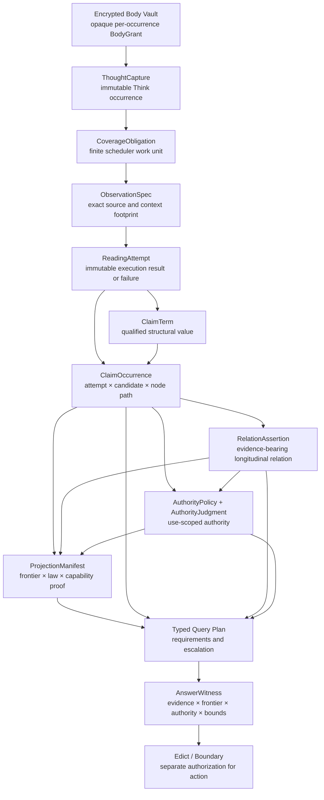

# ADR-THINK-001

# Thoughts Are Sources; Claims Are Readings

## The Contextual, Streaming Mind

**Status:** Accepted — implementation gated\
**Date:** 2026-08-19\
**Scope:** Think capture, storage identity, contextual interpretation, longitudinal claims, authority, projections, querying, migration, erasure, and bounded execution\
**Decision owners:** Think maintainers\
**Supersedes:** Content-fingerprint thought identity; authoritative flat-enrichment semantics; mutable pipeline progress stored as domain fact; naked semantic relation edges\
**Does not supersede:** Existing production behavior until cutover; WARP’s causal-storage contract; the independent Contextual Claims schema and evaluator specifications

> **Captures are evidence. Claims are readings. Judgments grant authority. Mind is a worldline.**

---

## 1. Decision

Think will be rebuilt around an append-only, evidence-preserving semantic architecture in which:

1. A **ThoughtCapture** is an immutable domain occurrence proving that particular content entered Think through a particular ingress.
2. Body equality is a storage concern, not thought identity.
3. A **reading** is a versioned interpretation of an exact observation footprint.
4. A **ClaimOccurrence** records what a particular reading asserted at a particular structural position.
5. Longitudinal relationships such as `supersedes`, `contradicts`, `retracts`, and `fulfills` are evidence-bearing assertions, not naked graph edges.
6. A reading has no ambient authority merely because an extractor produced it.
7. Explicit human judgments and versioned default policies determine which readings may be used for which purposes.
8. Topics, tags, classifications, indexes, adjacency tables, and current-state views are disposable projections with explicit capability signatures.
9. Every query is evaluated at an immutable causal frontier and may use a projection only when that projection proves sufficient for the query’s semantic, temporal, authority, completeness, and access requirements.
10. Raw migration and contextual extraction are separate operations.
11. Every history-sized operation streams with backpressure or declares a bounded atomic unit.
12. Logical domain granularity is independent of physical publication granularity.
13. User content is stored through an erasure-compatible encrypted body vault. Immutable history will not publish plaintext content hashes.
14. The canonical system is the append-only record history. No graph, table, index, or projection is canonical state.

Contextual Claims becomes Think’s primary intermediate representation for **claim-bearing language readings**. It does not become a universal ontology for source code, images, executable plans, audio structure, or arbitrary artifacts.

---

## 2. Implementation gates

No migration or production cutover may begin until all five gates below are implemented and independently verified.

### Gate 1 — Bulk admission

The migration writer must publish bounded windows of logical operations through a bounded number of Git processes or one scoped bulk-object session.

One logical ThoughtCapture per legacy occurrence does not imply one Git process cohort, patch publication, or commit per thought.

### Gate 2 — Two-level observation model

Think must distinguish:

- a finite **CoverageObligation**, used by schedulers to determine what work remains; and
- an exact **ObservationSpec**, used to prove what a reading actually observed.

Actual executions are immutable **ReadingAttempts**.

### Gate 3 — Fixture-gated capabilities

No projection capability may exist until a governing fixture fails when that distinction is removed.

Capability declarations without killing fixtures are invalid build artifacts.

### Gate 4 — Versioned authority policy

A first-class, versioned default-authority policy must determine which claim shapes may automatically speak for which use classes.

Human attention must be requested lazily, only when a requested use cannot be lawfully resolved by policy.

### Gate 5 — Erasure-compatible body storage

ThoughtCapture records must not contain raw body bytes, public plaintext body hashes, or publicly equality-revealing shared CAS identifiers.

Per-occurrence erasure, derivation tracking, projection invalidation, backup handling, and content-bearing receipt erasure must be designed before migration mints the first canonical identity.

---

## 3. Context

Think’s current enrichment architecture has several good properties:

- captured content remains available;
- enrichment is additive;
- derivation receipts identify their producers;
- tags, topics, and classifications accelerate retrieval.

However, the current model grants too much authority to lossy enrichment and conflates several different forms of identity.

The existing design tends to treat:

- identical text as one canonical thought;
- a semantic extraction as an enrichment fact;
- a graph edge as sufficient representation of semantic relationship;
- mutable counters and cursors as durable domain state;
- an index hit as sufficient evidence for an answer.

Those assumptions fail for the questions Think is intended to answer:

- What did I actually decide?
- Was this a proposal, prediction, quotation, or commitment?
- Did I reject both alternatives or only one?
- Was this my belief or something another speaker said?
- What was believed at the time, as opposed to how I interpret it now?
- What remained unresolved at a particular causal frontier?
- Which newer statement corrected, retracted, or superseded an older one?
- Why is this reading currently permitted to speak with authority?
- What did the system know when it took an action?

Flat enrichment cannot safely answer these questions because it erases distinctions such as:

- nested attribution;
- temporal framing;
- modality;
- alternatives;
- negation;
- guards;
- reported speech;
- observation context;
- source ambiguity;
- extractor disagreement;
- authority and review status.

Contextual Claims supplies the missing semantic discipline:

> Never compile prose directly into facts. Compile prose into qualified readings whose evidence, context, uncertainty, and authority remain explicit.

---

## 4. Goals

This ADR establishes an architecture that can:

1. Preserve every admitted capture as an immutable occurrence.
2. Preserve repetition, time, provenance, and ingress context even when body bytes are identical.
3. Reinterpret old evidence under new extractors, profiles, and contexts without overwriting old readings.
4. Distinguish source ambiguity from extractor uncertainty.
5. Represent nested scope, attribution, alternatives, negation, modality, guards, and evidence anchors.
6. Represent correction, contradiction, retraction, supersession, fulfillment, and cancellation without rewriting history.
7. Answer historical questions at explicit causal frontiers.
8. Prevent weak projections from silently answering questions requiring distinctions they erased.
9. Produce answer witnesses explaining what evidence, authority, policy, frontier, and capabilities supported an answer.
10. Escalate insufficient queries through bounded canonical work rather than returning either a lie or an unhelpful refusal.
11. Migrate legacy history deterministically and resumably without materializing the complete Mind.
12. Keep memory, process count, concurrency, and publication units explicitly bounded.
13. Support meaningful cryptographic erasure without pretending append-only history can physically forget its own causal structure.
14. Preserve a lawful bridge from interpreted language to future Edict-authorized action.

---

## 5. Non-goals

This ADR does not attempt to:

1. Determine objective truth automatically.
2. Collapse all equivalent-looking claims into one proposition.
3. Make LLM extraction deterministic.
4. Represent every artifact type using Contextual Claims.
5. Prove universal semantic equivalence between the legacy and replacement systems.
6. Make every query answerable from a projection.
7. Treat confidence as authority.
8. Permit natural-language captures to directly authorize external actions.
9. Preserve recoverability after a valid erasure request.
10. Undo irreversible external effects after the facts or authority later change.
11. Eliminate all buffering. Bounded atomic barriers remain lawful.
12. Make a graph, SQL schema, search index, embedding store, or UI representation canonical.

---

## 6. Normative language

The terms **MUST**, **MUST NOT**, **SHOULD**, **SHOULD NOT**, and **MAY** are normative.

A system claiming conformance to this ADR must satisfy every MUST and MUST NOT requirement.

---

## 7. Constitutional invariants

### I1. Occurrence identity is not body identity

Two byte-identical captures are two ThoughtCaptures.

They may share physical storage internally, but they retain distinct:

- Think domain identifiers;
- causal births;
- capture times;
- ingress contexts;
- provenance;
- reading histories;
- authority histories;
- erasure lifecycles.

Repetition is evidence and must not be discarded.

### I2. Think identity is not WARP identity

A ThoughtCapture owns an opaque Think domain identifier.

WARP supplies the receipt witnessing its admission.

The birth receipt proves that the domain identity was lawfully admitted; the receipt does not become the domain identifier.

### I3. A capture proves capture, not truth

A ThoughtCapture authoritatively establishes:

> These bytes were admitted through this ingress at this causal occurrence.

It does not automatically establish:

- that the content is true;
- that the capturing user authored it;
- that the capturing user believed it;
- that a quoted speaker said it;
- that an instruction was authorized;
- that a future prediction occurred.

### I4. Capture success excludes extraction

The capture success contract contains only:

1. durable preparation of the body grant;
2. lawful admission of the ThoughtCapture;
3. optional durable enqueueing of follow-through work.

Claim extraction, tagging, indexing, classification, summarization, and relation inference are not part of capture success.

### I5. Every reading binds an exact observation footprint

A reading must identify the exact source and context it observed.

Changing any semantically relevant input creates a different ObservationSpec.

### I6. Execution attempts coexist

Retries, competing extractors, model nondeterminism, and improved pipelines produce additional ReadingAttempts.

They do not overwrite earlier attempts.

### I7. ClaimTerm identity is structural, not propositional

A structurally addressed ClaimTerm proves equality only under an exact schema,
normalization law, and privacy scope. User-derived structural payloads and
their equality commitments remain behind opaque, per-derivative erasable
grants; immutable history does not publish plaintext term hashes or
equality-revealing shared identifiers.

It does not prove global proposition equality.

### I8. Semantic relationships require witnesses

Canonical relationships such as `contradicts`, `supersedes`, `retracts`, or `same_proposition_as` must be represented as typed, evidence-bearing records.

Disposable adjacency edges may accelerate traversal but have no independent authority.

### I9. Authority sits between reading and use

An extractor has authority to report that it produced a reading.

It does not automatically have authority to decide how that reading may be used.

Every consequential use requires an authority resolution.

### I10. Every answer is indexed to a causal frontier

A query chooses an immutable target frontier before evaluation.

Concurrent future admissions do not modify the answer at the already-selected frontier.

### I11. Projections must confess

Every projection manifest must declare:

- what distinctions it preserves;
- what distinctions it erases;
- what operators it supports;
- its completeness and exactness guarantees;
- its authority scope;
- its access view;
- its source domain;
- its coverage frontier.

### I12. The graph is not canonical

Canonical records may be rendered as a graph, table, timeline, tree, index, or document.

No rendering is the Mind itself.

### I13. Every growing operation streams or declares a bound

Any collection whose size can grow with history, migration input, claim count, artifact size, or query scope must be:

- streaming with backpressure;
- a declared bounded barrier; or
- forbidden.

### I14. Logical and physical granularity are independent

A migration window may physically publish thousands of independent ThoughtCaptures.

Physical co-publication does not merge their identities.

### I15. No partial semantic artifact may acquire authority

Chunked or incremental storage is permitted.

A reading, claim envelope, projection, or migration window becomes visible only after an immutable completion or publication manifest is admitted.

### I16. Operational state is not domain fact

Worker leases, heartbeats, temporary queues, and mutable execution cursors belong in operational state.

Immutable attempt outcomes, published projection manifests, obstructions, and cutover receipts belong in durable history.

### I17. Erasure removes future semantic use, not historical existence

After erasure, Think may retain minimal evidence that an occurrence existed and was erased.

It must not retain recoverable content or semantic derivatives that reveal the erased source.

---

## 8. Architecture



The architecture has four broad planes:

1. **Evidence plane** — body grants and ThoughtCaptures.
2. **Interpretation plane** — observation specifications, attempts, terms, claims, and relations.
3. **Authority plane** — policies, judgments, and use-scoped resolutions.
4. **Acceleration plane** — projections, typed query plans, and answer witnesses.

No plane may impersonate another.

---

## 9. Record-family complexity ledger

Every canonical record family must justify its existence with a query or invariant that cannot be satisfied without it.

| Record family | Required because |
| --- | --- |
| `BodyGrant` | User content must remain recoverable before erasure and non-recoverable afterward without publishing plaintext content identity. |
| `ThoughtCapture` | Repetition, capture time, ingress, provenance, and occurrence identity must survive body deduplication. |
| `ObservationSpec` | The system must prove exactly what context a reading observed. |
| `ReadingAttempt` | Retries, model nondeterminism, competing extractors, and failures must coexist. |
| `ClaimTerm` | Qualified claim structure must be reusable without collapsing situated occurrences. |
| `ClaimOccurrence` | Think must answer who asserted what, where, under which reading and evidence. |
| `RelationAssertion` | Longitudinal change must preserve evidence, actor, profile, time, and revision history. |
| `AuthorityPolicy` | The default policy is the practical adjudicator in a finite-attention system. |
| `AuthorityJudgment` | Human corrections and exceptional grants or denials must persist and override defaults. |
| `ProjectionManifest` | Fast reads must prove what distinctions and frontiers they cover. |
| `AnswerWitness` | The system must explain why an answer was permitted and what limitations applied. |
| `AdmissionWindow` | Migration and bulk writes must separate logical identity from physical process cost. |
| `MigrationObstruction` | Corrupt or undecodable source ranges must be explicitly accounted for without inventing thoughts. |
| `ErasureTombstone` | History must record lawful erasure without retaining recoverable source content. |

A proposed record family that cannot name a unique query or invariant must be deferred.

---

## 10. Body storage and ThoughtCapture

### 10.1 Body vault

User-authored or imported body bytes MUST NOT be written directly into irreversible WARP history.

The body vault stores encrypted content and exposes an opaque per-occurrence grant:

```text
BodyGrant {
    grantId
    vaultGeneration
    encryptedAccessDescriptor
    integrityCommitment
    mediaType
    byteLength
}
```

The canonical ThoughtCapture stores only `grantId` and non-sensitive metadata.

The vault may physically deduplicate equal content, but deduplication:

- MUST remain internal to the vault;
- MUST NOT be visible through canonical identifiers;
- MUST NOT cause two ThoughtCaptures to share a public body identity;
- MUST preserve independent per-occurrence revocation.

Deployments requiring stronger unlinkability MAY disable physical deduplication.

### 10.2 Capture protocol

Capture uses a prepare-then-admit protocol:

1. Encrypt and durably prepare a BodyGrant.
2. Construct the ThoughtCapture referencing that grant.
3. Admit the ThoughtCapture through WARP.
4. Return success only after the ThoughtCapture publication linearizes.
5. Garbage-collect unreferenced prepared grants after a safe grace period.

A body grant that exists without an admitted ThoughtCapture is an orphan, not a capture.

A ThoughtCapture must never reference a body grant that was not durably readable before publication.

### 10.3 ThoughtCapture shape

```text
ThoughtCapture {
    thoughtId
    bodyGrantRef
    capturedAt
    ingressPrincipal
    ingressKind
    sourceArtifactRef?
    sessionRef?
    ambientContextRefs[]
    legacySourceRef?
    schemaDigest
}
```

The corresponding WARP birth witness is:

```text
ThoughtBirthWitness {
    admissionWindowReceipt
    operationPath
}
```

The birth witness may be derived from the publication record rather than duplicated in the ThoughtCapture payload.

### 10.4 Identity

`thoughtId` is an opaque Think domain identity.

For migrated records it may be deterministically derived from:

```text
migration namespace × canonical legacy occurrence coordinate
```

It MUST NOT be derived from body bytes.

For new captures it SHOULD be randomly or monotonically generated within the Think namespace.

### 10.5 Authorship and capture attribution

Think must distinguish:

- `ingressPrincipal` — the authenticated actor or process that admitted the content;
- source artifact or channel provenance;
- claimed or inferred speaker attribution inside the content.

Capturing pasted Claude output does not make James its author.

Speaker, author, believer, and accountable actor are contextual claims unless operational provenance independently proves them.

---

## 11. Coverage obligations and observation identity

### 11.1 Why two levels exist

The scheduler needs a finite domain over which it can ask:

> What required semantic work remains incomplete?

Evidence needs a maximally precise identity answering:

> What exactly did this reading observe?

One key cannot lawfully perform both jobs.

### 11.2 CoverageObligation

A CoverageObligation is a logical scheduler work unit:

```text
CoverageObligationKey {
    sourceOccurrence
    sourceBodyGeneration
    lensFamily
    coveragePolicyDigest
}
```

Examples of `lensFamily` include:

- `local_source_claims`
- `source_time_contextual_claims`
- `current_project_reinterpretation`
- `commitment_extraction`
- `person_attribution`
- `decision_extraction`

A versioned CoveragePolicy defines:

- which source occurrences are in scope;
- which ObservationSpecs satisfy the obligation;
- what extractor or schema compatibility is acceptable;
- which context changes invalidate prior satisfaction;
- what bounded trigger schedules reevaluation;
- which failures are retryable;
- whether multiple successful attempts are required.

### 11.3 Satisfaction relation

An obligation is satisfied only when:

```text
satisfies(obligation, attempt) :=
    attempt.status == success
    and attempt.spec.sourceOccurrence == obligation.sourceOccurrence
    and attempt.spec.lensFamily == obligation.lensFamily
    and obligation.policy.accepts(attempt.spec, attempt.result)
```

The scheduler enumerates CoverageObligations, not every possible ObservationSpec.

### 11.4 Policy evolution

A new `coveragePolicyDigest` creates a new obligation only when the policy changes what counts as acceptable coverage.

Changing execution infrastructure without changing semantic acceptability may justify another ReadingAttempt under the same obligation.

New context must not trigger a rereading of the entire Mind by default.

Each context-sensitive CoveragePolicy must declare bounded invalidation triggers such as:

- project membership changed for this capture;
- a referenced entity was disambiguated;
- a source-time context artifact became available;
- an authority-relevant attribution changed;
- an extractor law changed a distinction required by the lens.

A local-source reading is not invalidated merely because unrelated new thoughts were captured elsewhere.

### 11.5 ObservationSpec

An ObservationSpec binds the exact requested reading:

```text
ObservationSpec {
    sourceOccurrence
    sourceBodyCommitment
    lensFamily
    orderedContextManifest
    contextFootprintRoot
    observationFrontier
    accessViewDigest
    profileDigest
    promptContractDigest
    extractorArtifactDigest
    parserDigest
    assemblerDigest
    normalizationDigest
}
```

Its identity is a domain-separated digest of the complete structure.

`observedAt` is not part of ObservationSpec identity. It belongs to the ReadingAttempt execution receipt.

### 11.6 Context footprint

The ordered context manifest must identify every semantically relevant input, including where applicable:

- neighboring ThoughtCaptures;
- conversation turns;
- active project observations;
- linked artifacts;
- prior ClaimOccurrences;
- entity bindings;
- access or redaction view;
- source-time metadata;
- query-supplied context.

An extractor must not claim exact evidence if its interpretation depended on unrecorded context.

### 11.7 Well-founded observation law

An ObservationSpec chooses an immutable observation frontier \(F_o\).

It may depend only on records admitted at or before \(F_o\).

The resulting ReadingAttempt is published after \(F_o\).

Therefore:

- a reading cannot depend on itself;
- a reading cannot depend on a future result;
- cross-reading support edges can reference only already-admitted artifacts;
- batch-internal claim-tree structure is not treated as independent evidentiary support;
- circular support is rejected during validation.

A modern reinterpretation of old evidence uses a new ObservationSpec at a newer frontier. It does not mutate the original reading.

Queries must distinguish:

- **source-time reading** — what the evidence supported using context available then;
- **current reinterpretation** — how the same evidence is read using context available now.

---

## 12. ReadingAttempt

A ReadingAttempt records one actual execution:

```text
ReadingAttempt {
    attemptId
    observationSpecRef
    executorReceipt
    startedAt
    completedAt
    status
    candidateManifestRef?
    failure?
}
```

Possible statuses include:

- `success`
- `typed_failure`
- `cancelled`
- `resource_exhausted`
- `invalid_output`
- `policy_blocked`

A retry creates another attempt.

A new model snapshot creates another attempt.

Two successful attempts may disagree without either being overwritten.

Competing candidates produced inside one attempt are extractor alternatives.

Alternatives explicitly present in the source belong inside the ClaimTerm structure.

These two forms of uncertainty MUST NOT be conflated.

---

## 13. ClaimTerm and ClaimOccurrence

### 13.1 ClaimTerm

A ClaimTerm is an immutable structural value preserving qualification such as:

- nested scope;
- attribution;
- modality;
- alternatives;
- negation;
- guards;
- temporal expressions;
- referent bindings;
- evidence anchors;
- unresolved references.

```text
ClaimTerm {
    claimTermId
    semanticSchemaDigest
    normalizationLawDigest
    structuralPayloadGrantRef
    privateStructuralCommitmentRef?
}
```

`structuralPayloadGrantRef` resolves to an encrypted, independently erasable
derived payload. `privateStructuralCommitmentRef`, when present, resolves to a
keyed or otherwise non-public commitment inside the erasable vault boundary.
Neither reference reveals source content or cross-occurrence equality through
canonical history.

Its optional private structural address means:

> Structurally equal under this exact schema and normalization law.

It does not mean:

> Universally the same proposition.

Large terms must be bounded or represented through a completed,
encrypted Merkle-addressed envelope whose payload and commitment capabilities
are destroyed when any governing erasure policy requires it. ClaimTerm
metadata may remain as a structural tombstone, but no recoverable semantic
payload may survive erasure in append-only records.

### 13.2 ClaimOccurrence

```text
ClaimOccurrence {
    readingAttemptRef
    candidateId
    canonicalNodePath
    claimTermRef
    evidenceAnchors[]
    bindingEnvironment?
    annotations?
}
```

Occurrence identity is:

```text
readingAttempt × candidateId × canonicalNodePath
```

A ClaimOccurrence authoritatively establishes:

> This reading asserted this qualified structure at this position.

It does not independently establish that the structure is true.

### 13.3 Indexicals and unresolved bindings

Statements such as:

> “I will do it tomorrow.”

must not be treated as complete propositions unless `I`, `it`, and `tomorrow` are bound.

Think may represent:

- a closed ClaimTerm with explicit bindings; or
- an open ClaimTerm plus an occurrence-specific binding environment.

Unresolved bindings remain explicit.

Matching open-term hashes do not establish proposition equality.

---

## 14. Longitudinal relationships

### 14.1 No naked canonical edges

Canonical relations are typed RelationAssertions:

```text
RelationAssertion {
    relationId
    relationKind
    sourceOccurrences[]
    targetOccurrences[]
    relationProfileDigest
    evidenceRefs[]
    assertingActorOrPolicy
    effectiveInterval?
    reviewState?
}
```

Traversal edges may be generated as disposable projections.

### 14.2 Relation families

#### Semantic relations

- `same_proposition_as`
- `entails`
- `contradicts`

These require an explicit semantic profile and compatible frames.

#### Discourse relations

- `clarifies`
- `answers`
- `elaborates`
- `quotes`

These describe communicative structure.

#### Revision relations

- `corrects`
- `supersedes`
- `retracts`
- `reaffirms`

These require actor and temporal authority.

A later statement does not automatically supersede an earlier one.

#### Deontic relations

- `commits_to`
- `fulfills`
- `cancels`
- `waives`
- `violates`

These require an accountable actor, commitment identity, conditions, and effective interval.

### 14.3 Proposition sameness

`same_proposition_as` must not create a global equivalence class or destructive union.

It must be qualified by some combination of:

- semantic profile;
- query class;
- authority use;
- temporal bounds;
- observer;
- substitution direction.

A reviewed equivalence may accelerate a bounded query without collapsing either occurrence.

### 14.4 Historical preservation

A retraction does not erase the original assertion.

A contradiction does not imply supersession.

A fulfillment does not erase the prior commitment.

Revision changes what may speak after its effective frontier; it does not rewrite what was previously said.

---

## 15. Authority

### 15.1 Authority is use-scoped

Authority answers:

> For what purpose may this reading speak?

Typical use classes include:

- candidate retrieval;
- topic grouping;
- timeline display;
- belief attribution;
- decision adjudication;
- commitment tracking;
- recommendation;
- external action authorization.

A claim may be admitted for candidate retrieval and refused for external action.

### 15.2 AuthorityPolicy

The default policy is a first-class adjudicator:

```text
AuthorityPolicy {
    policyDigest
    applicableSourceClasses
    claimShapeRules
    useClasses
    riskClasses
    defaultGrants
    defaultBounds
    defaultRefusals
    escalationRules
    precedenceRules
}
```

The policy must be versioned and available at the causal frontier where it was applied.

A policy may return:

- `ADMITTED`
- `BOUNDED`
- `REFUSED`
- `ESCALATED`

### 15.3 AuthorityJudgment

Explicit human or independently authorized judgments are append-only:

```text
AuthorityJudgment {
    judgmentId
    targetRef
    useClass
    decision
    scope
    effectiveFrom
    effectiveUntil?
    evidenceRefs[]
    adjudicator
    policyContext?
}
```

A judgment may itself later be superseded, retracted, or narrowed through another evidence-bearing judgment.

### 15.4 Resolution precedence

For claim \(c\), use \(u\), and query frontier \(F\):

1. Gather applicable explicit judgments admitted at or before \(F\).
2. Remove judgments superseded or retracted by judgments effective at or before \(F\).
3. Prefer more specific judgments over less specific judgments when specificity is formally comparable.
4. If maximally specific active judgments conflict or are causally incomparable, return `ESCALATED`.
5. An unambiguous explicit judgment overrides the default policy.
6. If no applicable explicit judgment exists, apply the AuthorityPolicy active at \(F\).
7. Record the policy digest and judgment references in the answer or action witness.

A later policy does not retroactively make a historical answer unlawful.

A current query may optionally request reevaluation under the current policy, but that is a different question from:

> Was the prior answer lawful relative to what the system knew and permitted then?

### 15.5 Attention economics

Think must not ask for human adjudication merely because a claim candidate exists.

Human attention is requested only when:

- a user requests a use that exceeds default policy authority;
- explicit judgments conflict;
- risk exceeds an automatic threshold;
- a requested external action requires stronger authorization;
- a repeated failure indicates the default policy is systematically inadequate.

Pending adjudication requests may expire.

The underlying ClaimOccurrences remain candidate readings; they do not become silently admitted.

An adjudication inbox should prioritize:

- blocked user value;
- action risk;
- recurrence frequency;
- uncertainty;
- cost of continued refusal.

### 15.6 Confidence is not authority

Extractor confidence, model agreement, frequency, and recency may inform policy.

None of them independently grants authority.

---

## 16. External action bridge

Contextual Claims does not directly authorize external effects.

To act, Think must request a separate Boundary or Edict authorization:

```text
ActionAuthorizationReceipt {
    authorizationId
    operationType
    boundedParameters
    claimRefs[]
    relationRefs[]
    authorityResolution
    policyDigest
    judgmentRefs[]
    evidenceFrontier
    expiration
    revocationConditions
}
```

The action executor may perform only the operation and parameters granted by the receipt.

### 16.1 Later retraction

If later evidence shows that a claim was misattributed, misunderstood, or improperly authorized:

- the original action receipt remains historical proof of what was permitted at its frontier;
- a new revocation or conflict record is appended;
- reversible actions may receive compensating operations;
- irreversible actions cannot be causally rolled back;
- an unrepairable consequence is recorded as an incident or violation;
- the system must not backfill regret into the original authorization record.

Legality is indexed to a frontier.

Regret is appended, never backfilled.

---

## 17. Temporal model

Think must preserve distinct clocks.

| Clock | Meaning |
| --- | --- |
| Causal admission frontier | When a record became part of authoritative history |
| `capturedAt` | Time supplied by the ingress or device |
| Source-mentioned time | Time referred to inside the content |
| Effective interval | When a belief, decision, obligation, or relation claims to hold |
| `observedAt` | When a ReadingAttempt executed |
| `adjudicatedAt` | When an authority judgment was admitted |
| Query frontier | The causal cut from which an answer is requested |

No single timestamp may impersonate all seven.

### 17.1 Default operator semantics

Typed query operators must declare default clocks.

| Query shape | Default interpretation |
| --- | --- |
| “What did I write or capture Friday?” | `capturedAt`, bounded by the selected causal frontier |
| “What did I decide by Friday?” | Decision effective time, evaluated using authority available by Friday’s frontier |
| “What did I believe on Friday?” | Belief authority and effective interval as of Friday’s frontier |
| “What was due Friday?” | Obligation effective interval |
| “When did Think extract this?” | `observedAt` |
| “When was this reviewed?” | `adjudicatedAt` |
| “What did Think know then?” | Evidence and readings admitted by the requested causal frontier |

The AnswerWitness must state which clock and frontier were used.

Alternative bindings remain explicit query options.

---

## 18. Projections

### 18.1 Projection status

Projections are disposable acceleration structures.

Examples include:

- auto-tags;
- topics;
- classifications;
- utterance-shape indexes;
- embeddings;
- timeline tables;
- claim adjacency;
- current-belief views;
- commitment indexes;
- search indexes;
- relation traversals.

A projection may be deleted and rebuilt from canonical records.

### 18.2 ProjectionManifest

```text
ProjectionManifest {
    projectionId
    projectionLawDigest
    builderArtifactDigest
    sourceDomain
    sourceFrontier
    accessViewDigest
    capabilitySignature
    proofBundleDigest
    publicationRoot
    completenessState
}
```

The projection is queryable only after the manifest is atomically published.

Partially built shards have no semantic authority.

### 18.3 Capability signature

A capability signature is a product of independently checked axes.

```text
CapabilitySignature {
    preservedDistinctions
    supportedOperators
    exactness
    completeness
    attributionDepth
    temporalCapabilities
    authorityClasses
    sourceDomain
    sourceFrontier
    accessViewDigest
    schemaDigest
}
```

Possible preserved distinctions include:

- scope;
- negation;
- attribution;
- alternatives;
- guards;
- modality;
- temporal framing;
- evidence anchors;
- unresolved bindings;
- source-versus-extractor uncertainty.

Possible exactness values include:

- `candidate_only`
- `sound_approximation`
- `exact_for_declared_domain`

Possible completeness values include:

- `unknown`
- `bounded_recall`
- `exhaustive_for_declared_domain`

Possible operators include:

- candidate retrieval;
- positive existential query;
- negative or exhaustive query;
- temporal filtering;
- relation traversal;
- authority resolution;
- historical as-of query.

### 18.4 Runtime compatibility

A projection may answer query \(Q\) only when:

\[
\operatorname{requirements}(Q) \sqsubseteq \operatorname{guarantees}(P)
\]

and:

1. the projection’s source domain contains the query domain;
2. the access view matches or lawfully dominates the query view;
3. the projection covers the requested causal frontier;
4. the projection’s authority scope satisfies the query use;
5. the projection supports the required operators;
6. the projection’s completeness is sufficient for the requested answer.

Runtime checking should be bounded and mechanical:

- bitset containment;
- enum or partial-order comparisons;
- fixed-size depth checks;
- digest equality;
- domain containment;
- substrate frontier dominance.

The runtime check verifies compatibility with the declared signature.

It does not prove that the projection truthfully earned that signature.

### 18.5 Capability minting

Capability honesty is established before publication.

Every registered capability must include:

- a normative definition;
- at least one killing fixture;
- interaction fixtures where applicable;
- mutation tests;
- builder conformance results;
- a proof-bundle digest.

The build must fail when:

- a capability lacks a killing fixture;
- dropping the distinction does not fail the fixture;
- required interaction fixtures are missing;
- the projection builder fails the governing corpus.

A capability bit without a killing fixture does not exist.

### 18.6 Negative answers

Candidate-only, approximate, embedding, and tag projections may retrieve likely evidence.

They must not establish:

- that no other matching evidence exists;
- that no contradiction exists;
- that all commitments were found;
- that no decision occurred;
- that a relation is globally absent.

Negative or exhaustive answers require an exhaustive guarantee over the declared source domain and frontier.

---

## 19. Typed query planning

### 19.1 Query requirements

Natural language may be parsed by an LLM into a proposed typed query plan.

The proposed plan must validate against a finite query type system before execution.

```text
QueryRequirement {
    queryClass
    sourceDomain
    asOfFrontier
    requiredDistinctions
    requiredOperators
    minimumExactness
    minimumCompleteness
    minimumAttributionDepth
    temporalRequirements
    authorityUseClass
    accessViewDigest
    workBudget
}
```

An LLM may propose requirements.

It may not waive them.

### 19.2 Planning sequence

The planner must:

1. Resolve the target query frontier.
2. Resolve default or explicit temporal semantics.
3. Determine semantic and authority requirements.
4. Select candidate projections.
5. Verify projection capability compatibility.
6. Use weak projections only for candidate retrieval where appropriate.
7. Rehydrate canonical records when projections are insufficient.
8. Schedule new bounded observations when required.
9. Request human adjudication only when policy cannot resolve the requested use.
10. Produce an AnswerWitness or a priced remediation result.

### 19.3 Result types

```text
Answered {
    answerPayloadRef
    witness
}

Bounded {
    answerPayloadRef
    omittedGuarantees
    witness
}

NeedsWork {
    reason
    remediationQuote
    partialWitness?
}

Refused {
    violatedLaw
    unavailableRemediation
    witness?
}
```

### 19.4 Remediation quote

A refusal caused by insufficient derived state should include the cheapest lawful cure when one exists:

```text
RemediationQuote {
    requiredOperation
    estimatedRecords
    estimatedBytes
    estimatedLatencyClass
    requiredAuthority
    maximumBudget
    expectedCapabilityGain
}
```

Example:

> The topic index is retrieval-only and cannot prove that these were the only unresolved commitments. Think can lawfully answer by rehydrating 42 canonical records under the commitment lens.

Below a configured budget, Think may execute the remediation automatically.

Above the budget, it asks for authorization.

A refusal without a lawful cure remains a final refusal.

### 19.5 AnswerWitness

```text
AnswerWitness {
    queryPlanDigest
    queryFrontier
    temporalBindings
    sourceDomain
    projectionManifestRefs[]
    canonicalEvidenceRefs[]
    readingAttemptRefs[]
    claimOccurrenceRefs[]
    relationAssertionRefs[]
    authorityPolicyDigest
    authorityJudgmentRefs[]
    capabilityRequirements
    capabilityGuaranteesUsed
    bounds
    omittedGuarantees[]
}
```

Content-bearing quotations, summaries, and answer text must be stored through erasable derived-payload grants.

The durable witness may retain structural references after content erasure, but not recoverable erased content.

---

## 20. Streaming and bounded execution law

### 20.1 Operation classes

Every operation must be classified as one of:

```text
streaming
bounded_barrier(maxBytes, maxItems)
forbidden_global_barrier
```

Examples of lawful bounded barriers include:

- canonical encoding of a bounded patch;
- validation of a bounded claim envelope;
- atomic publication of a bounded migration window;
- signature verification over a bounded manifest;
- final digest calculation for a bounded unit.

An operation is forbidden when its required materialization grows without an enforced limit tied to history, migration input, claim count, or artifact size.

### 20.2 Backpressure requirements

For streaming operations:

- maximum in-flight elements must not exceed configured concurrency;
- upstream must not be pulled while the downstream window is full;
- cancellation must close producers and child processes;
- queue depth must remain bounded;
- memory use must remain approximately flat as input count grows.

### 20.3 Process requirements

Process count is a separate bound from memory.

A stream that starts one Git process per element violates this ADR even if memory remains flat.

Process count must be proportional to:

- stream sessions;
- bounded admission windows;
- scoped bulk-object sessions;

not individual thoughts, patches, claims, or blobs.

### 20.4 `tee` and `demux`

Any `tee`, `demux`, fan-out, or branch queue must declare:

- per-branch queue bounds;
- behavior when one branch stalls;
- cancellation behavior;
- overflow semantics.

Unbounded cache growth between fast and slow consumers is forbidden.

### 20.5 Physical publication budgets

Each AdmissionWindow must enforce:

```text
maxItemsPerWindow
maxDecodedBytesPerWindow
maxEncodedBytesPerWindow
maxGitProcessesPerWindow
maxInFlightWindows
```

The exact defaults are implementation-specific and must be ratcheted by tests.

---

## 21. AdmissionWindow

### 21.1 Purpose

An AdmissionWindow physically packages multiple independent logical operations.

```text
AdmissionWindow {
    windowId
    parentFrontier
    writer
    migrationLawDigest?
    sourceRange?
    orderedOperationsRoot
    itemCount
    decodedByteCount
    encodedByteCount
}
```

Each operation retains its own subject and operation path.

### 21.2 Linearization point

The authoritative linearization point is the final checked update of the designated WARP ref.

Before that update, prepared Git objects are inert and may be garbage-collected.

After that update, every operation in the window is admitted atomically.

### 21.3 Crash behavior

#### Crash before ref update

- No ThoughtCapture in the window is admitted.
- Prepared objects may remain as unreachable storage.
- Retry may regenerate or reuse the same objects.
- Semantic duplication cannot occur because no authoritative frontier references the window.

#### Crash after ref update but before cursor update

- The window is admitted.
- The authoritative ref, not the mutable cursor, is the source of truth.
- Restart discovers the admitted window from history and advances the operational cursor.

### 21.4 Determinism

Migration windows should use canonical encoding and deterministic metadata so retries produce the same operation root and preferably the same Git object identities.

Even when physical object identity differs, logical duplication remains forbidden by:

- deterministic ThoughtCapture identifiers;
- deterministic source-coordinate mapping;
- checked parent publication;
- conflict detection for pre-existing subjects.

### 21.5 Birth witness

A ThoughtCapture admitted inside a shared window receives:

```text
window publication receipt × canonical operation path
```

This is one witnessed birth for one domain occurrence even though the physical publication contains many operations.

---

## 22. Migration

### 22.1 Separation of phases

Migration has two independent phases.

#### Phase A — Raw occurrence migration

Preserves:

- logical occurrence identity;
- exact recoverable body bytes;
- ingress and legacy provenance;
- ordering and causal source coordinates;
- deterministic mapping;
- obstruction accounting.

It does not run an LLM.

#### Phase B — Semantic coverage backfill

Creates:

- CoverageObligations;
- ObservationSpecs;
- ReadingAttempts;
- ClaimTerms;
- ClaimOccurrences;
- relation proposals;
- authority projections;
- search and topic projections.

Phase B may fail, retry, or evolve without changing Phase A.

### 22.2 Legacy observer

Before scanning history, the migration design must define the legacy observer.

Legacy page rewrites may contain repeated snapshots of the same logical entries.

The observer must define:

- how a logical legacy occurrence is identified;
- whether identity derives from first appearance, surviving entry ID, or revision lineage;
- how edits are represented;
- how duplicates caused by page snapshots are excluded;
- how true repeated captures remain distinct;
- how deletions or missing entries are treated.

The migrator must not scan every historical page snapshot and manufacture a new ThoughtCapture for every repeated copy.

### 22.3 Deterministic target identity

Each logical legacy occurrence maps to one deterministic ThoughtCapture ID derived from its canonical legacy occurrence coordinate.

Body text must not participate in target thought identity.

### 22.4 Streaming conversion

The migrator must:

1. Pin an immutable legacy source frontier \(C_0\).
2. Scan source history incrementally.
3. Hold at most one bounded page, source segment, or migration window.
4. Create one logical ThoughtCapture per legacy occurrence.
5. Publish bounded AdmissionWindows.
6. Record deterministic source-to-target mappings.
7. Resume safely at every admitted window boundary.
8. Hard-fail on conflicting pre-existing target content.
9. Retain old refs untouched.
10. Avoid any in-memory set proportional to the entire Mind.

### 22.5 Migration obstruction

Corrupt or undecodable source material is represented by a MigrationObstruction:

```text
MigrationObstruction {
    obstructionId
    sourceRange
    availableRawBytesRef?
    rawCommitment?
    failureKind
    parserDigest
    migrationLawDigest
    discoveredAt
}
```

An obstruction proves:

> Migration could not lawfully interpret this source range.

It does not pretend to be a ThoughtCapture.

Corruption may destroy framing. Therefore an obstruction may cover a range containing an unknown number of logical records.

Healing appends:

```text
ObstructionResolution {
    obstructionRef
    recoveredOccurrenceRefs[]
    recoveryMethod
    evidenceRefs[]
    adjudicator
}
```

The obstruction remains in history.

### 22.6 Authority during migration

The legacy system remains the sole authoritative write target throughout base migration and tail catch-up.

Fresh authoritative new-substrate-only captures must not begin before cutover.

Therefore a failure at 98% does not create split brain:

- migration pauses;
- users continue writing to legacy storage;
- the migrator resumes and catches up later.

A disjoint epoch-overlay design may be introduced by a separate ADR, but it is not the default migration strategy.

### 22.7 Cutover

This protocol executes only in Phase 8, after every acceptance criterion in
section 30 has independently passed. Earlier phases may rehearse every step on
disposable or non-authoritative refs, but they MUST NOT perform the authority
switch.

The cutover protocol is:

1. Record legacy source frontier \(C_0\).
2. Migrate the base history through \(C_0\).
3. Continue bounded tail catch-up to \(C_1\).
4. Verify all resolved source coordinates and migration roots.
5. Acquire the existing short write lock.
6. Convert the final bounded tail.
7. Publish the final AdmissionWindow.
8. Produce and verify the CutoverWitness.
9. Atomically switch Think’s storage-version or authoritative ref.
10. Release the lock.
11. Route all future writes only to the new substrate.
12. Retain old refs read-only as a recovery source, subject to erasure policy.

Long-lived dual writing is forbidden.

### 22.8 CutoverWitness

```text
CutoverWitness {
    legacySourceFrontier
    migrationLawDigest
    targetFrontier
    sourceToTargetMappingRoot
    orderedOccurrenceRoot
    opaqueBodyCommitmentRoot
    migratedOccurrenceCount
    obstructionDispositionRoot
    unresolvedObstructionCount
    processBudgetResults
    migrationVerificationResults
    boundedQueryAgreementResults
    authoritySwitchReceipt
}
```

A clean cutover requires zero unresolved obstructions.

A human may explicitly accept unresolved loss through a separate `LossAcceptance` judgment. In that case the witness must state incomplete coverage and must not claim exact migration equivalence.

### 22.9 Migration equivalence claim

Migration may prove:

- occurrence coverage over the declared source domain;
- deterministic source-to-target mapping;
- body commitment preservation;
- ordered-ID agreement;
- count agreement;
- bounded observational agreement for an explicit query set \(Q_0\) over an explicit domain \(D_0\).

It must not claim universal semantic equivalence.

---

## 23. Existing enrichment

Current enrichments remain useful but are demoted to declared projections.

### 23.1 `auto_tags`

Preserves:

- lexical or semantic topic candidates;
- source references;
- retrieval acceleration.

Typically erases:

- negation;
- attribution;
- nested scope;
- alternatives;
- guards;
- modality;
- exhaustive coverage.

Default authority:

- candidate retrieval only.

### 23.2 `semantic_parse`

Preserves:

- coarse utterance-shape classification;
- selected structural hints;
- source references.

Typically erases:

- deep nesting;
- exact speaker attribution;
- temporal qualification;
- evidence structure;
- competing readings.

Default authority:

- filtering and UI hints only.

### 23.3 Derived aggregates

The following are projections or operational state, not permanent facts:

- topic thought counts;
- “latest enriched” pointers;
- page and offset cursors;
- mutable `running → completed → failed` pipeline nodes;
- adjacency edges;
- current-state summary documents.

Published immutable completion events and ProjectionManifests remain durable.

Worker progress and leases remain operational.

---

## 24. Erasure

### 24.1 Chosen tradeoff

Think prioritizes:

1. distinct occurrence identity;
2. strong per-occurrence erasure;
3. non-public content equality.

Physical body deduplication is permitted only as a private vault optimization.

Stable public plaintext body identity is rejected.

### 24.2 No plaintext content hashes

Canonical history must not contain a plaintext body hash for user content.

Short or guessable bodies can be recovered through dictionary attack against a public digest even after key destruction.

Migration verification uses opaque per-occurrence commitments or keyed vault commitments that are not public equality tokens.

### 24.3 Erasure operation

Erasure appends an ErasureTombstone and destroys all applicable decryption and derivation capabilities:

```text
ErasureTombstone {
    sourceOccurrence
    erasurePolicyDigest
    requestedBy
    authorizedBy
    erasureFrontier
    derivationInvalidationRoot
    keyDestructionReceipt
}
```

After the erasure frontier:

- the ThoughtCapture’s body grant is unusable;
- projections exclude the occurrence;
- semantic derivatives capable of revealing the source are unavailable;
- future queries cannot recover or quote the erased content;
- the durable history may still prove that an occurrence existed and was erased.

### 24.4 Shared physical bodies

When two ThoughtCaptures contain equal bytes:

- each has a distinct opaque BodyGrant;
- the vault may map both grants to shared encrypted storage;
- erasing one grant must not destroy the other;
- the canonical record must not reveal that they shared content;
- after erasure, the erased occurrence must not remain linkable to the surviving body through public metadata.

### 24.5 Derivation index

Every derived artifact must identify its source occurrences directly or through a derivation manifest.

The erasure blast radius includes:

- ClaimOccurrences;
- ClaimTerms containing source-specific content;
- embeddings;
- summaries;
- quotations;
- relation rationales;
- projection shards;
- caches;
- search indexes;
- answer payloads;
- debug logs;
- trace payloads;
- model prompts retained for diagnostics;
- fixture candidates;
- exports;
- backups.

A receipt or log containing the erased text is derived sensitive content even if it is called “observability.”

### 24.6 Content-bearing witnesses

AnswerWitness structure may remain after erasure.

Quotations, summaries, and answer text must live in separately erasable encrypted payload grants.

After key destruction, the structural witness may prove:

- a query occurred;
- certain now-erased sources participated;
- a policy and frontier were used;
- the payload is no longer recoverable.

It must not preserve the erased content itself.

### 24.7 Backups

Encryption keys and key wrappers must not be permanently embedded in Git history or inseparable backups.

Erasure must propagate to backup key access.

A recurring erasure fire drill must verify that synthetic erased content is not recoverable from:

- active storage;
- projections;
- caches;
- logs;
- answer receipts;
- model traces;
- backups;
- restored environments.

### 24.8 Limits

Think cannot erase:

- content already copied to an uncontrolled external system;
- knowledge retained by a human;
- irreversible external effects;
- information independently present in another surviving capture.

The system must record these limitations honestly rather than claim impossible deletion.

---

## 25. Failure semantics

| Failure | Required behavior |
| --- | --- |
| Body preparation fails | Capture is not admitted. Return typed failure. |
| WARP admission fails after body preparation | Capture is not admitted. Prepared grant becomes orphaned and is later collected. |
| Extraction fails | ThoughtCapture remains authoritative. Append or retain failed ReadingAttempt. Retry independently. |
| Competing extractors disagree | Preserve all attempts. Do not silently choose one. |
| Claim envelope partially writes | Do not publish completion manifest. Partial chunks have no query authority. |
| Projection build fails | Previous published projection remains valid at its old frontier. Failed build is not visible as current. |
| Projection is stale | Overlay bounded canonical delta, route to stronger evidence, return bounded result, or produce remediation quote. |
| Projection frontier is incomparable | Projection cannot answer. |
| Explicit authority judgments conflict | Return `ESCALATED`. |
| Migration process crashes before window publication | No window operations are admitted. Retry safely. |
| Migration crashes after publication | Recover from authoritative history, not mutable cursor state. |
| Legacy source is corrupt | Append MigrationObstruction; do not invent a thought. |
| Erasure is authorized | Destroy applicable grants and derived payload access; append tombstone; rebuild projections. |
| Later evidence invalidates an external action | Preserve historical authorization receipt; append revocation, compensation, or incident. |
| Query cannot be answered lawfully | Return `NeedsWork` with remediation quote, or final `Refused`. |

---

## 26. Conformance corpus

The conformance corpus is a pre-implementation deliverable.

It is not a testing phase added after capability algebra exists.

### 26.1 Governing dojo fixture

At minimum, the corpus must include:

```text
Monday:
“Claude suggested A or B. I did not choose either.
We said we would revisit it Friday.”

Friday:
“Choose B only if the security review passes.”

Saturday:
“Security failed. Cancel B; ship neither.”
```

The same Monday body must then be captured a second time as a distinct occurrence.

The fixture must test:

- attribution;
- reported speech;
- alternatives;
- negation;
- collective speech;
- future intent;
- guard conditions;
- temporal querying;
- cancellation;
- repeated body bytes;
- source-time versus current interpretation;
- projection refusal;
- exhaustive versus candidate-only answers.

Expected questions include:

- Who proposed A?
- Had James decided anything on Thursday?
- What was conditionally selected Friday?
- Was it an unconditional commitment?
- What remained unresolved?
- What changed Saturday?
- Did Saturday make Monday’s historical statement nonexistent?
- Can `auto_tags` conclusively answer any of these?
- Can an embedding prove that no other decision exists?

### 26.2 Required fixture classes

The corpus must cover:

- direct negation;
- nested negation;
- negation inside quotation;
- ambiguous speaker;
- corrected speaker attribution;
- unresolved pronouns;
- source alternatives;
- extractor competing candidates;
- temporal expressions;
- source-time context;
- modern reinterpretation;
- guarded commitments;
- revoked authority;
- contradicting concurrent judgments;
- duplicated body bytes;
- correction without erasure;
- erasure with surviving duplicate content;
- relation-scope errors;
- stale projections;
- incomplete domains;
- negative queries;
- partial publication;
- observation dependency cycles.

### 26.3 Mutation adequacy

For every capability, at least one projection mutant must intentionally drop or corrupt the distinction.

The governing fixtures must detect the mutant.

Examples:

- remove negation;
- flatten attribution;
- discard guards;
- merge alternatives;
- drop temporal intervals;
- treat candidate retrieval as exhaustive;
- use current policy for historical answers;
- ignore access-view mismatch.

A capability that survives its killing mutant has not been earned.

### 26.4 Fixture farming

Every confirmed incorrect deployed answer should produce a fixture candidate containing:

```text
query
query frontier
source evidence
actual answer
corrected answer
lost distinction
required capability
```

After adjudication, the fixture joins the governing corpus.

The corpus is the accumulated record of ways Think has learned not to lie.

---

## 27. Verification ratchets

### 27.1 Streaming ratchets

Tests must verify:

- bounded in-flight elements;
- bounded queue depth;
- upstream backpressure;
- approximately flat RSS as \(N\) grows;
- producer and child-process cancellation;
- no unbounded `tee` or `demux`;
- bounded barrier enforcement.

### 27.2 Process ratchets

Tests must verify:

- process count grows with sessions or AdmissionWindows, not item count;
- bulk migration does not create one process cohort per thought;
- Git object publication occurs through scoped sessions;
- no process-per-blob restore or write path is introduced without an explicit exception and bound.

### 27.3 Migration ratchets

Tests must cover crashes:

- before object publication;
- after object writes but before ref update;
- after ref update but before cursor update;
- during final cutover;
- during obstruction resolution.

Tests must prove no duplicate semantic births.

### 27.4 Capability ratchets

Tests must verify:

- every capability references fixtures;
- every killing mutant is detected;
- interaction fixtures pass;
- a ProjectionManifest cannot publish without a valid proof bundle;
- candidate-only projections cannot answer exhaustive queries.

### 27.5 Authority ratchets

Tests must verify:

- historical answers use historical policies;
- explicit judgments override policy;
- conflicting explicit judgments escalate;
- revocation applies prospectively;
- external action requires an independent authorization receipt;
- later retraction does not rewrite the prior receipt.

### 27.6 Erasure ratchets

Tests must verify:

- erased body grants cannot decrypt;
- surviving equal-content captures remain usable;
- public records do not reveal content equality;
- claims and projections no longer reveal erased text;
- answer payloads are unavailable;
- backups do not restore destroyed key access;
- structural tombstones remain valid without content recovery.

---

## 28. Shadow-mode rollout

Capability enforcement should begin in shadow mode.

For each real query, Think records:

- the typed requirements;
- which projection the existing system used;
- whether the new planner would have accepted or refused it;
- what answer the weak projection returned;
- whether bounded rehydration changed the answer;
- estimated escalation cost.

Shadow mode measures:

- how often weak projections are sufficient;
- how often refusals would occur;
- which capability-preserving projections are worth building;
- where policy causes excessive adjudication;
- which real queries justify each record family.

Enforced refusal begins only after:

- the governing corpus passes;
- remediation quotes work;
- refusal rates are understood;
- high-frequency query paths have lawful escalation.

---

## 29. Implementation phases

### Phase 0 — Constitutional foundation

Deliver:

- this ADR;
- canonical terminology;
- capability registry format;
- governing fixture corpus;
- CoveragePolicy model;
- AuthorityPolicy model;
- erasure threat model;
- AdmissionWindow contract.

No migration begins.

### Phase 1 — Evidence substrate

Implement:

- encrypted BodyVault;
- opaque BodyGrants;
- ThoughtCapture codec;
- admission-window publication;
- birth witnesses;
- correction and erasure records;
- process and streaming ratchets.

Use isolated fixtures only.

### Phase 2 — Minimal semantic vertical slice

Implement exactly one end-to-end path:

```text
ThoughtCapture
→ CoverageObligation
→ ObservationSpec
→ ReadingAttempt
→ nested ClaimOccurrences
→ default authority resolution
→ weak projection candidate retrieval
→ capability insufficiency
→ bounded canonical rehydration
→ AnswerWitness
```

The weak projection must honestly refuse at least one governing query.

### Phase 3 — Migration dry run

Implement:

- legacy observer;
- deterministic occurrence mapping;
- bounded AdmissionWindows;
- resumable migration;
- obstruction handling;
- migration witness generation.

Run against disposable refs.

Do not switch authority.

### Phase 4 — Verified cutover rehearsal

Perform:

- base migration;
- tail catch-up;
- bounded final-lock rehearsal;
- candidate final-window publication on non-authoritative refs;
- CutoverWitness construction and independent verification;
- crash, recovery, erasure, and no-split-brain drills.

Do not switch authority. Legacy storage remains the sole production write
target.

### Phase 5 — Contextual Claims backfill

Enumerate CoverageObligations over the candidate evidence substrate and create
versioned ReadingAttempts.

Extraction failures do not affect raw migration validity.

### Phase 6 — Projection shadow mode

Build and measure:

- tags;
- topics;
- claim indexes;
- timelines;
- relation adjacency;
- current-authority views.

Do not enforce refusals yet.

### Phase 7 — Authority and refusal enforcement readiness

Implement and prove behind non-authoritative shadow or deny-by-default gates:

- capability routing;
- default authority policy;
- adjudication inbox;
- remediation quotes;
- bounded automatic escalation;
- answer witnesses.

### Phase 8 — Edict action bridge and production cutover

Only after the read and authority planes are stable:

- mint bounded ActionAuthorizationReceipts;
- execute through Edict or Boundary;
- preserve compensation and incident semantics;
- prove all acceptance criteria 1–35 together;
- acquire the final bounded legacy write lock;
- publish and verify the final tail AdmissionWindow and CutoverWitness;
- atomically switch production authority exactly once;
- retain legacy refs read-only under the recovery and erasure policy.

---

## 30. Acceptance criteria

The architecture is ready for production cutover only when all of the following are true.

1. Two identical captures produce two ThoughtCapture IDs and two birth witnesses.
2. Equal body bytes do not create a public shared content identifier.
3. Capture remains successful when every semantic follow-through operation fails.
4. A rereading under new context creates a new ObservationSpec and ReadingAttempt.
5. The original source-time reading remains available.
6. The validator rejects observation dependency cycles.
7. Source alternatives remain distinct from competing extractor candidates.
8. ClaimTerm hashes are never used as global proposition identities.
9. `same_proposition_as` does not destructively collapse occurrences.
10. A relation cannot publish without evidence, profile, and source/target occurrences.
11. A default AuthorityPolicy resolves common low-risk uses without human review.
12. A consequential unresolved use enters the adjudication inbox rather than silently auto-admitting.
13. Historical answers reproduce the policy and frontier used at the time.
14. A current-policy reevaluation may differ without rewriting the historical answer.
15. A weak projection may retrieve candidates but cannot answer a negative exhaustive query.
16. Every capability has a killing fixture.
17. Every capability mutant is detected.
18. Partial projection builds remain invisible.
19. A new retraction cannot alter an answer already fixed at an earlier query frontier.
20. A stale projection either overlays the bounded delta, escalates, returns bounded output, or refuses.
21. Migration memory remains bounded as history grows.
22. Migration Git process count grows with windows, not thoughts.
23. A crash before ref update produces no admitted window.
24. A crash after ref update produces one admitted window and no duplicate semantic births.
25. Corrupt source material produces an obstruction rather than an invented ThoughtCapture.
26. Cutover cannot claim exact coverage while unresolved obstructions exist.
27. Long-lived dual writing is not used.
28. An erased capture is no longer recoverable through its BodyGrant.
29. An equal-content surviving capture remains readable.
30. Projections, embeddings, claims, quotes, traces, and answer payloads no longer reveal erased content.
31. Backup restoration does not restore erased key access.
32. The minimal durable tombstone does not reveal plaintext or public body equality.
33. External action cannot occur from a ClaimOccurrence alone.
34. Every external action has a bounded authorization receipt.
35. Later retraction produces revocation, compensation, escalation, or incident—not historical mutation.

---

## 31. Rejected alternatives

### Content hash as thought identity

Rejected because body equality does not imply occurrence equality.

### Public plaintext body hashes

Rejected because they permit dictionary attacks and undermine meaningful erasure.

### Raw content inline in WARP history

Rejected because irreversible history cannot later erase the content.

### WARP receipt as ThoughtCapture identity

Rejected because substrate coordinates witness domain identity but must not define it.

### One observation identity for both scheduling and evidence

Rejected because exact evidence identity is too fine for finite backfill enumeration.

### One full write publication per migrated thought

Rejected because it violates the process-count law at migration scale.

### LLM extraction during raw migration

Rejected because migration must remain deterministic, reproducible, bounded, and independently verifiable.

### Long-lived dual writes

Rejected because they create a reconciliation problem during the operation intended to eliminate one.

### Canonical graph state

Rejected because graphs are observer-dependent projections over append-only records.

### Naked semantic edges

Rejected because relations require evidence, provenance, review, time, and revision.

### Global proposition union-find

Rejected because proposition equivalence is profile-, observer-, use-, and time-relative.

### Confidence as authority

Rejected because probability of extractor output does not determine permitted use.

### Mandatory human review of every claim

Rejected because infinite-review assumptions make the system either useless or dishonest.

### Self-declared projection capabilities

Rejected because bitsets do not prove that distinctions were preserved.

### Bare refusals

Rejected because a correct system that cannot explain the cheapest lawful cure will be bypassed or abandoned.

### Universal first-output-before-EOF rule

Rejected because bounded canonical barriers, validation, signatures, and atomic publication may lawfully require complete bounded input.

### Contextual Claims as universal ontology

Rejected because it is a claim-bearing language IR, not the correct semantic representation for every artifact class.

---

## 32. Consequences

### Positive consequences

- Think preserves history without freezing interpretation.
- Repeated thoughts retain semantic significance.
- New extractors can coexist with old ones.
- Historical answers become reproducible.
- Weak projections remain useful without becoming authoritative.
- Authority becomes explicit and inspectable.
- Refusal becomes actionable rather than terminal.
- Migration becomes bounded in both memory and process count.
- Erasure is designed into identity and storage rather than retrofitted.
- Contextual Claims becomes reusable infrastructure for Think, Edict, and future semantic systems.

### Negative consequences

- The architecture introduces more record families than a conventional note-taking system.
- Body storage requires an encrypted vault and key lifecycle.
- Projection capability minting requires substantial fixture and mutation work.
- Historical policy evaluation is more complex than “latest state wins.”
- Strong erasure complicates deduplication, receipts, backups, and observability.
- Typed query planning requires explicit operators and capability requirements.
- Some queries will return bounded results, request remediation, or refuse.
- External actions require a separate authorization layer.
- Developers must reason in causal frontiers rather than mutable current state.

These costs are accepted because the alternative is a simpler system that answers important questions confidently and incorrectly.

---

## 33. Final architectural law

The complete stack is:

```text
The BodyVault preserves recoverable content.
ThoughtCapture witnesses occurrence.
WARP witnesses causal admission.
CoveragePolicy defines required readings.
ObservationSpec binds what was seen.
ReadingAttempt records what happened.
Contextual Claims preserves qualified meaning.
RelationAssertions preserve change through time.
AuthorityPolicy and judgments determine permitted use.
Projections accelerate and confess.
Typed queries prove sufficiency or escalate.
AnswerWitnesses explain.
Edict authorizes action.
Erasure removes future recoverability without rewriting history.
```

None of these layers may impersonate another.

> **The source is sacred as evidence, not as truth.**
> **Hashes prove sameness of bytes. They do not prove sameness of meaning.**
> **A relation without a witness is an edge wearing a tie.**
> **A projection that cannot confess what it erased is not an optimization. It is a liar.**
> **Append-only does not mean never changing your mind. It means changing your mind without rewriting who you were.**
> **A distinction you cannot afford to adjudicate is a distinction you have merely stored.**
> **The algebra is the easy tenth. The fixtures that make it honest are the work.**
> **State is a reading. Mind is the witnessed worldline.**
