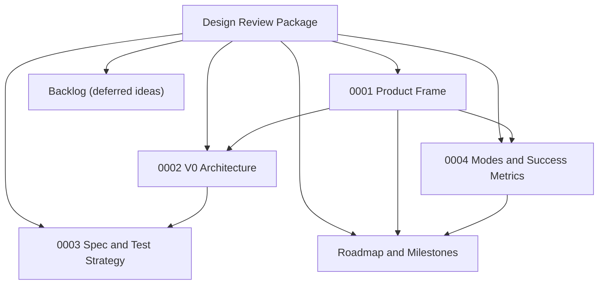

# Design Review Package

Status: draft for review

This directory is the pre-implementation design package for `think`.

The intent is to lock the product shape, architectural boundaries, and milestone sequence before writing production code. The package is intentionally small. It should be possible to review the entire set in one sitting and come out with a clear go/no-go decision.

## Review Scope

This review is meant to answer five questions:

1. Is the product thesis still sharp and defensible?
2. Are the v0 hills concrete enough to guide decisions?
3. Is the architecture honest to the thesis?
4. Are the milestones sequenced around user value rather than technical vanity?
5. Does the testing strategy keep us deterministic and local-first?

## Artifacts

- [`0001-product-frame.md`](./0001-product-frame.md): sponsor user, jobs, hills, experience principles, risks, and playback framing.
- [`0002-v0-architecture.md`](./0002-v0-architecture.md): system shape, writer model, storage/replication model, and read/sync policy.
- [`0003-spec-and-test-strategy.md`](./0003-spec-and-test-strategy.md): design for tests-as-spec, deterministic harnesses, and repo isolation.
- [`0004-modes-and-success-metrics.md`](./0004-modes-and-success-metrics.md): capture/brainstorm/reflection/x-ray mode doctrine and usage metrics for validating product fit.
- [`ROADMAP.md`](./ROADMAP.md): milestone sequence, hill mapping, exit criteria, and review checkpoints.
- [`BACKLOG.md`](../../BACKLOG.md): deferred ideas, cool ideas, and parking-lot items that should not silently become approved scope.

## Review Package Map

## Review Standard

Approve these docs only if they preserve the core doctrine:

- raw capture is sacred
- capture must be cheap
- interpretation is deferred
- provenance matters
- replay matters
- Git/WARP complexity stays below the user experience

If a design choice improves technical sophistication but adds friction to capture, it should be rejected.

## Out Of Scope For This Review

- final UI mockups
- implementation details at module/class/function level
- packaging/distribution details
- auth and hosted deployment strategy
- production sync topology beyond the first upstream backup target

## Expected Outcome

After review, we should either:

- approve the package and start writing spec tests, or
- return with specific changes to hills, architecture boundaries, or milestone sequencing

No production implementation should begin before this review is complete.
