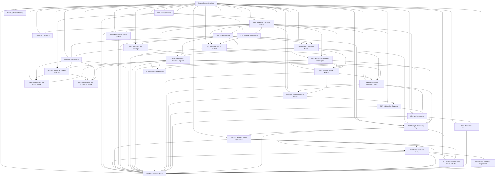

# Design Review Package

Status: design approved; `M0`, `M1`, `M2`, `M3`, and `M4` complete; agent-native CLI, graph derivation, ingress pipeline, pressure-test/spitball split, and the full M4 read/reentry stack are implemented and under active use; `M5` is now in progress and its explicit-ingest and URL-capture slices are implemented

This directory began as the pre-implementation design package for `think`.

The intent was to lock the product shape, architectural boundaries, and milestone sequence before writing production code. The package is intentionally small. It should be possible to review the entire set in one sitting and come out with a clear go/no-go decision.

## Review Scope

This review is meant to answer five questions:

1. Is the product thesis still sharp and defensible?
2. Are the v0 hills concrete enough to guide decisions?
3. Is the architecture honest to the thesis?
4. Are the milestones sequenced around user value rather than technical vanity?
5. Does the testing strategy keep us deterministic and local-first?

## Current References

- [`0001-product-frame.md`](./0001-product-frame.md): sponsor user, jobs, hills, experience principles, risks, and playback framing.
- [`0002-v0-architecture.md`](./0002-v0-architecture.md): system shape, writer model, storage/replication model, and read/sync policy.
- [`0003-spec-and-test-strategy.md`](./0003-spec-and-test-strategy.md): design for tests-as-spec, deterministic harnesses, and repo isolation.
- [`0004-modes-and-success-metrics.md`](./0004-modes-and-success-metrics.md): capture/brainstorm/reflection/x-ray mode doctrine and usage metrics for validating product fit.
- [`0008-agent-native-cli.md`](./0008-agent-native-cli.md): IBM Design Thinking frame for treating agents as first-class CLI consumers through a versioned JSONL plumbing contract.
- [`0009-graph-derivation-model.md`](./0009-graph-derivation-model.md): technical graph model for raw capture, content identity, derived artifacts, sessions, and later mode outputs.
- [`0010-ingress-and-derivation-pipeline.md`](./0010-ingress-and-derivation-pipeline.md): technical note for when derivation runs, which process owns it, and why Git hooks are not the correctness path.
- [`0011-pressure-test-and-spitball.md`](./0011-pressure-test-and-spitball.md): product note separating deterministic pressure-testing from future explicit LLM-assisted spitballing.
- [`0012-m4-reentry-browse-inspect.md`](./0012-m4-reentry-browse-inspect.md): implemented milestone note for the human read surfaces `recent`, `browse`, and `inspect`.
- [`0015-per-thought-derivation-catalog.md`](./0015-per-thought-derivation-catalog.md): consolidated catalog of what is derived from each raw thought, when it is derived, what its payload looks like, and what is currently implemented versus deferred.
- [`0019-graph-versioning-and-migration.md`](./0019-graph-versioning-and-migration.md): technical correction note for versioning the graph model and migrating from the current property-linked repos to explicit graph-native relationships.
- [`0021-graph-migration-gating.md`](./0021-graph-migration-gating.md): technical/product note for when graph migration is required, when it may run automatically, and why capture remains exempt from blocking upgrades.
- [`0022-graph-native-browse-read-refactor.md`](./0022-graph-native-browse-read-refactor.md): technical/product note for making browse and inspect use graph-native read paths, explicit traversal edges, and the committed browse bootstrap benchmark. This refactor is implemented and closed.
- [`0027-m5-additional-ingress-surfaces.md`](./0027-m5-additional-ingress-surfaces.md): milestone note for extending raw capture into additional human and agent ingress surfaces without changing the sacred capture core. The explicit-ingest and URL-capture slices are implemented, and the next planned slice is selected-text / share-based capture.
- [`0028-m5-shortcuts-url-capture.md`](./0028-m5-shortcuts-url-capture.md): implemented `M5` slice note for local URL-triggered capture and Apple Shortcuts as a thin human wrapper over the same raw-capture core.
- [`0029-m5-selected-text-share-capture.md`](./0029-m5-selected-text-share-capture.md): current `M5` slice note for explicit selected-text and share/send capture on macOS without drifting into clipping or import semantics.
- [`ROADMAP.md`](./ROADMAP.md): milestone sequence, hill mapping, exit criteria, and review checkpoints.

## Archived Slice History

Completed milestone and slice notes that still matter as historical context, but are no longer part of the smallest current-reference set, now live under [`archive/`](./archive/):

- [`archive/0005-m2-macos-capture-surface.md`](./archive/0005-m2-macos-capture-surface.md): M2 menu bar app and transient capture-panel design note.
- [`archive/0006-stats-command.md`](./archive/0006-stats-command.md): first read-only stats surface note.
- [`archive/0007-m3-brainstorm-mode.md`](./archive/0007-m3-brainstorm-mode.md): initial explicit brainstorm/reflect note.
- [`archive/0013-m4-bijou-read-shell.md`](./archive/0013-m4-bijou-read-shell.md): first Bijou browse/inspect shell note.
- [`archive/0014-m4-first-derived-artifacts.md`](./archive/0014-m4-first-derived-artifacts.md): first real derivation-bundle note.
- [`archive/0016-m4-session-context-browse.md`](./archive/0016-m4-session-context-browse.md): session-context browse slice.
- [`archive/0017-m4-session-traversal.md`](./archive/0017-m4-session-traversal.md): same-session traversal slice.
- [`archive/0018-m4-remember.md`](./archive/0018-m4-remember.md): initial remember/recall note.
- [`archive/0020-browse-bootstrap-benchmark.md`](./archive/0020-browse-bootstrap-benchmark.md): browse bootstrap benchmark note and baselines.
- [`archive/0023-remember-enhancements.md`](./archive/0023-remember-enhancements.md): bounded and brief remember enhancements.
- [`archive/0024-graph-migration-progress-ux.md`](./archive/0024-graph-migration-progress-ux.md): interactive migration progress UX slice.
- [`archive/0025-prompt-telemetry-read-surface.md`](./archive/0025-prompt-telemetry-read-surface.md): prompt telemetry read surface slice.
- [`archive/0026-m4-session-presentation-polish.md`](./archive/0026-m4-session-presentation-polish.md): session-presentation polish slice.
- [`../retrospectives/m1-capture-core-and-upstream-backup.md`](../retrospectives/m1-capture-core-and-upstream-backup.md): closeout for the first implemented milestone and the remaining validation follow-through.
- [`../retrospectives/m2-macos-capture-surface.md`](../retrospectives/m2-macos-capture-surface.md): closeout for the native menu bar app and hotkey capture surface.
- [`../retrospectives/m3-reflect-mode.md`](../retrospectives/m3-reflect-mode.md): closeout for the first explicit post-capture reflect mode and the pressure-test/spitball split it uncovered.
- [`../retrospectives/m4-session-context-browse.md`](../retrospectives/m4-session-context-browse.md): closeout for the first M4 slice that makes browse consume `session_attribution` honestly in both the TUI and JSON surfaces.
- [`../retrospectives/m4-session-traversal.md`](../retrospectives/m4-session-traversal.md): closeout for the M4 slice that makes same-session movement a first-class browse behavior for both humans and agents.
- [`../retrospectives/m4-graph-migration-gating.md`](../retrospectives/m4-graph-migration-gating.md): closeout for the slice that makes migration explicit for graph-native commands while keeping raw capture migration-safe.
- [`../retrospectives/m4-v3-read-edge-substrate.md`](../retrospectives/m4-v3-read-edge-substrate.md): closeout for the narrower sub-slice that lands `v3` graph-native read edges without yet claiming the browse bootstrap performance win.
- [`../retrospectives/m4-graph-native-browse-read-refactor.md`](../retrospectives/m4-graph-native-browse-read-refactor.md): closeout for the slice that moves product reads onto `WarpApp -> worldline() -> observer(...)`, enables checkpoint-backed browse startup, and records the official `AFTER` benchmark.
- [`../retrospectives/m4-graph-migration-progress-ux.md`](../retrospectives/m4-graph-migration-progress-ux.md): closeout for the slice that makes the human interactive upgrade moment visibly in progress while keeping agent and capture behavior unchanged.
- [`../retrospectives/m4-remember-enhancements.md`](../retrospectives/m4-remember-enhancements.md): closeout for the slice that adds bounded and brief remember recall without changing the underlying ranking model.
- [`../retrospectives/m4-prompt-telemetry-read-surface.md`](../retrospectives/m4-prompt-telemetry-read-surface.md): closeout for the slice that turns recorded prompt telemetry into a factual CLI / JSON read surface without drifting into dashboards.
- [`../retrospectives/m4-session-presentation-polish.md`](../retrospectives/m4-session-presentation-polish.md): closeout for the slice that makes browse session context calmer and more structured without changing session semantics.
- [`../retrospectives/m4-reentry-browse-inspect.md`](../retrospectives/m4-reentry-browse-inspect.md): overall milestone closeout for M4 now that the read/reentry stack is complete.
- [`../retrospectives/m5-ingest-surface.md`](../retrospectives/m5-ingest-surface.md): closeout for the first M5 slice that adds explicit stdin ingress without changing the sacred raw-capture core.
- [`BACKLOG.md`](../../BACKLOG.md): deferred ideas, cool ideas, and parking-lot items that should not silently become approved scope.

## Review Package Map

## Review Standard

Approve these docs only if they preserve the core doctrine:

- raw capture is sacred
- capture must be cheap
- interpretation is deferred
- provenance matters
- replay matters
- Git/WARP complexity stays below the user experience

If a design choice improves technical sophistication but adds friction to capture, it should be rejected.

## Out Of Scope For This Review

- final UI mockups
- implementation details at module/class/function level
- packaging/distribution details
- auth and hosted deployment strategy
- production sync topology beyond the first upstream backup target

## Expected Outcome

After review, we should either:

- approve the package and start writing spec tests, or
- return with specific changes to hills, architecture boundaries, or milestone sequencing

That review is now complete. Production implementation began after approval, Milestones 1 through 4 have been closed, and Milestone 5 planning is now next.
