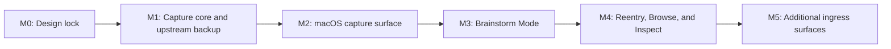

# Roadmap And Milestones

Status: `M0`, `M1`, `M2`, and `M3` complete; `M4` implementation in progress; agent-native CLI, graph derivation, ingress pipeline, pressure-test/spitball split, and `M4` read-mode, Bijou read-shell, first-derived-artifact, derivation-catalog, session-context-browse, session-traversal, remember, graph-versioning/migration, browse-bootstrap-benchmark, graph-migration-gating, graph-native-browse-read-refactor, and graph-migration-progress-ux designs implemented and under active use

## Planning Frame

This roadmap is grounded in the hills from [`0001-product-frame.md`](./0001-product-frame.md).

Milestones exist to prove user value in sequence. They are not buckets for unrelated engineering activity.

## Current Status

- `M0: Design lock` is complete.
- `M1: Capture core and upstream backup` is complete from an implementation/specification standpoint.
- `M1` still has follow-through validation work around real-world usage and latency measurement.
- `M2: macOS capture surface` is complete.
- `M3: Brainstorm Mode` is complete.
- `M4: Reentry, Browse, and Inspect` is in progress.
- the first M4 session-context browse slice is implemented and closed.
- the first M4 session-traversal browse slice is implemented and closed.
- the graph-migration-gating correction slice is implemented and closed.
- the `v3` read-edge substrate slice is implemented and closed.
- the broader graph-native browse/read refactor is implemented and closed.

## Planning Principles

1. Capture value before reflection value.
2. Prove real usage before building ontology.
3. Keep the local-first path excellent before expanding ingress options.
4. Add infrastructure only when it serves a hill directly.
5. Treat the agent-facing JSONL contract as a real product boundary, not as incidental debug output.

## Cross-Cutting Design Notes

Some design notes are not standalone milestones, but they still shape how milestone work should be built.

Current cross-cutting notes under review:

- [`0008-agent-native-cli.md`](./0008-agent-native-cli.md)
- [`0009-graph-derivation-model.md`](./0009-graph-derivation-model.md)
- [`0010-ingress-and-derivation-pipeline.md`](./0010-ingress-and-derivation-pipeline.md)
- [`0011-pressure-test-and-spitball.md`](./0011-pressure-test-and-spitball.md)
- [`0012-m4-reentry-browse-inspect.md`](./0012-m4-reentry-browse-inspect.md)
- [`0013-m4-bijou-read-shell.md`](./0013-m4-bijou-read-shell.md)
- [`0014-m4-first-derived-artifacts.md`](./0014-m4-first-derived-artifacts.md)
- [`0015-per-thought-derivation-catalog.md`](./0015-per-thought-derivation-catalog.md)
- [`0016-m4-session-context-browse.md`](./0016-m4-session-context-browse.md)
- [`0017-m4-session-traversal.md`](./0017-m4-session-traversal.md)
- [`0018-m4-remember.md`](./0018-m4-remember.md)
- [`0019-graph-versioning-and-migration.md`](./0019-graph-versioning-and-migration.md)
- [`0020-browse-bootstrap-benchmark.md`](./0020-browse-bootstrap-benchmark.md)
- [`0021-graph-migration-gating.md`](./0021-graph-migration-gating.md)
- [`0022-graph-native-browse-read-refactor.md`](./0022-graph-native-browse-read-refactor.md)
- [`0024-graph-migration-progress-ux.md`](./0024-graph-migration-progress-ux.md)

These notes should constrain new CLI-facing, graph-facing, derivation-orchestration, and read-surface work without becoming separate milestones.

## Milestone Flow

## Milestone 0: Design Lock

Status:

- complete

Goal:

- approve the product frame, architecture, and test strategy

Primary hill support:

- enables all hills by removing ambiguity before implementation

Deliverables:

- approved design package in `docs/design/`
- named first acceptance specs
- agreed local/upstream topology for day one

Playback questions:

- do the hills still feel sharp and product-relevant?
- does the architecture still preserve capture cheapness?
- are we testing the right promises?

Exit criteria:

- docs approved or revised with clear action items
- no unresolved contradiction about daemon/no-daemon, local/upstream, or ingress ownership

## Milestone 1: Capture Core And Upstream Backup

Status:

- complete for implementation/specification
- follow-through remains for habit validation and latency measurement

Goal:

- make raw capture work reliably from the CLI into a private local Git/WARP repo with day-one private upstream backup

Primary hill support:

- Hill 1
- Hill 2

Deliverables:

- `think "..."` direct capture
- local repo bootstrap
- upstream config and bootstrap path
- immutable raw entry storage
- best-effort push after local success
- visible backup state model: local/backed-up/pending
- deterministic acceptance specs for capture, recent, and replication using temp bare remotes
- capture latency budget and benchmark harness

Playback:

- user can capture a thought from the shell in under a second on a warm path
- exact wording is preserved
- recent entries can be listed without exposing Git concepts
- local save still succeeds while offline
- backup succeeds when upstream is reachable
- backup state is honest and understandable
- daily capture usage begins to approach habit-forming levels

Exit criteria:

- all core capture specs pass
- no required daemon
- local success never depends on network
- replication tests are deterministic
- no Git terminology leaks into the normal user flow
- capture is habit-friendly enough that the user reaches for it without prompting
- no embeddings or clustering work begins before capture habit is proven

## Milestone 2: macOS Capture Surface

Status:

- complete

Goal:

- make the capture experience genuinely habit-forming on macOS

Primary hill support:

- Hill 1
- Hill 2

Deliverables:

- menu bar app
- global hotkey
- Spotlight-like transient capture panel
- same shared capture core used by the CLI

Playback:

- user can hit the hotkey, type, press Enter, and dismiss in one motion
- capture feels faster than opening a notes app
- backup state is either silent or minimally visible, never distracting

Exit criteria:

- capture panel is the preferred daily capture path on Mac
- menu bar app remains thin and does not become an ad hoc admin console

## Milestone 3: Brainstorm Mode

Status:

- complete
  - shipped user-facing deterministic surface: `Reflect`

Goal:

- add an explicit session-based mode that helps the user expand and pressure-test an idea without corrupting raw capture

Primary hill support:

- Hill 3

Deliverables:

- `think --reflect ...` or equivalent seeded mode
- question-led interaction instead of generic idea spam
- reflect outputs stored separately from raw capture entries

Playback:

- the mode helps the user sharpen or reframe an idea
- the mode feels like a deliberate push rather than autocomplete or chat
- raw capture remains the default and is not interrupted by reflect behavior

Exit criteria:

- reflect mode produces new useful entries
- reflect is entered deliberately and never ambushes plain capture
- the shipped deterministic surface remains honest about being reflect / pressure-test rather than fake generative brainstorming

## Milestone 4: Reentry, Browse, And Inspect

Goal:

- add richer read modes that revisit captures without violating raw-entry immutability or collapsing into one clever surface

Primary hill support:

- Hill 3

Deliverables:

- richer `recent` or reentry flow
- explicit context-scoped recall through `--remember`
- first explicit `browse` prototype
- first explicit `inspect` prototype
- first explicit Bijou read shell for human browse/inspect flow
- first real derivation bundle that gives `inspect` durable receipts
- sync-first read posture where useful
- scoped materialization policy for deeper read modes

Playback:

- user can return to old captures and see them in context
- user or agent can recover likely relevant prior context for the current project or topic through explicit recall
- browse mode helps the user navigate the archive without being prompted at
- inspect mode provides receipts when the user wants to inspect structure directly
- the first read shell feels like navigation rather than terminal theater
- derived structure remains clearly separate from raw capture

Exit criteria:

- no mutation of raw entries
- `recent` remains boring and trustworthy
- `remember` remains inspectable and does not degrade into opaque search ranking
- browse and inspect improve understanding without adding capture friction
- the Bijou read shell remains optional porcelain over the explicit CLI contract

## Milestone 5: Additional Ingress Surfaces

Goal:

- add remote and ambient capture options without centralizing the system around a daemon

Primary hill support:

- Hill 1
- Hill 2

Candidates:

- web capture URL
- email ingress
- text-to-think

Playback:

- user can capture from outside their Mac without learning a new mental model
- provenance remains honest per ingress surface

Exit criteria:

- each new ingress uses the same core capture contract
- local and remote writers remain conceptually unified to the user

## Deferred Infrastructure

These are explicitly not first milestones:

- public hosted service
- auth system
- ontology engine
- embeddings before capture habit is proven
- clustering before capture habit is proven
- daemon-centric local architecture
- dashboard-first UX

## Review Checkpoints

Roadmap reviews should happen:

- after Milestone 0 approval
- before starting Milestone 2
- before starting Milestone 4

Those are the likely points where product direction could drift from the original thesis and should be challenged directly.
